# STAGE: PREPROCESS DATA

# Note: look into color param for cat plots|
# Add more simple visuals, plots at the end not models


```python
# Importing libraries

import numpy as np 
import pandas as pd 

import matplotlib.pyplot as plt 
import seaborn as sns 
from scipy import stats
%matplotlib inline

import matplotlib.cm

from sklearn.model_selection import train_test_split
from sklearn.preprocessing import OneHotEncoder, LabelEncoder
from sklearn import preprocessing
from sklearn.preprocessing import MinMaxScaler


import statsmodels.api as sm

```

# Reading in data and examining


```python
df = pd.read_csv('kc_house_data.csv')

df.head()
```


<div>
<style scoped>
    .dataframe tbody tr th:only-of-type {
        vertical-align: middle;
    }

    .dataframe tbody tr th {
        vertical-align: top;
    }

    .dataframe thead th {
        text-align: right;
    }
</style>
<table border="1" class="dataframe">
  <thead>
    <tr style="text-align: right;">
      <th></th>
      <th>id</th>
      <th>date</th>
      <th>price</th>
      <th>bedrooms</th>
      <th>bathrooms</th>
      <th>sqft_living</th>
      <th>sqft_lot</th>
      <th>floors</th>
      <th>waterfront</th>
      <th>view</th>
      <th>...</th>
      <th>grade</th>
      <th>sqft_above</th>
      <th>sqft_basement</th>
      <th>yr_built</th>
      <th>yr_renovated</th>
      <th>zipcode</th>
      <th>lat</th>
      <th>long</th>
      <th>sqft_living15</th>
      <th>sqft_lot15</th>
    </tr>
  </thead>
  <tbody>
    <tr>
      <td>0</td>
      <td>7129300520</td>
      <td>10/13/2014</td>
      <td>221900.0</td>
      <td>3</td>
      <td>1.00</td>
      <td>1180</td>
      <td>5650</td>
      <td>1.0</td>
      <td>NaN</td>
      <td>0.0</td>
      <td>...</td>
      <td>7</td>
      <td>1180</td>
      <td>0.0</td>
      <td>1955</td>
      <td>0.0</td>
      <td>98178</td>
      <td>47.5112</td>
      <td>-122.257</td>
      <td>1340</td>
      <td>5650</td>
    </tr>
    <tr>
      <td>1</td>
      <td>6414100192</td>
      <td>12/9/2014</td>
      <td>538000.0</td>
      <td>3</td>
      <td>2.25</td>
      <td>2570</td>
      <td>7242</td>
      <td>2.0</td>
      <td>0.0</td>
      <td>0.0</td>
      <td>...</td>
      <td>7</td>
      <td>2170</td>
      <td>400.0</td>
      <td>1951</td>
      <td>1991.0</td>
      <td>98125</td>
      <td>47.7210</td>
      <td>-122.319</td>
      <td>1690</td>
      <td>7639</td>
    </tr>
    <tr>
      <td>2</td>
      <td>5631500400</td>
      <td>2/25/2015</td>
      <td>180000.0</td>
      <td>2</td>
      <td>1.00</td>
      <td>770</td>
      <td>10000</td>
      <td>1.0</td>
      <td>0.0</td>
      <td>0.0</td>
      <td>...</td>
      <td>6</td>
      <td>770</td>
      <td>0.0</td>
      <td>1933</td>
      <td>NaN</td>
      <td>98028</td>
      <td>47.7379</td>
      <td>-122.233</td>
      <td>2720</td>
      <td>8062</td>
    </tr>
    <tr>
      <td>3</td>
      <td>2487200875</td>
      <td>12/9/2014</td>
      <td>604000.0</td>
      <td>4</td>
      <td>3.00</td>
      <td>1960</td>
      <td>5000</td>
      <td>1.0</td>
      <td>0.0</td>
      <td>0.0</td>
      <td>...</td>
      <td>7</td>
      <td>1050</td>
      <td>910.0</td>
      <td>1965</td>
      <td>0.0</td>
      <td>98136</td>
      <td>47.5208</td>
      <td>-122.393</td>
      <td>1360</td>
      <td>5000</td>
    </tr>
    <tr>
      <td>4</td>
      <td>1954400510</td>
      <td>2/18/2015</td>
      <td>510000.0</td>
      <td>3</td>
      <td>2.00</td>
      <td>1680</td>
      <td>8080</td>
      <td>1.0</td>
      <td>0.0</td>
      <td>0.0</td>
      <td>...</td>
      <td>8</td>
      <td>1680</td>
      <td>0.0</td>
      <td>1987</td>
      <td>0.0</td>
      <td>98074</td>
      <td>47.6168</td>
      <td>-122.045</td>
      <td>1800</td>
      <td>7503</td>
    </tr>
  </tbody>
</table>
<p>5 rows × 21 columns</p>
</div>


```python
df.tail()
```


<div>
<style scoped>
    .dataframe tbody tr th:only-of-type {
        vertical-align: middle;
    }

    .dataframe tbody tr th {
        vertical-align: top;
    }

    .dataframe thead th {
        text-align: right;
    }
</style>
<table border="1" class="dataframe">
  <thead>
    <tr style="text-align: right;">
      <th></th>
      <th>id</th>
      <th>date</th>
      <th>price</th>
      <th>bedrooms</th>
      <th>bathrooms</th>
      <th>sqft_living</th>
      <th>sqft_lot</th>
      <th>floors</th>
      <th>waterfront</th>
      <th>view</th>
      <th>...</th>
      <th>grade</th>
      <th>sqft_above</th>
      <th>sqft_basement</th>
      <th>yr_built</th>
      <th>yr_renovated</th>
      <th>zipcode</th>
      <th>lat</th>
      <th>long</th>
      <th>sqft_living15</th>
      <th>sqft_lot15</th>
    </tr>
  </thead>
  <tbody>
    <tr>
      <td>21592</td>
      <td>263000018</td>
      <td>5/21/2014</td>
      <td>360000.0</td>
      <td>3</td>
      <td>2.50</td>
      <td>1530</td>
      <td>1131</td>
      <td>3.0</td>
      <td>0.0</td>
      <td>0.0</td>
      <td>...</td>
      <td>8</td>
      <td>1530</td>
      <td>0.0</td>
      <td>2009</td>
      <td>0.0</td>
      <td>98103</td>
      <td>47.6993</td>
      <td>-122.346</td>
      <td>1530</td>
      <td>1509</td>
    </tr>
    <tr>
      <td>21593</td>
      <td>6600060120</td>
      <td>2/23/2015</td>
      <td>400000.0</td>
      <td>4</td>
      <td>2.50</td>
      <td>2310</td>
      <td>5813</td>
      <td>2.0</td>
      <td>0.0</td>
      <td>0.0</td>
      <td>...</td>
      <td>8</td>
      <td>2310</td>
      <td>0.0</td>
      <td>2014</td>
      <td>0.0</td>
      <td>98146</td>
      <td>47.5107</td>
      <td>-122.362</td>
      <td>1830</td>
      <td>7200</td>
    </tr>
    <tr>
      <td>21594</td>
      <td>1523300141</td>
      <td>6/23/2014</td>
      <td>402101.0</td>
      <td>2</td>
      <td>0.75</td>
      <td>1020</td>
      <td>1350</td>
      <td>2.0</td>
      <td>0.0</td>
      <td>0.0</td>
      <td>...</td>
      <td>7</td>
      <td>1020</td>
      <td>0.0</td>
      <td>2009</td>
      <td>0.0</td>
      <td>98144</td>
      <td>47.5944</td>
      <td>-122.299</td>
      <td>1020</td>
      <td>2007</td>
    </tr>
    <tr>
      <td>21595</td>
      <td>291310100</td>
      <td>1/16/2015</td>
      <td>400000.0</td>
      <td>3</td>
      <td>2.50</td>
      <td>1600</td>
      <td>2388</td>
      <td>2.0</td>
      <td>NaN</td>
      <td>0.0</td>
      <td>...</td>
      <td>8</td>
      <td>1600</td>
      <td>0.0</td>
      <td>2004</td>
      <td>0.0</td>
      <td>98027</td>
      <td>47.5345</td>
      <td>-122.069</td>
      <td>1410</td>
      <td>1287</td>
    </tr>
    <tr>
      <td>21596</td>
      <td>1523300157</td>
      <td>10/15/2014</td>
      <td>325000.0</td>
      <td>2</td>
      <td>0.75</td>
      <td>1020</td>
      <td>1076</td>
      <td>2.0</td>
      <td>0.0</td>
      <td>0.0</td>
      <td>...</td>
      <td>7</td>
      <td>1020</td>
      <td>0.0</td>
      <td>2008</td>
      <td>0.0</td>
      <td>98144</td>
      <td>47.5941</td>
      <td>-122.299</td>
      <td>1020</td>
      <td>1357</td>
    </tr>
  </tbody>
</table>
<p>5 rows × 21 columns</p>
</div>


# Looks like there's some NaN in the data, time for a null values and type check, null values in 'waterfront', 'view' and 'yr_renovated' features, objects in date and sqft_basement


```python
df.info()
```

    <class 'pandas.core.frame.DataFrame'>
    RangeIndex: 21597 entries, 0 to 21596
    Data columns (total 21 columns):
    id               21597 non-null int64
    date             21597 non-null object
    price            21597 non-null float64
    bedrooms         21597 non-null int64
    bathrooms        21597 non-null float64
    sqft_living      21597 non-null int64
    sqft_lot         21597 non-null int64
    floors           21597 non-null float64
    waterfront       19221 non-null float64
    view             21534 non-null float64
    condition        21597 non-null int64
    grade            21597 non-null int64
    sqft_above       21597 non-null int64
    sqft_basement    21597 non-null object
    yr_built         21597 non-null int64
    yr_renovated     17755 non-null float64
    zipcode          21597 non-null int64
    lat              21597 non-null float64
    long             21597 non-null float64
    sqft_living15    21597 non-null int64
    sqft_lot15       21597 non-null int64
    dtypes: float64(8), int64(11), object(2)
    memory usage: 3.5+ MB


```python
df.shape
```


    (21597, 21)


```python
df.isna().any()
```


    id               False
    date             False
    price            False
    bedrooms         False
    bathrooms        False
    sqft_living      False
    sqft_lot         False
    floors           False
    waterfront        True
    view              True
    condition        False
    grade            False
    sqft_above       False
    sqft_basement    False
    yr_built         False
    yr_renovated      True
    zipcode          False
    lat              False
    long             False
    sqft_living15    False
    sqft_lot15       False
    dtype: bool


```python
df.isna().sum()
```


    id                  0
    date                0
    price               0
    bedrooms            0
    bathrooms           0
    sqft_living         0
    sqft_lot            0
    floors              0
    waterfront       2376
    view               63
    condition           0
    grade               0
    sqft_above          0
    sqft_basement       0
    yr_built            0
    yr_renovated     3842
    zipcode             0
    lat                 0
    long                0
    sqft_living15       0
    sqft_lot15          0
    dtype: int64


```python
df['view'].describe()
```


    count    21534.000000
    mean         0.233863
    std          0.765686
    min          0.000000
    25%          0.000000
    50%          0.000000
    75%          0.000000
    max          4.000000
    Name: view, dtype: float64


# View is predominately zero, meaning the house hasn't been viewed
# Transform view into categories.


```python
sns.catplot(x='view', y='price', data=df)
```


    <seaborn.axisgrid.FacetGrid at 0x110df3630>


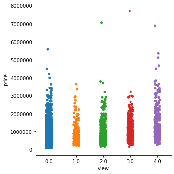


```python
df['view'].value_counts(dropna=False)
```


    0.0    19422
    2.0      957
    3.0      508
    1.0      330
    4.0      317
    NaN       63
    Name: view, dtype: int64


```python
df['view'] = df['view'].fillna(0).astype(int)

df['view'].value_counts(dropna=False)
```


    0    19485
    2      957
    3      508
    1      330
    4      317
    Name: view, dtype: int64


# Encoding view into separate features


```python
df = pd.concat([df,pd.get_dummies(df['view'], prefix='view', drop_first=True)],axis=1).drop(['view'],axis=1)

df.head(10)
```


<div>
<style scoped>
    .dataframe tbody tr th:only-of-type {
        vertical-align: middle;
    }

    .dataframe tbody tr th {
        vertical-align: top;
    }

    .dataframe thead th {
        text-align: right;
    }
</style>
<table border="1" class="dataframe">
  <thead>
    <tr style="text-align: right;">
      <th></th>
      <th>id</th>
      <th>date</th>
      <th>price</th>
      <th>bedrooms</th>
      <th>bathrooms</th>
      <th>sqft_living</th>
      <th>sqft_lot</th>
      <th>floors</th>
      <th>waterfront</th>
      <th>condition</th>
      <th>...</th>
      <th>yr_renovated</th>
      <th>zipcode</th>
      <th>lat</th>
      <th>long</th>
      <th>sqft_living15</th>
      <th>sqft_lot15</th>
      <th>view_1</th>
      <th>view_2</th>
      <th>view_3</th>
      <th>view_4</th>
    </tr>
  </thead>
  <tbody>
    <tr>
      <td>0</td>
      <td>7129300520</td>
      <td>10/13/2014</td>
      <td>221900.0</td>
      <td>3</td>
      <td>1.00</td>
      <td>1180</td>
      <td>5650</td>
      <td>1.0</td>
      <td>NaN</td>
      <td>3</td>
      <td>...</td>
      <td>0.0</td>
      <td>98178</td>
      <td>47.5112</td>
      <td>-122.257</td>
      <td>1340</td>
      <td>5650</td>
      <td>0</td>
      <td>0</td>
      <td>0</td>
      <td>0</td>
    </tr>
    <tr>
      <td>1</td>
      <td>6414100192</td>
      <td>12/9/2014</td>
      <td>538000.0</td>
      <td>3</td>
      <td>2.25</td>
      <td>2570</td>
      <td>7242</td>
      <td>2.0</td>
      <td>0.0</td>
      <td>3</td>
      <td>...</td>
      <td>1991.0</td>
      <td>98125</td>
      <td>47.7210</td>
      <td>-122.319</td>
      <td>1690</td>
      <td>7639</td>
      <td>0</td>
      <td>0</td>
      <td>0</td>
      <td>0</td>
    </tr>
    <tr>
      <td>2</td>
      <td>5631500400</td>
      <td>2/25/2015</td>
      <td>180000.0</td>
      <td>2</td>
      <td>1.00</td>
      <td>770</td>
      <td>10000</td>
      <td>1.0</td>
      <td>0.0</td>
      <td>3</td>
      <td>...</td>
      <td>NaN</td>
      <td>98028</td>
      <td>47.7379</td>
      <td>-122.233</td>
      <td>2720</td>
      <td>8062</td>
      <td>0</td>
      <td>0</td>
      <td>0</td>
      <td>0</td>
    </tr>
    <tr>
      <td>3</td>
      <td>2487200875</td>
      <td>12/9/2014</td>
      <td>604000.0</td>
      <td>4</td>
      <td>3.00</td>
      <td>1960</td>
      <td>5000</td>
      <td>1.0</td>
      <td>0.0</td>
      <td>5</td>
      <td>...</td>
      <td>0.0</td>
      <td>98136</td>
      <td>47.5208</td>
      <td>-122.393</td>
      <td>1360</td>
      <td>5000</td>
      <td>0</td>
      <td>0</td>
      <td>0</td>
      <td>0</td>
    </tr>
    <tr>
      <td>4</td>
      <td>1954400510</td>
      <td>2/18/2015</td>
      <td>510000.0</td>
      <td>3</td>
      <td>2.00</td>
      <td>1680</td>
      <td>8080</td>
      <td>1.0</td>
      <td>0.0</td>
      <td>3</td>
      <td>...</td>
      <td>0.0</td>
      <td>98074</td>
      <td>47.6168</td>
      <td>-122.045</td>
      <td>1800</td>
      <td>7503</td>
      <td>0</td>
      <td>0</td>
      <td>0</td>
      <td>0</td>
    </tr>
    <tr>
      <td>5</td>
      <td>7237550310</td>
      <td>5/12/2014</td>
      <td>1230000.0</td>
      <td>4</td>
      <td>4.50</td>
      <td>5420</td>
      <td>101930</td>
      <td>1.0</td>
      <td>0.0</td>
      <td>3</td>
      <td>...</td>
      <td>0.0</td>
      <td>98053</td>
      <td>47.6561</td>
      <td>-122.005</td>
      <td>4760</td>
      <td>101930</td>
      <td>0</td>
      <td>0</td>
      <td>0</td>
      <td>0</td>
    </tr>
    <tr>
      <td>6</td>
      <td>1321400060</td>
      <td>6/27/2014</td>
      <td>257500.0</td>
      <td>3</td>
      <td>2.25</td>
      <td>1715</td>
      <td>6819</td>
      <td>2.0</td>
      <td>0.0</td>
      <td>3</td>
      <td>...</td>
      <td>0.0</td>
      <td>98003</td>
      <td>47.3097</td>
      <td>-122.327</td>
      <td>2238</td>
      <td>6819</td>
      <td>0</td>
      <td>0</td>
      <td>0</td>
      <td>0</td>
    </tr>
    <tr>
      <td>7</td>
      <td>2008000270</td>
      <td>1/15/2015</td>
      <td>291850.0</td>
      <td>3</td>
      <td>1.50</td>
      <td>1060</td>
      <td>9711</td>
      <td>1.0</td>
      <td>0.0</td>
      <td>3</td>
      <td>...</td>
      <td>0.0</td>
      <td>98198</td>
      <td>47.4095</td>
      <td>-122.315</td>
      <td>1650</td>
      <td>9711</td>
      <td>0</td>
      <td>0</td>
      <td>0</td>
      <td>0</td>
    </tr>
    <tr>
      <td>8</td>
      <td>2414600126</td>
      <td>4/15/2015</td>
      <td>229500.0</td>
      <td>3</td>
      <td>1.00</td>
      <td>1780</td>
      <td>7470</td>
      <td>1.0</td>
      <td>0.0</td>
      <td>3</td>
      <td>...</td>
      <td>0.0</td>
      <td>98146</td>
      <td>47.5123</td>
      <td>-122.337</td>
      <td>1780</td>
      <td>8113</td>
      <td>0</td>
      <td>0</td>
      <td>0</td>
      <td>0</td>
    </tr>
    <tr>
      <td>9</td>
      <td>3793500160</td>
      <td>3/12/2015</td>
      <td>323000.0</td>
      <td>3</td>
      <td>2.50</td>
      <td>1890</td>
      <td>6560</td>
      <td>2.0</td>
      <td>0.0</td>
      <td>3</td>
      <td>...</td>
      <td>0.0</td>
      <td>98038</td>
      <td>47.3684</td>
      <td>-122.031</td>
      <td>2390</td>
      <td>7570</td>
      <td>0</td>
      <td>0</td>
      <td>0</td>
      <td>0</td>
    </tr>
  </tbody>
</table>
<p>10 rows × 24 columns</p>
</div>


# Waterfront is the next variable of interest - and mostly 0, so imputing NaN with 0s.


```python
df['waterfront'].value_counts(dropna=False)
```


    0.0    19075
    NaN     2376
    1.0      146
    Name: waterfront, dtype: int64


```python
df['waterfront'] = df['waterfront'].fillna(0)

df['waterfront'].value_counts(dropna=False)
```


    0.0    21451
    1.0      146
    Name: waterfront, dtype: int64


```python
sns.distplot(df['waterfront'])
```


    <matplotlib.axes._subplots.AxesSubplot at 0x1c17592e48>


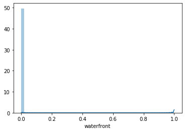


```python
sns.catplot(x="waterfront", y="price",data=df)
```


    <seaborn.axisgrid.FacetGrid at 0x1c17592080>


```python
df.isna().sum()
```


    id                  0
    date                0
    price               0
    bedrooms            0
    bathrooms           0
    sqft_living         0
    sqft_lot            0
    floors              0
    waterfront          0
    condition           0
    grade               0
    sqft_above          0
    sqft_basement       0
    yr_built            0
    yr_renovated     3842
    zipcode             0
    lat                 0
    long                0
    sqft_living15       0
    sqft_lot15          0
    view_1              0
    view_2              0
    view_3              0
    view_4              0
    dtype: int64


# Keeping yr_renovated, filling with 0s, creating new features off of yr_renovated


```python
df['yr_renovated'].value_counts(dropna=False)
```


    0.0       17011
    NaN        3842
    2014.0       73
    2003.0       31
    2013.0       31
              ...  
    1944.0        1
    1948.0        1
    1976.0        1
    1934.0        1
    1953.0        1
    Name: yr_renovated, Length: 71, dtype: int64


```python
df['yr_renovated'] = df['yr_renovated'].fillna(0)
```


```python
df.yr_renovated.value_counts(dropna=False)
```


    0.0       20853
    2014.0       73
    2003.0       31
    2013.0       31
    2007.0       30
              ...  
    1946.0        1
    1959.0        1
    1971.0        1
    1951.0        1
    1954.0        1
    Name: yr_renovated, Length: 70, dtype: int64


# Extract only housing that was renovated, as well as the gap between building and renovation in years


```python
df['was_renovated'] = df['yr_renovated'].astype(bool).astype(int)
renovation_gap = df[(df['yr_renovated'] > 0)]
display(renovation_gap.head(10))
display(df.head(10))
```


<div>
<style scoped>
    .dataframe tbody tr th:only-of-type {
        vertical-align: middle;
    }

    .dataframe tbody tr th {
        vertical-align: top;
    }

    .dataframe thead th {
        text-align: right;
    }
</style>
<table border="1" class="dataframe">
  <thead>
    <tr style="text-align: right;">
      <th></th>
      <th>id</th>
      <th>date</th>
      <th>price</th>
      <th>bedrooms</th>
      <th>bathrooms</th>
      <th>sqft_living</th>
      <th>sqft_lot</th>
      <th>floors</th>
      <th>waterfront</th>
      <th>condition</th>
      <th>...</th>
      <th>zipcode</th>
      <th>lat</th>
      <th>long</th>
      <th>sqft_living15</th>
      <th>sqft_lot15</th>
      <th>view_1</th>
      <th>view_2</th>
      <th>view_3</th>
      <th>view_4</th>
      <th>was_renovated</th>
    </tr>
  </thead>
  <tbody>
    <tr>
      <td>1</td>
      <td>6414100192</td>
      <td>12/9/2014</td>
      <td>538000.0</td>
      <td>3</td>
      <td>2.25</td>
      <td>2570</td>
      <td>7242</td>
      <td>2.0</td>
      <td>0.0</td>
      <td>3</td>
      <td>...</td>
      <td>98125</td>
      <td>47.7210</td>
      <td>-122.319</td>
      <td>1690</td>
      <td>7639</td>
      <td>0</td>
      <td>0</td>
      <td>0</td>
      <td>0</td>
      <td>1</td>
    </tr>
    <tr>
      <td>35</td>
      <td>9547205180</td>
      <td>6/13/2014</td>
      <td>696000.0</td>
      <td>3</td>
      <td>2.50</td>
      <td>2300</td>
      <td>3060</td>
      <td>1.5</td>
      <td>0.0</td>
      <td>3</td>
      <td>...</td>
      <td>98115</td>
      <td>47.6827</td>
      <td>-122.310</td>
      <td>1590</td>
      <td>3264</td>
      <td>0</td>
      <td>0</td>
      <td>0</td>
      <td>0</td>
      <td>1</td>
    </tr>
    <tr>
      <td>95</td>
      <td>1483300570</td>
      <td>9/8/2014</td>
      <td>905000.0</td>
      <td>4</td>
      <td>2.50</td>
      <td>3300</td>
      <td>10250</td>
      <td>1.0</td>
      <td>0.0</td>
      <td>3</td>
      <td>...</td>
      <td>98040</td>
      <td>47.5873</td>
      <td>-122.249</td>
      <td>1950</td>
      <td>6045</td>
      <td>0</td>
      <td>0</td>
      <td>0</td>
      <td>0</td>
      <td>1</td>
    </tr>
    <tr>
      <td>103</td>
      <td>2450000295</td>
      <td>10/7/2014</td>
      <td>1090000.0</td>
      <td>3</td>
      <td>2.50</td>
      <td>2920</td>
      <td>8113</td>
      <td>2.0</td>
      <td>0.0</td>
      <td>3</td>
      <td>...</td>
      <td>98004</td>
      <td>47.5814</td>
      <td>-122.196</td>
      <td>2370</td>
      <td>8113</td>
      <td>0</td>
      <td>0</td>
      <td>0</td>
      <td>0</td>
      <td>1</td>
    </tr>
    <tr>
      <td>125</td>
      <td>4389200955</td>
      <td>3/2/2015</td>
      <td>1450000.0</td>
      <td>4</td>
      <td>2.75</td>
      <td>2750</td>
      <td>17789</td>
      <td>1.5</td>
      <td>0.0</td>
      <td>3</td>
      <td>...</td>
      <td>98004</td>
      <td>47.6141</td>
      <td>-122.212</td>
      <td>3060</td>
      <td>11275</td>
      <td>0</td>
      <td>0</td>
      <td>0</td>
      <td>0</td>
      <td>1</td>
    </tr>
    <tr>
      <td>158</td>
      <td>8029200135</td>
      <td>11/13/2014</td>
      <td>247000.0</td>
      <td>3</td>
      <td>2.00</td>
      <td>1270</td>
      <td>7198</td>
      <td>1.5</td>
      <td>0.0</td>
      <td>3</td>
      <td>...</td>
      <td>98022</td>
      <td>47.2086</td>
      <td>-121.996</td>
      <td>1160</td>
      <td>7198</td>
      <td>0</td>
      <td>0</td>
      <td>0</td>
      <td>0</td>
      <td>1</td>
    </tr>
    <tr>
      <td>209</td>
      <td>6300000550</td>
      <td>7/17/2014</td>
      <td>464000.0</td>
      <td>6</td>
      <td>3.00</td>
      <td>2300</td>
      <td>3404</td>
      <td>2.0</td>
      <td>0.0</td>
      <td>3</td>
      <td>...</td>
      <td>98133</td>
      <td>47.7067</td>
      <td>-122.343</td>
      <td>1560</td>
      <td>1312</td>
      <td>0</td>
      <td>0</td>
      <td>0</td>
      <td>0</td>
      <td>1</td>
    </tr>
    <tr>
      <td>216</td>
      <td>46100204</td>
      <td>2/21/2015</td>
      <td>1510000.0</td>
      <td>5</td>
      <td>3.00</td>
      <td>3300</td>
      <td>33474</td>
      <td>1.0</td>
      <td>0.0</td>
      <td>3</td>
      <td>...</td>
      <td>98040</td>
      <td>47.5673</td>
      <td>-122.210</td>
      <td>3836</td>
      <td>20953</td>
      <td>0</td>
      <td>0</td>
      <td>1</td>
      <td>0</td>
      <td>1</td>
    </tr>
    <tr>
      <td>230</td>
      <td>8096000060</td>
      <td>4/13/2015</td>
      <td>655000.0</td>
      <td>2</td>
      <td>1.75</td>
      <td>1450</td>
      <td>15798</td>
      <td>2.0</td>
      <td>1.0</td>
      <td>3</td>
      <td>...</td>
      <td>98166</td>
      <td>47.4497</td>
      <td>-122.375</td>
      <td>2030</td>
      <td>13193</td>
      <td>0</td>
      <td>0</td>
      <td>0</td>
      <td>1</td>
      <td>1</td>
    </tr>
    <tr>
      <td>237</td>
      <td>7228500560</td>
      <td>3/20/2015</td>
      <td>410000.0</td>
      <td>4</td>
      <td>1.00</td>
      <td>1970</td>
      <td>4740</td>
      <td>1.5</td>
      <td>0.0</td>
      <td>3</td>
      <td>...</td>
      <td>98122</td>
      <td>47.6136</td>
      <td>-122.303</td>
      <td>1510</td>
      <td>4740</td>
      <td>0</td>
      <td>0</td>
      <td>0</td>
      <td>0</td>
      <td>1</td>
    </tr>
  </tbody>
</table>
<p>10 rows × 25 columns</p>
</div>


<div>
<style scoped>
    .dataframe tbody tr th:only-of-type {
        vertical-align: middle;
    }

    .dataframe tbody tr th {
        vertical-align: top;
    }

    .dataframe thead th {
        text-align: right;
    }
</style>
<table border="1" class="dataframe">
  <thead>
    <tr style="text-align: right;">
      <th></th>
      <th>id</th>
      <th>date</th>
      <th>price</th>
      <th>bedrooms</th>
      <th>bathrooms</th>
      <th>sqft_living</th>
      <th>sqft_lot</th>
      <th>floors</th>
      <th>waterfront</th>
      <th>condition</th>
      <th>...</th>
      <th>zipcode</th>
      <th>lat</th>
      <th>long</th>
      <th>sqft_living15</th>
      <th>sqft_lot15</th>
      <th>view_1</th>
      <th>view_2</th>
      <th>view_3</th>
      <th>view_4</th>
      <th>was_renovated</th>
    </tr>
  </thead>
  <tbody>
    <tr>
      <td>0</td>
      <td>7129300520</td>
      <td>10/13/2014</td>
      <td>221900.0</td>
      <td>3</td>
      <td>1.00</td>
      <td>1180</td>
      <td>5650</td>
      <td>1.0</td>
      <td>0.0</td>
      <td>3</td>
      <td>...</td>
      <td>98178</td>
      <td>47.5112</td>
      <td>-122.257</td>
      <td>1340</td>
      <td>5650</td>
      <td>0</td>
      <td>0</td>
      <td>0</td>
      <td>0</td>
      <td>0</td>
    </tr>
    <tr>
      <td>1</td>
      <td>6414100192</td>
      <td>12/9/2014</td>
      <td>538000.0</td>
      <td>3</td>
      <td>2.25</td>
      <td>2570</td>
      <td>7242</td>
      <td>2.0</td>
      <td>0.0</td>
      <td>3</td>
      <td>...</td>
      <td>98125</td>
      <td>47.7210</td>
      <td>-122.319</td>
      <td>1690</td>
      <td>7639</td>
      <td>0</td>
      <td>0</td>
      <td>0</td>
      <td>0</td>
      <td>1</td>
    </tr>
    <tr>
      <td>2</td>
      <td>5631500400</td>
      <td>2/25/2015</td>
      <td>180000.0</td>
      <td>2</td>
      <td>1.00</td>
      <td>770</td>
      <td>10000</td>
      <td>1.0</td>
      <td>0.0</td>
      <td>3</td>
      <td>...</td>
      <td>98028</td>
      <td>47.7379</td>
      <td>-122.233</td>
      <td>2720</td>
      <td>8062</td>
      <td>0</td>
      <td>0</td>
      <td>0</td>
      <td>0</td>
      <td>0</td>
    </tr>
    <tr>
      <td>3</td>
      <td>2487200875</td>
      <td>12/9/2014</td>
      <td>604000.0</td>
      <td>4</td>
      <td>3.00</td>
      <td>1960</td>
      <td>5000</td>
      <td>1.0</td>
      <td>0.0</td>
      <td>5</td>
      <td>...</td>
      <td>98136</td>
      <td>47.5208</td>
      <td>-122.393</td>
      <td>1360</td>
      <td>5000</td>
      <td>0</td>
      <td>0</td>
      <td>0</td>
      <td>0</td>
      <td>0</td>
    </tr>
    <tr>
      <td>4</td>
      <td>1954400510</td>
      <td>2/18/2015</td>
      <td>510000.0</td>
      <td>3</td>
      <td>2.00</td>
      <td>1680</td>
      <td>8080</td>
      <td>1.0</td>
      <td>0.0</td>
      <td>3</td>
      <td>...</td>
      <td>98074</td>
      <td>47.6168</td>
      <td>-122.045</td>
      <td>1800</td>
      <td>7503</td>
      <td>0</td>
      <td>0</td>
      <td>0</td>
      <td>0</td>
      <td>0</td>
    </tr>
    <tr>
      <td>5</td>
      <td>7237550310</td>
      <td>5/12/2014</td>
      <td>1230000.0</td>
      <td>4</td>
      <td>4.50</td>
      <td>5420</td>
      <td>101930</td>
      <td>1.0</td>
      <td>0.0</td>
      <td>3</td>
      <td>...</td>
      <td>98053</td>
      <td>47.6561</td>
      <td>-122.005</td>
      <td>4760</td>
      <td>101930</td>
      <td>0</td>
      <td>0</td>
      <td>0</td>
      <td>0</td>
      <td>0</td>
    </tr>
    <tr>
      <td>6</td>
      <td>1321400060</td>
      <td>6/27/2014</td>
      <td>257500.0</td>
      <td>3</td>
      <td>2.25</td>
      <td>1715</td>
      <td>6819</td>
      <td>2.0</td>
      <td>0.0</td>
      <td>3</td>
      <td>...</td>
      <td>98003</td>
      <td>47.3097</td>
      <td>-122.327</td>
      <td>2238</td>
      <td>6819</td>
      <td>0</td>
      <td>0</td>
      <td>0</td>
      <td>0</td>
      <td>0</td>
    </tr>
    <tr>
      <td>7</td>
      <td>2008000270</td>
      <td>1/15/2015</td>
      <td>291850.0</td>
      <td>3</td>
      <td>1.50</td>
      <td>1060</td>
      <td>9711</td>
      <td>1.0</td>
      <td>0.0</td>
      <td>3</td>
      <td>...</td>
      <td>98198</td>
      <td>47.4095</td>
      <td>-122.315</td>
      <td>1650</td>
      <td>9711</td>
      <td>0</td>
      <td>0</td>
      <td>0</td>
      <td>0</td>
      <td>0</td>
    </tr>
    <tr>
      <td>8</td>
      <td>2414600126</td>
      <td>4/15/2015</td>
      <td>229500.0</td>
      <td>3</td>
      <td>1.00</td>
      <td>1780</td>
      <td>7470</td>
      <td>1.0</td>
      <td>0.0</td>
      <td>3</td>
      <td>...</td>
      <td>98146</td>
      <td>47.5123</td>
      <td>-122.337</td>
      <td>1780</td>
      <td>8113</td>
      <td>0</td>
      <td>0</td>
      <td>0</td>
      <td>0</td>
      <td>0</td>
    </tr>
    <tr>
      <td>9</td>
      <td>3793500160</td>
      <td>3/12/2015</td>
      <td>323000.0</td>
      <td>3</td>
      <td>2.50</td>
      <td>1890</td>
      <td>6560</td>
      <td>2.0</td>
      <td>0.0</td>
      <td>3</td>
      <td>...</td>
      <td>98038</td>
      <td>47.3684</td>
      <td>-122.031</td>
      <td>2390</td>
      <td>7570</td>
      <td>0</td>
      <td>0</td>
      <td>0</td>
      <td>0</td>
      <td>0</td>
    </tr>
  </tbody>
</table>
<p>10 rows × 25 columns</p>
</div>


```python
df['was_renovated'].value_counts()
```


    0    20853
    1      744
    Name: was_renovated, dtype: int64


```python
renovation_gap['ren_gap'] = renovation_gap["yr_renovated"] - renovation_gap["yr_built"]

renovation_gap['ren_gap'].value_counts(dropna=False)
```

    /Users/michael/anaconda3/envs/learn-env/lib/python3.6/site-packages/ipykernel/__main__.py:1: SettingWithCopyWarning: 
    A value is trying to be set on a copy of a slice from a DataFrame.
    Try using .loc[row_indexer,col_indexer] = value instead
    
    See the caveats in the documentation: http://pandas.pydata.org/pandas-docs/stable/user_guide/indexing.html#returning-a-view-versus-a-copy
      if __name__ == '__main__':


    63.0     17
    43.0     17
    37.0     16
    36.0     15
    61.0     15
             ..
    105.0     1
    13.0      1
    109.0     1
    113.0     1
    10.0      1
    Name: ren_gap, Length: 103, dtype: int64


```python
df['ren_gap'] = renovation_gap['ren_gap']

```


```python
df['ren_gap'].value_counts(dropna=False)
```


    NaN      20853
    63.0        17
    43.0        17
    37.0        16
    86.0        15
             ...  
    10.0         1
    105.0        1
    113.0        1
    13.0         1
    109.0        1
    Name: ren_gap, Length: 104, dtype: int64


```python
df['ren_gap'] = df['ren_gap'].fillna(0)

df['ren_gap'].value_counts(dropna=False)
```


    0.0      20853
    63.0        17
    43.0        17
    37.0        16
    86.0        15
             ...  
    10.0         1
    105.0        1
    113.0        1
    13.0         1
    109.0        1
    Name: ren_gap, Length: 104, dtype: int64


# Scatterplot of the renovation gap in years among renovated housing vs. year built and its correlation to price


```python
plt.figure(1, figsize=(20,20))
    
plt.subplot(2, 2,1)
sns.scatterplot(x='ren_gap', y='price', data=renovation_gap)
```


    <matplotlib.axes._subplots.AxesSubplot at 0x1c191997b8>


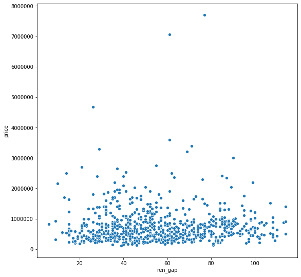


# Seems to be a relatively random distribution, not indicating the linearity we're looking for out of a variable to model, or a good correlation


```python
sns.distplot(df['ren_gap'])
```


    <matplotlib.axes._subplots.AxesSubplot at 0x1c19d4cb70>


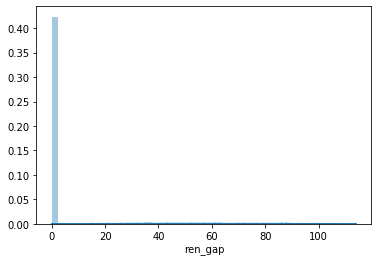


# Still most of the houses have not been renovated, causing a lack of data to go off of 


```python
df.head()
```


<div>
<style scoped>
    .dataframe tbody tr th:only-of-type {
        vertical-align: middle;
    }

    .dataframe tbody tr th {
        vertical-align: top;
    }

    .dataframe thead th {
        text-align: right;
    }
</style>
<table border="1" class="dataframe">
  <thead>
    <tr style="text-align: right;">
      <th></th>
      <th>id</th>
      <th>date</th>
      <th>price</th>
      <th>bedrooms</th>
      <th>bathrooms</th>
      <th>sqft_living</th>
      <th>sqft_lot</th>
      <th>floors</th>
      <th>waterfront</th>
      <th>condition</th>
      <th>...</th>
      <th>lat</th>
      <th>long</th>
      <th>sqft_living15</th>
      <th>sqft_lot15</th>
      <th>view_1</th>
      <th>view_2</th>
      <th>view_3</th>
      <th>view_4</th>
      <th>was_renovated</th>
      <th>ren_gap</th>
    </tr>
  </thead>
  <tbody>
    <tr>
      <td>0</td>
      <td>7129300520</td>
      <td>10/13/2014</td>
      <td>221900.0</td>
      <td>3</td>
      <td>1.00</td>
      <td>1180</td>
      <td>5650</td>
      <td>1.0</td>
      <td>0.0</td>
      <td>3</td>
      <td>...</td>
      <td>47.5112</td>
      <td>-122.257</td>
      <td>1340</td>
      <td>5650</td>
      <td>0</td>
      <td>0</td>
      <td>0</td>
      <td>0</td>
      <td>0</td>
      <td>0.0</td>
    </tr>
    <tr>
      <td>1</td>
      <td>6414100192</td>
      <td>12/9/2014</td>
      <td>538000.0</td>
      <td>3</td>
      <td>2.25</td>
      <td>2570</td>
      <td>7242</td>
      <td>2.0</td>
      <td>0.0</td>
      <td>3</td>
      <td>...</td>
      <td>47.7210</td>
      <td>-122.319</td>
      <td>1690</td>
      <td>7639</td>
      <td>0</td>
      <td>0</td>
      <td>0</td>
      <td>0</td>
      <td>1</td>
      <td>40.0</td>
    </tr>
    <tr>
      <td>2</td>
      <td>5631500400</td>
      <td>2/25/2015</td>
      <td>180000.0</td>
      <td>2</td>
      <td>1.00</td>
      <td>770</td>
      <td>10000</td>
      <td>1.0</td>
      <td>0.0</td>
      <td>3</td>
      <td>...</td>
      <td>47.7379</td>
      <td>-122.233</td>
      <td>2720</td>
      <td>8062</td>
      <td>0</td>
      <td>0</td>
      <td>0</td>
      <td>0</td>
      <td>0</td>
      <td>0.0</td>
    </tr>
    <tr>
      <td>3</td>
      <td>2487200875</td>
      <td>12/9/2014</td>
      <td>604000.0</td>
      <td>4</td>
      <td>3.00</td>
      <td>1960</td>
      <td>5000</td>
      <td>1.0</td>
      <td>0.0</td>
      <td>5</td>
      <td>...</td>
      <td>47.5208</td>
      <td>-122.393</td>
      <td>1360</td>
      <td>5000</td>
      <td>0</td>
      <td>0</td>
      <td>0</td>
      <td>0</td>
      <td>0</td>
      <td>0.0</td>
    </tr>
    <tr>
      <td>4</td>
      <td>1954400510</td>
      <td>2/18/2015</td>
      <td>510000.0</td>
      <td>3</td>
      <td>2.00</td>
      <td>1680</td>
      <td>8080</td>
      <td>1.0</td>
      <td>0.0</td>
      <td>3</td>
      <td>...</td>
      <td>47.6168</td>
      <td>-122.045</td>
      <td>1800</td>
      <td>7503</td>
      <td>0</td>
      <td>0</td>
      <td>0</td>
      <td>0</td>
      <td>0</td>
      <td>0.0</td>
    </tr>
  </tbody>
</table>
<p>5 rows × 26 columns</p>
</div>


# Dropping id as it provides no real analysis driving information


```python
df.drop('id', axis=1, inplace=True)
df.head()
```


<div>
<style scoped>
    .dataframe tbody tr th:only-of-type {
        vertical-align: middle;
    }

    .dataframe tbody tr th {
        vertical-align: top;
    }

    .dataframe thead th {
        text-align: right;
    }
</style>
<table border="1" class="dataframe">
  <thead>
    <tr style="text-align: right;">
      <th></th>
      <th>date</th>
      <th>price</th>
      <th>bedrooms</th>
      <th>bathrooms</th>
      <th>sqft_living</th>
      <th>sqft_lot</th>
      <th>floors</th>
      <th>waterfront</th>
      <th>condition</th>
      <th>grade</th>
      <th>...</th>
      <th>lat</th>
      <th>long</th>
      <th>sqft_living15</th>
      <th>sqft_lot15</th>
      <th>view_1</th>
      <th>view_2</th>
      <th>view_3</th>
      <th>view_4</th>
      <th>was_renovated</th>
      <th>ren_gap</th>
    </tr>
  </thead>
  <tbody>
    <tr>
      <td>0</td>
      <td>10/13/2014</td>
      <td>221900.0</td>
      <td>3</td>
      <td>1.00</td>
      <td>1180</td>
      <td>5650</td>
      <td>1.0</td>
      <td>0.0</td>
      <td>3</td>
      <td>7</td>
      <td>...</td>
      <td>47.5112</td>
      <td>-122.257</td>
      <td>1340</td>
      <td>5650</td>
      <td>0</td>
      <td>0</td>
      <td>0</td>
      <td>0</td>
      <td>0</td>
      <td>0.0</td>
    </tr>
    <tr>
      <td>1</td>
      <td>12/9/2014</td>
      <td>538000.0</td>
      <td>3</td>
      <td>2.25</td>
      <td>2570</td>
      <td>7242</td>
      <td>2.0</td>
      <td>0.0</td>
      <td>3</td>
      <td>7</td>
      <td>...</td>
      <td>47.7210</td>
      <td>-122.319</td>
      <td>1690</td>
      <td>7639</td>
      <td>0</td>
      <td>0</td>
      <td>0</td>
      <td>0</td>
      <td>1</td>
      <td>40.0</td>
    </tr>
    <tr>
      <td>2</td>
      <td>2/25/2015</td>
      <td>180000.0</td>
      <td>2</td>
      <td>1.00</td>
      <td>770</td>
      <td>10000</td>
      <td>1.0</td>
      <td>0.0</td>
      <td>3</td>
      <td>6</td>
      <td>...</td>
      <td>47.7379</td>
      <td>-122.233</td>
      <td>2720</td>
      <td>8062</td>
      <td>0</td>
      <td>0</td>
      <td>0</td>
      <td>0</td>
      <td>0</td>
      <td>0.0</td>
    </tr>
    <tr>
      <td>3</td>
      <td>12/9/2014</td>
      <td>604000.0</td>
      <td>4</td>
      <td>3.00</td>
      <td>1960</td>
      <td>5000</td>
      <td>1.0</td>
      <td>0.0</td>
      <td>5</td>
      <td>7</td>
      <td>...</td>
      <td>47.5208</td>
      <td>-122.393</td>
      <td>1360</td>
      <td>5000</td>
      <td>0</td>
      <td>0</td>
      <td>0</td>
      <td>0</td>
      <td>0</td>
      <td>0.0</td>
    </tr>
    <tr>
      <td>4</td>
      <td>2/18/2015</td>
      <td>510000.0</td>
      <td>3</td>
      <td>2.00</td>
      <td>1680</td>
      <td>8080</td>
      <td>1.0</td>
      <td>0.0</td>
      <td>3</td>
      <td>8</td>
      <td>...</td>
      <td>47.6168</td>
      <td>-122.045</td>
      <td>1800</td>
      <td>7503</td>
      <td>0</td>
      <td>0</td>
      <td>0</td>
      <td>0</td>
      <td>0</td>
      <td>0.0</td>
    </tr>
  </tbody>
</table>
<p>5 rows × 25 columns</p>
</div>


# Date dropped, to be revisited for time series analysis


```python
df.drop('date', axis=1, inplace=True)
df.head()
```


<div>
<style scoped>
    .dataframe tbody tr th:only-of-type {
        vertical-align: middle;
    }

    .dataframe tbody tr th {
        vertical-align: top;
    }

    .dataframe thead th {
        text-align: right;
    }
</style>
<table border="1" class="dataframe">
  <thead>
    <tr style="text-align: right;">
      <th></th>
      <th>price</th>
      <th>bedrooms</th>
      <th>bathrooms</th>
      <th>sqft_living</th>
      <th>sqft_lot</th>
      <th>floors</th>
      <th>waterfront</th>
      <th>condition</th>
      <th>grade</th>
      <th>sqft_above</th>
      <th>...</th>
      <th>lat</th>
      <th>long</th>
      <th>sqft_living15</th>
      <th>sqft_lot15</th>
      <th>view_1</th>
      <th>view_2</th>
      <th>view_3</th>
      <th>view_4</th>
      <th>was_renovated</th>
      <th>ren_gap</th>
    </tr>
  </thead>
  <tbody>
    <tr>
      <td>0</td>
      <td>221900.0</td>
      <td>3</td>
      <td>1.00</td>
      <td>1180</td>
      <td>5650</td>
      <td>1.0</td>
      <td>0.0</td>
      <td>3</td>
      <td>7</td>
      <td>1180</td>
      <td>...</td>
      <td>47.5112</td>
      <td>-122.257</td>
      <td>1340</td>
      <td>5650</td>
      <td>0</td>
      <td>0</td>
      <td>0</td>
      <td>0</td>
      <td>0</td>
      <td>0.0</td>
    </tr>
    <tr>
      <td>1</td>
      <td>538000.0</td>
      <td>3</td>
      <td>2.25</td>
      <td>2570</td>
      <td>7242</td>
      <td>2.0</td>
      <td>0.0</td>
      <td>3</td>
      <td>7</td>
      <td>2170</td>
      <td>...</td>
      <td>47.7210</td>
      <td>-122.319</td>
      <td>1690</td>
      <td>7639</td>
      <td>0</td>
      <td>0</td>
      <td>0</td>
      <td>0</td>
      <td>1</td>
      <td>40.0</td>
    </tr>
    <tr>
      <td>2</td>
      <td>180000.0</td>
      <td>2</td>
      <td>1.00</td>
      <td>770</td>
      <td>10000</td>
      <td>1.0</td>
      <td>0.0</td>
      <td>3</td>
      <td>6</td>
      <td>770</td>
      <td>...</td>
      <td>47.7379</td>
      <td>-122.233</td>
      <td>2720</td>
      <td>8062</td>
      <td>0</td>
      <td>0</td>
      <td>0</td>
      <td>0</td>
      <td>0</td>
      <td>0.0</td>
    </tr>
    <tr>
      <td>3</td>
      <td>604000.0</td>
      <td>4</td>
      <td>3.00</td>
      <td>1960</td>
      <td>5000</td>
      <td>1.0</td>
      <td>0.0</td>
      <td>5</td>
      <td>7</td>
      <td>1050</td>
      <td>...</td>
      <td>47.5208</td>
      <td>-122.393</td>
      <td>1360</td>
      <td>5000</td>
      <td>0</td>
      <td>0</td>
      <td>0</td>
      <td>0</td>
      <td>0</td>
      <td>0.0</td>
    </tr>
    <tr>
      <td>4</td>
      <td>510000.0</td>
      <td>3</td>
      <td>2.00</td>
      <td>1680</td>
      <td>8080</td>
      <td>1.0</td>
      <td>0.0</td>
      <td>3</td>
      <td>8</td>
      <td>1680</td>
      <td>...</td>
      <td>47.6168</td>
      <td>-122.045</td>
      <td>1800</td>
      <td>7503</td>
      <td>0</td>
      <td>0</td>
      <td>0</td>
      <td>0</td>
      <td>0</td>
      <td>0.0</td>
    </tr>
  </tbody>
</table>
<p>5 rows × 24 columns</p>
</div>


```python
df.head()
```


<div>
<style scoped>
    .dataframe tbody tr th:only-of-type {
        vertical-align: middle;
    }

    .dataframe tbody tr th {
        vertical-align: top;
    }

    .dataframe thead th {
        text-align: right;
    }
</style>
<table border="1" class="dataframe">
  <thead>
    <tr style="text-align: right;">
      <th></th>
      <th>price</th>
      <th>bedrooms</th>
      <th>bathrooms</th>
      <th>sqft_living</th>
      <th>sqft_lot</th>
      <th>floors</th>
      <th>waterfront</th>
      <th>condition</th>
      <th>grade</th>
      <th>sqft_above</th>
      <th>...</th>
      <th>lat</th>
      <th>long</th>
      <th>sqft_living15</th>
      <th>sqft_lot15</th>
      <th>view_1</th>
      <th>view_2</th>
      <th>view_3</th>
      <th>view_4</th>
      <th>was_renovated</th>
      <th>ren_gap</th>
    </tr>
  </thead>
  <tbody>
    <tr>
      <td>0</td>
      <td>221900.0</td>
      <td>3</td>
      <td>1.00</td>
      <td>1180</td>
      <td>5650</td>
      <td>1.0</td>
      <td>0.0</td>
      <td>3</td>
      <td>7</td>
      <td>1180</td>
      <td>...</td>
      <td>47.5112</td>
      <td>-122.257</td>
      <td>1340</td>
      <td>5650</td>
      <td>0</td>
      <td>0</td>
      <td>0</td>
      <td>0</td>
      <td>0</td>
      <td>0.0</td>
    </tr>
    <tr>
      <td>1</td>
      <td>538000.0</td>
      <td>3</td>
      <td>2.25</td>
      <td>2570</td>
      <td>7242</td>
      <td>2.0</td>
      <td>0.0</td>
      <td>3</td>
      <td>7</td>
      <td>2170</td>
      <td>...</td>
      <td>47.7210</td>
      <td>-122.319</td>
      <td>1690</td>
      <td>7639</td>
      <td>0</td>
      <td>0</td>
      <td>0</td>
      <td>0</td>
      <td>1</td>
      <td>40.0</td>
    </tr>
    <tr>
      <td>2</td>
      <td>180000.0</td>
      <td>2</td>
      <td>1.00</td>
      <td>770</td>
      <td>10000</td>
      <td>1.0</td>
      <td>0.0</td>
      <td>3</td>
      <td>6</td>
      <td>770</td>
      <td>...</td>
      <td>47.7379</td>
      <td>-122.233</td>
      <td>2720</td>
      <td>8062</td>
      <td>0</td>
      <td>0</td>
      <td>0</td>
      <td>0</td>
      <td>0</td>
      <td>0.0</td>
    </tr>
    <tr>
      <td>3</td>
      <td>604000.0</td>
      <td>4</td>
      <td>3.00</td>
      <td>1960</td>
      <td>5000</td>
      <td>1.0</td>
      <td>0.0</td>
      <td>5</td>
      <td>7</td>
      <td>1050</td>
      <td>...</td>
      <td>47.5208</td>
      <td>-122.393</td>
      <td>1360</td>
      <td>5000</td>
      <td>0</td>
      <td>0</td>
      <td>0</td>
      <td>0</td>
      <td>0</td>
      <td>0.0</td>
    </tr>
    <tr>
      <td>4</td>
      <td>510000.0</td>
      <td>3</td>
      <td>2.00</td>
      <td>1680</td>
      <td>8080</td>
      <td>1.0</td>
      <td>0.0</td>
      <td>3</td>
      <td>8</td>
      <td>1680</td>
      <td>...</td>
      <td>47.6168</td>
      <td>-122.045</td>
      <td>1800</td>
      <td>7503</td>
      <td>0</td>
      <td>0</td>
      <td>0</td>
      <td>0</td>
      <td>0</td>
      <td>0.0</td>
    </tr>
  </tbody>
</table>
<p>5 rows × 24 columns</p>
</div>


# Imputing 0s and converting to int sqft_basement, which is also mostly 0s.


```python
df['sqft_basement'].value_counts()
```


    0.0       12826
    ?           454
    600.0       217
    500.0       209
    700.0       208
              ...  
    243.0         1
    1525.0        1
    276.0         1
    1248.0        1
    861.0         1
    Name: sqft_basement, Length: 304, dtype: int64


```python
df.sqft_basement[df.sqft_basement == "?"] = 0

df['sqft_basement'].value_counts()
```

    /Users/michael/anaconda3/envs/learn-env/lib/python3.6/site-packages/ipykernel/__main__.py:1: SettingWithCopyWarning: 
    A value is trying to be set on a copy of a slice from a DataFrame
    
    See the caveats in the documentation: http://pandas.pydata.org/pandas-docs/stable/user_guide/indexing.html#returning-a-view-versus-a-copy
      if __name__ == '__main__':


    0.0       12826
    0           454
    600.0       217
    500.0       209
    700.0       208
              ...  
    243.0         1
    1525.0        1
    276.0         1
    1248.0        1
    861.0         1
    Name: sqft_basement, Length: 304, dtype: int64


```python
df['sqft_basement'] = df['sqft_basement'].astype('float32').astype(int)

df['sqft_basement'].value_counts()
```


    0       13280
    600       217
    500       209
    700       208
    800       201
            ...  
    1816        1
    1880        1
    1960        1
    2120        1
    1135        1
    Name: sqft_basement, Length: 303, dtype: int64


# Creating boolean of has_basement


```python
sns.distplot(df['sqft_basement'])
```


    <matplotlib.axes._subplots.AxesSubplot at 0x1c198c9b70>


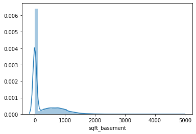


# Most homes don't have a basement, those that have more than 1000 square footage of basement are rare


```python

df['has_basement'] = df['sqft_basement'].astype(bool).astype(int)
```


```python
df.info()
```

    <class 'pandas.core.frame.DataFrame'>
    RangeIndex: 21597 entries, 0 to 21596
    Data columns (total 25 columns):
    price            21597 non-null float64
    bedrooms         21597 non-null int64
    bathrooms        21597 non-null float64
    sqft_living      21597 non-null int64
    sqft_lot         21597 non-null int64
    floors           21597 non-null float64
    waterfront       21597 non-null float64
    condition        21597 non-null int64
    grade            21597 non-null int64
    sqft_above       21597 non-null int64
    sqft_basement    21597 non-null int64
    yr_built         21597 non-null int64
    yr_renovated     21597 non-null float64
    zipcode          21597 non-null int64
    lat              21597 non-null float64
    long             21597 non-null float64
    sqft_living15    21597 non-null int64
    sqft_lot15       21597 non-null int64
    view_1           21597 non-null uint8
    view_2           21597 non-null uint8
    view_3           21597 non-null uint8
    view_4           21597 non-null uint8
    was_renovated    21597 non-null int64
    ren_gap          21597 non-null float64
    has_basement     21597 non-null int64
    dtypes: float64(8), int64(13), uint8(4)
    memory usage: 3.5 MB


```python
df['has_basement'].value_counts()
```


    0    13280
    1     8317
    Name: has_basement, dtype: int64


```python
sns.catplot(x='has_basement', y='price', data=df)
```


    <seaborn.axisgrid.FacetGrid at 0x1c198c97f0>


# Looks like more dwellings with basements fetch higher prices

# Question: What's the relative impact of years since a house was built, year renovated if it was renovated, years since renovations took place, and whether it was renovated or not on housing prices?


```python
sns.scatterplot(x="yr_built", y='price', data=df)
```


    <matplotlib.axes._subplots.AxesSubplot at 0x1c198a7ba8>


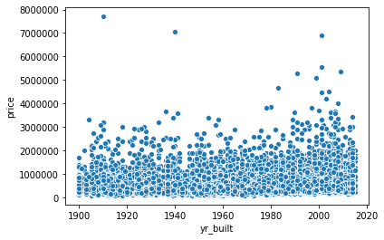


```python
sns.scatterplot(x="yr_renovated", y="price", data= renovation_gap)
```


    <matplotlib.axes._subplots.AxesSubplot at 0x1c19896fd0>


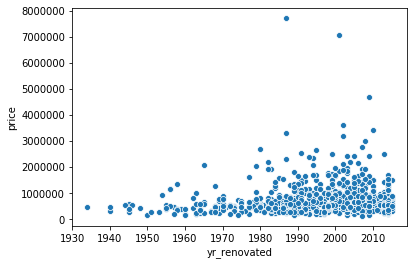


```python
sns.scatterplot(x='ren_gap', y='price', data=renovation_gap)
```


    <matplotlib.axes._subplots.AxesSubplot at 0x1c1b311dd8>


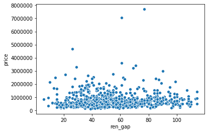


```python
sns.barplot(x='was_renovated', y='price', data=df)
```


    <matplotlib.axes._subplots.AxesSubplot at 0x1c1b2462e8>


# Conclusions: When a house was built matters less than its renovation year if it was renovated when comparing to price, but it's not that important how many years since a house was built that it was renovated. Renovation overall does raise prices.

# Question - how does living in the Seattle area effect prices?


```python
seattlezips = [98188,98199,98174,98154,98158,98164,98101,98102,98103,98104,98105,98106,98107,98108,98109,98112,98115,98116,98117,98118,98119,98121,98122,98125,98126,98133,98134,98136,
98144]

df['seattle'] = df['zipcode'].apply(lambda i: 1 if i in seattlezips else 0)
```


```python
df.seattle.value_counts()
```


    0    14735
    1     6862
    Name: seattle, dtype: int64


```python
sns.barplot(x='seattle', y='price', data=df)
```


    <matplotlib.axes._subplots.AxesSubplot at 0x1c1b5261d0>


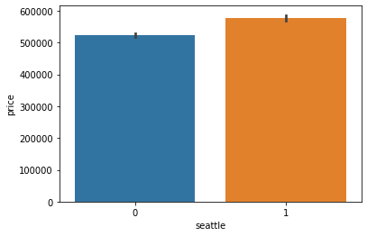


# Looks like living in Seattle has a measurable impact on driving up price


```python
%%HTML 

<div class='tableauPlaceholder' id='viz1574011490209' style='position: relative'><noscript><a href='#'></a></noscript><object class='tableauViz'  style='display:none;'><param name='host_url' value='https%3A%2F%2Fpublic.tableau.com%2F' /> <param name='embed_code_version' value='3' /> <param name='site_root' value='' /><param name='name' value='HousingPricesHeatmap-KingCountyWA&#47;kc_housing_heatmap' /><param name='tabs' value='no' /><param name='toolbar' value='yes' /><param name='static_image' value='https:&#47;&#47;public.tableau.com&#47;static&#47;images&#47;Ho&#47;HousingPricesHeatmap-KingCountyWA&#47;kc_housing_heatmap&#47;1.png' /> <param name='animate_transition' value='yes' /><param name='display_static_image' value='yes' /><param name='display_spinner' value='yes' /><param name='display_overlay' value='yes' /><param name='display_count' value='yes' /><param name='filter' value='publish=yes' /></object></div>                <script type='text/javascript'>                    var divElement = document.getElementById('viz1574011490209');                    var vizElement = divElement.getElementsByTagName('object')[0];                    vizElement.style.width='100%';vizElement.style.height=(divElement.offsetWidth*0.75)+'px';                    var scriptElement = document.createElement('script');                    scriptElement.src = 'https://public.tableau.com/javascripts/api/viz_v1.js';                    vizElement.parentNode.insertBefore(scriptElement, vizElement);                </script>
```


<div class='tableauPlaceholder' id='viz1574011490209' style='position: relative'><noscript><a href='#'></a></noscript><object class='tableauViz'  style='display:none;'><param name='host_url' value='https%3A%2F%2Fpublic.tableau.com%2F' /> <param name='embed_code_version' value='3' /> <param name='site_root' value='' /><param name='name' value='HousingPricesHeatmap-KingCountyWA&#47;kc_housing_heatmap' /><param name='tabs' value='no' /><param name='toolbar' value='yes' /><param name='static_image' value='https:&#47;&#47;public.tableau.com&#47;static&#47;images&#47;Ho&#47;HousingPricesHeatmap-KingCountyWA&#47;kc_housing_heatmap&#47;1.png' /> <param name='animate_transition' value='yes' /><param name='display_static_image' value='yes' /><param name='display_spinner' value='yes' /><param name='display_overlay' value='yes' /><param name='display_count' value='yes' /><param name='filter' value='publish=yes' /></object></div>                <script type='text/javascript'>                    var divElement = document.getElementById('viz1574011490209');                    var vizElement = divElement.getElementsByTagName('object')[0];                    vizElement.style.width='100%';vizElement.style.height=(divElement.offsetWidth*0.75)+'px';                    var scriptElement = document.createElement('script');                    scriptElement.src = 'https://public.tableau.com/javascripts/api/viz_v1.js';                    vizElement.parentNode.insertBefore(scriptElement, vizElement);                </script>


# Conclusions - looks like at the least, more expensive homes are spread more in the north and center of the county

# lat and long are mostly useful for geospatial analysis, dropping them for now 


```python
df.drop(['lat', 'long'], axis=1, inplace=True)

df.head()
```


<div>
<style scoped>
    .dataframe tbody tr th:only-of-type {
        vertical-align: middle;
    }

    .dataframe tbody tr th {
        vertical-align: top;
    }

    .dataframe thead th {
        text-align: right;
    }
</style>
<table border="1" class="dataframe">
  <thead>
    <tr style="text-align: right;">
      <th></th>
      <th>price</th>
      <th>bedrooms</th>
      <th>bathrooms</th>
      <th>sqft_living</th>
      <th>sqft_lot</th>
      <th>floors</th>
      <th>waterfront</th>
      <th>condition</th>
      <th>grade</th>
      <th>sqft_above</th>
      <th>...</th>
      <th>sqft_living15</th>
      <th>sqft_lot15</th>
      <th>view_1</th>
      <th>view_2</th>
      <th>view_3</th>
      <th>view_4</th>
      <th>was_renovated</th>
      <th>ren_gap</th>
      <th>has_basement</th>
      <th>seattle</th>
    </tr>
  </thead>
  <tbody>
    <tr>
      <td>0</td>
      <td>221900.0</td>
      <td>3</td>
      <td>1.00</td>
      <td>1180</td>
      <td>5650</td>
      <td>1.0</td>
      <td>0.0</td>
      <td>3</td>
      <td>7</td>
      <td>1180</td>
      <td>...</td>
      <td>1340</td>
      <td>5650</td>
      <td>0</td>
      <td>0</td>
      <td>0</td>
      <td>0</td>
      <td>0</td>
      <td>0.0</td>
      <td>0</td>
      <td>0</td>
    </tr>
    <tr>
      <td>1</td>
      <td>538000.0</td>
      <td>3</td>
      <td>2.25</td>
      <td>2570</td>
      <td>7242</td>
      <td>2.0</td>
      <td>0.0</td>
      <td>3</td>
      <td>7</td>
      <td>2170</td>
      <td>...</td>
      <td>1690</td>
      <td>7639</td>
      <td>0</td>
      <td>0</td>
      <td>0</td>
      <td>0</td>
      <td>1</td>
      <td>40.0</td>
      <td>1</td>
      <td>1</td>
    </tr>
    <tr>
      <td>2</td>
      <td>180000.0</td>
      <td>2</td>
      <td>1.00</td>
      <td>770</td>
      <td>10000</td>
      <td>1.0</td>
      <td>0.0</td>
      <td>3</td>
      <td>6</td>
      <td>770</td>
      <td>...</td>
      <td>2720</td>
      <td>8062</td>
      <td>0</td>
      <td>0</td>
      <td>0</td>
      <td>0</td>
      <td>0</td>
      <td>0.0</td>
      <td>0</td>
      <td>0</td>
    </tr>
    <tr>
      <td>3</td>
      <td>604000.0</td>
      <td>4</td>
      <td>3.00</td>
      <td>1960</td>
      <td>5000</td>
      <td>1.0</td>
      <td>0.0</td>
      <td>5</td>
      <td>7</td>
      <td>1050</td>
      <td>...</td>
      <td>1360</td>
      <td>5000</td>
      <td>0</td>
      <td>0</td>
      <td>0</td>
      <td>0</td>
      <td>0</td>
      <td>0.0</td>
      <td>1</td>
      <td>1</td>
    </tr>
    <tr>
      <td>4</td>
      <td>510000.0</td>
      <td>3</td>
      <td>2.00</td>
      <td>1680</td>
      <td>8080</td>
      <td>1.0</td>
      <td>0.0</td>
      <td>3</td>
      <td>8</td>
      <td>1680</td>
      <td>...</td>
      <td>1800</td>
      <td>7503</td>
      <td>0</td>
      <td>0</td>
      <td>0</td>
      <td>0</td>
      <td>0</td>
      <td>0.0</td>
      <td>0</td>
      <td>0</td>
    </tr>
  </tbody>
</table>
<p>5 rows × 24 columns</p>
</div>


# QUESTION: Are there any other issues such as a predominance of 0s in the values of a column? - Bedrooms and Bathrooms look ordinal, as does floors and condition and grade but bathrooms, bedrooms and grade could be treated as numeric


```python
for col in df:
    print(df[col].value_counts(dropna=False))
```

    350000.0    172
    450000.0    172
    550000.0    159
    500000.0    152
    425000.0    150
               ... 
    870515.0      1
    336950.0      1
    386100.0      1
    176250.0      1
    884744.0      1
    Name: price, Length: 3622, dtype: int64
    3     9824
    4     6882
    2     2760
    5     1601
    6      272
    1      196
    7       38
    8       13
    9        6
    10       3
    11       1
    33       1
    Name: bedrooms, dtype: int64
    2.50    5377
    1.00    3851
    1.75    3048
    2.25    2047
    2.00    1930
    1.50    1445
    2.75    1185
    3.00     753
    3.50     731
    3.25     589
    3.75     155
    4.00     136
    4.50     100
    4.25      79
    0.75      71
    4.75      23
    5.00      21
    5.25      13
    5.50      10
    1.25       9
    6.00       6
    5.75       4
    0.50       4
    8.00       2
    6.25       2
    6.75       2
    6.50       2
    7.50       1
    7.75       1
    Name: bathrooms, dtype: int64
    1300    138
    1400    135
    1440    133
    1660    129
    1010    129
           ... 
    4970      1
    2905      1
    2793      1
    4810      1
    1975      1
    Name: sqft_living, Length: 1034, dtype: int64
    5000      358
    6000      290
    4000      251
    7200      220
    7500      119
             ... 
    1448        1
    38884       1
    17313       1
    35752       1
    315374      1
    Name: sqft_lot, Length: 9776, dtype: int64
    1.0    10673
    2.0     8235
    1.5     1910
    3.0      611
    2.5      161
    3.5        7
    Name: floors, dtype: int64
    0.0    21451
    1.0      146
    Name: waterfront, dtype: int64
    3    14020
    4     5677
    5     1701
    2      170
    1       29
    Name: condition, dtype: int64
    7     8974
    8     6065
    9     2615
    6     2038
    10    1134
    11     399
    5      242
    12      89
    4       27
    13      13
    3        1
    Name: grade, dtype: int64
    1300    212
    1010    210
    1200    206
    1220    192
    1140    184
           ... 
    2601      1
    440       1
    2473      1
    2441      1
    1975      1
    Name: sqft_above, Length: 942, dtype: int64
    0       13280
    600       217
    500       209
    700       208
    800       201
            ...  
    1816        1
    1880        1
    1960        1
    2120        1
    1135        1
    Name: sqft_basement, Length: 303, dtype: int64
    2014    559
    2006    453
    2005    450
    2004    433
    2003    420
           ... 
    1933     30
    1901     29
    1902     27
    1935     24
    1934     21
    Name: yr_built, Length: 116, dtype: int64
    0.0       20853
    2014.0       73
    2003.0       31
    2013.0       31
    2007.0       30
              ...  
    1946.0        1
    1959.0        1
    1971.0        1
    1951.0        1
    1954.0        1
    Name: yr_renovated, Length: 70, dtype: int64
    98103    602
    98038    589
    98115    583
    98052    574
    98117    553
            ... 
    98102    104
    98010    100
    98024     80
    98148     57
    98039     50
    Name: zipcode, Length: 70, dtype: int64
    1540    197
    1440    195
    1560    192
    1500    180
    1460    169
           ... 
    4890      1
    2873      1
    952       1
    3193      1
    2049      1
    Name: sqft_living15, Length: 777, dtype: int64
    5000      427
    4000      356
    6000      288
    7200      210
    4800      145
             ... 
    11036       1
    8989        1
    871200      1
    809         1
    6147        1
    Name: sqft_lot15, Length: 8682, dtype: int64
    0    21267
    1      330
    Name: view_1, dtype: int64
    0    20640
    1      957
    Name: view_2, dtype: int64
    0    21089
    1      508
    Name: view_3, dtype: int64
    0    21280
    1      317
    Name: view_4, dtype: int64
    0    20853
    1      744
    Name: was_renovated, dtype: int64
    0.0      20853
    63.0        17
    43.0        17
    37.0        16
    86.0        15
             ...  
    10.0         1
    105.0        1
    113.0        1
    13.0         1
    109.0        1
    Name: ren_gap, Length: 104, dtype: int64
    0    13280
    1     8317
    Name: has_basement, dtype: int64
    0    14735
    1     6862
    Name: seattle, dtype: int64


```python
df = pd.concat([df,pd.get_dummies(df['condition'], prefix='condition', drop_first=True)],axis=1).drop(['condition'],axis=1)

df.head(10)
```


<div>
<style scoped>
    .dataframe tbody tr th:only-of-type {
        vertical-align: middle;
    }

    .dataframe tbody tr th {
        vertical-align: top;
    }

    .dataframe thead th {
        text-align: right;
    }
</style>
<table border="1" class="dataframe">
  <thead>
    <tr style="text-align: right;">
      <th></th>
      <th>price</th>
      <th>bedrooms</th>
      <th>bathrooms</th>
      <th>sqft_living</th>
      <th>sqft_lot</th>
      <th>floors</th>
      <th>waterfront</th>
      <th>grade</th>
      <th>sqft_above</th>
      <th>sqft_basement</th>
      <th>...</th>
      <th>view_3</th>
      <th>view_4</th>
      <th>was_renovated</th>
      <th>ren_gap</th>
      <th>has_basement</th>
      <th>seattle</th>
      <th>condition_2</th>
      <th>condition_3</th>
      <th>condition_4</th>
      <th>condition_5</th>
    </tr>
  </thead>
  <tbody>
    <tr>
      <td>0</td>
      <td>221900.0</td>
      <td>3</td>
      <td>1.00</td>
      <td>1180</td>
      <td>5650</td>
      <td>1.0</td>
      <td>0.0</td>
      <td>7</td>
      <td>1180</td>
      <td>0</td>
      <td>...</td>
      <td>0</td>
      <td>0</td>
      <td>0</td>
      <td>0.0</td>
      <td>0</td>
      <td>0</td>
      <td>0</td>
      <td>1</td>
      <td>0</td>
      <td>0</td>
    </tr>
    <tr>
      <td>1</td>
      <td>538000.0</td>
      <td>3</td>
      <td>2.25</td>
      <td>2570</td>
      <td>7242</td>
      <td>2.0</td>
      <td>0.0</td>
      <td>7</td>
      <td>2170</td>
      <td>400</td>
      <td>...</td>
      <td>0</td>
      <td>0</td>
      <td>1</td>
      <td>40.0</td>
      <td>1</td>
      <td>1</td>
      <td>0</td>
      <td>1</td>
      <td>0</td>
      <td>0</td>
    </tr>
    <tr>
      <td>2</td>
      <td>180000.0</td>
      <td>2</td>
      <td>1.00</td>
      <td>770</td>
      <td>10000</td>
      <td>1.0</td>
      <td>0.0</td>
      <td>6</td>
      <td>770</td>
      <td>0</td>
      <td>...</td>
      <td>0</td>
      <td>0</td>
      <td>0</td>
      <td>0.0</td>
      <td>0</td>
      <td>0</td>
      <td>0</td>
      <td>1</td>
      <td>0</td>
      <td>0</td>
    </tr>
    <tr>
      <td>3</td>
      <td>604000.0</td>
      <td>4</td>
      <td>3.00</td>
      <td>1960</td>
      <td>5000</td>
      <td>1.0</td>
      <td>0.0</td>
      <td>7</td>
      <td>1050</td>
      <td>910</td>
      <td>...</td>
      <td>0</td>
      <td>0</td>
      <td>0</td>
      <td>0.0</td>
      <td>1</td>
      <td>1</td>
      <td>0</td>
      <td>0</td>
      <td>0</td>
      <td>1</td>
    </tr>
    <tr>
      <td>4</td>
      <td>510000.0</td>
      <td>3</td>
      <td>2.00</td>
      <td>1680</td>
      <td>8080</td>
      <td>1.0</td>
      <td>0.0</td>
      <td>8</td>
      <td>1680</td>
      <td>0</td>
      <td>...</td>
      <td>0</td>
      <td>0</td>
      <td>0</td>
      <td>0.0</td>
      <td>0</td>
      <td>0</td>
      <td>0</td>
      <td>1</td>
      <td>0</td>
      <td>0</td>
    </tr>
    <tr>
      <td>5</td>
      <td>1230000.0</td>
      <td>4</td>
      <td>4.50</td>
      <td>5420</td>
      <td>101930</td>
      <td>1.0</td>
      <td>0.0</td>
      <td>11</td>
      <td>3890</td>
      <td>1530</td>
      <td>...</td>
      <td>0</td>
      <td>0</td>
      <td>0</td>
      <td>0.0</td>
      <td>1</td>
      <td>0</td>
      <td>0</td>
      <td>1</td>
      <td>0</td>
      <td>0</td>
    </tr>
    <tr>
      <td>6</td>
      <td>257500.0</td>
      <td>3</td>
      <td>2.25</td>
      <td>1715</td>
      <td>6819</td>
      <td>2.0</td>
      <td>0.0</td>
      <td>7</td>
      <td>1715</td>
      <td>0</td>
      <td>...</td>
      <td>0</td>
      <td>0</td>
      <td>0</td>
      <td>0.0</td>
      <td>0</td>
      <td>0</td>
      <td>0</td>
      <td>1</td>
      <td>0</td>
      <td>0</td>
    </tr>
    <tr>
      <td>7</td>
      <td>291850.0</td>
      <td>3</td>
      <td>1.50</td>
      <td>1060</td>
      <td>9711</td>
      <td>1.0</td>
      <td>0.0</td>
      <td>7</td>
      <td>1060</td>
      <td>0</td>
      <td>...</td>
      <td>0</td>
      <td>0</td>
      <td>0</td>
      <td>0.0</td>
      <td>0</td>
      <td>0</td>
      <td>0</td>
      <td>1</td>
      <td>0</td>
      <td>0</td>
    </tr>
    <tr>
      <td>8</td>
      <td>229500.0</td>
      <td>3</td>
      <td>1.00</td>
      <td>1780</td>
      <td>7470</td>
      <td>1.0</td>
      <td>0.0</td>
      <td>7</td>
      <td>1050</td>
      <td>730</td>
      <td>...</td>
      <td>0</td>
      <td>0</td>
      <td>0</td>
      <td>0.0</td>
      <td>1</td>
      <td>0</td>
      <td>0</td>
      <td>1</td>
      <td>0</td>
      <td>0</td>
    </tr>
    <tr>
      <td>9</td>
      <td>323000.0</td>
      <td>3</td>
      <td>2.50</td>
      <td>1890</td>
      <td>6560</td>
      <td>2.0</td>
      <td>0.0</td>
      <td>7</td>
      <td>1890</td>
      <td>0</td>
      <td>...</td>
      <td>0</td>
      <td>0</td>
      <td>0</td>
      <td>0.0</td>
      <td>0</td>
      <td>0</td>
      <td>0</td>
      <td>1</td>
      <td>0</td>
      <td>0</td>
    </tr>
  </tbody>
</table>
<p>10 rows × 27 columns</p>
</div>


```python

```

# Bedrooms --> categories


```python
sns.catplot(x='bedrooms', y='price', data=df)
```


    <seaborn.axisgrid.FacetGrid at 0x1c1b602390>


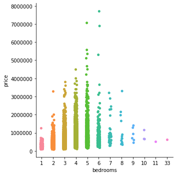


```python
df = pd.concat([df,pd.get_dummies(df['bedrooms'], prefix='bedroom', drop_first=True)],axis=1).drop(['bedrooms'],axis=1)

df.head(10)
```


<div>
<style scoped>
    .dataframe tbody tr th:only-of-type {
        vertical-align: middle;
    }

    .dataframe tbody tr th {
        vertical-align: top;
    }

    .dataframe thead th {
        text-align: right;
    }
</style>
<table border="1" class="dataframe">
  <thead>
    <tr style="text-align: right;">
      <th></th>
      <th>price</th>
      <th>bathrooms</th>
      <th>sqft_living</th>
      <th>sqft_lot</th>
      <th>floors</th>
      <th>waterfront</th>
      <th>grade</th>
      <th>sqft_above</th>
      <th>sqft_basement</th>
      <th>yr_built</th>
      <th>...</th>
      <th>bedroom_3</th>
      <th>bedroom_4</th>
      <th>bedroom_5</th>
      <th>bedroom_6</th>
      <th>bedroom_7</th>
      <th>bedroom_8</th>
      <th>bedroom_9</th>
      <th>bedroom_10</th>
      <th>bedroom_11</th>
      <th>bedroom_33</th>
    </tr>
  </thead>
  <tbody>
    <tr>
      <td>0</td>
      <td>221900.0</td>
      <td>1.00</td>
      <td>1180</td>
      <td>5650</td>
      <td>1.0</td>
      <td>0.0</td>
      <td>7</td>
      <td>1180</td>
      <td>0</td>
      <td>1955</td>
      <td>...</td>
      <td>1</td>
      <td>0</td>
      <td>0</td>
      <td>0</td>
      <td>0</td>
      <td>0</td>
      <td>0</td>
      <td>0</td>
      <td>0</td>
      <td>0</td>
    </tr>
    <tr>
      <td>1</td>
      <td>538000.0</td>
      <td>2.25</td>
      <td>2570</td>
      <td>7242</td>
      <td>2.0</td>
      <td>0.0</td>
      <td>7</td>
      <td>2170</td>
      <td>400</td>
      <td>1951</td>
      <td>...</td>
      <td>1</td>
      <td>0</td>
      <td>0</td>
      <td>0</td>
      <td>0</td>
      <td>0</td>
      <td>0</td>
      <td>0</td>
      <td>0</td>
      <td>0</td>
    </tr>
    <tr>
      <td>2</td>
      <td>180000.0</td>
      <td>1.00</td>
      <td>770</td>
      <td>10000</td>
      <td>1.0</td>
      <td>0.0</td>
      <td>6</td>
      <td>770</td>
      <td>0</td>
      <td>1933</td>
      <td>...</td>
      <td>0</td>
      <td>0</td>
      <td>0</td>
      <td>0</td>
      <td>0</td>
      <td>0</td>
      <td>0</td>
      <td>0</td>
      <td>0</td>
      <td>0</td>
    </tr>
    <tr>
      <td>3</td>
      <td>604000.0</td>
      <td>3.00</td>
      <td>1960</td>
      <td>5000</td>
      <td>1.0</td>
      <td>0.0</td>
      <td>7</td>
      <td>1050</td>
      <td>910</td>
      <td>1965</td>
      <td>...</td>
      <td>0</td>
      <td>1</td>
      <td>0</td>
      <td>0</td>
      <td>0</td>
      <td>0</td>
      <td>0</td>
      <td>0</td>
      <td>0</td>
      <td>0</td>
    </tr>
    <tr>
      <td>4</td>
      <td>510000.0</td>
      <td>2.00</td>
      <td>1680</td>
      <td>8080</td>
      <td>1.0</td>
      <td>0.0</td>
      <td>8</td>
      <td>1680</td>
      <td>0</td>
      <td>1987</td>
      <td>...</td>
      <td>1</td>
      <td>0</td>
      <td>0</td>
      <td>0</td>
      <td>0</td>
      <td>0</td>
      <td>0</td>
      <td>0</td>
      <td>0</td>
      <td>0</td>
    </tr>
    <tr>
      <td>5</td>
      <td>1230000.0</td>
      <td>4.50</td>
      <td>5420</td>
      <td>101930</td>
      <td>1.0</td>
      <td>0.0</td>
      <td>11</td>
      <td>3890</td>
      <td>1530</td>
      <td>2001</td>
      <td>...</td>
      <td>0</td>
      <td>1</td>
      <td>0</td>
      <td>0</td>
      <td>0</td>
      <td>0</td>
      <td>0</td>
      <td>0</td>
      <td>0</td>
      <td>0</td>
    </tr>
    <tr>
      <td>6</td>
      <td>257500.0</td>
      <td>2.25</td>
      <td>1715</td>
      <td>6819</td>
      <td>2.0</td>
      <td>0.0</td>
      <td>7</td>
      <td>1715</td>
      <td>0</td>
      <td>1995</td>
      <td>...</td>
      <td>1</td>
      <td>0</td>
      <td>0</td>
      <td>0</td>
      <td>0</td>
      <td>0</td>
      <td>0</td>
      <td>0</td>
      <td>0</td>
      <td>0</td>
    </tr>
    <tr>
      <td>7</td>
      <td>291850.0</td>
      <td>1.50</td>
      <td>1060</td>
      <td>9711</td>
      <td>1.0</td>
      <td>0.0</td>
      <td>7</td>
      <td>1060</td>
      <td>0</td>
      <td>1963</td>
      <td>...</td>
      <td>1</td>
      <td>0</td>
      <td>0</td>
      <td>0</td>
      <td>0</td>
      <td>0</td>
      <td>0</td>
      <td>0</td>
      <td>0</td>
      <td>0</td>
    </tr>
    <tr>
      <td>8</td>
      <td>229500.0</td>
      <td>1.00</td>
      <td>1780</td>
      <td>7470</td>
      <td>1.0</td>
      <td>0.0</td>
      <td>7</td>
      <td>1050</td>
      <td>730</td>
      <td>1960</td>
      <td>...</td>
      <td>1</td>
      <td>0</td>
      <td>0</td>
      <td>0</td>
      <td>0</td>
      <td>0</td>
      <td>0</td>
      <td>0</td>
      <td>0</td>
      <td>0</td>
    </tr>
    <tr>
      <td>9</td>
      <td>323000.0</td>
      <td>2.50</td>
      <td>1890</td>
      <td>6560</td>
      <td>2.0</td>
      <td>0.0</td>
      <td>7</td>
      <td>1890</td>
      <td>0</td>
      <td>2003</td>
      <td>...</td>
      <td>1</td>
      <td>0</td>
      <td>0</td>
      <td>0</td>
      <td>0</td>
      <td>0</td>
      <td>0</td>
      <td>0</td>
      <td>0</td>
      <td>0</td>
    </tr>
  </tbody>
</table>
<p>10 rows × 37 columns</p>
</div>


```python

```

# Binning bathrooms into an ordinal category with .cat.codes


```python
sns.catplot(x="bathrooms", y="price", data=df)
```


    <seaborn.axisgrid.FacetGrid at 0x1c1b674fd0>


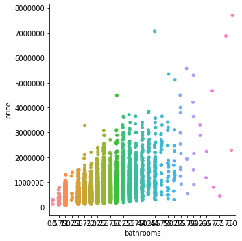


```python
bins = [0, 1,2,3,4,5, 6, 7, 8]
df['bathroom_bins'] = pd.cut(df['bathrooms'], bins,include_lowest = True)

df.head(10)
```


<div>
<style scoped>
    .dataframe tbody tr th:only-of-type {
        vertical-align: middle;
    }

    .dataframe tbody tr th {
        vertical-align: top;
    }

    .dataframe thead th {
        text-align: right;
    }
</style>
<table border="1" class="dataframe">
  <thead>
    <tr style="text-align: right;">
      <th></th>
      <th>price</th>
      <th>bathrooms</th>
      <th>sqft_living</th>
      <th>sqft_lot</th>
      <th>floors</th>
      <th>waterfront</th>
      <th>grade</th>
      <th>sqft_above</th>
      <th>sqft_basement</th>
      <th>yr_built</th>
      <th>...</th>
      <th>bedroom_4</th>
      <th>bedroom_5</th>
      <th>bedroom_6</th>
      <th>bedroom_7</th>
      <th>bedroom_8</th>
      <th>bedroom_9</th>
      <th>bedroom_10</th>
      <th>bedroom_11</th>
      <th>bedroom_33</th>
      <th>bathroom_bins</th>
    </tr>
  </thead>
  <tbody>
    <tr>
      <td>0</td>
      <td>221900.0</td>
      <td>1.00</td>
      <td>1180</td>
      <td>5650</td>
      <td>1.0</td>
      <td>0.0</td>
      <td>7</td>
      <td>1180</td>
      <td>0</td>
      <td>1955</td>
      <td>...</td>
      <td>0</td>
      <td>0</td>
      <td>0</td>
      <td>0</td>
      <td>0</td>
      <td>0</td>
      <td>0</td>
      <td>0</td>
      <td>0</td>
      <td>(-0.001, 1.0]</td>
    </tr>
    <tr>
      <td>1</td>
      <td>538000.0</td>
      <td>2.25</td>
      <td>2570</td>
      <td>7242</td>
      <td>2.0</td>
      <td>0.0</td>
      <td>7</td>
      <td>2170</td>
      <td>400</td>
      <td>1951</td>
      <td>...</td>
      <td>0</td>
      <td>0</td>
      <td>0</td>
      <td>0</td>
      <td>0</td>
      <td>0</td>
      <td>0</td>
      <td>0</td>
      <td>0</td>
      <td>(2.0, 3.0]</td>
    </tr>
    <tr>
      <td>2</td>
      <td>180000.0</td>
      <td>1.00</td>
      <td>770</td>
      <td>10000</td>
      <td>1.0</td>
      <td>0.0</td>
      <td>6</td>
      <td>770</td>
      <td>0</td>
      <td>1933</td>
      <td>...</td>
      <td>0</td>
      <td>0</td>
      <td>0</td>
      <td>0</td>
      <td>0</td>
      <td>0</td>
      <td>0</td>
      <td>0</td>
      <td>0</td>
      <td>(-0.001, 1.0]</td>
    </tr>
    <tr>
      <td>3</td>
      <td>604000.0</td>
      <td>3.00</td>
      <td>1960</td>
      <td>5000</td>
      <td>1.0</td>
      <td>0.0</td>
      <td>7</td>
      <td>1050</td>
      <td>910</td>
      <td>1965</td>
      <td>...</td>
      <td>1</td>
      <td>0</td>
      <td>0</td>
      <td>0</td>
      <td>0</td>
      <td>0</td>
      <td>0</td>
      <td>0</td>
      <td>0</td>
      <td>(2.0, 3.0]</td>
    </tr>
    <tr>
      <td>4</td>
      <td>510000.0</td>
      <td>2.00</td>
      <td>1680</td>
      <td>8080</td>
      <td>1.0</td>
      <td>0.0</td>
      <td>8</td>
      <td>1680</td>
      <td>0</td>
      <td>1987</td>
      <td>...</td>
      <td>0</td>
      <td>0</td>
      <td>0</td>
      <td>0</td>
      <td>0</td>
      <td>0</td>
      <td>0</td>
      <td>0</td>
      <td>0</td>
      <td>(1.0, 2.0]</td>
    </tr>
    <tr>
      <td>5</td>
      <td>1230000.0</td>
      <td>4.50</td>
      <td>5420</td>
      <td>101930</td>
      <td>1.0</td>
      <td>0.0</td>
      <td>11</td>
      <td>3890</td>
      <td>1530</td>
      <td>2001</td>
      <td>...</td>
      <td>1</td>
      <td>0</td>
      <td>0</td>
      <td>0</td>
      <td>0</td>
      <td>0</td>
      <td>0</td>
      <td>0</td>
      <td>0</td>
      <td>(4.0, 5.0]</td>
    </tr>
    <tr>
      <td>6</td>
      <td>257500.0</td>
      <td>2.25</td>
      <td>1715</td>
      <td>6819</td>
      <td>2.0</td>
      <td>0.0</td>
      <td>7</td>
      <td>1715</td>
      <td>0</td>
      <td>1995</td>
      <td>...</td>
      <td>0</td>
      <td>0</td>
      <td>0</td>
      <td>0</td>
      <td>0</td>
      <td>0</td>
      <td>0</td>
      <td>0</td>
      <td>0</td>
      <td>(2.0, 3.0]</td>
    </tr>
    <tr>
      <td>7</td>
      <td>291850.0</td>
      <td>1.50</td>
      <td>1060</td>
      <td>9711</td>
      <td>1.0</td>
      <td>0.0</td>
      <td>7</td>
      <td>1060</td>
      <td>0</td>
      <td>1963</td>
      <td>...</td>
      <td>0</td>
      <td>0</td>
      <td>0</td>
      <td>0</td>
      <td>0</td>
      <td>0</td>
      <td>0</td>
      <td>0</td>
      <td>0</td>
      <td>(1.0, 2.0]</td>
    </tr>
    <tr>
      <td>8</td>
      <td>229500.0</td>
      <td>1.00</td>
      <td>1780</td>
      <td>7470</td>
      <td>1.0</td>
      <td>0.0</td>
      <td>7</td>
      <td>1050</td>
      <td>730</td>
      <td>1960</td>
      <td>...</td>
      <td>0</td>
      <td>0</td>
      <td>0</td>
      <td>0</td>
      <td>0</td>
      <td>0</td>
      <td>0</td>
      <td>0</td>
      <td>0</td>
      <td>(-0.001, 1.0]</td>
    </tr>
    <tr>
      <td>9</td>
      <td>323000.0</td>
      <td>2.50</td>
      <td>1890</td>
      <td>6560</td>
      <td>2.0</td>
      <td>0.0</td>
      <td>7</td>
      <td>1890</td>
      <td>0</td>
      <td>2003</td>
      <td>...</td>
      <td>0</td>
      <td>0</td>
      <td>0</td>
      <td>0</td>
      <td>0</td>
      <td>0</td>
      <td>0</td>
      <td>0</td>
      <td>0</td>
      <td>(2.0, 3.0]</td>
    </tr>
  </tbody>
</table>
<p>10 rows × 38 columns</p>
</div>


```python
df.bathroom_bins.value_counts(dropna=False)
```


    (2.0, 3.0]       9362
    (1.0, 2.0]       6432
    (-0.001, 1.0]    3926
    (3.0, 4.0]       1611
    (4.0, 5.0]        223
    (5.0, 6.0]         33
    (6.0, 7.0]          6
    (7.0, 8.0]          4
    Name: bathroom_bins, dtype: int64


```python
df['bathroom_bins'] = df['bathroom_bins'].cat.codes
```


```python
df['bathroom_bins'].value_counts()
```


    2    9362
    1    6432
    0    3926
    3    1611
    4     223
    5      33
    6       6
    7       4
    Name: bathroom_bins, dtype: int64


```python
df.drop('bathrooms', axis= 1, inplace=True)
```


```python
sns.catplot(x="bathroom_bins", y="price", data=df)
```


    <seaborn.axisgrid.FacetGrid at 0x1c1a7efeb8>


# Conclusions: Having 0-4 bedrooms is most common, with 3-4 bedrooms looking like the sweet spot to increase price.

# Encoding of Floors


```python
df = pd.concat([df,pd.get_dummies(df['floors'], prefix='floors', drop_first=True)],axis=1).drop(['floors'],axis=1)

df.head(10)
```


<div>
<style scoped>
    .dataframe tbody tr th:only-of-type {
        vertical-align: middle;
    }

    .dataframe tbody tr th {
        vertical-align: top;
    }

    .dataframe thead th {
        text-align: right;
    }
</style>
<table border="1" class="dataframe">
  <thead>
    <tr style="text-align: right;">
      <th></th>
      <th>price</th>
      <th>sqft_living</th>
      <th>sqft_lot</th>
      <th>waterfront</th>
      <th>grade</th>
      <th>sqft_above</th>
      <th>sqft_basement</th>
      <th>yr_built</th>
      <th>yr_renovated</th>
      <th>zipcode</th>
      <th>...</th>
      <th>bedroom_9</th>
      <th>bedroom_10</th>
      <th>bedroom_11</th>
      <th>bedroom_33</th>
      <th>bathroom_bins</th>
      <th>floors_1.5</th>
      <th>floors_2.0</th>
      <th>floors_2.5</th>
      <th>floors_3.0</th>
      <th>floors_3.5</th>
    </tr>
  </thead>
  <tbody>
    <tr>
      <td>0</td>
      <td>221900.0</td>
      <td>1180</td>
      <td>5650</td>
      <td>0.0</td>
      <td>7</td>
      <td>1180</td>
      <td>0</td>
      <td>1955</td>
      <td>0.0</td>
      <td>98178</td>
      <td>...</td>
      <td>0</td>
      <td>0</td>
      <td>0</td>
      <td>0</td>
      <td>0</td>
      <td>0</td>
      <td>0</td>
      <td>0</td>
      <td>0</td>
      <td>0</td>
    </tr>
    <tr>
      <td>1</td>
      <td>538000.0</td>
      <td>2570</td>
      <td>7242</td>
      <td>0.0</td>
      <td>7</td>
      <td>2170</td>
      <td>400</td>
      <td>1951</td>
      <td>1991.0</td>
      <td>98125</td>
      <td>...</td>
      <td>0</td>
      <td>0</td>
      <td>0</td>
      <td>0</td>
      <td>2</td>
      <td>0</td>
      <td>1</td>
      <td>0</td>
      <td>0</td>
      <td>0</td>
    </tr>
    <tr>
      <td>2</td>
      <td>180000.0</td>
      <td>770</td>
      <td>10000</td>
      <td>0.0</td>
      <td>6</td>
      <td>770</td>
      <td>0</td>
      <td>1933</td>
      <td>0.0</td>
      <td>98028</td>
      <td>...</td>
      <td>0</td>
      <td>0</td>
      <td>0</td>
      <td>0</td>
      <td>0</td>
      <td>0</td>
      <td>0</td>
      <td>0</td>
      <td>0</td>
      <td>0</td>
    </tr>
    <tr>
      <td>3</td>
      <td>604000.0</td>
      <td>1960</td>
      <td>5000</td>
      <td>0.0</td>
      <td>7</td>
      <td>1050</td>
      <td>910</td>
      <td>1965</td>
      <td>0.0</td>
      <td>98136</td>
      <td>...</td>
      <td>0</td>
      <td>0</td>
      <td>0</td>
      <td>0</td>
      <td>2</td>
      <td>0</td>
      <td>0</td>
      <td>0</td>
      <td>0</td>
      <td>0</td>
    </tr>
    <tr>
      <td>4</td>
      <td>510000.0</td>
      <td>1680</td>
      <td>8080</td>
      <td>0.0</td>
      <td>8</td>
      <td>1680</td>
      <td>0</td>
      <td>1987</td>
      <td>0.0</td>
      <td>98074</td>
      <td>...</td>
      <td>0</td>
      <td>0</td>
      <td>0</td>
      <td>0</td>
      <td>1</td>
      <td>0</td>
      <td>0</td>
      <td>0</td>
      <td>0</td>
      <td>0</td>
    </tr>
    <tr>
      <td>5</td>
      <td>1230000.0</td>
      <td>5420</td>
      <td>101930</td>
      <td>0.0</td>
      <td>11</td>
      <td>3890</td>
      <td>1530</td>
      <td>2001</td>
      <td>0.0</td>
      <td>98053</td>
      <td>...</td>
      <td>0</td>
      <td>0</td>
      <td>0</td>
      <td>0</td>
      <td>4</td>
      <td>0</td>
      <td>0</td>
      <td>0</td>
      <td>0</td>
      <td>0</td>
    </tr>
    <tr>
      <td>6</td>
      <td>257500.0</td>
      <td>1715</td>
      <td>6819</td>
      <td>0.0</td>
      <td>7</td>
      <td>1715</td>
      <td>0</td>
      <td>1995</td>
      <td>0.0</td>
      <td>98003</td>
      <td>...</td>
      <td>0</td>
      <td>0</td>
      <td>0</td>
      <td>0</td>
      <td>2</td>
      <td>0</td>
      <td>1</td>
      <td>0</td>
      <td>0</td>
      <td>0</td>
    </tr>
    <tr>
      <td>7</td>
      <td>291850.0</td>
      <td>1060</td>
      <td>9711</td>
      <td>0.0</td>
      <td>7</td>
      <td>1060</td>
      <td>0</td>
      <td>1963</td>
      <td>0.0</td>
      <td>98198</td>
      <td>...</td>
      <td>0</td>
      <td>0</td>
      <td>0</td>
      <td>0</td>
      <td>1</td>
      <td>0</td>
      <td>0</td>
      <td>0</td>
      <td>0</td>
      <td>0</td>
    </tr>
    <tr>
      <td>8</td>
      <td>229500.0</td>
      <td>1780</td>
      <td>7470</td>
      <td>0.0</td>
      <td>7</td>
      <td>1050</td>
      <td>730</td>
      <td>1960</td>
      <td>0.0</td>
      <td>98146</td>
      <td>...</td>
      <td>0</td>
      <td>0</td>
      <td>0</td>
      <td>0</td>
      <td>0</td>
      <td>0</td>
      <td>0</td>
      <td>0</td>
      <td>0</td>
      <td>0</td>
    </tr>
    <tr>
      <td>9</td>
      <td>323000.0</td>
      <td>1890</td>
      <td>6560</td>
      <td>0.0</td>
      <td>7</td>
      <td>1890</td>
      <td>0</td>
      <td>2003</td>
      <td>0.0</td>
      <td>98038</td>
      <td>...</td>
      <td>0</td>
      <td>0</td>
      <td>0</td>
      <td>0</td>
      <td>2</td>
      <td>0</td>
      <td>1</td>
      <td>0</td>
      <td>0</td>
      <td>0</td>
    </tr>
  </tbody>
</table>
<p>10 rows × 41 columns</p>
</div>


```python
df.columns
```


    Index(['price', 'sqft_living', 'sqft_lot', 'waterfront', 'grade', 'sqft_above',
           'sqft_basement', 'yr_built', 'yr_renovated', 'zipcode', 'sqft_living15',
           'sqft_lot15', 'view_1', 'view_2', 'view_3', 'view_4', 'was_renovated',
           'ren_gap', 'has_basement', 'seattle', 'condition_2', 'condition_3',
           'condition_4', 'condition_5', 'bedroom_2', 'bedroom_3', 'bedroom_4',
           'bedroom_5', 'bedroom_6', 'bedroom_7', 'bedroom_8', 'bedroom_9',
           'bedroom_10', 'bedroom_11', 'bedroom_33', 'bathroom_bins', 'floors_1.5',
           'floors_2.0', 'floors_2.5', 'floors_3.0', 'floors_3.5'],
          dtype='object')


# Encoding of zipcodes!


```python
df = pd.concat([df,pd.get_dummies(df['zipcode'], prefix='zip',drop_first=True)],axis=1,).drop(['zipcode'],axis=1)

df.head(10)
```


<div>
<style scoped>
    .dataframe tbody tr th:only-of-type {
        vertical-align: middle;
    }

    .dataframe tbody tr th {
        vertical-align: top;
    }

    .dataframe thead th {
        text-align: right;
    }
</style>
<table border="1" class="dataframe">
  <thead>
    <tr style="text-align: right;">
      <th></th>
      <th>price</th>
      <th>sqft_living</th>
      <th>sqft_lot</th>
      <th>waterfront</th>
      <th>grade</th>
      <th>sqft_above</th>
      <th>sqft_basement</th>
      <th>yr_built</th>
      <th>yr_renovated</th>
      <th>sqft_living15</th>
      <th>...</th>
      <th>zip_98146</th>
      <th>zip_98148</th>
      <th>zip_98155</th>
      <th>zip_98166</th>
      <th>zip_98168</th>
      <th>zip_98177</th>
      <th>zip_98178</th>
      <th>zip_98188</th>
      <th>zip_98198</th>
      <th>zip_98199</th>
    </tr>
  </thead>
  <tbody>
    <tr>
      <td>0</td>
      <td>221900.0</td>
      <td>1180</td>
      <td>5650</td>
      <td>0.0</td>
      <td>7</td>
      <td>1180</td>
      <td>0</td>
      <td>1955</td>
      <td>0.0</td>
      <td>1340</td>
      <td>...</td>
      <td>0</td>
      <td>0</td>
      <td>0</td>
      <td>0</td>
      <td>0</td>
      <td>0</td>
      <td>1</td>
      <td>0</td>
      <td>0</td>
      <td>0</td>
    </tr>
    <tr>
      <td>1</td>
      <td>538000.0</td>
      <td>2570</td>
      <td>7242</td>
      <td>0.0</td>
      <td>7</td>
      <td>2170</td>
      <td>400</td>
      <td>1951</td>
      <td>1991.0</td>
      <td>1690</td>
      <td>...</td>
      <td>0</td>
      <td>0</td>
      <td>0</td>
      <td>0</td>
      <td>0</td>
      <td>0</td>
      <td>0</td>
      <td>0</td>
      <td>0</td>
      <td>0</td>
    </tr>
    <tr>
      <td>2</td>
      <td>180000.0</td>
      <td>770</td>
      <td>10000</td>
      <td>0.0</td>
      <td>6</td>
      <td>770</td>
      <td>0</td>
      <td>1933</td>
      <td>0.0</td>
      <td>2720</td>
      <td>...</td>
      <td>0</td>
      <td>0</td>
      <td>0</td>
      <td>0</td>
      <td>0</td>
      <td>0</td>
      <td>0</td>
      <td>0</td>
      <td>0</td>
      <td>0</td>
    </tr>
    <tr>
      <td>3</td>
      <td>604000.0</td>
      <td>1960</td>
      <td>5000</td>
      <td>0.0</td>
      <td>7</td>
      <td>1050</td>
      <td>910</td>
      <td>1965</td>
      <td>0.0</td>
      <td>1360</td>
      <td>...</td>
      <td>0</td>
      <td>0</td>
      <td>0</td>
      <td>0</td>
      <td>0</td>
      <td>0</td>
      <td>0</td>
      <td>0</td>
      <td>0</td>
      <td>0</td>
    </tr>
    <tr>
      <td>4</td>
      <td>510000.0</td>
      <td>1680</td>
      <td>8080</td>
      <td>0.0</td>
      <td>8</td>
      <td>1680</td>
      <td>0</td>
      <td>1987</td>
      <td>0.0</td>
      <td>1800</td>
      <td>...</td>
      <td>0</td>
      <td>0</td>
      <td>0</td>
      <td>0</td>
      <td>0</td>
      <td>0</td>
      <td>0</td>
      <td>0</td>
      <td>0</td>
      <td>0</td>
    </tr>
    <tr>
      <td>5</td>
      <td>1230000.0</td>
      <td>5420</td>
      <td>101930</td>
      <td>0.0</td>
      <td>11</td>
      <td>3890</td>
      <td>1530</td>
      <td>2001</td>
      <td>0.0</td>
      <td>4760</td>
      <td>...</td>
      <td>0</td>
      <td>0</td>
      <td>0</td>
      <td>0</td>
      <td>0</td>
      <td>0</td>
      <td>0</td>
      <td>0</td>
      <td>0</td>
      <td>0</td>
    </tr>
    <tr>
      <td>6</td>
      <td>257500.0</td>
      <td>1715</td>
      <td>6819</td>
      <td>0.0</td>
      <td>7</td>
      <td>1715</td>
      <td>0</td>
      <td>1995</td>
      <td>0.0</td>
      <td>2238</td>
      <td>...</td>
      <td>0</td>
      <td>0</td>
      <td>0</td>
      <td>0</td>
      <td>0</td>
      <td>0</td>
      <td>0</td>
      <td>0</td>
      <td>0</td>
      <td>0</td>
    </tr>
    <tr>
      <td>7</td>
      <td>291850.0</td>
      <td>1060</td>
      <td>9711</td>
      <td>0.0</td>
      <td>7</td>
      <td>1060</td>
      <td>0</td>
      <td>1963</td>
      <td>0.0</td>
      <td>1650</td>
      <td>...</td>
      <td>0</td>
      <td>0</td>
      <td>0</td>
      <td>0</td>
      <td>0</td>
      <td>0</td>
      <td>0</td>
      <td>0</td>
      <td>1</td>
      <td>0</td>
    </tr>
    <tr>
      <td>8</td>
      <td>229500.0</td>
      <td>1780</td>
      <td>7470</td>
      <td>0.0</td>
      <td>7</td>
      <td>1050</td>
      <td>730</td>
      <td>1960</td>
      <td>0.0</td>
      <td>1780</td>
      <td>...</td>
      <td>1</td>
      <td>0</td>
      <td>0</td>
      <td>0</td>
      <td>0</td>
      <td>0</td>
      <td>0</td>
      <td>0</td>
      <td>0</td>
      <td>0</td>
    </tr>
    <tr>
      <td>9</td>
      <td>323000.0</td>
      <td>1890</td>
      <td>6560</td>
      <td>0.0</td>
      <td>7</td>
      <td>1890</td>
      <td>0</td>
      <td>2003</td>
      <td>0.0</td>
      <td>2390</td>
      <td>...</td>
      <td>0</td>
      <td>0</td>
      <td>0</td>
      <td>0</td>
      <td>0</td>
      <td>0</td>
      <td>0</td>
      <td>0</td>
      <td>0</td>
      <td>0</td>
    </tr>
  </tbody>
</table>
<p>10 rows × 109 columns</p>
</div>


```python
zip_col = [col for col in df if col.startswith('zip') or col.startswith('price')]
zip_col
```


    ['price',
     'zip_98002',
     'zip_98003',
     'zip_98004',
     'zip_98005',
     'zip_98006',
     'zip_98007',
     'zip_98008',
     'zip_98010',
     'zip_98011',
     'zip_98014',
     'zip_98019',
     'zip_98022',
     'zip_98023',
     'zip_98024',
     'zip_98027',
     'zip_98028',
     'zip_98029',
     'zip_98030',
     'zip_98031',
     'zip_98032',
     'zip_98033',
     'zip_98034',
     'zip_98038',
     'zip_98039',
     'zip_98040',
     'zip_98042',
     'zip_98045',
     'zip_98052',
     'zip_98053',
     'zip_98055',
     'zip_98056',
     'zip_98058',
     'zip_98059',
     'zip_98065',
     'zip_98070',
     'zip_98072',
     'zip_98074',
     'zip_98075',
     'zip_98077',
     'zip_98092',
     'zip_98102',
     'zip_98103',
     'zip_98105',
     'zip_98106',
     'zip_98107',
     'zip_98108',
     'zip_98109',
     'zip_98112',
     'zip_98115',
     'zip_98116',
     'zip_98117',
     'zip_98118',
     'zip_98119',
     'zip_98122',
     'zip_98125',
     'zip_98126',
     'zip_98133',
     'zip_98136',
     'zip_98144',
     'zip_98146',
     'zip_98148',
     'zip_98155',
     'zip_98166',
     'zip_98168',
     'zip_98177',
     'zip_98178',
     'zip_98188',
     'zip_98198',
     'zip_98199']


```python
len(zip_col)
```


    70


# Binning yr_built


```python
sorted(df['yr_built'].unique())
```


    [1900,
     1901,
     1902,
     1903,
     1904,
     1905,
     1906,
     1907,
     1908,
     1909,
     1910,
     1911,
     1912,
     1913,
     1914,
     1915,
     1916,
     1917,
     1918,
     1919,
     1920,
     1921,
     1922,
     1923,
     1924,
     1925,
     1926,
     1927,
     1928,
     1929,
     1930,
     1931,
     1932,
     1933,
     1934,
     1935,
     1936,
     1937,
     1938,
     1939,
     1940,
     1941,
     1942,
     1943,
     1944,
     1945,
     1946,
     1947,
     1948,
     1949,
     1950,
     1951,
     1952,
     1953,
     1954,
     1955,
     1956,
     1957,
     1958,
     1959,
     1960,
     1961,
     1962,
     1963,
     1964,
     1965,
     1966,
     1967,
     1968,
     1969,
     1970,
     1971,
     1972,
     1973,
     1974,
     1975,
     1976,
     1977,
     1978,
     1979,
     1980,
     1981,
     1982,
     1983,
     1984,
     1985,
     1986,
     1987,
     1988,
     1989,
     1990,
     1991,
     1992,
     1993,
     1994,
     1995,
     1996,
     1997,
     1998,
     1999,
     2000,
     2001,
     2002,
     2003,
     2004,
     2005,
     2006,
     2007,
     2008,
     2009,
     2010,
     2011,
     2012,
     2013,
     2014,
     2015]


```python
bins = [1900,1920,1940,1960,1980,2000,2020]
df['yr_built_bins'] = pd.cut(df['yr_built'], bins,include_lowest=True)
df['yr_built_bins']
```


    0        (1940.0, 1960.0]
    1        (1940.0, 1960.0]
    2        (1920.0, 1940.0]
    3        (1960.0, 1980.0]
    4        (1980.0, 2000.0]
                   ...       
    21592    (2000.0, 2020.0]
    21593    (2000.0, 2020.0]
    21594    (2000.0, 2020.0]
    21595    (2000.0, 2020.0]
    21596    (2000.0, 2020.0]
    Name: yr_built_bins, Length: 21597, dtype: category
    Categories (6, interval[float64]): [(1899.999, 1920.0] < (1920.0, 1940.0] < (1940.0, 1960.0] < (1960.0, 1980.0] < (1980.0, 2000.0] < (2000.0, 2020.0]]


```python
df['yr_built_bins'].value_counts()
```


    (1960.0, 1980.0]      4935
    (2000.0, 2020.0]      4538
    (1980.0, 2000.0]      4491
    (1940.0, 1960.0]      4305
    (1920.0, 1940.0]      1780
    (1899.999, 1920.0]    1548
    Name: yr_built_bins, dtype: int64


```python
df['yr_built_bins']= df['yr_built_bins'].astype("category")
```


```python
df['yr_built_bins'].value_counts()
```


    (1960.0, 1980.0]      4935
    (2000.0, 2020.0]      4538
    (1980.0, 2000.0]      4491
    (1940.0, 1960.0]      4305
    (1920.0, 1940.0]      1780
    (1899.999, 1920.0]    1548
    Name: yr_built_bins, dtype: int64


```python
df['yr_built_bins'] = df['yr_built_bins'].cat.codes
```


```python
df['yr_built_bins'].value_counts()
```


    3    4935
    5    4538
    4    4491
    2    4305
    1    1780
    0    1548
    Name: yr_built_bins, dtype: int64


```python
df.drop('yr_built', axis=1, inplace=True)
```


```python
sns.catplot(x="yr_built_bins", y="price", data=df)
```


    <seaborn.axisgrid.FacetGrid at 0x1c17c8f748>


# Looks like with the exception of some outliers, most ranges of houses with regards to when they were built net about the same price.

# Binning yr_renovated


```python
sorted(df['yr_renovated'].unique())
```


    [0.0,
     1934.0,
     1940.0,
     1944.0,
     1945.0,
     1946.0,
     1948.0,
     1950.0,
     1951.0,
     1953.0,
     1954.0,
     1955.0,
     1956.0,
     1957.0,
     1958.0,
     1959.0,
     1960.0,
     1962.0,
     1963.0,
     1964.0,
     1965.0,
     1967.0,
     1968.0,
     1969.0,
     1970.0,
     1971.0,
     1972.0,
     1973.0,
     1974.0,
     1975.0,
     1976.0,
     1977.0,
     1978.0,
     1979.0,
     1980.0,
     1981.0,
     1982.0,
     1983.0,
     1984.0,
     1985.0,
     1986.0,
     1987.0,
     1988.0,
     1989.0,
     1990.0,
     1991.0,
     1992.0,
     1993.0,
     1994.0,
     1995.0,
     1996.0,
     1997.0,
     1998.0,
     1999.0,
     2000.0,
     2001.0,
     2002.0,
     2003.0,
     2004.0,
     2005.0,
     2006.0,
     2007.0,
     2008.0,
     2009.0,
     2010.0,
     2011.0,
     2012.0,
     2013.0,
     2014.0,
     2015.0]


```python
ren_bins = [0, 1900,1940,1960,1980,2000,2020]
```


```python
df['yr_ren_bins'] = pd.cut(df['yr_renovated'], ren_bins,include_lowest=True)
df['yr_ren_bins'].value_counts()
```


    (-0.001, 1900.0]    20853
    (2000.0, 2020.0]      350
    (1980.0, 2000.0]      288
    (1960.0, 1980.0]       78
    (1940.0, 1960.0]       25
    (1900.0, 1940.0]        3
    Name: yr_ren_bins, dtype: int64


```python
df['yr_ren_bins']= df['yr_ren_bins'].astype("category")
```


```python
df['yr_ren_bins'] = df['yr_ren_bins'].cat.codes
```


```python
df['yr_ren_bins'].value_counts(dropna=False)
```


    0    20853
    5      350
    4      288
    3       78
    2       25
    1        3
    Name: yr_ren_bins, dtype: int64


```python
df.drop('yr_renovated',axis=1, inplace=True)
```


```python
sns.catplot(x="yr_ren_bins", y="price", data=df)
```


    <seaborn.axisgrid.FacetGrid at 0x1c1a912908>


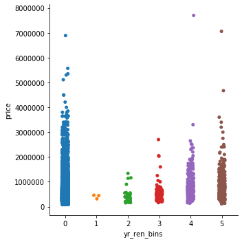


# In this data, most of the renovated houses are in the 5th bin, 2000-2020 and fetch the highest prices.

# Examining data visually before trimming outliers


```python
def diagnostic_plots(df, variable):
    
    # function to plot a histogram and a Q-Q plot
    # side by side, for a certain variable
    
    plt.figure(figsize=(15,6))
    plt.subplot(1, 2, 1)
    df[variable].hist(bins=30)
    plt.title(variable)

    plt.subplot(1, 2, 2)
    stats.probplot(df[variable], dist="norm", plot=plt)
    plt.title(variable)
    
    plt.tight_layout()
    plt.show()
```

# TBD: DO PLOTS FOR CATEGORICAL VS. NUMERICAL FEATURES AS DIFFERENT PLOTS FOR DISTRIBUTION BY THEMSELVES/AGAINST PRICE


```python
numeric_col = ['price', 'sqft_living', 'sqft_lot', 'grade', 'sqft_above',
       'sqft_basement', 'sqft_living15', 'sqft_lot15', 'yr_built_bins', 'yr_ren_bins']
```


```python
for col in df[numeric_col]:
    diagnostic_plots(df,col)
```


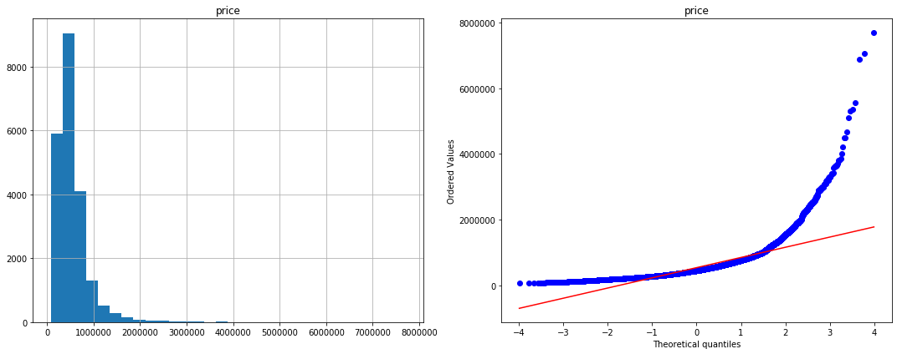


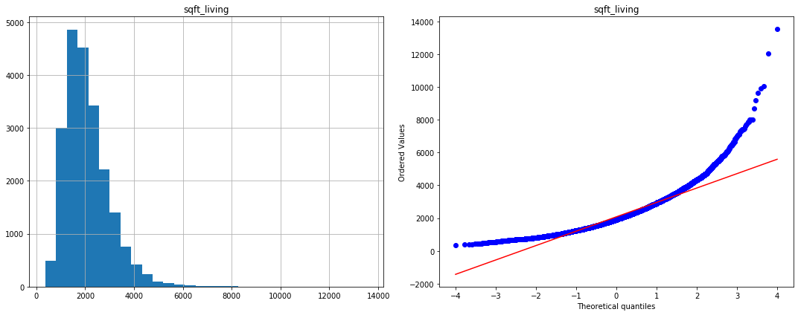


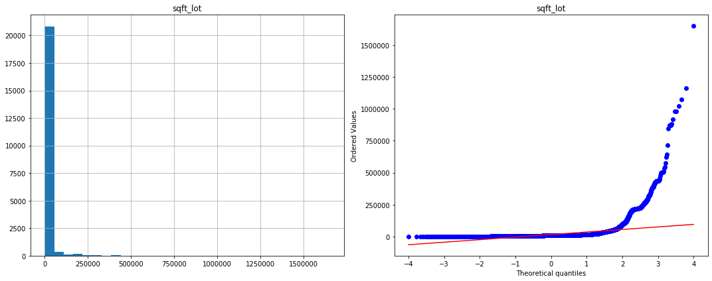


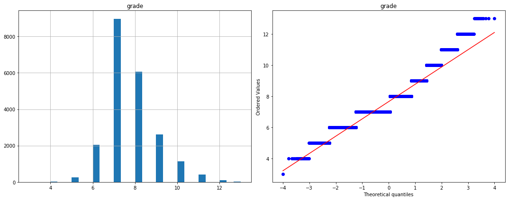


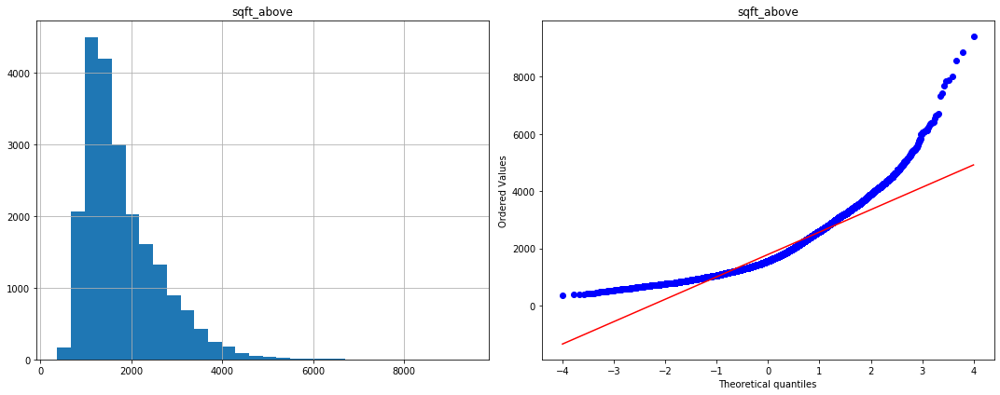


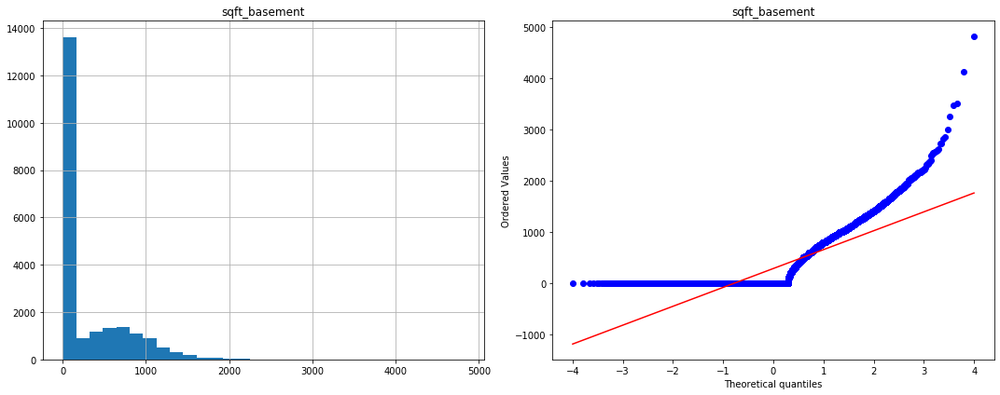


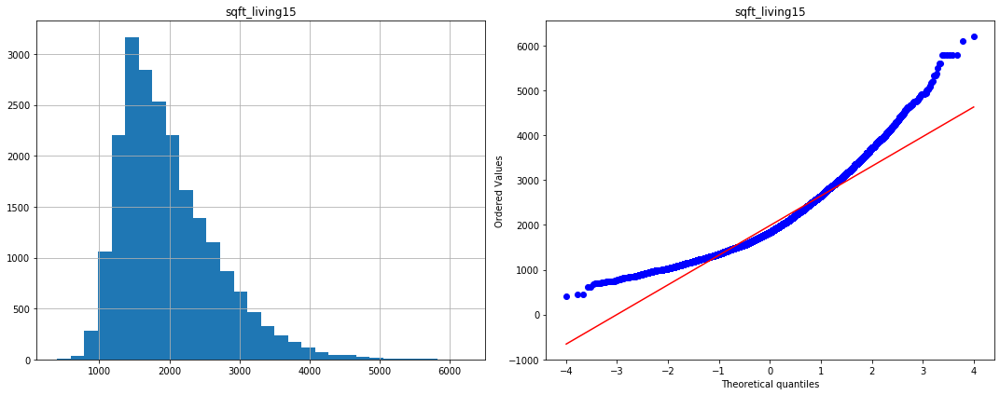


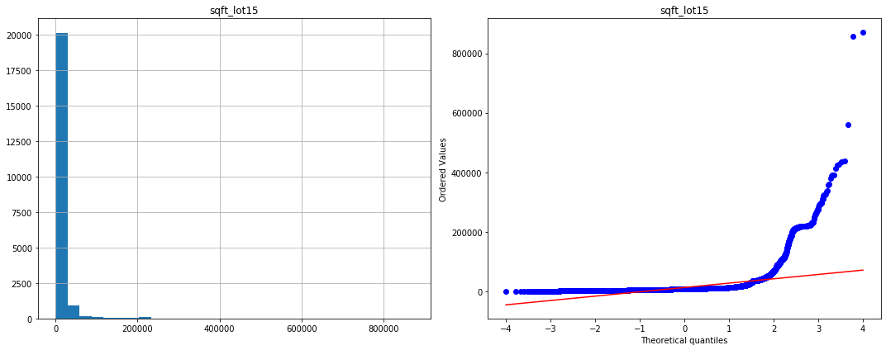


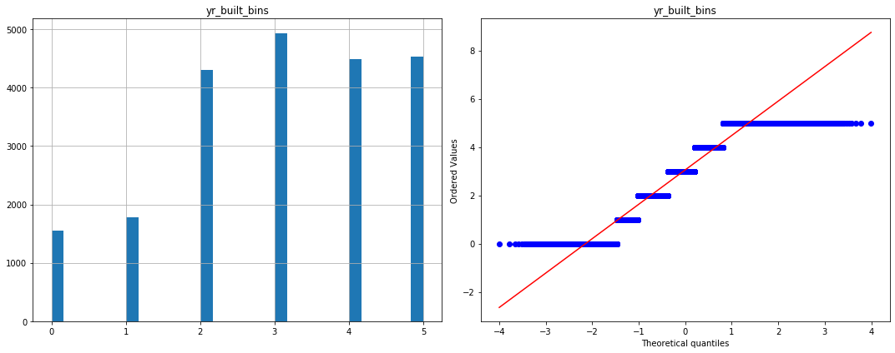


# This plot is very finicky about number of features


```python
len(df.columns)
```


    109


```python
#set figures large to be modified by tight_layout
plt.figure(1, figsize=(20,20))

#core function to create scatterplot
def multi_scatter_plot(x):
    sns.scatterplot(x, y="price", data=df)
    
#iterating over dataframe minus redundant price column, adding subplots
for index, col in enumerate(df.drop(['price'], axis=1).columns, start=1):
    #adds subplot, using index to increment position of new subplot in a 5 column structure
    plt.subplot(11, 10,index)
    #call function to create plot
    multi_scatter_plot(col)
    
#tidy display for inline and show plot
plt.tight_layout()
plt.show()
```


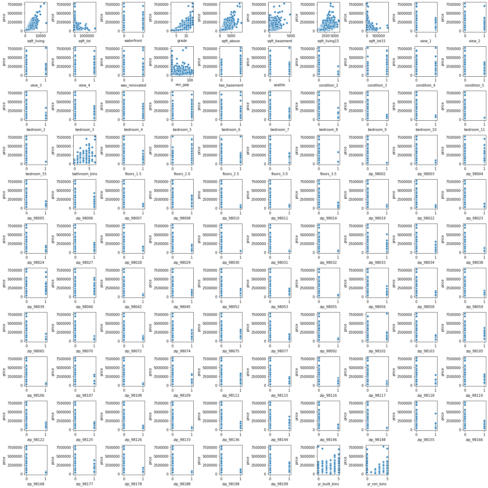


```python
df.drop(['sqft_lot', 'sqft_lot15', 'ren_gap'], axis=1, inplace=True)
```

# Outlier trimming - add IQR/z less than -3 


```python
len(df)
```


    21597


```python
def find_outliers(col):
    """Use scipy to calcualte absoliute Z-scores 
    and return boolean series where True indicates it is an outlier
    Args:
        col (Series): a series/column from your DataFrame
    Returns:
        idx_outliers (Series): series of  True/False for each row in col
        
    Ex:
    >> idx_outs = find_outliers(df['bedrooms'])
    >> df_clean = df.loc[idx_outs==False]"""
    from scipy import stats
    z = np.abs(stats.zscore(col))
    idx_outliers = np.where(z>3,True,False)
    return pd.Series(idx_outliers,index=col.index)
```


```python
df.columns
```


    Index(['price', 'sqft_living', 'waterfront', 'grade', 'sqft_above',
           'sqft_basement', 'sqft_living15', 'view_1', 'view_2', 'view_3',
           ...
           'zip_98155', 'zip_98166', 'zip_98168', 'zip_98177', 'zip_98178',
           'zip_98188', 'zip_98198', 'zip_98199', 'yr_built_bins', 'yr_ren_bins'],
          dtype='object', length=106)


```python
col_trim = ['price', 'sqft_living', 
            'grade', 'sqft_above', 'sqft_basement','sqft_living15'] 

for col in col_trim:
    print(col)
    idx = find_outliers(df[col])
    df = df.loc[idx==False]
```

    price
    sqft_living
    grade
    sqft_above
    sqft_basement
    sqft_living15


```python
len(df)
```


    20269


```python
df.columns
```


    Index(['price', 'sqft_living', 'waterfront', 'grade', 'sqft_above',
           'sqft_basement', 'sqft_living15', 'view_1', 'view_2', 'view_3',
           ...
           'zip_98155', 'zip_98166', 'zip_98168', 'zip_98177', 'zip_98178',
           'zip_98188', 'zip_98198', 'zip_98199', 'yr_built_bins', 'yr_ren_bins'],
          dtype='object', length=106)


# Dropping all only 1s and only 0s columns


```python
df = df.loc[:, (df != 0).any(axis=0)]

df.columns
```


    Index(['price', 'sqft_living', 'waterfront', 'grade', 'sqft_above',
           'sqft_basement', 'sqft_living15', 'view_1', 'view_2', 'view_3',
           ...
           'zip_98155', 'zip_98166', 'zip_98168', 'zip_98177', 'zip_98178',
           'zip_98188', 'zip_98198', 'zip_98199', 'yr_built_bins', 'yr_ren_bins'],
          dtype='object', length=106)


```python
display(df.columns)
```


    Index(['price', 'sqft_living', 'waterfront', 'grade', 'sqft_above',
           'sqft_basement', 'sqft_living15', 'view_1', 'view_2', 'view_3',
           ...
           'zip_98155', 'zip_98166', 'zip_98168', 'zip_98177', 'zip_98178',
           'zip_98188', 'zip_98198', 'zip_98199', 'yr_built_bins', 'yr_ren_bins'],
          dtype='object', length=106)


# NOTE: Comment out large viz if needing the notebook to run quickly


```python
plt.figure(figsize=(30,30))
plt.tight_layout()
sns.heatmap(df[['price', 'sqft_living',
       'grade', 'sqft_above', 'sqft_basement', 'yr_built_bins', 'bathroom_bins', 'yr_ren_bins',
       'sqft_living15', 'view_1', 'view_2',
       'has_basement', 'seattle', 'condition_2', 'condition_3',
       'condition_4', 'condition_5',
       'bedroom_2', 'bedroom_3', 'bedroom_4', 'bedroom_5',
       'floors_1.5', 'floors_2.0', 'floors_2.5', 'floors_3.0',
       'floors_3.5']].corr(), cmap='coolwarm', annot=True);
```


# NOTE: Comment out large viz if needing the notebook to run quickly


```python
numeric_col = ['price', 'sqft_living',  'grade', 'sqft_above',
       'sqft_basement', 'sqft_living15',  'yr_built_bins', 'yr_ren_bins']

for col in df[numeric_col]:
    diagnostic_plots(df,col)
```


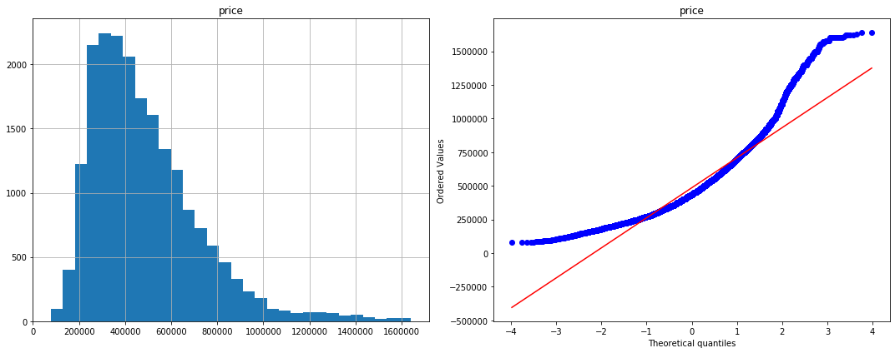


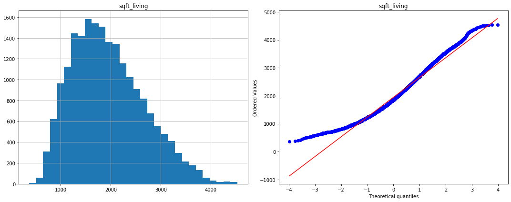


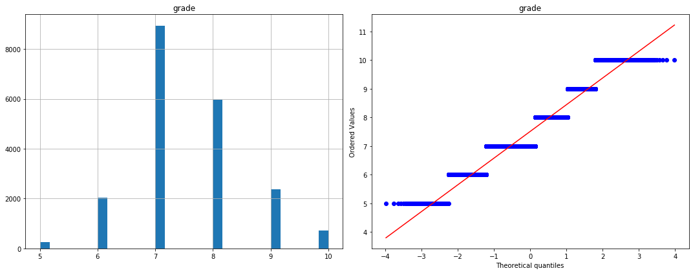


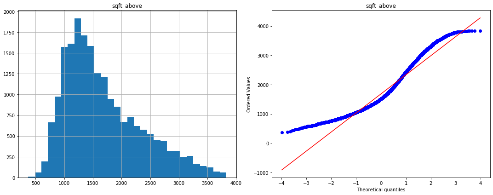


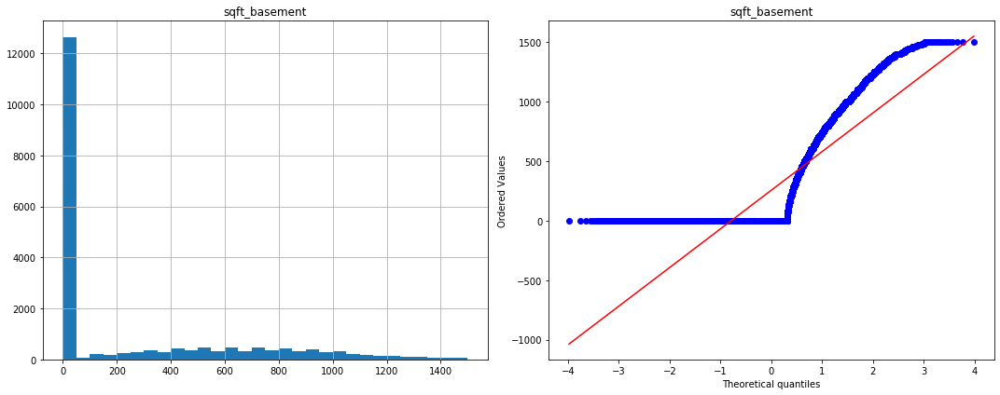


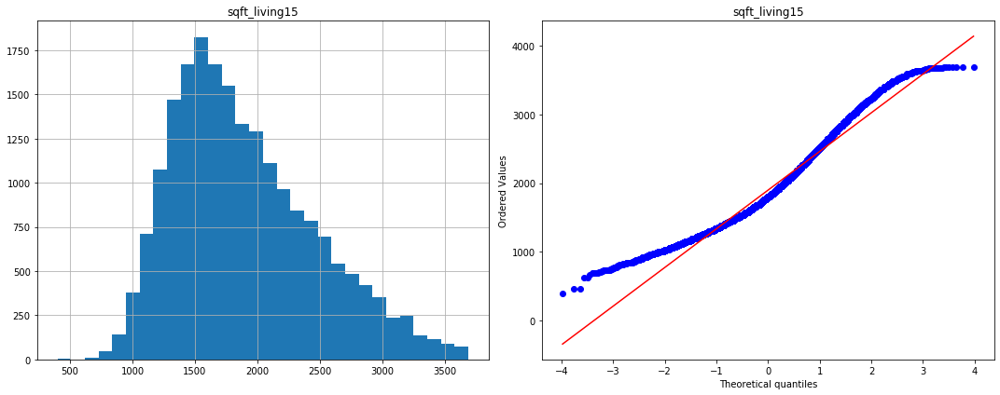


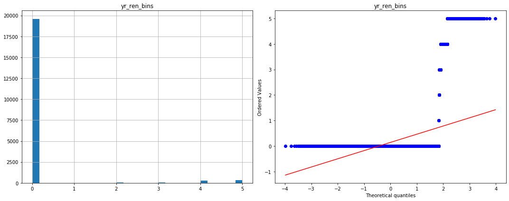


# TBD/ NOTE: DETERMINE WHAT TO LOG TRANSFORM BASED ON DISTRIBUTION


```python
for col in df[['sqft_living',  'grade', 'sqft_above',
       'sqft_basement', 'sqft_living15',  'yr_built_bins', 'yr_ren_bins']]:
    df[col] = np.log(df[col])
    diagnostic_plots(df,col)
```


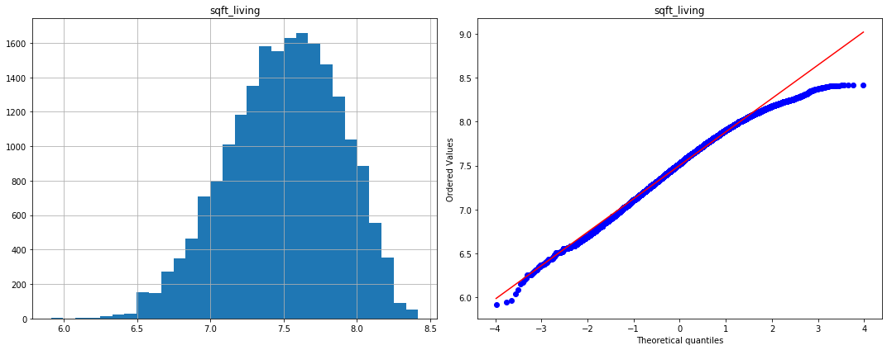


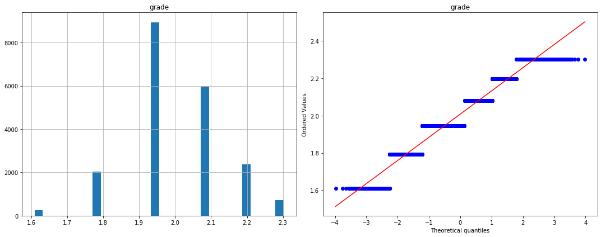


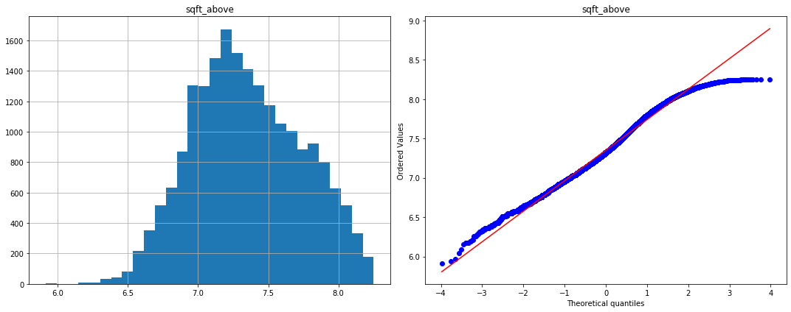


    /Users/michael/anaconda3/envs/learn-env/lib/python3.6/site-packages/pandas/core/series.py:853: RuntimeWarning: divide by zero encountered in log
      result = getattr(ufunc, method)(*inputs, **kwargs)


    ---------------------------------------------------------------------------

    ValueError                                Traceback (most recent call last)

    <ipython-input-111-5755f6bc37f8> in <module>
          2        'sqft_basement', 'sqft_living15',  'yr_built_bins', 'yr_ren_bins']]:
          3     df[col] = np.log(df[col])
    ----> 4     diagnostic_plots(df,col)
    

    <ipython-input-83-d35bacbcf6f3> in diagnostic_plots(df, variable)
          6     plt.figure(figsize=(15,6))
          7     plt.subplot(1, 2, 1)
    ----> 8     df[variable].hist(bins=30)
          9     plt.title(variable)
         10 


    ~/anaconda3/envs/learn-env/lib/python3.6/site-packages/pandas/plotting/_core.py in hist_series(self, by, ax, grid, xlabelsize, xrot, ylabelsize, yrot, figsize, bins, **kwds)
         83         figsize=figsize,
         84         bins=bins,
    ---> 85         **kwds
         86     )
         87 


    ~/anaconda3/envs/learn-env/lib/python3.6/site-packages/pandas/plotting/_matplotlib/hist.py in hist_series(self, by, ax, grid, xlabelsize, xrot, ylabelsize, yrot, figsize, bins, **kwds)
        314         values = self.dropna().values
        315 
    --> 316         ax.hist(values, bins=bins, **kwds)
        317         ax.grid(grid)
        318         axes = np.array([ax])


    ~/anaconda3/envs/learn-env/lib/python3.6/site-packages/matplotlib/__init__.py in inner(ax, data, *args, **kwargs)
       1599     def inner(ax, *args, data=None, **kwargs):
       1600         if data is None:
    -> 1601             return func(ax, *map(sanitize_sequence, args), **kwargs)
       1602 
       1603         bound = new_sig.bind(ax, *args, **kwargs)


    ~/anaconda3/envs/learn-env/lib/python3.6/site-packages/matplotlib/axes/_axes.py in hist(self, x, bins, range, density, weights, cumulative, bottom, histtype, align, orientation, rwidth, log, color, label, stacked, normed, **kwargs)
       6765             # this will automatically overwrite bins,
       6766             # so that each histogram uses the same bins
    -> 6767             m, bins = np.histogram(x[i], bins, weights=w[i], **hist_kwargs)
       6768             m = m.astype(float)  # causes problems later if it's an int
       6769             if mlast is None:


    ~/anaconda3/envs/learn-env/lib/python3.6/site-packages/numpy/lib/histograms.py in histogram(a, bins, range, normed, weights, density)
        778     a, weights = _ravel_and_check_weights(a, weights)
        779 
    --> 780     bin_edges, uniform_bins = _get_bin_edges(a, bins, range, weights)
        781 
        782     # Histogram is an integer or a float array depending on the weights.


    ~/anaconda3/envs/learn-env/lib/python3.6/site-packages/numpy/lib/histograms.py in _get_bin_edges(a, bins, range, weights)
        415             raise ValueError('`bins` must be positive, when an integer')
        416 
    --> 417         first_edge, last_edge = _get_outer_edges(a, range)
        418 
        419     elif np.ndim(bins) == 1:


    ~/anaconda3/envs/learn-env/lib/python3.6/site-packages/numpy/lib/histograms.py in _get_outer_edges(a, range)
        305         if not (np.isfinite(first_edge) and np.isfinite(last_edge)):
        306             raise ValueError(
    --> 307                 "supplied range of [{}, {}] is not finite".format(first_edge, last_edge))
        308     elif a.size == 0:
        309         # handle empty arrays. Can't determine range, so use 0-1.


    ValueError: supplied range of [-inf, 7.313220387090301] is not finite


# TBD:Summary of correlation plot


```python
df.columns
```


    Index(['price', 'sqft_living', 'waterfront', 'grade', 'sqft_above',
           'sqft_basement', 'sqft_living15', 'view_1', 'view_2', 'view_3',
           ...
           'zip_98155', 'zip_98166', 'zip_98168', 'zip_98177', 'zip_98178',
           'zip_98188', 'zip_98198', 'zip_98199', 'yr_built_bins', 'yr_ren_bins'],
          dtype='object', length=106)


# NOTE: Comment out large viz if needing the notebook to run quickly


```python
plt.figure(figsize=(30,30))
plt.tight_layout()
sns.heatmap(df[['price', 'sqft_living',
       'grade', 'sqft_above', 'sqft_basement', 'yr_built_bins', 'bathroom_bins', 'yr_ren_bins',
       'sqft_living15', 'view_1', 'view_2',
       'has_basement', 'seattle', 'condition_2', 'condition_3',
       'condition_4', 'condition_5',
       'bedroom_2', 'bedroom_3', 'bedroom_4', 'bedroom_5',
       'floors_1.5', 'floors_2.0', 'floors_2.5', 'floors_3.0',
       'floors_3.5']].corr(), cmap='coolwarm', annot=True);
```


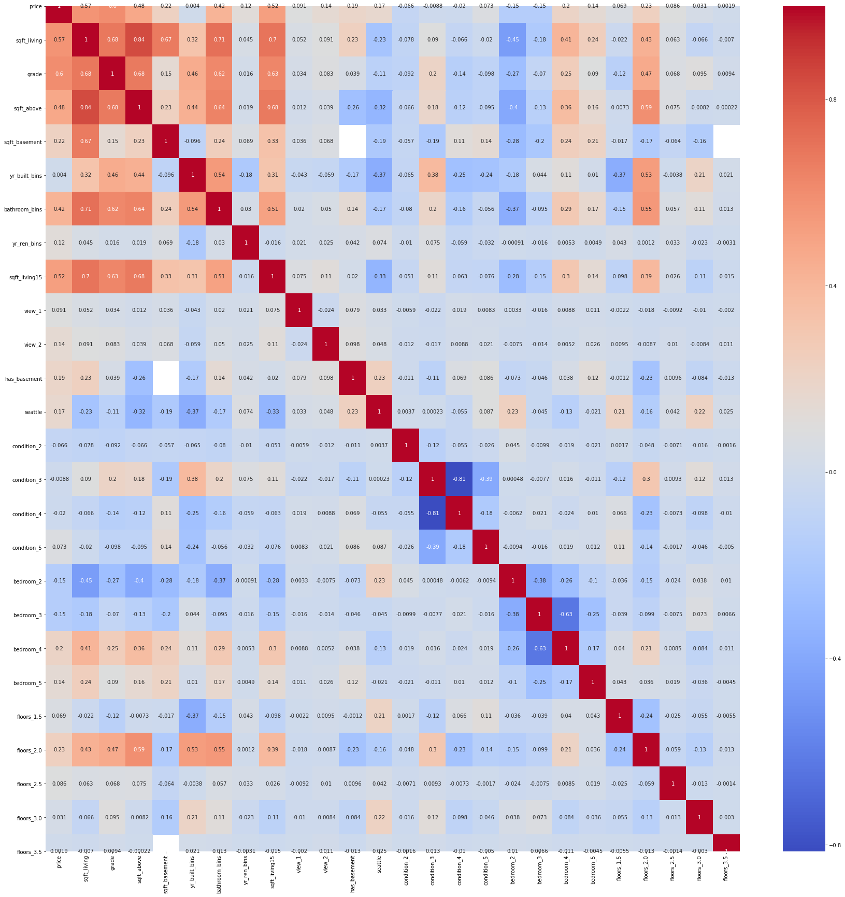


```python

```

# Dropping colinear features


```python
df.drop(['sqft_living15','sqft_above', 'sqft_basement'], axis=1,inplace=True)
```


```python
df.columns
```


    Index(['price', 'sqft_living', 'waterfront', 'grade', 'view_1', 'view_2',
           'view_3', 'view_4', 'was_renovated', 'has_basement',
           ...
           'zip_98155', 'zip_98166', 'zip_98168', 'zip_98177', 'zip_98178',
           'zip_98188', 'zip_98198', 'zip_98199', 'yr_built_bins', 'yr_ren_bins'],
          dtype='object', length=103)


# NOTE: Comment out large viz if needing the notebook to run quickly


```python
plt.figure(figsize=(30,30))
plt.tight_layout()
sns.heatmap(df[['price', 'sqft_living',
       'grade', 'yr_built_bins', 'bathroom_bins', 'yr_ren_bins', 'view_1', 'view_2',
       'has_basement', 'seattle', 'condition_2', 'condition_3',
       'condition_4', 'condition_5',
       'bedroom_2', 'bedroom_3', 'bedroom_4', 'bedroom_5',
       'floors_1.5', 'floors_2.0', 'floors_2.5', 'floors_3.0',
       'floors_3.5']].corr(), cmap='coolwarm', annot=True);
```


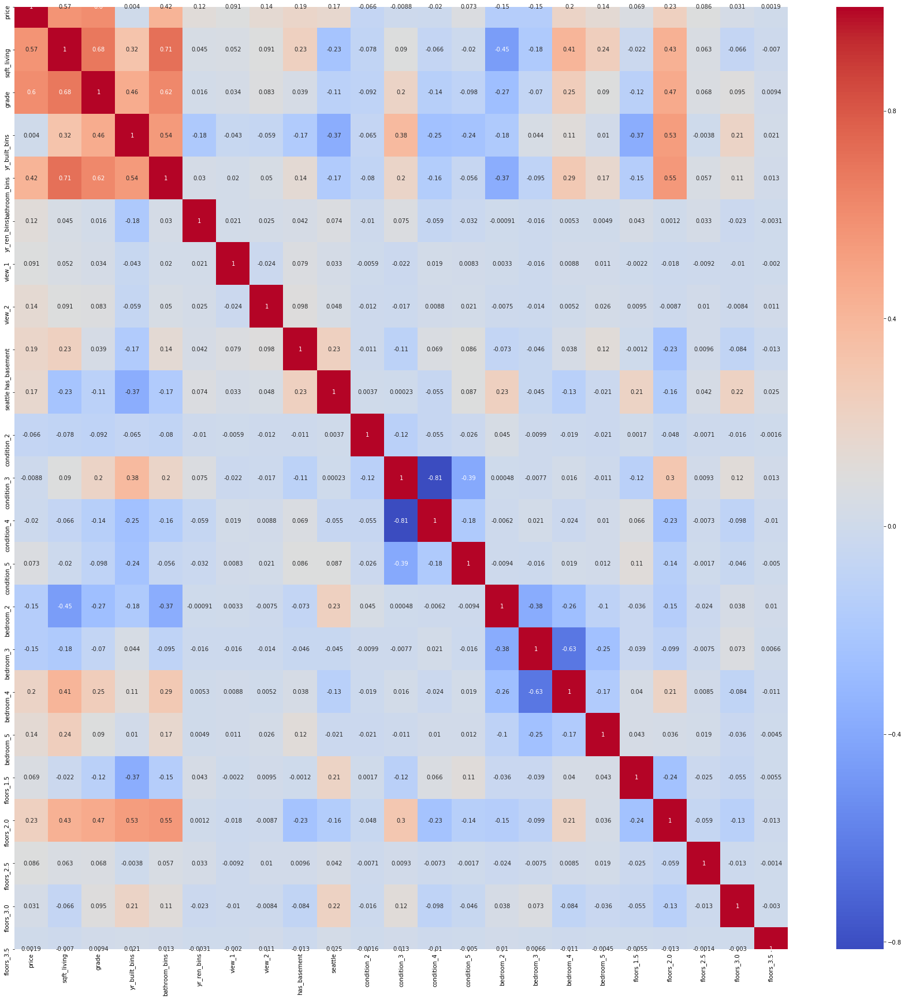


```python
df.drop('bedroom_3', axis=1, inplace=True)
```


```python
df.head()
```


<div>
<style scoped>
    .dataframe tbody tr th:only-of-type {
        vertical-align: middle;
    }

    .dataframe tbody tr th {
        vertical-align: top;
    }

    .dataframe thead th {
        text-align: right;
    }
</style>
<table border="1" class="dataframe">
  <thead>
    <tr style="text-align: right;">
      <th></th>
      <th>price</th>
      <th>sqft_living</th>
      <th>waterfront</th>
      <th>grade</th>
      <th>view_1</th>
      <th>view_2</th>
      <th>view_3</th>
      <th>view_4</th>
      <th>was_renovated</th>
      <th>has_basement</th>
      <th>...</th>
      <th>zip_98155</th>
      <th>zip_98166</th>
      <th>zip_98168</th>
      <th>zip_98177</th>
      <th>zip_98178</th>
      <th>zip_98188</th>
      <th>zip_98198</th>
      <th>zip_98199</th>
      <th>yr_built_bins</th>
      <th>yr_ren_bins</th>
    </tr>
  </thead>
  <tbody>
    <tr>
      <td>0</td>
      <td>221900.0</td>
      <td>7.073270</td>
      <td>0.0</td>
      <td>1.945910</td>
      <td>0</td>
      <td>0</td>
      <td>0</td>
      <td>0</td>
      <td>0</td>
      <td>0</td>
      <td>...</td>
      <td>0</td>
      <td>0</td>
      <td>0</td>
      <td>0</td>
      <td>1</td>
      <td>0</td>
      <td>0</td>
      <td>0</td>
      <td>2</td>
      <td>0</td>
    </tr>
    <tr>
      <td>1</td>
      <td>538000.0</td>
      <td>7.851661</td>
      <td>0.0</td>
      <td>1.945910</td>
      <td>0</td>
      <td>0</td>
      <td>0</td>
      <td>0</td>
      <td>1</td>
      <td>1</td>
      <td>...</td>
      <td>0</td>
      <td>0</td>
      <td>0</td>
      <td>0</td>
      <td>0</td>
      <td>0</td>
      <td>0</td>
      <td>0</td>
      <td>2</td>
      <td>4</td>
    </tr>
    <tr>
      <td>2</td>
      <td>180000.0</td>
      <td>6.646391</td>
      <td>0.0</td>
      <td>1.791759</td>
      <td>0</td>
      <td>0</td>
      <td>0</td>
      <td>0</td>
      <td>0</td>
      <td>0</td>
      <td>...</td>
      <td>0</td>
      <td>0</td>
      <td>0</td>
      <td>0</td>
      <td>0</td>
      <td>0</td>
      <td>0</td>
      <td>0</td>
      <td>1</td>
      <td>0</td>
    </tr>
    <tr>
      <td>3</td>
      <td>604000.0</td>
      <td>7.580700</td>
      <td>0.0</td>
      <td>1.945910</td>
      <td>0</td>
      <td>0</td>
      <td>0</td>
      <td>0</td>
      <td>0</td>
      <td>1</td>
      <td>...</td>
      <td>0</td>
      <td>0</td>
      <td>0</td>
      <td>0</td>
      <td>0</td>
      <td>0</td>
      <td>0</td>
      <td>0</td>
      <td>3</td>
      <td>0</td>
    </tr>
    <tr>
      <td>4</td>
      <td>510000.0</td>
      <td>7.426549</td>
      <td>0.0</td>
      <td>2.079442</td>
      <td>0</td>
      <td>0</td>
      <td>0</td>
      <td>0</td>
      <td>0</td>
      <td>0</td>
      <td>...</td>
      <td>0</td>
      <td>0</td>
      <td>0</td>
      <td>0</td>
      <td>0</td>
      <td>0</td>
      <td>0</td>
      <td>0</td>
      <td>4</td>
      <td>0</td>
    </tr>
  </tbody>
</table>
<p>5 rows × 102 columns</p>
</div>


```python
len(df.columns)
```


    102


```python
df.columns
```


    Index(['price', 'sqft_living', 'waterfront', 'grade', 'view_1', 'view_2',
           'view_3', 'view_4', 'was_renovated', 'has_basement',
           ...
           'zip_98155', 'zip_98166', 'zip_98168', 'zip_98177', 'zip_98178',
           'zip_98188', 'zip_98198', 'zip_98199', 'yr_built_bins', 'yr_ren_bins'],
          dtype='object', length=102)


# Scaling with MinMax, TBD: add kde plots


```python
df.columns
```


    Index(['price', 'sqft_living', 'waterfront', 'grade', 'view_1', 'view_2',
           'view_3', 'view_4', 'was_renovated', 'has_basement',
           ...
           'zip_98155', 'zip_98166', 'zip_98168', 'zip_98177', 'zip_98178',
           'zip_98188', 'zip_98198', 'zip_98199', 'yr_built_bins', 'yr_ren_bins'],
          dtype='object', length=102)


# Should this be done after test train split?


```python
scale_cols= ['price', 'sqft_living', 'grade', 'yr_built_bins', 'bathroom_bins', 'yr_ren_bins']
scaler = MinMaxScaler()

df[scale_cols] = scaler.fit_transform(df[scale_cols])

df.head(10)
```


<div>
<style scoped>
    .dataframe tbody tr th:only-of-type {
        vertical-align: middle;
    }

    .dataframe tbody tr th {
        vertical-align: top;
    }

    .dataframe thead th {
        text-align: right;
    }
</style>
<table border="1" class="dataframe">
  <thead>
    <tr style="text-align: right;">
      <th></th>
      <th>price</th>
      <th>sqft_living</th>
      <th>waterfront</th>
      <th>grade</th>
      <th>view_1</th>
      <th>view_2</th>
      <th>view_3</th>
      <th>view_4</th>
      <th>was_renovated</th>
      <th>has_basement</th>
      <th>...</th>
      <th>zip_98155</th>
      <th>zip_98166</th>
      <th>zip_98168</th>
      <th>zip_98177</th>
      <th>zip_98178</th>
      <th>zip_98188</th>
      <th>zip_98198</th>
      <th>zip_98199</th>
      <th>yr_built_bins</th>
      <th>yr_ren_bins</th>
    </tr>
  </thead>
  <tbody>
    <tr>
      <td>0</td>
      <td>0.092125</td>
      <td>0.462985</td>
      <td>0.0</td>
      <td>0.485427</td>
      <td>0</td>
      <td>0</td>
      <td>0</td>
      <td>0</td>
      <td>0</td>
      <td>0</td>
      <td>...</td>
      <td>0</td>
      <td>0</td>
      <td>0</td>
      <td>0</td>
      <td>1</td>
      <td>0</td>
      <td>0</td>
      <td>0</td>
      <td>0.4</td>
      <td>0.0</td>
    </tr>
    <tr>
      <td>1</td>
      <td>0.294494</td>
      <td>0.773724</td>
      <td>0.0</td>
      <td>0.485427</td>
      <td>0</td>
      <td>0</td>
      <td>0</td>
      <td>0</td>
      <td>1</td>
      <td>1</td>
      <td>...</td>
      <td>0</td>
      <td>0</td>
      <td>0</td>
      <td>0</td>
      <td>0</td>
      <td>0</td>
      <td>0</td>
      <td>0</td>
      <td>0.4</td>
      <td>0.8</td>
    </tr>
    <tr>
      <td>2</td>
      <td>0.065301</td>
      <td>0.292573</td>
      <td>0.0</td>
      <td>0.263034</td>
      <td>0</td>
      <td>0</td>
      <td>0</td>
      <td>0</td>
      <td>0</td>
      <td>0</td>
      <td>...</td>
      <td>0</td>
      <td>0</td>
      <td>0</td>
      <td>0</td>
      <td>0</td>
      <td>0</td>
      <td>0</td>
      <td>0</td>
      <td>0.2</td>
      <td>0.0</td>
    </tr>
    <tr>
      <td>3</td>
      <td>0.336748</td>
      <td>0.665554</td>
      <td>0.0</td>
      <td>0.485427</td>
      <td>0</td>
      <td>0</td>
      <td>0</td>
      <td>0</td>
      <td>0</td>
      <td>1</td>
      <td>...</td>
      <td>0</td>
      <td>0</td>
      <td>0</td>
      <td>0</td>
      <td>0</td>
      <td>0</td>
      <td>0</td>
      <td>0</td>
      <td>0.6</td>
      <td>0.0</td>
    </tr>
    <tr>
      <td>4</td>
      <td>0.276569</td>
      <td>0.604017</td>
      <td>0.0</td>
      <td>0.678072</td>
      <td>0</td>
      <td>0</td>
      <td>0</td>
      <td>0</td>
      <td>0</td>
      <td>0</td>
      <td>...</td>
      <td>0</td>
      <td>0</td>
      <td>0</td>
      <td>0</td>
      <td>0</td>
      <td>0</td>
      <td>0</td>
      <td>0</td>
      <td>0.8</td>
      <td>0.0</td>
    </tr>
    <tr>
      <td>6</td>
      <td>0.114917</td>
      <td>0.612248</td>
      <td>0.0</td>
      <td>0.485427</td>
      <td>0</td>
      <td>0</td>
      <td>0</td>
      <td>0</td>
      <td>0</td>
      <td>0</td>
      <td>...</td>
      <td>0</td>
      <td>0</td>
      <td>0</td>
      <td>0</td>
      <td>0</td>
      <td>0</td>
      <td>0</td>
      <td>0</td>
      <td>0.8</td>
      <td>0.0</td>
    </tr>
    <tr>
      <td>7</td>
      <td>0.136908</td>
      <td>0.420172</td>
      <td>0.0</td>
      <td>0.485427</td>
      <td>0</td>
      <td>0</td>
      <td>0</td>
      <td>0</td>
      <td>0</td>
      <td>0</td>
      <td>...</td>
      <td>0</td>
      <td>0</td>
      <td>0</td>
      <td>0</td>
      <td>0</td>
      <td>0</td>
      <td>1</td>
      <td>0</td>
      <td>0.6</td>
      <td>0.0</td>
    </tr>
    <tr>
      <td>8</td>
      <td>0.096991</td>
      <td>0.627099</td>
      <td>0.0</td>
      <td>0.485427</td>
      <td>0</td>
      <td>0</td>
      <td>0</td>
      <td>0</td>
      <td>0</td>
      <td>1</td>
      <td>...</td>
      <td>0</td>
      <td>0</td>
      <td>0</td>
      <td>0</td>
      <td>0</td>
      <td>0</td>
      <td>0</td>
      <td>0</td>
      <td>0.4</td>
      <td>0.0</td>
    </tr>
    <tr>
      <td>9</td>
      <td>0.156850</td>
      <td>0.651036</td>
      <td>0.0</td>
      <td>0.485427</td>
      <td>0</td>
      <td>0</td>
      <td>0</td>
      <td>0</td>
      <td>0</td>
      <td>0</td>
      <td>...</td>
      <td>0</td>
      <td>0</td>
      <td>0</td>
      <td>0</td>
      <td>0</td>
      <td>0</td>
      <td>0</td>
      <td>0</td>
      <td>1.0</td>
      <td>0.0</td>
    </tr>
    <tr>
      <td>11</td>
      <td>0.249680</td>
      <td>0.456161</td>
      <td>0.0</td>
      <td>0.485427</td>
      <td>0</td>
      <td>0</td>
      <td>0</td>
      <td>0</td>
      <td>0</td>
      <td>1</td>
      <td>...</td>
      <td>0</td>
      <td>0</td>
      <td>0</td>
      <td>0</td>
      <td>0</td>
      <td>0</td>
      <td>0</td>
      <td>0</td>
      <td>0.4</td>
      <td>0.0</td>
    </tr>
  </tbody>
</table>
<p>10 rows × 102 columns</p>
</div>


# MODELING

# Modeling with Ordinary Least Squares with SM for better stats analysis of regression


```python
df.columns
```


    Index(['price', 'sqft_living', 'waterfront', 'grade', 'view_1', 'view_2',
           'view_3', 'view_4', 'was_renovated', 'has_basement',
           ...
           'zip_98155', 'zip_98166', 'zip_98168', 'zip_98177', 'zip_98178',
           'zip_98188', 'zip_98198', 'zip_98199', 'yr_built_bins', 'yr_ren_bins'],
          dtype='object', length=102)


```python
print(df.columns)
```

    Index(['price', 'sqft_living', 'waterfront', 'grade', 'view_1', 'view_2',
           'view_3', 'view_4', 'was_renovated', 'has_basement',
           ...
           'zip_98155', 'zip_98166', 'zip_98168', 'zip_98177', 'zip_98178',
           'zip_98188', 'zip_98198', 'zip_98199', 'yr_built_bins', 'yr_ren_bins'],
          dtype='object', length=102)


```python
X = df.drop('price', axis=1)

y = df['price']

y = y.astype(float)
X = X.astype(float)

X_train, X_test, y_train, y_test = train_test_split(X,
                                                    y,
                                                    test_size=0.3,
                                                    random_state=0)
x_train = sm.add_constant(X_train)
X_test = sm.add_constant(X_test)
model_fit = sm.OLS(y_train, x_train).fit()
results_df = pd.concat([x_train, y_train], axis=1)
model_fit.summary()
```

    /Users/michael/anaconda3/envs/learn-env/lib/python3.6/site-packages/numpy/core/fromnumeric.py:2389: FutureWarning: Method .ptp is deprecated and will be removed in a future version. Use numpy.ptp instead.
      return ptp(axis=axis, out=out, **kwargs)


<table class="simpletable">
<caption>OLS Regression Results</caption>
<tr>
  <th>Dep. Variable:</th>          <td>price</td>      <th>  R-squared:         </th>  <td>   0.798</td> 
</tr>
<tr>
  <th>Model:</th>                   <td>OLS</td>       <th>  Adj. R-squared:    </th>  <td>   0.797</td> 
</tr>
<tr>
  <th>Method:</th>             <td>Least Squares</td>  <th>  F-statistic:       </th>  <td>   562.1</td> 
</tr>
<tr>
  <th>Date:</th>             <td>Mon, 18 Nov 2019</td> <th>  Prob (F-statistic):</th>   <td>  0.00</td>  
</tr>
<tr>
  <th>Time:</th>                 <td>07:43:51</td>     <th>  Log-Likelihood:    </th>  <td>  18056.</td> 
</tr>
<tr>
  <th>No. Observations:</th>      <td> 14188</td>      <th>  AIC:               </th> <td>-3.591e+04</td>
</tr>
<tr>
  <th>Df Residuals:</th>          <td> 14088</td>      <th>  BIC:               </th> <td>-3.516e+04</td>
</tr>
<tr>
  <th>Df Model:</th>              <td>    99</td>      <th>                     </th>      <td> </td>    
</tr>
<tr>
  <th>Covariance Type:</th>      <td>nonrobust</td>    <th>                     </th>      <td> </td>    
</tr>
</table>
<table class="simpletable">
<tr>
        <td></td>           <th>coef</th>     <th>std err</th>      <th>t</th>      <th>P>|t|</th>  <th>[0.025</th>    <th>0.975]</th>  
</tr>
<tr>
  <th>const</th>         <td>   -0.2207</td> <td>    0.015</td> <td>  -14.430</td> <td> 0.000</td> <td>   -0.251</td> <td>   -0.191</td>
</tr>
<tr>
  <th>sqft_living</th>   <td>    0.3755</td> <td>    0.008</td> <td>   49.476</td> <td> 0.000</td> <td>    0.361</td> <td>    0.390</td>
</tr>
<tr>
  <th>waterfront</th>    <td>    0.1278</td> <td>    0.011</td> <td>   11.187</td> <td> 0.000</td> <td>    0.105</td> <td>    0.150</td>
</tr>
<tr>
  <th>grade</th>         <td>    0.1905</td> <td>    0.005</td> <td>   37.614</td> <td> 0.000</td> <td>    0.181</td> <td>    0.200</td>
</tr>
<tr>
  <th>view_1</th>        <td>    0.0487</td> <td>    0.005</td> <td>    9.609</td> <td> 0.000</td> <td>    0.039</td> <td>    0.059</td>
</tr>
<tr>
  <th>view_2</th>        <td>    0.0534</td> <td>    0.003</td> <td>   17.524</td> <td> 0.000</td> <td>    0.047</td> <td>    0.059</td>
</tr>
<tr>
  <th>view_3</th>        <td>    0.1055</td> <td>    0.004</td> <td>   23.611</td> <td> 0.000</td> <td>    0.097</td> <td>    0.114</td>
</tr>
<tr>
  <th>view_4</th>        <td>    0.1686</td> <td>    0.007</td> <td>   23.327</td> <td> 0.000</td> <td>    0.154</td> <td>    0.183</td>
</tr>
<tr>
  <th>was_renovated</th> <td>   -0.0965</td> <td>    0.016</td> <td>   -5.891</td> <td> 0.000</td> <td>   -0.129</td> <td>   -0.064</td>
</tr>
<tr>
  <th>has_basement</th>  <td>   -0.0219</td> <td>    0.002</td> <td>  -14.377</td> <td> 0.000</td> <td>   -0.025</td> <td>   -0.019</td>
</tr>
<tr>
  <th>seattle</th>       <td>    0.1757</td> <td>    0.004</td> <td>   39.536</td> <td> 0.000</td> <td>    0.167</td> <td>    0.184</td>
</tr>
<tr>
  <th>condition_2</th>   <td>    0.0241</td> <td>    0.016</td> <td>    1.545</td> <td> 0.122</td> <td>   -0.006</td> <td>    0.055</td>
</tr>
<tr>
  <th>condition_3</th>   <td>    0.0272</td> <td>    0.014</td> <td>    1.892</td> <td> 0.059</td> <td>   -0.001</td> <td>    0.055</td>
</tr>
<tr>
  <th>condition_4</th>   <td>    0.0364</td> <td>    0.014</td> <td>    2.538</td> <td> 0.011</td> <td>    0.008</td> <td>    0.065</td>
</tr>
<tr>
  <th>condition_5</th>   <td>    0.0612</td> <td>    0.014</td> <td>    4.238</td> <td> 0.000</td> <td>    0.033</td> <td>    0.090</td>
</tr>
<tr>
  <th>bedroom_2</th>     <td>    0.0128</td> <td>    0.002</td> <td>    6.483</td> <td> 0.000</td> <td>    0.009</td> <td>    0.017</td>
</tr>
<tr>
  <th>bedroom_4</th>     <td>   -0.0002</td> <td>    0.001</td> <td>   -0.107</td> <td> 0.915</td> <td>   -0.003</td> <td>    0.003</td>
</tr>
<tr>
  <th>bedroom_5</th>     <td>    0.0002</td> <td>    0.003</td> <td>    0.085</td> <td> 0.932</td> <td>   -0.005</td> <td>    0.005</td>
</tr>
<tr>
  <th>bedroom_6</th>     <td>   -0.0139</td> <td>    0.006</td> <td>   -2.338</td> <td> 0.019</td> <td>   -0.026</td> <td>   -0.002</td>
</tr>
<tr>
  <th>bedroom_7</th>     <td>   -0.0402</td> <td>    0.016</td> <td>   -2.486</td> <td> 0.013</td> <td>   -0.072</td> <td>   -0.009</td>
</tr>
<tr>
  <th>bedroom_8</th>     <td>   -0.0693</td> <td>    0.028</td> <td>   -2.483</td> <td> 0.013</td> <td>   -0.124</td> <td>   -0.015</td>
</tr>
<tr>
  <th>bedroom_9</th>     <td>    0.0042</td> <td>    0.034</td> <td>    0.122</td> <td> 0.903</td> <td>   -0.063</td> <td>    0.072</td>
</tr>
<tr>
  <th>bedroom_10</th>    <td>   -0.1079</td> <td>    0.068</td> <td>   -1.580</td> <td> 0.114</td> <td>   -0.242</td> <td>    0.026</td>
</tr>
<tr>
  <th>bedroom_11</th>    <td>   -0.0139</td> <td>    0.068</td> <td>   -0.204</td> <td> 0.839</td> <td>   -0.148</td> <td>    0.120</td>
</tr>
<tr>
  <th>bedroom_33</th>    <td>-3.674e-16</td> <td> 3.17e-16</td> <td>   -1.160</td> <td> 0.246</td> <td>-9.88e-16</td> <td> 2.53e-16</td>
</tr>
<tr>
  <th>bathroom_bins</th> <td>    0.0278</td> <td>    0.006</td> <td>    4.669</td> <td> 0.000</td> <td>    0.016</td> <td>    0.040</td>
</tr>
<tr>
  <th>floors_1.5</th>    <td>    0.0004</td> <td>    0.002</td> <td>    0.181</td> <td> 0.856</td> <td>   -0.004</td> <td>    0.005</td>
</tr>
<tr>
  <th>floors_2.0</th>    <td>   -0.0024</td> <td>    0.002</td> <td>   -1.260</td> <td> 0.208</td> <td>   -0.006</td> <td>    0.001</td>
</tr>
<tr>
  <th>floors_2.5</th>    <td>    0.0162</td> <td>    0.008</td> <td>    2.132</td> <td> 0.033</td> <td>    0.001</td> <td>    0.031</td>
</tr>
<tr>
  <th>floors_3.0</th>    <td>   -0.0367</td> <td>    0.004</td> <td>   -8.604</td> <td> 0.000</td> <td>   -0.045</td> <td>   -0.028</td>
</tr>
<tr>
  <th>floors_3.5</th>    <td>   -0.0631</td> <td>    0.034</td> <td>   -1.843</td> <td> 0.065</td> <td>   -0.130</td> <td>    0.004</td>
</tr>
<tr>
  <th>zip_98002</th>     <td>    0.0109</td> <td>    0.007</td> <td>    1.519</td> <td> 0.129</td> <td>   -0.003</td> <td>    0.025</td>
</tr>
<tr>
  <th>zip_98003</th>     <td>   -0.0016</td> <td>    0.007</td> <td>   -0.240</td> <td> 0.810</td> <td>   -0.015</td> <td>    0.011</td>
</tr>
<tr>
  <th>zip_98004</th>     <td>    0.3924</td> <td>    0.007</td> <td>   55.037</td> <td> 0.000</td> <td>    0.378</td> <td>    0.406</td>
</tr>
<tr>
  <th>zip_98005</th>     <td>    0.2252</td> <td>    0.008</td> <td>   26.622</td> <td> 0.000</td> <td>    0.209</td> <td>    0.242</td>
</tr>
<tr>
  <th>zip_98006</th>     <td>    0.1799</td> <td>    0.006</td> <td>   29.732</td> <td> 0.000</td> <td>    0.168</td> <td>    0.192</td>
</tr>
<tr>
  <th>zip_98007</th>     <td>    0.1667</td> <td>    0.009</td> <td>   19.240</td> <td> 0.000</td> <td>    0.150</td> <td>    0.184</td>
</tr>
<tr>
  <th>zip_98008</th>     <td>    0.1553</td> <td>    0.007</td> <td>   23.515</td> <td> 0.000</td> <td>    0.142</td> <td>    0.168</td>
</tr>
<tr>
  <th>zip_98010</th>     <td>    0.0773</td> <td>    0.009</td> <td>    8.293</td> <td> 0.000</td> <td>    0.059</td> <td>    0.096</td>
</tr>
<tr>
  <th>zip_98011</th>     <td>    0.0922</td> <td>    0.007</td> <td>   12.505</td> <td> 0.000</td> <td>    0.078</td> <td>    0.107</td>
</tr>
<tr>
  <th>zip_98014</th>     <td>    0.0866</td> <td>    0.009</td> <td>    9.551</td> <td> 0.000</td> <td>    0.069</td> <td>    0.104</td>
</tr>
<tr>
  <th>zip_98019</th>     <td>    0.0685</td> <td>    0.007</td> <td>    9.226</td> <td> 0.000</td> <td>    0.054</td> <td>    0.083</td>
</tr>
<tr>
  <th>zip_98022</th>     <td>    0.0100</td> <td>    0.007</td> <td>    1.437</td> <td> 0.151</td> <td>   -0.004</td> <td>    0.024</td>
</tr>
<tr>
  <th>zip_98023</th>     <td>   -0.0108</td> <td>    0.006</td> <td>   -1.904</td> <td> 0.057</td> <td>   -0.022</td> <td>    0.000</td>
</tr>
<tr>
  <th>zip_98024</th>     <td>    0.1050</td> <td>    0.011</td> <td>    9.608</td> <td> 0.000</td> <td>    0.084</td> <td>    0.126</td>
</tr>
<tr>
  <th>zip_98027</th>     <td>    0.1305</td> <td>    0.006</td> <td>   21.500</td> <td> 0.000</td> <td>    0.119</td> <td>    0.142</td>
</tr>
<tr>
  <th>zip_98028</th>     <td>    0.0835</td> <td>    0.007</td> <td>   12.615</td> <td> 0.000</td> <td>    0.071</td> <td>    0.097</td>
</tr>
<tr>
  <th>zip_98029</th>     <td>    0.1378</td> <td>    0.007</td> <td>   21.095</td> <td> 0.000</td> <td>    0.125</td> <td>    0.151</td>
</tr>
<tr>
  <th>zip_98030</th>     <td>    0.0074</td> <td>    0.007</td> <td>    1.115</td> <td> 0.265</td> <td>   -0.006</td> <td>    0.020</td>
</tr>
<tr>
  <th>zip_98031</th>     <td>    0.0084</td> <td>    0.007</td> <td>    1.275</td> <td> 0.202</td> <td>   -0.005</td> <td>    0.021</td>
</tr>
<tr>
  <th>zip_98032</th>     <td>   -0.0021</td> <td>    0.009</td> <td>   -0.249</td> <td> 0.803</td> <td>   -0.019</td> <td>    0.015</td>
</tr>
<tr>
  <th>zip_98033</th>     <td>    0.2254</td> <td>    0.006</td> <td>   37.989</td> <td> 0.000</td> <td>    0.214</td> <td>    0.237</td>
</tr>
<tr>
  <th>zip_98034</th>     <td>    0.1237</td> <td>    0.006</td> <td>   21.941</td> <td> 0.000</td> <td>    0.113</td> <td>    0.135</td>
</tr>
<tr>
  <th>zip_98038</th>     <td>    0.0267</td> <td>    0.005</td> <td>    4.867</td> <td> 0.000</td> <td>    0.016</td> <td>    0.037</td>
</tr>
<tr>
  <th>zip_98039</th>     <td>    0.5270</td> <td>    0.019</td> <td>   28.139</td> <td> 0.000</td> <td>    0.490</td> <td>    0.564</td>
</tr>
<tr>
  <th>zip_98040</th>     <td>    0.3214</td> <td>    0.007</td> <td>   43.419</td> <td> 0.000</td> <td>    0.307</td> <td>    0.336</td>
</tr>
<tr>
  <th>zip_98042</th>     <td>    0.0131</td> <td>    0.006</td> <td>    2.345</td> <td> 0.019</td> <td>    0.002</td> <td>    0.024</td>
</tr>
<tr>
  <th>zip_98045</th>     <td>    0.0715</td> <td>    0.007</td> <td>   10.244</td> <td> 0.000</td> <td>    0.058</td> <td>    0.085</td>
</tr>
<tr>
  <th>zip_98052</th>     <td>    0.1670</td> <td>    0.006</td> <td>   29.978</td> <td> 0.000</td> <td>    0.156</td> <td>    0.178</td>
</tr>
<tr>
  <th>zip_98053</th>     <td>    0.1602</td> <td>    0.006</td> <td>   25.485</td> <td> 0.000</td> <td>    0.148</td> <td>    0.173</td>
</tr>
<tr>
  <th>zip_98055</th>     <td>    0.0326</td> <td>    0.007</td> <td>    4.978</td> <td> 0.000</td> <td>    0.020</td> <td>    0.045</td>
</tr>
<tr>
  <th>zip_98056</th>     <td>    0.0712</td> <td>    0.006</td> <td>   11.904</td> <td> 0.000</td> <td>    0.059</td> <td>    0.083</td>
</tr>
<tr>
  <th>zip_98058</th>     <td>    0.0274</td> <td>    0.006</td> <td>    4.752</td> <td> 0.000</td> <td>    0.016</td> <td>    0.039</td>
</tr>
<tr>
  <th>zip_98059</th>     <td>    0.0632</td> <td>    0.006</td> <td>   10.822</td> <td> 0.000</td> <td>    0.052</td> <td>    0.075</td>
</tr>
<tr>
  <th>zip_98065</th>     <td>    0.0909</td> <td>    0.006</td> <td>   14.101</td> <td> 0.000</td> <td>    0.078</td> <td>    0.104</td>
</tr>
<tr>
  <th>zip_98070</th>     <td>    0.0647</td> <td>    0.009</td> <td>    7.264</td> <td> 0.000</td> <td>    0.047</td> <td>    0.082</td>
</tr>
<tr>
  <th>zip_98072</th>     <td>    0.1220</td> <td>    0.007</td> <td>   18.230</td> <td> 0.000</td> <td>    0.109</td> <td>    0.135</td>
</tr>
<tr>
  <th>zip_98074</th>     <td>    0.1467</td> <td>    0.006</td> <td>   24.172</td> <td> 0.000</td> <td>    0.135</td> <td>    0.159</td>
</tr>
<tr>
  <th>zip_98075</th>     <td>    0.1638</td> <td>    0.007</td> <td>   24.828</td> <td> 0.000</td> <td>    0.151</td> <td>    0.177</td>
</tr>
<tr>
  <th>zip_98077</th>     <td>    0.1198</td> <td>    0.008</td> <td>   15.537</td> <td> 0.000</td> <td>    0.105</td> <td>    0.135</td>
</tr>
<tr>
  <th>zip_98092</th>     <td>   -0.0079</td> <td>    0.006</td> <td>   -1.284</td> <td> 0.199</td> <td>   -0.020</td> <td>    0.004</td>
</tr>
<tr>
  <th>zip_98102</th>     <td>    0.1011</td> <td>    0.008</td> <td>   12.506</td> <td> 0.000</td> <td>    0.085</td> <td>    0.117</td>
</tr>
<tr>
  <th>zip_98103</th>     <td>    0.0337</td> <td>    0.003</td> <td>    9.939</td> <td> 0.000</td> <td>    0.027</td> <td>    0.040</td>
</tr>
<tr>
  <th>zip_98105</th>     <td>    0.1001</td> <td>    0.006</td> <td>   18.091</td> <td> 0.000</td> <td>    0.089</td> <td>    0.111</td>
</tr>
<tr>
  <th>zip_98106</th>     <td>   -0.0908</td> <td>    0.004</td> <td>  -20.321</td> <td> 0.000</td> <td>   -0.100</td> <td>   -0.082</td>
</tr>
<tr>
  <th>zip_98107</th>     <td>    0.0286</td> <td>    0.005</td> <td>    5.663</td> <td> 0.000</td> <td>    0.019</td> <td>    0.039</td>
</tr>
<tr>
  <th>zip_98108</th>     <td>   -0.1002</td> <td>    0.006</td> <td>  -16.820</td> <td> 0.000</td> <td>   -0.112</td> <td>   -0.089</td>
</tr>
<tr>
  <th>zip_98109</th>     <td>    0.1216</td> <td>    0.008</td> <td>   15.152</td> <td> 0.000</td> <td>    0.106</td> <td>    0.137</td>
</tr>
<tr>
  <th>zip_98112</th>     <td>    0.1477</td> <td>    0.005</td> <td>   27.794</td> <td> 0.000</td> <td>    0.137</td> <td>    0.158</td>
</tr>
<tr>
  <th>zip_98115</th>     <td>    0.0336</td> <td>    0.003</td> <td>    9.883</td> <td> 0.000</td> <td>    0.027</td> <td>    0.040</td>
</tr>
<tr>
  <th>zip_98116</th>     <td>    0.0090</td> <td>    0.005</td> <td>    2.000</td> <td> 0.045</td> <td>    0.000</td> <td>    0.018</td>
</tr>
<tr>
  <th>zip_98117</th>     <td>    0.0268</td> <td>    0.004</td> <td>    7.646</td> <td> 0.000</td> <td>    0.020</td> <td>    0.034</td>
</tr>
<tr>
  <th>zip_98118</th>     <td>   -0.0702</td> <td>    0.004</td> <td>  -19.110</td> <td> 0.000</td> <td>   -0.077</td> <td>   -0.063</td>
</tr>
<tr>
  <th>zip_98119</th>     <td>    0.1136</td> <td>    0.006</td> <td>   19.875</td> <td> 0.000</td> <td>    0.102</td> <td>    0.125</td>
</tr>
<tr>
  <th>zip_98122</th>     <td>    0.0209</td> <td>    0.005</td> <td>    4.393</td> <td> 0.000</td> <td>    0.012</td> <td>    0.030</td>
</tr>
<tr>
  <th>zip_98125</th>     <td>   -0.0475</td> <td>    0.004</td> <td>  -12.078</td> <td> 0.000</td> <td>   -0.055</td> <td>   -0.040</td>
</tr>
<tr>
  <th>zip_98126</th>     <td>   -0.0531</td> <td>    0.004</td> <td>  -12.220</td> <td> 0.000</td> <td>   -0.062</td> <td>   -0.045</td>
</tr>
<tr>
  <th>zip_98133</th>     <td>   -0.0772</td> <td>    0.004</td> <td>  -20.739</td> <td> 0.000</td> <td>   -0.085</td> <td>   -0.070</td>
</tr>
<tr>
  <th>zip_98136</th>     <td>   -0.0187</td> <td>    0.005</td> <td>   -3.769</td> <td> 0.000</td> <td>   -0.028</td> <td>   -0.009</td>
</tr>
<tr>
  <th>zip_98144</th>     <td>   -0.0148</td> <td>    0.004</td> <td>   -3.316</td> <td> 0.001</td> <td>   -0.024</td> <td>   -0.006</td>
</tr>
<tr>
  <th>zip_98146</th>     <td>    0.0782</td> <td>    0.007</td> <td>   12.001</td> <td> 0.000</td> <td>    0.065</td> <td>    0.091</td>
</tr>
<tr>
  <th>zip_98148</th>     <td>    0.0439</td> <td>    0.012</td> <td>    3.651</td> <td> 0.000</td> <td>    0.020</td> <td>    0.068</td>
</tr>
<tr>
  <th>zip_98155</th>     <td>    0.0922</td> <td>    0.006</td> <td>   15.592</td> <td> 0.000</td> <td>    0.081</td> <td>    0.104</td>
</tr>
<tr>
  <th>zip_98166</th>     <td>    0.0632</td> <td>    0.007</td> <td>    9.286</td> <td> 0.000</td> <td>    0.050</td> <td>    0.077</td>
</tr>
<tr>
  <th>zip_98168</th>     <td>    0.0423</td> <td>    0.007</td> <td>    6.494</td> <td> 0.000</td> <td>    0.030</td> <td>    0.055</td>
</tr>
<tr>
  <th>zip_98177</th>     <td>    0.1449</td> <td>    0.007</td> <td>   20.493</td> <td> 0.000</td> <td>    0.131</td> <td>    0.159</td>
</tr>
<tr>
  <th>zip_98178</th>     <td>    0.0332</td> <td>    0.007</td> <td>    4.863</td> <td> 0.000</td> <td>    0.020</td> <td>    0.047</td>
</tr>
<tr>
  <th>zip_98188</th>     <td>   -0.1553</td> <td>    0.007</td> <td>  -23.463</td> <td> 0.000</td> <td>   -0.168</td> <td>   -0.142</td>
</tr>
<tr>
  <th>zip_98198</th>     <td>    0.0104</td> <td>    0.007</td> <td>    1.592</td> <td> 0.111</td> <td>   -0.002</td> <td>    0.023</td>
</tr>
<tr>
  <th>zip_98199</th>     <td>    0.0667</td> <td>    0.005</td> <td>   14.028</td> <td> 0.000</td> <td>    0.057</td> <td>    0.076</td>
</tr>
<tr>
  <th>yr_built_bins</th> <td>   -0.0364</td> <td>    0.003</td> <td>  -10.669</td> <td> 0.000</td> <td>   -0.043</td> <td>   -0.030</td>
</tr>
<tr>
  <th>yr_ren_bins</th>   <td>    0.1361</td> <td>    0.019</td> <td>    7.251</td> <td> 0.000</td> <td>    0.099</td> <td>    0.173</td>
</tr>
</table>
<table class="simpletable">
<tr>
  <th>Omnibus:</th>       <td>3622.411</td> <th>  Durbin-Watson:     </th> <td>   1.986</td> 
</tr>
<tr>
  <th>Prob(Omnibus):</th>  <td> 0.000</td>  <th>  Jarque-Bera (JB):  </th> <td>19302.601</td>
</tr>
<tr>
  <th>Skew:</th>           <td> 1.127</td>  <th>  Prob(JB):          </th> <td>    0.00</td> 
</tr>
<tr>
  <th>Kurtosis:</th>       <td> 8.251</td>  <th>  Cond. No.          </th> <td>1.23e+16</td> 
</tr>
</table><br/><br/>Warnings:<br/>[1] Standard Errors assume that the covariance matrix of the errors is correctly specified.<br/>[2] The smallest eigenvalue is 3.09e-28. This might indicate that there are<br/>strong multicollinearity problems or that the design matrix is singular.


```python
predictions = model_fit.predict(X_test)
```


```python
model_fit.conf_int()
```


<div>
<style scoped>
    .dataframe tbody tr th:only-of-type {
        vertical-align: middle;
    }

    .dataframe tbody tr th {
        vertical-align: top;
    }

    .dataframe thead th {
        text-align: right;
    }
</style>
<table border="1" class="dataframe">
  <thead>
    <tr style="text-align: right;">
      <th></th>
      <th>0</th>
      <th>1</th>
    </tr>
  </thead>
  <tbody>
    <tr>
      <td>const</td>
      <td>-0.250688</td>
      <td>-0.190726</td>
    </tr>
    <tr>
      <td>sqft_living</td>
      <td>0.360665</td>
      <td>0.390421</td>
    </tr>
    <tr>
      <td>waterfront</td>
      <td>0.105381</td>
      <td>0.150154</td>
    </tr>
    <tr>
      <td>grade</td>
      <td>0.180567</td>
      <td>0.200420</td>
    </tr>
    <tr>
      <td>view_1</td>
      <td>0.038805</td>
      <td>0.058695</td>
    </tr>
    <tr>
      <td>...</td>
      <td>...</td>
      <td>...</td>
    </tr>
    <tr>
      <td>zip_98188</td>
      <td>-0.168288</td>
      <td>-0.142338</td>
    </tr>
    <tr>
      <td>zip_98198</td>
      <td>-0.002414</td>
      <td>0.023311</td>
    </tr>
    <tr>
      <td>zip_98199</td>
      <td>0.057420</td>
      <td>0.076073</td>
    </tr>
    <tr>
      <td>yr_built_bins</td>
      <td>-0.043099</td>
      <td>-0.029721</td>
    </tr>
    <tr>
      <td>yr_ren_bins</td>
      <td>0.099317</td>
      <td>0.172901</td>
    </tr>
  </tbody>
</table>
<p>102 rows × 2 columns</p>
</div>


# Predictions analysis


```python
plt.scatter(y_test,predictions)
plt.xlabel('True Price')
plt.ylabel('Predicted Price')
```


    Text(0, 0.5, 'Predicted Price')


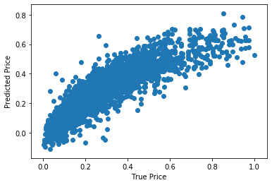


```python
sns.distplot(predictions)
```


    <matplotlib.axes._subplots.AxesSubplot at 0x1c22aa9e10>


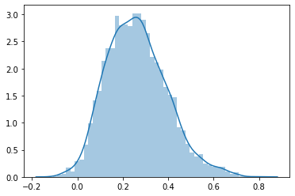


# Exponentionally transforming back the log transform as its inverse transformation - TBD: ONLY INCLUDE TRANSFORMED COLS

# Or add an explanation of log transformed features, that they are by percentage not unit


```python
# invert_log_pred = np.expm1(predictions)
# invert_log_test= np.expm1(y_test)
```


```python
# invert_log_train = np.expm1(y_train)
```


```python
# plt.scatter(invert_log_test,invert_log_pred)
# plt.xlabel('True Price - inverted log transform')
# plt.ylabel('Predicted Price - inverted log transform')
```

# To Explore: Include more variables, maybe keep at lower thresholds of corr, do these need an inverse transform?
# Residual plotting - OUTLIER SPOTTED - look into this plot


```python
fig = sm.qqplot(model_fit.resid, stats.t, fit=True, line='45')
plt.show()
```


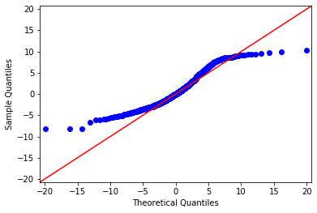


```python

```


```python
sns.residplot(model_fit.resid, model_fit.fittedvalues)
```


    <matplotlib.axes._subplots.AxesSubplot at 0x1c1fa85860>


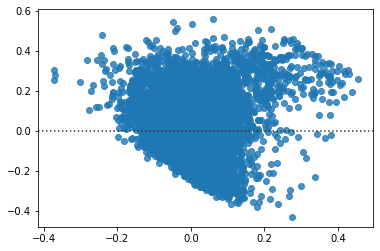


# Dropping high p values and re running model


```python
df.drop(['bedroom_4', 'bedroom_5', 'bedroom_9', 'bedroom_11', 'floors_1.5','zip_98003', 'zip_98032' ], axis=1, inplace=True)

predictors = df.drop('price', axis=1)
target = df['price']


X_train, X_test, y_train, y_test = train_test_split(predictors,
                                                    target,
                                                    test_size=0.3,
                                                    random_state=0)
x_train = sm.add_constant(X_train)
X_test = sm.add_constant(X_test)
model_fit = sm.OLS(y_train, x_train).fit()
results_df = pd.concat([x_train, y_train], axis=1)
model_fit.summary()
```


<table class="simpletable">
<caption>OLS Regression Results</caption>
<tr>
  <th>Dep. Variable:</th>          <td>price</td>      <th>  R-squared:         </th>  <td>   0.798</td> 
</tr>
<tr>
  <th>Model:</th>                   <td>OLS</td>       <th>  Adj. R-squared:    </th>  <td>   0.797</td> 
</tr>
<tr>
  <th>Method:</th>             <td>Least Squares</td>  <th>  F-statistic:       </th>  <td>   605.2</td> 
</tr>
<tr>
  <th>Date:</th>             <td>Mon, 18 Nov 2019</td> <th>  Prob (F-statistic):</th>   <td>  0.00</td>  
</tr>
<tr>
  <th>Time:</th>                 <td>07:54:05</td>     <th>  Log-Likelihood:    </th>  <td>  18056.</td> 
</tr>
<tr>
  <th>No. Observations:</th>      <td> 14188</td>      <th>  AIC:               </th> <td>-3.593e+04</td>
</tr>
<tr>
  <th>Df Residuals:</th>          <td> 14095</td>      <th>  BIC:               </th> <td>-3.522e+04</td>
</tr>
<tr>
  <th>Df Model:</th>              <td>    92</td>      <th>                     </th>      <td> </td>    
</tr>
<tr>
  <th>Covariance Type:</th>      <td>nonrobust</td>    <th>                     </th>      <td> </td>    
</tr>
</table>
<table class="simpletable">
<tr>
        <td></td>           <th>coef</th>     <th>std err</th>      <th>t</th>      <th>P>|t|</th>  <th>[0.025</th>    <th>0.975]</th>  
</tr>
<tr>
  <th>const</th>         <td>   -0.2217</td> <td>    0.015</td> <td>  -14.845</td> <td> 0.000</td> <td>   -0.251</td> <td>   -0.192</td>
</tr>
<tr>
  <th>sqft_living</th>   <td>    0.3757</td> <td>    0.007</td> <td>   53.671</td> <td> 0.000</td> <td>    0.362</td> <td>    0.389</td>
</tr>
<tr>
  <th>waterfront</th>    <td>    0.1278</td> <td>    0.011</td> <td>   11.197</td> <td> 0.000</td> <td>    0.105</td> <td>    0.150</td>
</tr>
<tr>
  <th>grade</th>         <td>    0.1904</td> <td>    0.005</td> <td>   37.923</td> <td> 0.000</td> <td>    0.181</td> <td>    0.200</td>
</tr>
<tr>
  <th>view_1</th>        <td>    0.0487</td> <td>    0.005</td> <td>    9.610</td> <td> 0.000</td> <td>    0.039</td> <td>    0.059</td>
</tr>
<tr>
  <th>view_2</th>        <td>    0.0534</td> <td>    0.003</td> <td>   17.548</td> <td> 0.000</td> <td>    0.047</td> <td>    0.059</td>
</tr>
<tr>
  <th>view_3</th>        <td>    0.1055</td> <td>    0.004</td> <td>   23.631</td> <td> 0.000</td> <td>    0.097</td> <td>    0.114</td>
</tr>
<tr>
  <th>view_4</th>        <td>    0.1686</td> <td>    0.007</td> <td>   23.342</td> <td> 0.000</td> <td>    0.154</td> <td>    0.183</td>
</tr>
<tr>
  <th>was_renovated</th> <td>   -0.0965</td> <td>    0.016</td> <td>   -5.900</td> <td> 0.000</td> <td>   -0.129</td> <td>   -0.064</td>
</tr>
<tr>
  <th>has_basement</th>  <td>   -0.0220</td> <td>    0.001</td> <td>  -14.773</td> <td> 0.000</td> <td>   -0.025</td> <td>   -0.019</td>
</tr>
<tr>
  <th>seattle</th>       <td>    0.1767</td> <td>    0.003</td> <td>   54.481</td> <td> 0.000</td> <td>    0.170</td> <td>    0.183</td>
</tr>
<tr>
  <th>condition_2</th>   <td>    0.0242</td> <td>    0.016</td> <td>    1.547</td> <td> 0.122</td> <td>   -0.006</td> <td>    0.055</td>
</tr>
<tr>
  <th>condition_3</th>   <td>    0.0272</td> <td>    0.014</td> <td>    1.896</td> <td> 0.058</td> <td>   -0.001</td> <td>    0.055</td>
</tr>
<tr>
  <th>condition_4</th>   <td>    0.0365</td> <td>    0.014</td> <td>    2.541</td> <td> 0.011</td> <td>    0.008</td> <td>    0.065</td>
</tr>
<tr>
  <th>condition_5</th>   <td>    0.0613</td> <td>    0.014</td> <td>    4.242</td> <td> 0.000</td> <td>    0.033</td> <td>    0.090</td>
</tr>
<tr>
  <th>bedroom_2</th>     <td>    0.0127</td> <td>    0.002</td> <td>    6.518</td> <td> 0.000</td> <td>    0.009</td> <td>    0.017</td>
</tr>
<tr>
  <th>bedroom_6</th>     <td>   -0.0139</td> <td>    0.006</td> <td>   -2.382</td> <td> 0.017</td> <td>   -0.025</td> <td>   -0.002</td>
</tr>
<tr>
  <th>bedroom_7</th>     <td>   -0.0402</td> <td>    0.016</td> <td>   -2.492</td> <td> 0.013</td> <td>   -0.072</td> <td>   -0.009</td>
</tr>
<tr>
  <th>bedroom_8</th>     <td>   -0.0694</td> <td>    0.028</td> <td>   -2.489</td> <td> 0.013</td> <td>   -0.124</td> <td>   -0.015</td>
</tr>
<tr>
  <th>bedroom_10</th>    <td>   -0.1081</td> <td>    0.068</td> <td>   -1.583</td> <td> 0.113</td> <td>   -0.242</td> <td>    0.026</td>
</tr>
<tr>
  <th>bedroom_33</th>    <td> 2.939e-16</td> <td> 1.47e-16</td> <td>    2.002</td> <td> 0.045</td> <td> 6.13e-18</td> <td> 5.82e-16</td>
</tr>
<tr>
  <th>bathroom_bins</th> <td>    0.0279</td> <td>    0.006</td> <td>    4.702</td> <td> 0.000</td> <td>    0.016</td> <td>    0.040</td>
</tr>
<tr>
  <th>floors_2.0</th>    <td>   -0.0025</td> <td>    0.002</td> <td>   -1.335</td> <td> 0.182</td> <td>   -0.006</td> <td>    0.001</td>
</tr>
<tr>
  <th>floors_2.5</th>    <td>    0.0161</td> <td>    0.008</td> <td>    2.136</td> <td> 0.033</td> <td>    0.001</td> <td>    0.031</td>
</tr>
<tr>
  <th>floors_3.0</th>    <td>   -0.0368</td> <td>    0.004</td> <td>   -8.674</td> <td> 0.000</td> <td>   -0.045</td> <td>   -0.028</td>
</tr>
<tr>
  <th>floors_3.5</th>    <td>   -0.0632</td> <td>    0.034</td> <td>   -1.847</td> <td> 0.065</td> <td>   -0.130</td> <td>    0.004</td>
</tr>
<tr>
  <th>zip_98002</th>     <td>    0.0118</td> <td>    0.006</td> <td>    1.832</td> <td> 0.067</td> <td>   -0.001</td> <td>    0.024</td>
</tr>
<tr>
  <th>zip_98004</th>     <td>    0.3933</td> <td>    0.006</td> <td>   61.565</td> <td> 0.000</td> <td>    0.381</td> <td>    0.406</td>
</tr>
<tr>
  <th>zip_98005</th>     <td>    0.2262</td> <td>    0.008</td> <td>   28.814</td> <td> 0.000</td> <td>    0.211</td> <td>    0.242</td>
</tr>
<tr>
  <th>zip_98006</th>     <td>    0.1808</td> <td>    0.005</td> <td>   35.019</td> <td> 0.000</td> <td>    0.171</td> <td>    0.191</td>
</tr>
<tr>
  <th>zip_98007</th>     <td>    0.1677</td> <td>    0.008</td> <td>   20.776</td> <td> 0.000</td> <td>    0.152</td> <td>    0.184</td>
</tr>
<tr>
  <th>zip_98008</th>     <td>    0.1562</td> <td>    0.006</td> <td>   26.948</td> <td> 0.000</td> <td>    0.145</td> <td>    0.168</td>
</tr>
<tr>
  <th>zip_98010</th>     <td>    0.0783</td> <td>    0.009</td> <td>    8.903</td> <td> 0.000</td> <td>    0.061</td> <td>    0.096</td>
</tr>
<tr>
  <th>zip_98011</th>     <td>    0.0932</td> <td>    0.007</td> <td>   13.943</td> <td> 0.000</td> <td>    0.080</td> <td>    0.106</td>
</tr>
<tr>
  <th>zip_98014</th>     <td>    0.0876</td> <td>    0.009</td> <td>   10.289</td> <td> 0.000</td> <td>    0.071</td> <td>    0.104</td>
</tr>
<tr>
  <th>zip_98019</th>     <td>    0.0694</td> <td>    0.007</td> <td>   10.279</td> <td> 0.000</td> <td>    0.056</td> <td>    0.083</td>
</tr>
<tr>
  <th>zip_98022</th>     <td>    0.0110</td> <td>    0.006</td> <td>    1.758</td> <td> 0.079</td> <td>   -0.001</td> <td>    0.023</td>
</tr>
<tr>
  <th>zip_98023</th>     <td>   -0.0099</td> <td>    0.005</td> <td>   -2.091</td> <td> 0.037</td> <td>   -0.019</td> <td>   -0.001</td>
</tr>
<tr>
  <th>zip_98024</th>     <td>    0.1060</td> <td>    0.010</td> <td>   10.122</td> <td> 0.000</td> <td>    0.085</td> <td>    0.127</td>
</tr>
<tr>
  <th>zip_98027</th>     <td>    0.1315</td> <td>    0.005</td> <td>   25.262</td> <td> 0.000</td> <td>    0.121</td> <td>    0.142</td>
</tr>
<tr>
  <th>zip_98028</th>     <td>    0.0844</td> <td>    0.006</td> <td>   14.456</td> <td> 0.000</td> <td>    0.073</td> <td>    0.096</td>
</tr>
<tr>
  <th>zip_98029</th>     <td>    0.1388</td> <td>    0.006</td> <td>   24.143</td> <td> 0.000</td> <td>    0.128</td> <td>    0.150</td>
</tr>
<tr>
  <th>zip_98030</th>     <td>    0.0083</td> <td>    0.006</td> <td>    1.416</td> <td> 0.157</td> <td>   -0.003</td> <td>    0.020</td>
</tr>
<tr>
  <th>zip_98031</th>     <td>    0.0094</td> <td>    0.006</td> <td>    1.599</td> <td> 0.110</td> <td>   -0.002</td> <td>    0.021</td>
</tr>
<tr>
  <th>zip_98033</th>     <td>    0.2264</td> <td>    0.005</td> <td>   44.874</td> <td> 0.000</td> <td>    0.216</td> <td>    0.236</td>
</tr>
<tr>
  <th>zip_98034</th>     <td>    0.1246</td> <td>    0.005</td> <td>   26.565</td> <td> 0.000</td> <td>    0.115</td> <td>    0.134</td>
</tr>
<tr>
  <th>zip_98038</th>     <td>    0.0276</td> <td>    0.005</td> <td>    6.072</td> <td> 0.000</td> <td>    0.019</td> <td>    0.037</td>
</tr>
<tr>
  <th>zip_98039</th>     <td>    0.5279</td> <td>    0.018</td> <td>   28.616</td> <td> 0.000</td> <td>    0.492</td> <td>    0.564</td>
</tr>
<tr>
  <th>zip_98040</th>     <td>    0.3223</td> <td>    0.007</td> <td>   48.147</td> <td> 0.000</td> <td>    0.309</td> <td>    0.335</td>
</tr>
<tr>
  <th>zip_98042</th>     <td>    0.0140</td> <td>    0.005</td> <td>    3.012</td> <td> 0.003</td> <td>    0.005</td> <td>    0.023</td>
</tr>
<tr>
  <th>zip_98045</th>     <td>    0.0724</td> <td>    0.006</td> <td>   11.594</td> <td> 0.000</td> <td>    0.060</td> <td>    0.085</td>
</tr>
<tr>
  <th>zip_98052</th>     <td>    0.1679</td> <td>    0.005</td> <td>   36.406</td> <td> 0.000</td> <td>    0.159</td> <td>    0.177</td>
</tr>
<tr>
  <th>zip_98053</th>     <td>    0.1611</td> <td>    0.005</td> <td>   29.441</td> <td> 0.000</td> <td>    0.150</td> <td>    0.172</td>
</tr>
<tr>
  <th>zip_98055</th>     <td>    0.0336</td> <td>    0.006</td> <td>    5.822</td> <td> 0.000</td> <td>    0.022</td> <td>    0.045</td>
</tr>
<tr>
  <th>zip_98056</th>     <td>    0.0721</td> <td>    0.005</td> <td>   14.108</td> <td> 0.000</td> <td>    0.062</td> <td>    0.082</td>
</tr>
<tr>
  <th>zip_98058</th>     <td>    0.0283</td> <td>    0.005</td> <td>    5.839</td> <td> 0.000</td> <td>    0.019</td> <td>    0.038</td>
</tr>
<tr>
  <th>zip_98059</th>     <td>    0.0641</td> <td>    0.005</td> <td>   12.933</td> <td> 0.000</td> <td>    0.054</td> <td>    0.074</td>
</tr>
<tr>
  <th>zip_98065</th>     <td>    0.0918</td> <td>    0.006</td> <td>   16.201</td> <td> 0.000</td> <td>    0.081</td> <td>    0.103</td>
</tr>
<tr>
  <th>zip_98070</th>     <td>    0.0657</td> <td>    0.008</td> <td>    7.880</td> <td> 0.000</td> <td>    0.049</td> <td>    0.082</td>
</tr>
<tr>
  <th>zip_98072</th>     <td>    0.1230</td> <td>    0.006</td> <td>   20.772</td> <td> 0.000</td> <td>    0.111</td> <td>    0.135</td>
</tr>
<tr>
  <th>zip_98074</th>     <td>    0.1477</td> <td>    0.005</td> <td>   28.343</td> <td> 0.000</td> <td>    0.137</td> <td>    0.158</td>
</tr>
<tr>
  <th>zip_98075</th>     <td>    0.1647</td> <td>    0.006</td> <td>   28.297</td> <td> 0.000</td> <td>    0.153</td> <td>    0.176</td>
</tr>
<tr>
  <th>zip_98077</th>     <td>    0.1207</td> <td>    0.007</td> <td>   17.130</td> <td> 0.000</td> <td>    0.107</td> <td>    0.135</td>
</tr>
<tr>
  <th>zip_98092</th>     <td>   -0.0070</td> <td>    0.005</td> <td>   -1.314</td> <td> 0.189</td> <td>   -0.017</td> <td>    0.003</td>
</tr>
<tr>
  <th>zip_98102</th>     <td>    0.1012</td> <td>    0.008</td> <td>   12.545</td> <td> 0.000</td> <td>    0.085</td> <td>    0.117</td>
</tr>
<tr>
  <th>zip_98103</th>     <td>    0.0338</td> <td>    0.003</td> <td>    9.984</td> <td> 0.000</td> <td>    0.027</td> <td>    0.040</td>
</tr>
<tr>
  <th>zip_98105</th>     <td>    0.1002</td> <td>    0.006</td> <td>   18.197</td> <td> 0.000</td> <td>    0.089</td> <td>    0.111</td>
</tr>
<tr>
  <th>zip_98106</th>     <td>   -0.0908</td> <td>    0.004</td> <td>  -20.392</td> <td> 0.000</td> <td>   -0.100</td> <td>   -0.082</td>
</tr>
<tr>
  <th>zip_98107</th>     <td>    0.0287</td> <td>    0.005</td> <td>    5.689</td> <td> 0.000</td> <td>    0.019</td> <td>    0.039</td>
</tr>
<tr>
  <th>zip_98108</th>     <td>   -0.1002</td> <td>    0.006</td> <td>  -16.828</td> <td> 0.000</td> <td>   -0.112</td> <td>   -0.089</td>
</tr>
<tr>
  <th>zip_98109</th>     <td>    0.1217</td> <td>    0.008</td> <td>   15.171</td> <td> 0.000</td> <td>    0.106</td> <td>    0.137</td>
</tr>
<tr>
  <th>zip_98112</th>     <td>    0.1478</td> <td>    0.005</td> <td>   27.854</td> <td> 0.000</td> <td>    0.137</td> <td>    0.158</td>
</tr>
<tr>
  <th>zip_98115</th>     <td>    0.0337</td> <td>    0.003</td> <td>    9.906</td> <td> 0.000</td> <td>    0.027</td> <td>    0.040</td>
</tr>
<tr>
  <th>zip_98116</th>     <td>    0.0091</td> <td>    0.005</td> <td>    2.015</td> <td> 0.044</td> <td>    0.000</td> <td>    0.018</td>
</tr>
<tr>
  <th>zip_98117</th>     <td>    0.0268</td> <td>    0.004</td> <td>    7.669</td> <td> 0.000</td> <td>    0.020</td> <td>    0.034</td>
</tr>
<tr>
  <th>zip_98118</th>     <td>   -0.0702</td> <td>    0.004</td> <td>  -19.128</td> <td> 0.000</td> <td>   -0.077</td> <td>   -0.063</td>
</tr>
<tr>
  <th>zip_98119</th>     <td>    0.1137</td> <td>    0.006</td> <td>   19.919</td> <td> 0.000</td> <td>    0.102</td> <td>    0.125</td>
</tr>
<tr>
  <th>zip_98122</th>     <td>    0.0210</td> <td>    0.005</td> <td>    4.415</td> <td> 0.000</td> <td>    0.012</td> <td>    0.030</td>
</tr>
<tr>
  <th>zip_98125</th>     <td>   -0.0475</td> <td>    0.004</td> <td>  -12.117</td> <td> 0.000</td> <td>   -0.055</td> <td>   -0.040</td>
</tr>
<tr>
  <th>zip_98126</th>     <td>   -0.0531</td> <td>    0.004</td> <td>  -12.227</td> <td> 0.000</td> <td>   -0.062</td> <td>   -0.045</td>
</tr>
<tr>
  <th>zip_98133</th>     <td>   -0.0772</td> <td>    0.004</td> <td>  -20.790</td> <td> 0.000</td> <td>   -0.084</td> <td>   -0.070</td>
</tr>
<tr>
  <th>zip_98136</th>     <td>   -0.0187</td> <td>    0.005</td> <td>   -3.768</td> <td> 0.000</td> <td>   -0.028</td> <td>   -0.009</td>
</tr>
<tr>
  <th>zip_98144</th>     <td>   -0.0148</td> <td>    0.004</td> <td>   -3.305</td> <td> 0.001</td> <td>   -0.024</td> <td>   -0.006</td>
</tr>
<tr>
  <th>zip_98146</th>     <td>    0.0791</td> <td>    0.006</td> <td>   13.847</td> <td> 0.000</td> <td>    0.068</td> <td>    0.090</td>
</tr>
<tr>
  <th>zip_98148</th>     <td>    0.0448</td> <td>    0.012</td> <td>    3.858</td> <td> 0.000</td> <td>    0.022</td> <td>    0.068</td>
</tr>
<tr>
  <th>zip_98155</th>     <td>    0.0932</td> <td>    0.005</td> <td>   18.586</td> <td> 0.000</td> <td>    0.083</td> <td>    0.103</td>
</tr>
<tr>
  <th>zip_98166</th>     <td>    0.0641</td> <td>    0.006</td> <td>   10.631</td> <td> 0.000</td> <td>    0.052</td> <td>    0.076</td>
</tr>
<tr>
  <th>zip_98168</th>     <td>    0.0433</td> <td>    0.006</td> <td>    7.570</td> <td> 0.000</td> <td>    0.032</td> <td>    0.054</td>
</tr>
<tr>
  <th>zip_98177</th>     <td>    0.1458</td> <td>    0.006</td> <td>   23.073</td> <td> 0.000</td> <td>    0.133</td> <td>    0.158</td>
</tr>
<tr>
  <th>zip_98178</th>     <td>    0.0341</td> <td>    0.006</td> <td>    5.634</td> <td> 0.000</td> <td>    0.022</td> <td>    0.046</td>
</tr>
<tr>
  <th>zip_98188</th>     <td>   -0.1553</td> <td>    0.007</td> <td>  -23.507</td> <td> 0.000</td> <td>   -0.168</td> <td>   -0.142</td>
</tr>
<tr>
  <th>zip_98198</th>     <td>    0.0114</td> <td>    0.006</td> <td>    1.977</td> <td> 0.048</td> <td>  9.9e-05</td> <td>    0.023</td>
</tr>
<tr>
  <th>zip_98199</th>     <td>    0.0668</td> <td>    0.005</td> <td>   14.051</td> <td> 0.000</td> <td>    0.057</td> <td>    0.076</td>
</tr>
<tr>
  <th>yr_built_bins</th> <td>   -0.0365</td> <td>    0.003</td> <td>  -10.904</td> <td> 0.000</td> <td>   -0.043</td> <td>   -0.030</td>
</tr>
<tr>
  <th>yr_ren_bins</th>   <td>    0.1361</td> <td>    0.019</td> <td>    7.258</td> <td> 0.000</td> <td>    0.099</td> <td>    0.173</td>
</tr>
</table>
<table class="simpletable">
<tr>
  <th>Omnibus:</th>       <td>3623.192</td> <th>  Durbin-Watson:     </th> <td>   1.986</td> 
</tr>
<tr>
  <th>Prob(Omnibus):</th>  <td> 0.000</td>  <th>  Jarque-Bera (JB):  </th> <td>19305.308</td>
</tr>
<tr>
  <th>Skew:</th>           <td> 1.127</td>  <th>  Prob(JB):          </th> <td>    0.00</td> 
</tr>
<tr>
  <th>Kurtosis:</th>       <td> 8.251</td>  <th>  Cond. No.          </th> <td>1.52e+16</td> 
</tr>
</table><br/><br/>Warnings:<br/>[1] Standard Errors assume that the covariance matrix of the errors is correctly specified.<br/>[2] The smallest eigenvalue is 1.96e-28. This might indicate that there are<br/>strong multicollinearity problems or that the design matrix is singular.


```python
df.drop(['floors_3.0', 'zip_98011','zip_98028','zip_98065','zip_98077','zip_98155'], axis=1, inplace=True)

predictors = df.drop('price', axis=1)
target = df['price']


X_train, X_test, y_train, y_test = train_test_split(predictors,
                                                    target,
                                                    test_size=0.3,
                                                    random_state=0)
x_train = sm.add_constant(X_train)
X_test = sm.add_constant(X_test)
model_fit = sm.OLS(y_train, x_train).fit()
results_df = pd.concat([x_train, y_train], axis=1)
model_fit.summary()
```


<table class="simpletable">
<caption>OLS Regression Results</caption>
<tr>
  <th>Dep. Variable:</th>          <td>price</td>      <th>  R-squared:         </th>  <td>   0.788</td> 
</tr>
<tr>
  <th>Model:</th>                   <td>OLS</td>       <th>  Adj. R-squared:    </th>  <td>   0.786</td> 
</tr>
<tr>
  <th>Method:</th>             <td>Least Squares</td>  <th>  F-statistic:       </th>  <td>   607.8</td> 
</tr>
<tr>
  <th>Date:</th>             <td>Mon, 18 Nov 2019</td> <th>  Prob (F-statistic):</th>   <td>  0.00</td>  
</tr>
<tr>
  <th>Time:</th>                 <td>07:54:22</td>     <th>  Log-Likelihood:    </th>  <td>  17698.</td> 
</tr>
<tr>
  <th>No. Observations:</th>      <td> 14188</td>      <th>  AIC:               </th> <td>-3.522e+04</td>
</tr>
<tr>
  <th>Df Residuals:</th>          <td> 14101</td>      <th>  BIC:               </th> <td>-3.457e+04</td>
</tr>
<tr>
  <th>Df Model:</th>              <td>    86</td>      <th>                     </th>      <td> </td>    
</tr>
<tr>
  <th>Covariance Type:</th>      <td>nonrobust</td>    <th>                     </th>      <td> </td>    
</tr>
</table>
<table class="simpletable">
<tr>
        <td></td>           <th>coef</th>     <th>std err</th>      <th>t</th>      <th>P>|t|</th>  <th>[0.025</th>    <th>0.975]</th>  
</tr>
<tr>
  <th>const</th>         <td>   -0.1536</td> <td>    0.015</td> <td>  -10.197</td> <td> 0.000</td> <td>   -0.183</td> <td>   -0.124</td>
</tr>
<tr>
  <th>sqft_living</th>   <td>    0.3827</td> <td>    0.007</td> <td>   53.561</td> <td> 0.000</td> <td>    0.369</td> <td>    0.397</td>
</tr>
<tr>
  <th>waterfront</th>    <td>    0.1277</td> <td>    0.012</td> <td>   10.909</td> <td> 0.000</td> <td>    0.105</td> <td>    0.151</td>
</tr>
<tr>
  <th>grade</th>         <td>    0.1916</td> <td>    0.005</td> <td>   37.508</td> <td> 0.000</td> <td>    0.182</td> <td>    0.202</td>
</tr>
<tr>
  <th>view_1</th>        <td>    0.0476</td> <td>    0.005</td> <td>    9.152</td> <td> 0.000</td> <td>    0.037</td> <td>    0.058</td>
</tr>
<tr>
  <th>view_2</th>        <td>    0.0525</td> <td>    0.003</td> <td>   16.825</td> <td> 0.000</td> <td>    0.046</td> <td>    0.059</td>
</tr>
<tr>
  <th>view_3</th>        <td>    0.1045</td> <td>    0.005</td> <td>   22.840</td> <td> 0.000</td> <td>    0.096</td> <td>    0.113</td>
</tr>
<tr>
  <th>view_4</th>        <td>    0.1655</td> <td>    0.007</td> <td>   22.352</td> <td> 0.000</td> <td>    0.151</td> <td>    0.180</td>
</tr>
<tr>
  <th>was_renovated</th> <td>   -0.0990</td> <td>    0.017</td> <td>   -5.907</td> <td> 0.000</td> <td>   -0.132</td> <td>   -0.066</td>
</tr>
<tr>
  <th>has_basement</th>  <td>   -0.0189</td> <td>    0.001</td> <td>  -12.801</td> <td> 0.000</td> <td>   -0.022</td> <td>   -0.016</td>
</tr>
<tr>
  <th>seattle</th>       <td>    0.1133</td> <td>    0.002</td> <td>   50.417</td> <td> 0.000</td> <td>    0.109</td> <td>    0.118</td>
</tr>
<tr>
  <th>condition_2</th>   <td>    0.0169</td> <td>    0.016</td> <td>    1.053</td> <td> 0.292</td> <td>   -0.015</td> <td>    0.048</td>
</tr>
<tr>
  <th>condition_3</th>   <td>    0.0218</td> <td>    0.015</td> <td>    1.482</td> <td> 0.138</td> <td>   -0.007</td> <td>    0.051</td>
</tr>
<tr>
  <th>condition_4</th>   <td>    0.0297</td> <td>    0.015</td> <td>    2.022</td> <td> 0.043</td> <td>    0.001</td> <td>    0.059</td>
</tr>
<tr>
  <th>condition_5</th>   <td>    0.0562</td> <td>    0.015</td> <td>    3.798</td> <td> 0.000</td> <td>    0.027</td> <td>    0.085</td>
</tr>
<tr>
  <th>bedroom_2</th>     <td>    0.0145</td> <td>    0.002</td> <td>    7.231</td> <td> 0.000</td> <td>    0.011</td> <td>    0.018</td>
</tr>
<tr>
  <th>bedroom_6</th>     <td>   -0.0148</td> <td>    0.006</td> <td>   -2.471</td> <td> 0.013</td> <td>   -0.027</td> <td>   -0.003</td>
</tr>
<tr>
  <th>bedroom_7</th>     <td>   -0.0375</td> <td>    0.017</td> <td>   -2.267</td> <td> 0.023</td> <td>   -0.070</td> <td>   -0.005</td>
</tr>
<tr>
  <th>bedroom_8</th>     <td>   -0.0706</td> <td>    0.029</td> <td>   -2.471</td> <td> 0.013</td> <td>   -0.127</td> <td>   -0.015</td>
</tr>
<tr>
  <th>bedroom_10</th>    <td>   -0.1153</td> <td>    0.070</td> <td>   -1.648</td> <td> 0.099</td> <td>   -0.253</td> <td>    0.022</td>
</tr>
<tr>
  <th>bedroom_33</th>    <td>-3.734e-16</td> <td> 1.73e-16</td> <td>   -2.155</td> <td> 0.031</td> <td>-7.13e-16</td> <td>-3.38e-17</td>
</tr>
<tr>
  <th>bathroom_bins</th> <td>    0.0199</td> <td>    0.006</td> <td>    3.314</td> <td> 0.001</td> <td>    0.008</td> <td>    0.032</td>
</tr>
<tr>
  <th>floors_2.0</th>    <td>    0.0047</td> <td>    0.002</td> <td>    2.713</td> <td> 0.007</td> <td>    0.001</td> <td>    0.008</td>
</tr>
<tr>
  <th>floors_2.5</th>    <td>    0.0209</td> <td>    0.008</td> <td>    2.710</td> <td> 0.007</td> <td>    0.006</td> <td>    0.036</td>
</tr>
<tr>
  <th>floors_3.5</th>    <td>   -0.0434</td> <td>    0.035</td> <td>   -1.240</td> <td> 0.215</td> <td>   -0.112</td> <td>    0.025</td>
</tr>
<tr>
  <th>zip_98002</th>     <td>   -0.0481</td> <td>    0.006</td> <td>   -7.847</td> <td> 0.000</td> <td>   -0.060</td> <td>   -0.036</td>
</tr>
<tr>
  <th>zip_98004</th>     <td>    0.3307</td> <td>    0.006</td> <td>   54.519</td> <td> 0.000</td> <td>    0.319</td> <td>    0.343</td>
</tr>
<tr>
  <th>zip_98005</th>     <td>    0.1652</td> <td>    0.008</td> <td>   21.560</td> <td> 0.000</td> <td>    0.150</td> <td>    0.180</td>
</tr>
<tr>
  <th>zip_98006</th>     <td>    0.1197</td> <td>    0.005</td> <td>   25.546</td> <td> 0.000</td> <td>    0.111</td> <td>    0.129</td>
</tr>
<tr>
  <th>zip_98007</th>     <td>    0.1064</td> <td>    0.008</td> <td>   13.461</td> <td> 0.000</td> <td>    0.091</td> <td>    0.122</td>
</tr>
<tr>
  <th>zip_98008</th>     <td>    0.0960</td> <td>    0.005</td> <td>   17.713</td> <td> 0.000</td> <td>    0.085</td> <td>    0.107</td>
</tr>
<tr>
  <th>zip_98010</th>     <td>    0.0184</td> <td>    0.009</td> <td>    2.119</td> <td> 0.034</td> <td>    0.001</td> <td>    0.035</td>
</tr>
<tr>
  <th>zip_98014</th>     <td>    0.0276</td> <td>    0.008</td> <td>    3.301</td> <td> 0.001</td> <td>    0.011</td> <td>    0.044</td>
</tr>
<tr>
  <th>zip_98019</th>     <td>    0.0095</td> <td>    0.006</td> <td>    1.474</td> <td> 0.140</td> <td>   -0.003</td> <td>    0.022</td>
</tr>
<tr>
  <th>zip_98022</th>     <td>   -0.0480</td> <td>    0.006</td> <td>   -8.084</td> <td> 0.000</td> <td>   -0.060</td> <td>   -0.036</td>
</tr>
<tr>
  <th>zip_98023</th>     <td>   -0.0695</td> <td>    0.004</td> <td>  -16.565</td> <td> 0.000</td> <td>   -0.078</td> <td>   -0.061</td>
</tr>
<tr>
  <th>zip_98024</th>     <td>    0.0454</td> <td>    0.010</td> <td>    4.341</td> <td> 0.000</td> <td>    0.025</td> <td>    0.066</td>
</tr>
<tr>
  <th>zip_98027</th>     <td>    0.0698</td> <td>    0.005</td> <td>   14.757</td> <td> 0.000</td> <td>    0.061</td> <td>    0.079</td>
</tr>
<tr>
  <th>zip_98029</th>     <td>    0.0781</td> <td>    0.005</td> <td>   14.593</td> <td> 0.000</td> <td>    0.068</td> <td>    0.089</td>
</tr>
<tr>
  <th>zip_98030</th>     <td>   -0.0511</td> <td>    0.006</td> <td>   -9.288</td> <td> 0.000</td> <td>   -0.062</td> <td>   -0.040</td>
</tr>
<tr>
  <th>zip_98031</th>     <td>   -0.0499</td> <td>    0.005</td> <td>   -9.103</td> <td> 0.000</td> <td>   -0.061</td> <td>   -0.039</td>
</tr>
<tr>
  <th>zip_98033</th>     <td>    0.1657</td> <td>    0.005</td> <td>   36.398</td> <td> 0.000</td> <td>    0.157</td> <td>    0.175</td>
</tr>
<tr>
  <th>zip_98034</th>     <td>    0.0646</td> <td>    0.004</td> <td>   15.584</td> <td> 0.000</td> <td>    0.056</td> <td>    0.073</td>
</tr>
<tr>
  <th>zip_98038</th>     <td>   -0.0317</td> <td>    0.004</td> <td>   -7.998</td> <td> 0.000</td> <td>   -0.039</td> <td>   -0.024</td>
</tr>
<tr>
  <th>zip_98039</th>     <td>    0.4659</td> <td>    0.019</td> <td>   24.843</td> <td> 0.000</td> <td>    0.429</td> <td>    0.503</td>
</tr>
<tr>
  <th>zip_98040</th>     <td>    0.2608</td> <td>    0.006</td> <td>   40.710</td> <td> 0.000</td> <td>    0.248</td> <td>    0.273</td>
</tr>
<tr>
  <th>zip_98042</th>     <td>   -0.0451</td> <td>    0.004</td> <td>  -10.989</td> <td> 0.000</td> <td>   -0.053</td> <td>   -0.037</td>
</tr>
<tr>
  <th>zip_98045</th>     <td>    0.0126</td> <td>    0.006</td> <td>    2.135</td> <td> 0.033</td> <td>    0.001</td> <td>    0.024</td>
</tr>
<tr>
  <th>zip_98052</th>     <td>    0.1072</td> <td>    0.004</td> <td>   26.545</td> <td> 0.000</td> <td>    0.099</td> <td>    0.115</td>
</tr>
<tr>
  <th>zip_98053</th>     <td>    0.1020</td> <td>    0.005</td> <td>   20.287</td> <td> 0.000</td> <td>    0.092</td> <td>    0.112</td>
</tr>
<tr>
  <th>zip_98055</th>     <td>   -0.0273</td> <td>    0.005</td> <td>   -5.077</td> <td> 0.000</td> <td>   -0.038</td> <td>   -0.017</td>
</tr>
<tr>
  <th>zip_98056</th>     <td>    0.0115</td> <td>    0.005</td> <td>    2.474</td> <td> 0.013</td> <td>    0.002</td> <td>    0.021</td>
</tr>
<tr>
  <th>zip_98058</th>     <td>   -0.0316</td> <td>    0.004</td> <td>   -7.287</td> <td> 0.000</td> <td>   -0.040</td> <td>   -0.023</td>
</tr>
<tr>
  <th>zip_98059</th>     <td>    0.0041</td> <td>    0.004</td> <td>    0.914</td> <td> 0.361</td> <td>   -0.005</td> <td>    0.013</td>
</tr>
<tr>
  <th>zip_98070</th>     <td>    0.0046</td> <td>    0.008</td> <td>    0.568</td> <td> 0.570</td> <td>   -0.011</td> <td>    0.021</td>
</tr>
<tr>
  <th>zip_98072</th>     <td>    0.0626</td> <td>    0.006</td> <td>   11.281</td> <td> 0.000</td> <td>    0.052</td> <td>    0.073</td>
</tr>
<tr>
  <th>zip_98074</th>     <td>    0.0867</td> <td>    0.005</td> <td>   18.337</td> <td> 0.000</td> <td>    0.077</td> <td>    0.096</td>
</tr>
<tr>
  <th>zip_98075</th>     <td>    0.1036</td> <td>    0.005</td> <td>   19.099</td> <td> 0.000</td> <td>    0.093</td> <td>    0.114</td>
</tr>
<tr>
  <th>zip_98092</th>     <td>   -0.0667</td> <td>    0.005</td> <td>  -13.632</td> <td> 0.000</td> <td>   -0.076</td> <td>   -0.057</td>
</tr>
<tr>
  <th>zip_98102</th>     <td>    0.0933</td> <td>    0.008</td> <td>   11.300</td> <td> 0.000</td> <td>    0.077</td> <td>    0.109</td>
</tr>
<tr>
  <th>zip_98103</th>     <td>    0.0257</td> <td>    0.003</td> <td>    7.534</td> <td> 0.000</td> <td>    0.019</td> <td>    0.032</td>
</tr>
<tr>
  <th>zip_98105</th>     <td>    0.0961</td> <td>    0.006</td> <td>   17.035</td> <td> 0.000</td> <td>    0.085</td> <td>    0.107</td>
</tr>
<tr>
  <th>zip_98106</th>     <td>   -0.0896</td> <td>    0.005</td> <td>  -19.698</td> <td> 0.000</td> <td>   -0.098</td> <td>   -0.081</td>
</tr>
<tr>
  <th>zip_98107</th>     <td>    0.0222</td> <td>    0.005</td> <td>    4.301</td> <td> 0.000</td> <td>    0.012</td> <td>    0.032</td>
</tr>
<tr>
  <th>zip_98108</th>     <td>   -0.1000</td> <td>    0.006</td> <td>  -16.405</td> <td> 0.000</td> <td>   -0.112</td> <td>   -0.088</td>
</tr>
<tr>
  <th>zip_98109</th>     <td>    0.1167</td> <td>    0.008</td> <td>   14.197</td> <td> 0.000</td> <td>    0.101</td> <td>    0.133</td>
</tr>
<tr>
  <th>zip_98112</th>     <td>    0.1434</td> <td>    0.005</td> <td>   26.375</td> <td> 0.000</td> <td>    0.133</td> <td>    0.154</td>
</tr>
<tr>
  <th>zip_98115</th>     <td>    0.0309</td> <td>    0.003</td> <td>    8.880</td> <td> 0.000</td> <td>    0.024</td> <td>    0.038</td>
</tr>
<tr>
  <th>zip_98116</th>     <td>    0.0061</td> <td>    0.005</td> <td>    1.313</td> <td> 0.189</td> <td>   -0.003</td> <td>    0.015</td>
</tr>
<tr>
  <th>zip_98117</th>     <td>    0.0236</td> <td>    0.004</td> <td>    6.591</td> <td> 0.000</td> <td>    0.017</td> <td>    0.031</td>
</tr>
<tr>
  <th>zip_98118</th>     <td>   -0.0707</td> <td>    0.004</td> <td>  -18.841</td> <td> 0.000</td> <td>   -0.078</td> <td>   -0.063</td>
</tr>
<tr>
  <th>zip_98119</th>     <td>    0.1073</td> <td>    0.006</td> <td>   18.383</td> <td> 0.000</td> <td>    0.096</td> <td>    0.119</td>
</tr>
<tr>
  <th>zip_98122</th>     <td>    0.0167</td> <td>    0.005</td> <td>    3.431</td> <td> 0.001</td> <td>    0.007</td> <td>    0.026</td>
</tr>
<tr>
  <th>zip_98125</th>     <td>   -0.0493</td> <td>    0.004</td> <td>  -12.279</td> <td> 0.000</td> <td>   -0.057</td> <td>   -0.041</td>
</tr>
<tr>
  <th>zip_98126</th>     <td>   -0.0537</td> <td>    0.004</td> <td>  -12.076</td> <td> 0.000</td> <td>   -0.062</td> <td>   -0.045</td>
</tr>
<tr>
  <th>zip_98133</th>     <td>   -0.0789</td> <td>    0.004</td> <td>  -20.714</td> <td> 0.000</td> <td>   -0.086</td> <td>   -0.071</td>
</tr>
<tr>
  <th>zip_98136</th>     <td>   -0.0212</td> <td>    0.005</td> <td>   -4.172</td> <td> 0.000</td> <td>   -0.031</td> <td>   -0.011</td>
</tr>
<tr>
  <th>zip_98144</th>     <td>   -0.0172</td> <td>    0.005</td> <td>   -3.762</td> <td> 0.000</td> <td>   -0.026</td> <td>   -0.008</td>
</tr>
<tr>
  <th>zip_98146</th>     <td>    0.0172</td> <td>    0.005</td> <td>    3.239</td> <td> 0.001</td> <td>    0.007</td> <td>    0.028</td>
</tr>
<tr>
  <th>zip_98148</th>     <td>   -0.0165</td> <td>    0.012</td> <td>   -1.414</td> <td> 0.157</td> <td>   -0.039</td> <td>    0.006</td>
</tr>
<tr>
  <th>zip_98166</th>     <td>    0.0024</td> <td>    0.006</td> <td>    0.420</td> <td> 0.675</td> <td>   -0.009</td> <td>    0.014</td>
</tr>
<tr>
  <th>zip_98168</th>     <td>   -0.0189</td> <td>    0.005</td> <td>   -3.544</td> <td> 0.000</td> <td>   -0.029</td> <td>   -0.008</td>
</tr>
<tr>
  <th>zip_98177</th>     <td>    0.0834</td> <td>    0.006</td> <td>   13.920</td> <td> 0.000</td> <td>    0.072</td> <td>    0.095</td>
</tr>
<tr>
  <th>zip_98178</th>     <td>   -0.0282</td> <td>    0.006</td> <td>   -4.965</td> <td> 0.000</td> <td>   -0.039</td> <td>   -0.017</td>
</tr>
<tr>
  <th>zip_98188</th>     <td>   -0.1532</td> <td>    0.007</td> <td>  -22.675</td> <td> 0.000</td> <td>   -0.166</td> <td>   -0.140</td>
</tr>
<tr>
  <th>zip_98198</th>     <td>   -0.0487</td> <td>    0.005</td> <td>   -9.035</td> <td> 0.000</td> <td>   -0.059</td> <td>   -0.038</td>
</tr>
<tr>
  <th>zip_98199</th>     <td>    0.0650</td> <td>    0.005</td> <td>   13.355</td> <td> 0.000</td> <td>    0.055</td> <td>    0.075</td>
</tr>
<tr>
  <th>yr_built_bins</th> <td>   -0.0494</td> <td>    0.003</td> <td>  -15.462</td> <td> 0.000</td> <td>   -0.056</td> <td>   -0.043</td>
</tr>
<tr>
  <th>yr_ren_bins</th>   <td>    0.1369</td> <td>    0.019</td> <td>    7.121</td> <td> 0.000</td> <td>    0.099</td> <td>    0.175</td>
</tr>
</table>
<table class="simpletable">
<tr>
  <th>Omnibus:</th>       <td>3197.648</td> <th>  Durbin-Watson:     </th> <td>   1.986</td> 
</tr>
<tr>
  <th>Prob(Omnibus):</th>  <td> 0.000</td>  <th>  Jarque-Bera (JB):  </th> <td>14942.086</td>
</tr>
<tr>
  <th>Skew:</th>           <td> 1.023</td>  <th>  Prob(JB):          </th> <td>    0.00</td> 
</tr>
<tr>
  <th>Kurtosis:</th>       <td> 7.592</td>  <th>  Cond. No.          </th> <td>1.24e+16</td> 
</tr>
</table><br/><br/>Warnings:<br/>[1] Standard Errors assume that the covariance matrix of the errors is correctly specified.<br/>[2] The smallest eigenvalue is 2.94e-28. This might indicate that there are<br/>strong multicollinearity problems or that the design matrix is singular.


# High kurtosis indicates skew/outliers

# Stepwise forward-backward feature selection


```python
import statsmodels.api as sm

def stepwise_selection(X, y, 
                       initial_list=[], 
                       threshold_in=0.01, 
                       threshold_out = 0.05, 
                       verbose=True):
    """ Perform a forward-backward feature selection 
    based on p-value from statsmodels.api.OLS
    Arguments:
        X - pandas.DataFrame with candidate features
        y - list-like with the target
        initial_list - list of features to start with (column names of X)
        threshold_in - include a feature if its p-value < threshold_in
        threshold_out - exclude a feature if its p-value > threshold_out
        verbose - whether to print the sequence of inclusions and exclusions
    Returns: list of selected features 
    Always set threshold_in < threshold_out to avoid infinite looping.
    See https://en.wikipedia.org/wiki/Stepwise_regression for the details
    """
    included = list(initial_list)
    while True:
        changed=False
        # forward step
        excluded = list(set(X.columns)-set(included))
        new_pval = pd.Series(index=excluded)
        for new_column in excluded:
            model = sm.OLS(y, sm.add_constant(pd.DataFrame(X[included+[new_column]]))).fit()
            new_pval[new_column] = model.pvalues[new_column]
        best_pval = new_pval.min()
        if best_pval < threshold_in:
            best_feature = new_pval.idxmin()
            included.append(best_feature)
            changed=True
            if verbose:
                print('Add  {:30} with p-value {:.6}'.format(best_feature, best_pval))

        # backward step
        model = sm.OLS(y, sm.add_constant(pd.DataFrame(X[included]))).fit()
        # use all coefs except intercept
        pvalues = model.pvalues.iloc[1:]
        worst_pval = pvalues.max() # null if pvalues is empty
        if worst_pval > threshold_out:
            changed=True
            worst_feature = pvalues.argmax()
            included.remove(worst_feature)
            if verbose:
                print('Drop {:30} with p-value {:.6}'.format(worst_feature, worst_pval))
        if not changed:
            break
    return included
```

# Takes a really long time to compute, comment out for faster notebook


```python
result = stepwise_selection(predictors, target, verbose=True)
print('resulting features:')
print(result)
```

    Add  sqft_living                    with p-value 0.0
    Add  seattle                        with p-value 0.0
    Add  grade                          with p-value 0.0
    Add  yr_built_bins                  with p-value 0.0
    Add  zip_98004                      with p-value 0.0
    Add  zip_98040                      with p-value 1.25922e-212
    Add  zip_98033                      with p-value 8.28755e-186
    Add  view_4                         with p-value 4.45877e-148
    Add  zip_98023                      with p-value 1.99359e-110
    Add  zip_98112                      with p-value 4.09683e-93
    Add  zip_98039                      with p-value 1.54464e-89
    Add  zip_98052                      with p-value 2.24053e-88
    Add  zip_98006                      with p-value 1.59198e-84
    Add  zip_98053                      with p-value 1.68563e-83
    Add  zip_98188                      with p-value 5.9255e-71
    Add  zip_98133                      with p-value 7.51056e-76
    Add  zip_98106                      with p-value 3.53416e-76
    Add  zip_98118                      with p-value 1.25259e-83
    Add  zip_98005                      with p-value 4.15605e-80
    Add  zip_98108                      with p-value 7.61727e-77
    Add  zip_98075                      with p-value 8.33317e-77
    Add  view_3                         with p-value 2.79053e-73
    Add  zip_98008                      with p-value 5.17015e-69
    Add  zip_98074                      with p-value 8.25346e-69
    Add  zip_98029                      with p-value 3.81654e-69
    Add  zip_98034                      with p-value 1.53487e-69
    Add  zip_98027                      with p-value 3.15051e-71
    Add  zip_98125                      with p-value 4.48827e-70
    Add  zip_98126                      with p-value 9.75262e-70
    Add  zip_98177                      with p-value 3.01352e-63
    Add  zip_98007                      with p-value 4.37148e-65
    Add  view_2                         with p-value 1.00966e-60
    Add  waterfront                     with p-value 9.89912e-50
    Add  zip_98072                      with p-value 1.48078e-50
    Add  zip_98105                      with p-value 3.96033e-41
    Add  has_basement                   with p-value 3.30699e-41
    Add  condition_5                    with p-value 5.42546e-40
    Add  zip_98119                      with p-value 7.04675e-39
    Add  zip_98092                      with p-value 7.1826e-38
    Add  zip_98109                      with p-value 1.51119e-33
    Add  view_1                         with p-value 7.03696e-28
    Add  zip_98199                      with p-value 5.80033e-26
    Add  zip_98102                      with p-value 4.39541e-27
    Add  zip_98042                      with p-value 1.07404e-25
    Add  zip_98030                      with p-value 8.45794e-23
    Add  zip_98031                      with p-value 4.83319e-22
    Add  zip_98198                      with p-value 1.66595e-21
    Add  zip_98022                      with p-value 3.976e-19
    Add  yr_ren_bins                    with p-value 5.64583e-18
    Add  zip_98002                      with p-value 4.53067e-18
    Add  zip_98058                      with p-value 2.22093e-18
    Add  zip_98038                      with p-value 1.29549e-21
    Add  zip_98144                      with p-value 2.65587e-17
    Add  zip_98136                      with p-value 2.0462e-19
    Add  bedroom_2                      with p-value 2.68879e-16
    Add  condition_4                    with p-value 3.98044e-14
    Add  zip_98055                      with p-value 6.3373e-14
    Add  was_renovated                  with p-value 2.39033e-13
    Add  zip_98178                      with p-value 1.81163e-13
    Add  zip_98168                      with p-value 4.82133e-08
    Add  zip_98024                      with p-value 3.02796e-07
    Add  bathroom_bins                  with p-value 1.28403e-06
    Add  zip_98116                      with p-value 1.89845e-05
    Add  floors_2.0                     with p-value 0.000389912
    Add  bedroom_7                      with p-value 0.000503768
    Add  zip_98014                      with p-value 0.000604509
    Add  floors_2.5                     with p-value 0.000935252
    Add  bedroom_8                      with p-value 0.00193225
    Add  zip_98148                      with p-value 0.00472171
    Add  zip_98115                      with p-value 0.00522744
    resulting features:
    ['sqft_living', 'seattle', 'grade', 'yr_built_bins', 'zip_98004', 'zip_98040', 'zip_98033', 'view_4', 'zip_98023', 'zip_98112', 'zip_98039', 'zip_98052', 'zip_98006', 'zip_98053', 'zip_98188', 'zip_98133', 'zip_98106', 'zip_98118', 'zip_98005', 'zip_98108', 'zip_98075', 'view_3', 'zip_98008', 'zip_98074', 'zip_98029', 'zip_98034', 'zip_98027', 'zip_98125', 'zip_98126', 'zip_98177', 'zip_98007', 'view_2', 'waterfront', 'zip_98072', 'zip_98105', 'has_basement', 'condition_5', 'zip_98119', 'zip_98092', 'zip_98109', 'view_1', 'zip_98199', 'zip_98102', 'zip_98042', 'zip_98030', 'zip_98031', 'zip_98198', 'zip_98022', 'yr_ren_bins', 'zip_98002', 'zip_98058', 'zip_98038', 'zip_98144', 'zip_98136', 'bedroom_2', 'condition_4', 'zip_98055', 'was_renovated', 'zip_98178', 'zip_98168', 'zip_98024', 'bathroom_bins', 'zip_98116', 'floors_2.0', 'bedroom_7', 'zip_98014', 'floors_2.5', 'bedroom_8', 'zip_98148', 'zip_98115']


```python
df_stepwise = df[['sqft_living', 'seattle', 'grade', 'yr_built_bins', 'zip_98004', 'zip_98040', 'zip_98033', 'view_4', 'zip_98023', 'zip_98112', 'zip_98039', 'zip_98052', 'zip_98006', 'zip_98053', 'zip_98188', 'zip_98133', 'zip_98106', 'zip_98118', 'zip_98005', 'zip_98108', 'zip_98075', 'view_3', 'zip_98008', 'zip_98074', 'zip_98029', 'zip_98034', 'zip_98027', 'zip_98125', 'zip_98126', 'zip_98177', 'zip_98007', 'view_2', 'waterfront', 'zip_98072', 'zip_98105', 'has_basement', 'condition_5', 'zip_98119', 'zip_98092', 'zip_98109', 'view_1', 'zip_98199', 'zip_98102', 'zip_98042', 'zip_98030', 'zip_98031', 'zip_98198', 'zip_98022', 'yr_ren_bins', 'zip_98002', 'zip_98058', 'zip_98038', 'zip_98144', 'zip_98136', 'bedroom_2', 'condition_4', 'zip_98055', 'was_renovated', 'zip_98178', 'zip_98168', 'zip_98024', 'bathroom_bins', 'zip_98116', 'floors_2.0', 'bedroom_7', 'zip_98014', 'floors_2.5', 'bedroom_8', 'zip_98148', 'zip_98115', 'price']]


df_stepwise.head(10)
```


<div>
<style scoped>
    .dataframe tbody tr th:only-of-type {
        vertical-align: middle;
    }

    .dataframe tbody tr th {
        vertical-align: top;
    }

    .dataframe thead th {
        text-align: right;
    }
</style>
<table border="1" class="dataframe">
  <thead>
    <tr style="text-align: right;">
      <th></th>
      <th>sqft_living</th>
      <th>seattle</th>
      <th>grade</th>
      <th>yr_built_bins</th>
      <th>zip_98004</th>
      <th>zip_98040</th>
      <th>zip_98033</th>
      <th>view_4</th>
      <th>zip_98023</th>
      <th>zip_98112</th>
      <th>...</th>
      <th>bathroom_bins</th>
      <th>zip_98116</th>
      <th>floors_2.0</th>
      <th>bedroom_7</th>
      <th>zip_98014</th>
      <th>floors_2.5</th>
      <th>bedroom_8</th>
      <th>zip_98148</th>
      <th>zip_98115</th>
      <th>price</th>
    </tr>
  </thead>
  <tbody>
    <tr>
      <td>0</td>
      <td>0.462985</td>
      <td>0</td>
      <td>0.485427</td>
      <td>0.4</td>
      <td>0</td>
      <td>0</td>
      <td>0</td>
      <td>0</td>
      <td>0</td>
      <td>0</td>
      <td>...</td>
      <td>0.0</td>
      <td>0</td>
      <td>0</td>
      <td>0</td>
      <td>0</td>
      <td>0</td>
      <td>0</td>
      <td>0</td>
      <td>0</td>
      <td>0.092125</td>
    </tr>
    <tr>
      <td>1</td>
      <td>0.773724</td>
      <td>1</td>
      <td>0.485427</td>
      <td>0.4</td>
      <td>0</td>
      <td>0</td>
      <td>0</td>
      <td>0</td>
      <td>0</td>
      <td>0</td>
      <td>...</td>
      <td>0.4</td>
      <td>0</td>
      <td>1</td>
      <td>0</td>
      <td>0</td>
      <td>0</td>
      <td>0</td>
      <td>0</td>
      <td>0</td>
      <td>0.294494</td>
    </tr>
    <tr>
      <td>2</td>
      <td>0.292573</td>
      <td>0</td>
      <td>0.263034</td>
      <td>0.2</td>
      <td>0</td>
      <td>0</td>
      <td>0</td>
      <td>0</td>
      <td>0</td>
      <td>0</td>
      <td>...</td>
      <td>0.0</td>
      <td>0</td>
      <td>0</td>
      <td>0</td>
      <td>0</td>
      <td>0</td>
      <td>0</td>
      <td>0</td>
      <td>0</td>
      <td>0.065301</td>
    </tr>
    <tr>
      <td>3</td>
      <td>0.665554</td>
      <td>1</td>
      <td>0.485427</td>
      <td>0.6</td>
      <td>0</td>
      <td>0</td>
      <td>0</td>
      <td>0</td>
      <td>0</td>
      <td>0</td>
      <td>...</td>
      <td>0.4</td>
      <td>0</td>
      <td>0</td>
      <td>0</td>
      <td>0</td>
      <td>0</td>
      <td>0</td>
      <td>0</td>
      <td>0</td>
      <td>0.336748</td>
    </tr>
    <tr>
      <td>4</td>
      <td>0.604017</td>
      <td>0</td>
      <td>0.678072</td>
      <td>0.8</td>
      <td>0</td>
      <td>0</td>
      <td>0</td>
      <td>0</td>
      <td>0</td>
      <td>0</td>
      <td>...</td>
      <td>0.2</td>
      <td>0</td>
      <td>0</td>
      <td>0</td>
      <td>0</td>
      <td>0</td>
      <td>0</td>
      <td>0</td>
      <td>0</td>
      <td>0.276569</td>
    </tr>
    <tr>
      <td>6</td>
      <td>0.612248</td>
      <td>0</td>
      <td>0.485427</td>
      <td>0.8</td>
      <td>0</td>
      <td>0</td>
      <td>0</td>
      <td>0</td>
      <td>0</td>
      <td>0</td>
      <td>...</td>
      <td>0.4</td>
      <td>0</td>
      <td>1</td>
      <td>0</td>
      <td>0</td>
      <td>0</td>
      <td>0</td>
      <td>0</td>
      <td>0</td>
      <td>0.114917</td>
    </tr>
    <tr>
      <td>7</td>
      <td>0.420172</td>
      <td>0</td>
      <td>0.485427</td>
      <td>0.6</td>
      <td>0</td>
      <td>0</td>
      <td>0</td>
      <td>0</td>
      <td>0</td>
      <td>0</td>
      <td>...</td>
      <td>0.2</td>
      <td>0</td>
      <td>0</td>
      <td>0</td>
      <td>0</td>
      <td>0</td>
      <td>0</td>
      <td>0</td>
      <td>0</td>
      <td>0.136908</td>
    </tr>
    <tr>
      <td>8</td>
      <td>0.627099</td>
      <td>0</td>
      <td>0.485427</td>
      <td>0.4</td>
      <td>0</td>
      <td>0</td>
      <td>0</td>
      <td>0</td>
      <td>0</td>
      <td>0</td>
      <td>...</td>
      <td>0.0</td>
      <td>0</td>
      <td>0</td>
      <td>0</td>
      <td>0</td>
      <td>0</td>
      <td>0</td>
      <td>0</td>
      <td>0</td>
      <td>0.096991</td>
    </tr>
    <tr>
      <td>9</td>
      <td>0.651036</td>
      <td>0</td>
      <td>0.485427</td>
      <td>1.0</td>
      <td>0</td>
      <td>0</td>
      <td>0</td>
      <td>0</td>
      <td>0</td>
      <td>0</td>
      <td>...</td>
      <td>0.4</td>
      <td>0</td>
      <td>1</td>
      <td>0</td>
      <td>0</td>
      <td>0</td>
      <td>0</td>
      <td>0</td>
      <td>0</td>
      <td>0.156850</td>
    </tr>
    <tr>
      <td>11</td>
      <td>0.456161</td>
      <td>1</td>
      <td>0.485427</td>
      <td>0.4</td>
      <td>0</td>
      <td>0</td>
      <td>0</td>
      <td>0</td>
      <td>0</td>
      <td>0</td>
      <td>...</td>
      <td>0.0</td>
      <td>0</td>
      <td>0</td>
      <td>0</td>
      <td>0</td>
      <td>0</td>
      <td>0</td>
      <td>0</td>
      <td>1</td>
      <td>0.249680</td>
    </tr>
  </tbody>
</table>
<p>10 rows × 71 columns</p>
</div>


# Model off of stepwise features


```python

X_train, X_test, y_train, y_test = train_test_split(df_stepwise.drop('price', axis=1),
                                                    df_stepwise['price'],
                                                    test_size=0.3,
                                                    random_state=0)
x_train = sm.add_constant(X_train)
X_test = sm.add_constant(X_test)
    #fit model
model_fit = sm.OLS(y_train, x_train).fit()

    #store results in dataframe for easier analysis
#     results_df = pd.concat([x_train, y_train], axis=1)
model_fit.summary()
    
```


<table class="simpletable">
<caption>OLS Regression Results</caption>
<tr>
  <th>Dep. Variable:</th>          <td>price</td>      <th>  R-squared:         </th>  <td>   0.787</td> 
</tr>
<tr>
  <th>Model:</th>                   <td>OLS</td>       <th>  Adj. R-squared:    </th>  <td>   0.786</td> 
</tr>
<tr>
  <th>Method:</th>             <td>Least Squares</td>  <th>  F-statistic:       </th>  <td>   745.1</td> 
</tr>
<tr>
  <th>Date:</th>             <td>Mon, 18 Nov 2019</td> <th>  Prob (F-statistic):</th>   <td>  0.00</td>  
</tr>
<tr>
  <th>Time:</th>                 <td>09:07:18</td>     <th>  Log-Likelihood:    </th>  <td>  17680.</td> 
</tr>
<tr>
  <th>No. Observations:</th>      <td> 14188</td>      <th>  AIC:               </th> <td>-3.522e+04</td>
</tr>
<tr>
  <th>Df Residuals:</th>          <td> 14117</td>      <th>  BIC:               </th> <td>-3.468e+04</td>
</tr>
<tr>
  <th>Df Model:</th>              <td>    70</td>      <th>                     </th>      <td> </td>    
</tr>
<tr>
  <th>Covariance Type:</th>      <td>nonrobust</td>    <th>                     </th>      <td> </td>    
</tr>
</table>
<table class="simpletable">
<tr>
        <td></td>           <th>coef</th>     <th>std err</th>      <th>t</th>      <th>P>|t|</th>  <th>[0.025</th>    <th>0.975]</th>  
</tr>
<tr>
  <th>const</th>         <td>   -0.1270</td> <td>    0.004</td> <td>  -31.271</td> <td> 0.000</td> <td>   -0.135</td> <td>   -0.119</td>
</tr>
<tr>
  <th>sqft_living</th>   <td>    0.3813</td> <td>    0.007</td> <td>   53.822</td> <td> 0.000</td> <td>    0.367</td> <td>    0.395</td>
</tr>
<tr>
  <th>seattle</th>       <td>    0.1314</td> <td>    0.003</td> <td>   50.536</td> <td> 0.000</td> <td>    0.126</td> <td>    0.136</td>
</tr>
<tr>
  <th>grade</th>         <td>    0.1919</td> <td>    0.005</td> <td>   37.848</td> <td> 0.000</td> <td>    0.182</td> <td>    0.202</td>
</tr>
<tr>
  <th>yr_built_bins</th> <td>   -0.0484</td> <td>    0.003</td> <td>  -15.338</td> <td> 0.000</td> <td>   -0.055</td> <td>   -0.042</td>
</tr>
<tr>
  <th>zip_98004</th>     <td>    0.3263</td> <td>    0.006</td> <td>   54.945</td> <td> 0.000</td> <td>    0.315</td> <td>    0.338</td>
</tr>
<tr>
  <th>zip_98040</th>     <td>    0.2564</td> <td>    0.006</td> <td>   40.814</td> <td> 0.000</td> <td>    0.244</td> <td>    0.269</td>
</tr>
<tr>
  <th>zip_98033</th>     <td>    0.1611</td> <td>    0.004</td> <td>   36.834</td> <td> 0.000</td> <td>    0.153</td> <td>    0.170</td>
</tr>
<tr>
  <th>view_4</th>        <td>    0.1664</td> <td>    0.007</td> <td>   22.516</td> <td> 0.000</td> <td>    0.152</td> <td>    0.181</td>
</tr>
<tr>
  <th>zip_98023</th>     <td>   -0.0740</td> <td>    0.004</td> <td>  -18.491</td> <td> 0.000</td> <td>   -0.082</td> <td>   -0.066</td>
</tr>
<tr>
  <th>zip_98112</th>     <td>    0.1210</td> <td>    0.006</td> <td>   20.390</td> <td> 0.000</td> <td>    0.109</td> <td>    0.133</td>
</tr>
<tr>
  <th>zip_98039</th>     <td>    0.4617</td> <td>    0.019</td> <td>   24.658</td> <td> 0.000</td> <td>    0.425</td> <td>    0.498</td>
</tr>
<tr>
  <th>zip_98052</th>     <td>    0.1027</td> <td>    0.004</td> <td>   26.731</td> <td> 0.000</td> <td>    0.095</td> <td>    0.110</td>
</tr>
<tr>
  <th>zip_98006</th>     <td>    0.1149</td> <td>    0.005</td> <td>   25.461</td> <td> 0.000</td> <td>    0.106</td> <td>    0.124</td>
</tr>
<tr>
  <th>zip_98053</th>     <td>    0.0976</td> <td>    0.005</td> <td>   20.057</td> <td> 0.000</td> <td>    0.088</td> <td>    0.107</td>
</tr>
<tr>
  <th>zip_98188</th>     <td>   -0.1760</td> <td>    0.007</td> <td>  -24.175</td> <td> 0.000</td> <td>   -0.190</td> <td>   -0.162</td>
</tr>
<tr>
  <th>zip_98133</th>     <td>   -0.1015</td> <td>    0.004</td> <td>  -23.509</td> <td> 0.000</td> <td>   -0.110</td> <td>   -0.093</td>
</tr>
<tr>
  <th>zip_98106</th>     <td>   -0.1125</td> <td>    0.005</td> <td>  -22.239</td> <td> 0.000</td> <td>   -0.122</td> <td>   -0.103</td>
</tr>
<tr>
  <th>zip_98118</th>     <td>   -0.0937</td> <td>    0.004</td> <td>  -21.881</td> <td> 0.000</td> <td>   -0.102</td> <td>   -0.085</td>
</tr>
<tr>
  <th>zip_98005</th>     <td>    0.1606</td> <td>    0.008</td> <td>   21.225</td> <td> 0.000</td> <td>    0.146</td> <td>    0.175</td>
</tr>
<tr>
  <th>zip_98108</th>     <td>   -0.1230</td> <td>    0.007</td> <td>  -18.606</td> <td> 0.000</td> <td>   -0.136</td> <td>   -0.110</td>
</tr>
<tr>
  <th>zip_98075</th>     <td>    0.0994</td> <td>    0.005</td> <td>   18.815</td> <td> 0.000</td> <td>    0.089</td> <td>    0.110</td>
</tr>
<tr>
  <th>view_3</th>        <td>    0.1051</td> <td>    0.005</td> <td>   23.055</td> <td> 0.000</td> <td>    0.096</td> <td>    0.114</td>
</tr>
<tr>
  <th>zip_98008</th>     <td>    0.0913</td> <td>    0.005</td> <td>   17.312</td> <td> 0.000</td> <td>    0.081</td> <td>    0.102</td>
</tr>
<tr>
  <th>zip_98074</th>     <td>    0.0825</td> <td>    0.005</td> <td>   18.056</td> <td> 0.000</td> <td>    0.074</td> <td>    0.091</td>
</tr>
<tr>
  <th>zip_98029</th>     <td>    0.0738</td> <td>    0.005</td> <td>   14.178</td> <td> 0.000</td> <td>    0.064</td> <td>    0.084</td>
</tr>
<tr>
  <th>zip_98034</th>     <td>    0.0600</td> <td>    0.004</td> <td>   15.210</td> <td> 0.000</td> <td>    0.052</td> <td>    0.068</td>
</tr>
<tr>
  <th>zip_98027</th>     <td>    0.0655</td> <td>    0.005</td> <td>   14.337</td> <td> 0.000</td> <td>    0.057</td> <td>    0.074</td>
</tr>
<tr>
  <th>zip_98125</th>     <td>   -0.0722</td> <td>    0.005</td> <td>  -15.947</td> <td> 0.000</td> <td>   -0.081</td> <td>   -0.063</td>
</tr>
<tr>
  <th>zip_98126</th>     <td>   -0.0765</td> <td>    0.005</td> <td>  -15.451</td> <td> 0.000</td> <td>   -0.086</td> <td>   -0.067</td>
</tr>
<tr>
  <th>zip_98177</th>     <td>    0.0788</td> <td>    0.006</td> <td>   13.457</td> <td> 0.000</td> <td>    0.067</td> <td>    0.090</td>
</tr>
<tr>
  <th>zip_98007</th>     <td>    0.1015</td> <td>    0.008</td> <td>   13.006</td> <td> 0.000</td> <td>    0.086</td> <td>    0.117</td>
</tr>
<tr>
  <th>view_2</th>        <td>    0.0528</td> <td>    0.003</td> <td>   16.949</td> <td> 0.000</td> <td>    0.047</td> <td>    0.059</td>
</tr>
<tr>
  <th>waterfront</th>    <td>    0.1271</td> <td>    0.011</td> <td>   11.053</td> <td> 0.000</td> <td>    0.105</td> <td>    0.150</td>
</tr>
<tr>
  <th>zip_98072</th>     <td>    0.0582</td> <td>    0.005</td> <td>   10.761</td> <td> 0.000</td> <td>    0.048</td> <td>    0.069</td>
</tr>
<tr>
  <th>zip_98105</th>     <td>    0.0729</td> <td>    0.006</td> <td>   11.907</td> <td> 0.000</td> <td>    0.061</td> <td>    0.085</td>
</tr>
<tr>
  <th>has_basement</th>  <td>   -0.0189</td> <td>    0.001</td> <td>  -12.854</td> <td> 0.000</td> <td>   -0.022</td> <td>   -0.016</td>
</tr>
<tr>
  <th>condition_5</th>   <td>    0.0353</td> <td>    0.002</td> <td>   14.882</td> <td> 0.000</td> <td>    0.031</td> <td>    0.040</td>
</tr>
<tr>
  <th>zip_98119</th>     <td>    0.0845</td> <td>    0.006</td> <td>   13.328</td> <td> 0.000</td> <td>    0.072</td> <td>    0.097</td>
</tr>
<tr>
  <th>zip_98092</th>     <td>   -0.0712</td> <td>    0.005</td> <td>  -15.058</td> <td> 0.000</td> <td>   -0.080</td> <td>   -0.062</td>
</tr>
<tr>
  <th>zip_98109</th>     <td>    0.0942</td> <td>    0.009</td> <td>   10.723</td> <td> 0.000</td> <td>    0.077</td> <td>    0.111</td>
</tr>
<tr>
  <th>view_1</th>        <td>    0.0478</td> <td>    0.005</td> <td>    9.224</td> <td> 0.000</td> <td>    0.038</td> <td>    0.058</td>
</tr>
<tr>
  <th>zip_98199</th>     <td>    0.0425</td> <td>    0.005</td> <td>    7.908</td> <td> 0.000</td> <td>    0.032</td> <td>    0.053</td>
</tr>
<tr>
  <th>zip_98102</th>     <td>    0.0709</td> <td>    0.009</td> <td>    8.042</td> <td> 0.000</td> <td>    0.054</td> <td>    0.088</td>
</tr>
<tr>
  <th>zip_98042</th>     <td>   -0.0498</td> <td>    0.004</td> <td>  -12.758</td> <td> 0.000</td> <td>   -0.057</td> <td>   -0.042</td>
</tr>
<tr>
  <th>zip_98030</th>     <td>   -0.0556</td> <td>    0.005</td> <td>  -10.381</td> <td> 0.000</td> <td>   -0.066</td> <td>   -0.045</td>
</tr>
<tr>
  <th>zip_98031</th>     <td>   -0.0544</td> <td>    0.005</td> <td>  -10.193</td> <td> 0.000</td> <td>   -0.065</td> <td>   -0.044</td>
</tr>
<tr>
  <th>zip_98198</th>     <td>   -0.0534</td> <td>    0.005</td> <td>  -10.215</td> <td> 0.000</td> <td>   -0.064</td> <td>   -0.043</td>
</tr>
<tr>
  <th>zip_98022</th>     <td>   -0.0527</td> <td>    0.006</td> <td>   -9.105</td> <td> 0.000</td> <td>   -0.064</td> <td>   -0.041</td>
</tr>
<tr>
  <th>yr_ren_bins</th>   <td>    0.1350</td> <td>    0.019</td> <td>    7.028</td> <td> 0.000</td> <td>    0.097</td> <td>    0.173</td>
</tr>
<tr>
  <th>zip_98002</th>     <td>   -0.0532</td> <td>    0.006</td> <td>   -8.877</td> <td> 0.000</td> <td>   -0.065</td> <td>   -0.041</td>
</tr>
<tr>
  <th>zip_98058</th>     <td>   -0.0362</td> <td>    0.004</td> <td>   -8.746</td> <td> 0.000</td> <td>   -0.044</td> <td>   -0.028</td>
</tr>
<tr>
  <th>zip_98038</th>     <td>   -0.0361</td> <td>    0.004</td> <td>   -9.606</td> <td> 0.000</td> <td>   -0.043</td> <td>   -0.029</td>
</tr>
<tr>
  <th>zip_98144</th>     <td>   -0.0399</td> <td>    0.005</td> <td>   -7.837</td> <td> 0.000</td> <td>   -0.050</td> <td>   -0.030</td>
</tr>
<tr>
  <th>zip_98136</th>     <td>   -0.0440</td> <td>    0.006</td> <td>   -7.852</td> <td> 0.000</td> <td>   -0.055</td> <td>   -0.033</td>
</tr>
<tr>
  <th>bedroom_2</th>     <td>    0.0145</td> <td>    0.002</td> <td>    7.253</td> <td> 0.000</td> <td>    0.011</td> <td>    0.018</td>
</tr>
<tr>
  <th>condition_4</th>   <td>    0.0081</td> <td>    0.001</td> <td>    5.428</td> <td> 0.000</td> <td>    0.005</td> <td>    0.011</td>
</tr>
<tr>
  <th>zip_98055</th>     <td>   -0.0320</td> <td>    0.005</td> <td>   -6.129</td> <td> 0.000</td> <td>   -0.042</td> <td>   -0.022</td>
</tr>
<tr>
  <th>was_renovated</th> <td>   -0.0968</td> <td>    0.017</td> <td>   -5.782</td> <td> 0.000</td> <td>   -0.130</td> <td>   -0.064</td>
</tr>
<tr>
  <th>zip_98178</th>     <td>   -0.0330</td> <td>    0.006</td> <td>   -5.963</td> <td> 0.000</td> <td>   -0.044</td> <td>   -0.022</td>
</tr>
<tr>
  <th>zip_98168</th>     <td>   -0.0237</td> <td>    0.005</td> <td>   -4.592</td> <td> 0.000</td> <td>   -0.034</td> <td>   -0.014</td>
</tr>
<tr>
  <th>zip_98024</th>     <td>    0.0409</td> <td>    0.010</td> <td>    3.938</td> <td> 0.000</td> <td>    0.021</td> <td>    0.061</td>
</tr>
<tr>
  <th>bathroom_bins</th> <td>    0.0180</td> <td>    0.006</td> <td>    3.013</td> <td> 0.003</td> <td>    0.006</td> <td>    0.030</td>
</tr>
<tr>
  <th>zip_98116</th>     <td>   -0.0169</td> <td>    0.005</td> <td>   -3.289</td> <td> 0.001</td> <td>   -0.027</td> <td>   -0.007</td>
</tr>
<tr>
  <th>floors_2.0</th>    <td>    0.0047</td> <td>    0.002</td> <td>    2.721</td> <td> 0.007</td> <td>    0.001</td> <td>    0.008</td>
</tr>
<tr>
  <th>bedroom_7</th>     <td>   -0.0366</td> <td>    0.017</td> <td>   -2.214</td> <td> 0.027</td> <td>   -0.069</td> <td>   -0.004</td>
</tr>
<tr>
  <th>zip_98014</th>     <td>    0.0231</td> <td>    0.008</td> <td>    2.790</td> <td> 0.005</td> <td>    0.007</td> <td>    0.039</td>
</tr>
<tr>
  <th>floors_2.5</th>    <td>    0.0199</td> <td>    0.008</td> <td>    2.597</td> <td> 0.009</td> <td>    0.005</td> <td>    0.035</td>
</tr>
<tr>
  <th>bedroom_8</th>     <td>   -0.0695</td> <td>    0.029</td> <td>   -2.432</td> <td> 0.015</td> <td>   -0.126</td> <td>   -0.013</td>
</tr>
<tr>
  <th>zip_98148</th>     <td>   -0.0221</td> <td>    0.012</td> <td>   -1.914</td> <td> 0.056</td> <td>   -0.045</td> <td>    0.001</td>
</tr>
<tr>
  <th>zip_98115</th>     <td>    0.0083</td> <td>    0.004</td> <td>    2.064</td> <td> 0.039</td> <td>    0.000</td> <td>    0.016</td>
</tr>
</table>
<table class="simpletable">
<tr>
  <th>Omnibus:</th>       <td>3161.367</td> <th>  Durbin-Watson:     </th> <td>   1.983</td> 
</tr>
<tr>
  <th>Prob(Omnibus):</th>  <td> 0.000</td>  <th>  Jarque-Bera (JB):  </th> <td>14844.014</td>
</tr>
<tr>
  <th>Skew:</th>           <td> 1.009</td>  <th>  Prob(JB):          </th> <td>    0.00</td> 
</tr>
<tr>
  <th>Kurtosis:</th>       <td> 7.587</td>  <th>  Cond. No.          </th> <td>    80.8</td> 
</tr>
</table><br/><br/>Warnings:<br/>[1] Standard Errors assume that the covariance matrix of the errors is correctly specified.


```python
predictions = model_fit.predict(X_test)
```


```python
res = model_fit.resid # residuals
probplot = sm.ProbPlot(res)
fig = probplot.qqplot()
h = plt.title('QQ residuals of OLS fit')
plt.show()
```


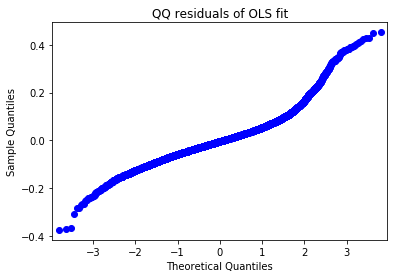


```python
sns.residplot(model_fit.resid, model_fit.fittedvalues)
```


    <matplotlib.axes._subplots.AxesSubplot at 0x1c1f347da0>


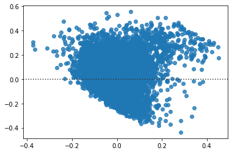


```python
invert_log_pred = np.expm1(predictions)
invert_log_test= np.expm1(y_test)
```


```python
invert_log_train = np.expm1(y_train)
```


```python
plt.figure(figsize=(20,20))
plt.scatter(invert_log_test,invert_log_pred)
plt.xlabel('True Price - inverted log transform')
plt.ylabel('Predicted Price - inverted log transform')
```


    Text(0, 0.5, 'Predicted Price - inverted log transform')


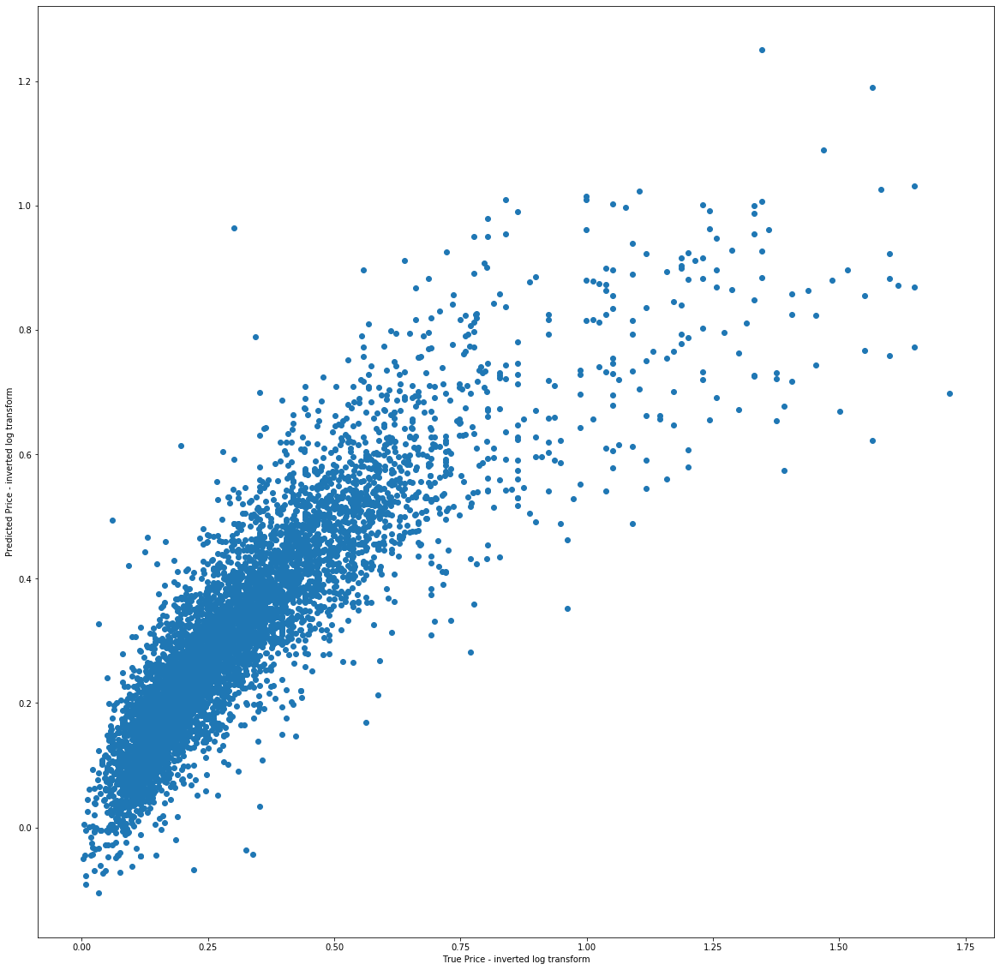


```python
np.exp(model_fit.params)
```


    const            0.880734
    sqft_living      1.464178
    seattle          1.140369
    grade            1.211569
    yr_built_bins    0.952706
                       ...   
    zip_98014        1.023366
    floors_2.5       1.020110
    bedroom_8        0.932850
    zip_98148        0.978098
    zip_98115        1.008319
    Length: 71, dtype: float64


```python
df.columns
```


    Index(['price', 'sqft_living', 'waterfront', 'grade', 'view_1', 'view_2',
           'view_3', 'view_4', 'was_renovated', 'has_basement', 'seattle',
           'condition_2', 'condition_3', 'condition_4', 'condition_5', 'bedroom_2',
           'bedroom_6', 'bedroom_7', 'bedroom_8', 'bedroom_10', 'bedroom_33',
           'bathroom_bins', 'floors_2.0', 'floors_2.5', 'floors_3.5', 'zip_98002',
           'zip_98004', 'zip_98005', 'zip_98006', 'zip_98007', 'zip_98008',
           'zip_98010', 'zip_98014', 'zip_98019', 'zip_98022', 'zip_98023',
           'zip_98024', 'zip_98027', 'zip_98029', 'zip_98030', 'zip_98031',
           'zip_98033', 'zip_98034', 'zip_98038', 'zip_98039', 'zip_98040',
           'zip_98042', 'zip_98045', 'zip_98052', 'zip_98053', 'zip_98055',
           'zip_98056', 'zip_98058', 'zip_98059', 'zip_98070', 'zip_98072',
           'zip_98074', 'zip_98075', 'zip_98092', 'zip_98102', 'zip_98103',
           'zip_98105', 'zip_98106', 'zip_98107', 'zip_98108', 'zip_98109',
           'zip_98112', 'zip_98115', 'zip_98116', 'zip_98117', 'zip_98118',
           'zip_98119', 'zip_98122', 'zip_98125', 'zip_98126', 'zip_98133',
           'zip_98136', 'zip_98144', 'zip_98146', 'zip_98148', 'zip_98166',
           'zip_98168', 'zip_98177', 'zip_98178', 'zip_98188', 'zip_98198',
           'zip_98199', 'yr_built_bins', 'yr_ren_bins'],
          dtype='object')


```python
# col_trim = ['price','sqft_living', 'sqft_lot',
#         'grade','yr_built','has_basement', 'seattle', ] 


# for col in col_trim:
#     print(col)
#     idx = find_outliers(df[col])
#     df = df.loc[idx==False]
```


```python

# X_train, X_test, y_train, y_test = train_test_split(df_stepwise.drop('price', axis=1),
#                                                     df_stepwise['price'],
#                                                     test_size=0.3,
#                                                     random_state=0)
# x_train = sm.add_constant(X_train)
# X_test = sm.add_constant(X_test)
#     #fit model
# model_fit = sm.OLS(y_train, x_train).fit()

#     #store results in dataframe for easier analysis
# #     results_df = pd.concat([x_train, y_train], axis=1)
# model_fit.summary()
    
```


```python
# res = model_fit.resid # residuals
# probplot = sm.ProbPlot(res)
# fig = probplot.qqplot()
# h = plt.title('QQ residuals of OLS fit')
# plt.show()
```

# HERE IS WHERE CONCLUSIONS ON THE MAIN MODEL GO


```python

```

# TBD: Iterate on model, Looking to eliminate more multicolinearity and outliers

# Another heatmap, more statistical tests re: multicolinearity


```python
# Attempted feature selection including recursive feature eliminator
```

# INCOMING TEXT DUMP OF MODELS, VISUALS LATER 

# Do bathrooms and bedrooms predict well price of housing?


```python

```

# Which is more predictive, bedrooms or bathrooms?


```python

```

# A model with a set of features around the general size of a dwelling


```python

```

# A model concerning the quality of a dwelling


```python

```

# Grade seems to be an overall strong predictor across models!


```python

```

# Analyzing by high and low percentages of the price of housing and the most performant model - doesn't include outliers which weakens the point


```python

```


```python
ninetyp = df.price.quantile(.9)
```


```python
ninetyp = df[df.price > df.price.quantile(.90)]
```


```python
ninetyp.columns
```

# Viz Conclusion - performance drops off at the highest percentiles, steadily


```python

```

# OVERALL CONCLUSIONS + BUSINESS RECS GO HERE- let the coeff tell the story, prices by zipcode/most expensive zipcodes


```python

```


```python

```


```python

```

# STORYTELL


```python

```

# Future work 
I'd like to explore time series and geospatial implications of the dataset. Furthermore, I'd utilize sampling techniques on the features which lack a good amount of positive data points such as waterfront.


```python

```


```python

```
