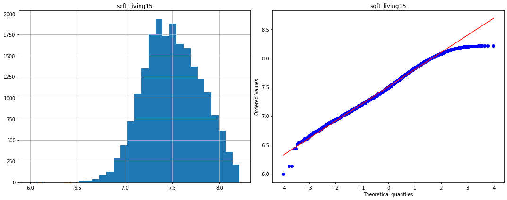
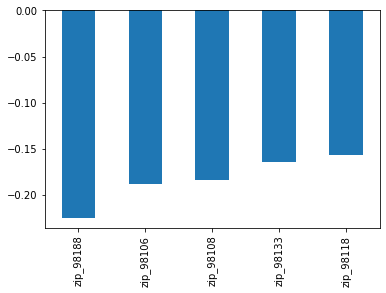

# Module 1 Project - Multiple Linear Regression - Michael Burak

In this notebook, I will examine the King County, WA housing pricing data set with the aim of finding the most important features influencing the target variable, price. I will tackle some side questions of interest to those studying real estate and home buyers as well regarding the data.


```python
# Importing libraries

import numpy as np 
import pandas as pd 

import matplotlib.pyplot as plt 
import seaborn as sns 
from scipy import stats
%matplotlib inline

import matplotlib.cm

from sklearn.model_selection import train_test_split
from sklearn.preprocessing import OneHotEncoder, LabelEncoder
from sklearn import preprocessing
from sklearn.preprocessing import MinMaxScaler


import statsmodels.api as sm

```

# Reading in data and examining


```python
df = pd.read_csv('kc_house_data.csv')

df.head()
```


<div>
<style scoped>
    .dataframe tbody tr th:only-of-type {
        vertical-align: middle;
    }

    .dataframe tbody tr th {
        vertical-align: top;
    }

    .dataframe thead th {
        text-align: right;
    }
</style>
<table border="1" class="dataframe">
  <thead>
    <tr style="text-align: right;">
      <th></th>
      <th>id</th>
      <th>date</th>
      <th>price</th>
      <th>bedrooms</th>
      <th>bathrooms</th>
      <th>sqft_living</th>
      <th>sqft_lot</th>
      <th>floors</th>
      <th>waterfront</th>
      <th>view</th>
      <th>...</th>
      <th>grade</th>
      <th>sqft_above</th>
      <th>sqft_basement</th>
      <th>yr_built</th>
      <th>yr_renovated</th>
      <th>zipcode</th>
      <th>lat</th>
      <th>long</th>
      <th>sqft_living15</th>
      <th>sqft_lot15</th>
    </tr>
  </thead>
  <tbody>
    <tr>
      <td>0</td>
      <td>7129300520</td>
      <td>10/13/2014</td>
      <td>221900.0</td>
      <td>3</td>
      <td>1.00</td>
      <td>1180</td>
      <td>5650</td>
      <td>1.0</td>
      <td>NaN</td>
      <td>0.0</td>
      <td>...</td>
      <td>7</td>
      <td>1180</td>
      <td>0.0</td>
      <td>1955</td>
      <td>0.0</td>
      <td>98178</td>
      <td>47.5112</td>
      <td>-122.257</td>
      <td>1340</td>
      <td>5650</td>
    </tr>
    <tr>
      <td>1</td>
      <td>6414100192</td>
      <td>12/9/2014</td>
      <td>538000.0</td>
      <td>3</td>
      <td>2.25</td>
      <td>2570</td>
      <td>7242</td>
      <td>2.0</td>
      <td>0.0</td>
      <td>0.0</td>
      <td>...</td>
      <td>7</td>
      <td>2170</td>
      <td>400.0</td>
      <td>1951</td>
      <td>1991.0</td>
      <td>98125</td>
      <td>47.7210</td>
      <td>-122.319</td>
      <td>1690</td>
      <td>7639</td>
    </tr>
    <tr>
      <td>2</td>
      <td>5631500400</td>
      <td>2/25/2015</td>
      <td>180000.0</td>
      <td>2</td>
      <td>1.00</td>
      <td>770</td>
      <td>10000</td>
      <td>1.0</td>
      <td>0.0</td>
      <td>0.0</td>
      <td>...</td>
      <td>6</td>
      <td>770</td>
      <td>0.0</td>
      <td>1933</td>
      <td>NaN</td>
      <td>98028</td>
      <td>47.7379</td>
      <td>-122.233</td>
      <td>2720</td>
      <td>8062</td>
    </tr>
    <tr>
      <td>3</td>
      <td>2487200875</td>
      <td>12/9/2014</td>
      <td>604000.0</td>
      <td>4</td>
      <td>3.00</td>
      <td>1960</td>
      <td>5000</td>
      <td>1.0</td>
      <td>0.0</td>
      <td>0.0</td>
      <td>...</td>
      <td>7</td>
      <td>1050</td>
      <td>910.0</td>
      <td>1965</td>
      <td>0.0</td>
      <td>98136</td>
      <td>47.5208</td>
      <td>-122.393</td>
      <td>1360</td>
      <td>5000</td>
    </tr>
    <tr>
      <td>4</td>
      <td>1954400510</td>
      <td>2/18/2015</td>
      <td>510000.0</td>
      <td>3</td>
      <td>2.00</td>
      <td>1680</td>
      <td>8080</td>
      <td>1.0</td>
      <td>0.0</td>
      <td>0.0</td>
      <td>...</td>
      <td>8</td>
      <td>1680</td>
      <td>0.0</td>
      <td>1987</td>
      <td>0.0</td>
      <td>98074</td>
      <td>47.6168</td>
      <td>-122.045</td>
      <td>1800</td>
      <td>7503</td>
    </tr>
  </tbody>
</table>
<p>5 rows × 21 columns</p>
</div>


```python
plt.figure(figsize=(8,8))
sns.distplot(df['price'], kde=False)
```


    <matplotlib.axes._subplots.AxesSubplot at 0x11b13ce10>


```python
df.nlargest(3, 'price')
```


<div>
<style scoped>
    .dataframe tbody tr th:only-of-type {
        vertical-align: middle;
    }

    .dataframe tbody tr th {
        vertical-align: top;
    }

    .dataframe thead th {
        text-align: right;
    }
</style>
<table border="1" class="dataframe">
  <thead>
    <tr style="text-align: right;">
      <th></th>
      <th>id</th>
      <th>date</th>
      <th>price</th>
      <th>bedrooms</th>
      <th>bathrooms</th>
      <th>sqft_living</th>
      <th>sqft_lot</th>
      <th>floors</th>
      <th>waterfront</th>
      <th>view</th>
      <th>...</th>
      <th>grade</th>
      <th>sqft_above</th>
      <th>sqft_basement</th>
      <th>yr_built</th>
      <th>yr_renovated</th>
      <th>zipcode</th>
      <th>lat</th>
      <th>long</th>
      <th>sqft_living15</th>
      <th>sqft_lot15</th>
    </tr>
  </thead>
  <tbody>
    <tr>
      <td>7245</td>
      <td>6762700020</td>
      <td>10/13/2014</td>
      <td>7700000.0</td>
      <td>6</td>
      <td>8.00</td>
      <td>12050</td>
      <td>27600</td>
      <td>2.5</td>
      <td>0.0</td>
      <td>3.0</td>
      <td>...</td>
      <td>13</td>
      <td>8570</td>
      <td>3480.0</td>
      <td>1910</td>
      <td>1987.0</td>
      <td>98102</td>
      <td>47.6298</td>
      <td>-122.323</td>
      <td>3940</td>
      <td>8800</td>
    </tr>
    <tr>
      <td>3910</td>
      <td>9808700762</td>
      <td>6/11/2014</td>
      <td>7060000.0</td>
      <td>5</td>
      <td>4.50</td>
      <td>10040</td>
      <td>37325</td>
      <td>2.0</td>
      <td>1.0</td>
      <td>2.0</td>
      <td>...</td>
      <td>11</td>
      <td>7680</td>
      <td>2360.0</td>
      <td>1940</td>
      <td>2001.0</td>
      <td>98004</td>
      <td>47.6500</td>
      <td>-122.214</td>
      <td>3930</td>
      <td>25449</td>
    </tr>
    <tr>
      <td>9245</td>
      <td>9208900037</td>
      <td>9/19/2014</td>
      <td>6890000.0</td>
      <td>6</td>
      <td>7.75</td>
      <td>9890</td>
      <td>31374</td>
      <td>2.0</td>
      <td>0.0</td>
      <td>4.0</td>
      <td>...</td>
      <td>13</td>
      <td>8860</td>
      <td>1030.0</td>
      <td>2001</td>
      <td>0.0</td>
      <td>98039</td>
      <td>47.6305</td>
      <td>-122.240</td>
      <td>4540</td>
      <td>42730</td>
    </tr>
  </tbody>
</table>
<p>3 rows × 21 columns</p>
</div>


```python
df.tail()
```


<div>
<style scoped>
    .dataframe tbody tr th:only-of-type {
        vertical-align: middle;
    }

    .dataframe tbody tr th {
        vertical-align: top;
    }

    .dataframe thead th {
        text-align: right;
    }
</style>
<table border="1" class="dataframe">
  <thead>
    <tr style="text-align: right;">
      <th></th>
      <th>id</th>
      <th>date</th>
      <th>price</th>
      <th>bedrooms</th>
      <th>bathrooms</th>
      <th>sqft_living</th>
      <th>sqft_lot</th>
      <th>floors</th>
      <th>waterfront</th>
      <th>view</th>
      <th>...</th>
      <th>grade</th>
      <th>sqft_above</th>
      <th>sqft_basement</th>
      <th>yr_built</th>
      <th>yr_renovated</th>
      <th>zipcode</th>
      <th>lat</th>
      <th>long</th>
      <th>sqft_living15</th>
      <th>sqft_lot15</th>
    </tr>
  </thead>
  <tbody>
    <tr>
      <td>21592</td>
      <td>263000018</td>
      <td>5/21/2014</td>
      <td>360000.0</td>
      <td>3</td>
      <td>2.50</td>
      <td>1530</td>
      <td>1131</td>
      <td>3.0</td>
      <td>0.0</td>
      <td>0.0</td>
      <td>...</td>
      <td>8</td>
      <td>1530</td>
      <td>0.0</td>
      <td>2009</td>
      <td>0.0</td>
      <td>98103</td>
      <td>47.6993</td>
      <td>-122.346</td>
      <td>1530</td>
      <td>1509</td>
    </tr>
    <tr>
      <td>21593</td>
      <td>6600060120</td>
      <td>2/23/2015</td>
      <td>400000.0</td>
      <td>4</td>
      <td>2.50</td>
      <td>2310</td>
      <td>5813</td>
      <td>2.0</td>
      <td>0.0</td>
      <td>0.0</td>
      <td>...</td>
      <td>8</td>
      <td>2310</td>
      <td>0.0</td>
      <td>2014</td>
      <td>0.0</td>
      <td>98146</td>
      <td>47.5107</td>
      <td>-122.362</td>
      <td>1830</td>
      <td>7200</td>
    </tr>
    <tr>
      <td>21594</td>
      <td>1523300141</td>
      <td>6/23/2014</td>
      <td>402101.0</td>
      <td>2</td>
      <td>0.75</td>
      <td>1020</td>
      <td>1350</td>
      <td>2.0</td>
      <td>0.0</td>
      <td>0.0</td>
      <td>...</td>
      <td>7</td>
      <td>1020</td>
      <td>0.0</td>
      <td>2009</td>
      <td>0.0</td>
      <td>98144</td>
      <td>47.5944</td>
      <td>-122.299</td>
      <td>1020</td>
      <td>2007</td>
    </tr>
    <tr>
      <td>21595</td>
      <td>291310100</td>
      <td>1/16/2015</td>
      <td>400000.0</td>
      <td>3</td>
      <td>2.50</td>
      <td>1600</td>
      <td>2388</td>
      <td>2.0</td>
      <td>NaN</td>
      <td>0.0</td>
      <td>...</td>
      <td>8</td>
      <td>1600</td>
      <td>0.0</td>
      <td>2004</td>
      <td>0.0</td>
      <td>98027</td>
      <td>47.5345</td>
      <td>-122.069</td>
      <td>1410</td>
      <td>1287</td>
    </tr>
    <tr>
      <td>21596</td>
      <td>1523300157</td>
      <td>10/15/2014</td>
      <td>325000.0</td>
      <td>2</td>
      <td>0.75</td>
      <td>1020</td>
      <td>1076</td>
      <td>2.0</td>
      <td>0.0</td>
      <td>0.0</td>
      <td>...</td>
      <td>7</td>
      <td>1020</td>
      <td>0.0</td>
      <td>2008</td>
      <td>0.0</td>
      <td>98144</td>
      <td>47.5941</td>
      <td>-122.299</td>
      <td>1020</td>
      <td>1357</td>
    </tr>
  </tbody>
</table>
<p>5 rows × 21 columns</p>
</div>


# Looks like there's some NaN in the data, time for a null values and type check, null values in 'waterfront', 'view' and 'yr_renovated' features, objects in date and sqft_basement


```python
df.info()
```

    <class 'pandas.core.frame.DataFrame'>
    RangeIndex: 21597 entries, 0 to 21596
    Data columns (total 21 columns):
    id               21597 non-null int64
    date             21597 non-null object
    price            21597 non-null float64
    bedrooms         21597 non-null int64
    bathrooms        21597 non-null float64
    sqft_living      21597 non-null int64
    sqft_lot         21597 non-null int64
    floors           21597 non-null float64
    waterfront       19221 non-null float64
    view             21534 non-null float64
    condition        21597 non-null int64
    grade            21597 non-null int64
    sqft_above       21597 non-null int64
    sqft_basement    21597 non-null object
    yr_built         21597 non-null int64
    yr_renovated     17755 non-null float64
    zipcode          21597 non-null int64
    lat              21597 non-null float64
    long             21597 non-null float64
    sqft_living15    21597 non-null int64
    sqft_lot15       21597 non-null int64
    dtypes: float64(8), int64(11), object(2)
    memory usage: 3.5+ MB


```python
df.shape
```


    (21597, 21)


```python
df.isna().any()
```


    id               False
    date             False
    price            False
    bedrooms         False
    bathrooms        False
    sqft_living      False
    sqft_lot         False
    floors           False
    waterfront        True
    view              True
    condition        False
    grade            False
    sqft_above       False
    sqft_basement    False
    yr_built         False
    yr_renovated      True
    zipcode          False
    lat              False
    long             False
    sqft_living15    False
    sqft_lot15       False
    dtype: bool


```python
df.isna().sum()
```


    id                  0
    date                0
    price               0
    bedrooms            0
    bathrooms           0
    sqft_living         0
    sqft_lot            0
    floors              0
    waterfront       2376
    view               63
    condition           0
    grade               0
    sqft_above          0
    sqft_basement       0
    yr_built            0
    yr_renovated     3842
    zipcode             0
    lat                 0
    long                0
    sqft_living15       0
    sqft_lot15          0
    dtype: int64


```python
df['view'].describe()
```


    count    21534.000000
    mean         0.233863
    std          0.765686
    min          0.000000
    25%          0.000000
    50%          0.000000
    75%          0.000000
    max          4.000000
    Name: view, dtype: float64


# View is predominately zero, meaning the house hasn't been viewed
# Transform view into categories.


```python
sns.catplot(x='view', y='price', data=df)
```


    <seaborn.axisgrid.FacetGrid at 0x1c1f458ac8>


```python
df['view'].value_counts(dropna=False)
```


    0.0    19422
    2.0      957
    3.0      508
    1.0      330
    4.0      317
    NaN       63
    Name: view, dtype: int64


```python
df['view'] = df['view'].fillna(0).astype(int)

df['view'].value_counts(dropna=False)
```


    0    19485
    2      957
    3      508
    1      330
    4      317
    Name: view, dtype: int64


# Encoding view into separate features


```python
df = pd.concat([df,pd.get_dummies(df['view'], prefix='view', drop_first=True)],axis=1).drop(['view'],axis=1)

df.head(10)
```


<div>
<style scoped>
    .dataframe tbody tr th:only-of-type {
        vertical-align: middle;
    }

    .dataframe tbody tr th {
        vertical-align: top;
    }

    .dataframe thead th {
        text-align: right;
    }
</style>
<table border="1" class="dataframe">
  <thead>
    <tr style="text-align: right;">
      <th></th>
      <th>id</th>
      <th>date</th>
      <th>price</th>
      <th>bedrooms</th>
      <th>bathrooms</th>
      <th>sqft_living</th>
      <th>sqft_lot</th>
      <th>floors</th>
      <th>waterfront</th>
      <th>condition</th>
      <th>...</th>
      <th>yr_renovated</th>
      <th>zipcode</th>
      <th>lat</th>
      <th>long</th>
      <th>sqft_living15</th>
      <th>sqft_lot15</th>
      <th>view_1</th>
      <th>view_2</th>
      <th>view_3</th>
      <th>view_4</th>
    </tr>
  </thead>
  <tbody>
    <tr>
      <td>0</td>
      <td>7129300520</td>
      <td>10/13/2014</td>
      <td>221900.0</td>
      <td>3</td>
      <td>1.00</td>
      <td>1180</td>
      <td>5650</td>
      <td>1.0</td>
      <td>NaN</td>
      <td>3</td>
      <td>...</td>
      <td>0.0</td>
      <td>98178</td>
      <td>47.5112</td>
      <td>-122.257</td>
      <td>1340</td>
      <td>5650</td>
      <td>0</td>
      <td>0</td>
      <td>0</td>
      <td>0</td>
    </tr>
    <tr>
      <td>1</td>
      <td>6414100192</td>
      <td>12/9/2014</td>
      <td>538000.0</td>
      <td>3</td>
      <td>2.25</td>
      <td>2570</td>
      <td>7242</td>
      <td>2.0</td>
      <td>0.0</td>
      <td>3</td>
      <td>...</td>
      <td>1991.0</td>
      <td>98125</td>
      <td>47.7210</td>
      <td>-122.319</td>
      <td>1690</td>
      <td>7639</td>
      <td>0</td>
      <td>0</td>
      <td>0</td>
      <td>0</td>
    </tr>
    <tr>
      <td>2</td>
      <td>5631500400</td>
      <td>2/25/2015</td>
      <td>180000.0</td>
      <td>2</td>
      <td>1.00</td>
      <td>770</td>
      <td>10000</td>
      <td>1.0</td>
      <td>0.0</td>
      <td>3</td>
      <td>...</td>
      <td>NaN</td>
      <td>98028</td>
      <td>47.7379</td>
      <td>-122.233</td>
      <td>2720</td>
      <td>8062</td>
      <td>0</td>
      <td>0</td>
      <td>0</td>
      <td>0</td>
    </tr>
    <tr>
      <td>3</td>
      <td>2487200875</td>
      <td>12/9/2014</td>
      <td>604000.0</td>
      <td>4</td>
      <td>3.00</td>
      <td>1960</td>
      <td>5000</td>
      <td>1.0</td>
      <td>0.0</td>
      <td>5</td>
      <td>...</td>
      <td>0.0</td>
      <td>98136</td>
      <td>47.5208</td>
      <td>-122.393</td>
      <td>1360</td>
      <td>5000</td>
      <td>0</td>
      <td>0</td>
      <td>0</td>
      <td>0</td>
    </tr>
    <tr>
      <td>4</td>
      <td>1954400510</td>
      <td>2/18/2015</td>
      <td>510000.0</td>
      <td>3</td>
      <td>2.00</td>
      <td>1680</td>
      <td>8080</td>
      <td>1.0</td>
      <td>0.0</td>
      <td>3</td>
      <td>...</td>
      <td>0.0</td>
      <td>98074</td>
      <td>47.6168</td>
      <td>-122.045</td>
      <td>1800</td>
      <td>7503</td>
      <td>0</td>
      <td>0</td>
      <td>0</td>
      <td>0</td>
    </tr>
    <tr>
      <td>5</td>
      <td>7237550310</td>
      <td>5/12/2014</td>
      <td>1230000.0</td>
      <td>4</td>
      <td>4.50</td>
      <td>5420</td>
      <td>101930</td>
      <td>1.0</td>
      <td>0.0</td>
      <td>3</td>
      <td>...</td>
      <td>0.0</td>
      <td>98053</td>
      <td>47.6561</td>
      <td>-122.005</td>
      <td>4760</td>
      <td>101930</td>
      <td>0</td>
      <td>0</td>
      <td>0</td>
      <td>0</td>
    </tr>
    <tr>
      <td>6</td>
      <td>1321400060</td>
      <td>6/27/2014</td>
      <td>257500.0</td>
      <td>3</td>
      <td>2.25</td>
      <td>1715</td>
      <td>6819</td>
      <td>2.0</td>
      <td>0.0</td>
      <td>3</td>
      <td>...</td>
      <td>0.0</td>
      <td>98003</td>
      <td>47.3097</td>
      <td>-122.327</td>
      <td>2238</td>
      <td>6819</td>
      <td>0</td>
      <td>0</td>
      <td>0</td>
      <td>0</td>
    </tr>
    <tr>
      <td>7</td>
      <td>2008000270</td>
      <td>1/15/2015</td>
      <td>291850.0</td>
      <td>3</td>
      <td>1.50</td>
      <td>1060</td>
      <td>9711</td>
      <td>1.0</td>
      <td>0.0</td>
      <td>3</td>
      <td>...</td>
      <td>0.0</td>
      <td>98198</td>
      <td>47.4095</td>
      <td>-122.315</td>
      <td>1650</td>
      <td>9711</td>
      <td>0</td>
      <td>0</td>
      <td>0</td>
      <td>0</td>
    </tr>
    <tr>
      <td>8</td>
      <td>2414600126</td>
      <td>4/15/2015</td>
      <td>229500.0</td>
      <td>3</td>
      <td>1.00</td>
      <td>1780</td>
      <td>7470</td>
      <td>1.0</td>
      <td>0.0</td>
      <td>3</td>
      <td>...</td>
      <td>0.0</td>
      <td>98146</td>
      <td>47.5123</td>
      <td>-122.337</td>
      <td>1780</td>
      <td>8113</td>
      <td>0</td>
      <td>0</td>
      <td>0</td>
      <td>0</td>
    </tr>
    <tr>
      <td>9</td>
      <td>3793500160</td>
      <td>3/12/2015</td>
      <td>323000.0</td>
      <td>3</td>
      <td>2.50</td>
      <td>1890</td>
      <td>6560</td>
      <td>2.0</td>
      <td>0.0</td>
      <td>3</td>
      <td>...</td>
      <td>0.0</td>
      <td>98038</td>
      <td>47.3684</td>
      <td>-122.031</td>
      <td>2390</td>
      <td>7570</td>
      <td>0</td>
      <td>0</td>
      <td>0</td>
      <td>0</td>
    </tr>
  </tbody>
</table>
<p>10 rows × 24 columns</p>
</div>


# Waterfront is the next variable of interest - and mostly 0, so imputing NaN with 0s.


```python
df['waterfront'].value_counts(dropna=False)
```


    0.0    19075
    NaN     2376
    1.0      146
    Name: waterfront, dtype: int64


```python
df['waterfront'] = df['waterfront'].fillna(0)

df['waterfront'].value_counts(dropna=False)
```


    0.0    21451
    1.0      146
    Name: waterfront, dtype: int64


```python
sns.distplot(df['waterfront'])
```


    <matplotlib.axes._subplots.AxesSubplot at 0x1c20a0f5c0>


```python
sns.catplot(x="waterfront", y="price",data=df)
```


    <seaborn.axisgrid.FacetGrid at 0x10ac6e320>


```python
df.isna().sum()
```


    id                  0
    date                0
    price               0
    bedrooms            0
    bathrooms           0
    sqft_living         0
    sqft_lot            0
    floors              0
    waterfront          0
    condition           0
    grade               0
    sqft_above          0
    sqft_basement       0
    yr_built            0
    yr_renovated     3842
    zipcode             0
    lat                 0
    long                0
    sqft_living15       0
    sqft_lot15          0
    view_1              0
    view_2              0
    view_3              0
    view_4              0
    dtype: int64


# Keeping yr_renovated, filling with 0s, creating new features off of yr_renovated


```python
df['yr_renovated'].value_counts(dropna=False)
```


    0.0       17011
    NaN        3842
    2014.0       73
    2003.0       31
    2013.0       31
              ...  
    1944.0        1
    1948.0        1
    1976.0        1
    1934.0        1
    1953.0        1
    Name: yr_renovated, Length: 71, dtype: int64


```python
df['yr_renovated'] = df['yr_renovated'].fillna(0)
```


```python
df.yr_renovated.value_counts(dropna=False)
```


    0.0       20853
    2014.0       73
    2003.0       31
    2013.0       31
    2007.0       30
              ...  
    1946.0        1
    1959.0        1
    1971.0        1
    1951.0        1
    1954.0        1
    Name: yr_renovated, Length: 70, dtype: int64


# Extract only housing that was renovated, as well as the gap between building and renovation in years


```python
df['was_renovated'] = df['yr_renovated'].astype(bool).astype(int)
renovation_gap = df[(df['yr_renovated'] > 0)]
display(renovation_gap.head(10))
display(df.head(10))
```


<div>
<style scoped>
    .dataframe tbody tr th:only-of-type {
        vertical-align: middle;
    }

    .dataframe tbody tr th {
        vertical-align: top;
    }

    .dataframe thead th {
        text-align: right;
    }
</style>
<table border="1" class="dataframe">
  <thead>
    <tr style="text-align: right;">
      <th></th>
      <th>id</th>
      <th>date</th>
      <th>price</th>
      <th>bedrooms</th>
      <th>bathrooms</th>
      <th>sqft_living</th>
      <th>sqft_lot</th>
      <th>floors</th>
      <th>waterfront</th>
      <th>condition</th>
      <th>...</th>
      <th>zipcode</th>
      <th>lat</th>
      <th>long</th>
      <th>sqft_living15</th>
      <th>sqft_lot15</th>
      <th>view_1</th>
      <th>view_2</th>
      <th>view_3</th>
      <th>view_4</th>
      <th>was_renovated</th>
    </tr>
  </thead>
  <tbody>
    <tr>
      <td>1</td>
      <td>6414100192</td>
      <td>12/9/2014</td>
      <td>538000.0</td>
      <td>3</td>
      <td>2.25</td>
      <td>2570</td>
      <td>7242</td>
      <td>2.0</td>
      <td>0.0</td>
      <td>3</td>
      <td>...</td>
      <td>98125</td>
      <td>47.7210</td>
      <td>-122.319</td>
      <td>1690</td>
      <td>7639</td>
      <td>0</td>
      <td>0</td>
      <td>0</td>
      <td>0</td>
      <td>1</td>
    </tr>
    <tr>
      <td>35</td>
      <td>9547205180</td>
      <td>6/13/2014</td>
      <td>696000.0</td>
      <td>3</td>
      <td>2.50</td>
      <td>2300</td>
      <td>3060</td>
      <td>1.5</td>
      <td>0.0</td>
      <td>3</td>
      <td>...</td>
      <td>98115</td>
      <td>47.6827</td>
      <td>-122.310</td>
      <td>1590</td>
      <td>3264</td>
      <td>0</td>
      <td>0</td>
      <td>0</td>
      <td>0</td>
      <td>1</td>
    </tr>
    <tr>
      <td>95</td>
      <td>1483300570</td>
      <td>9/8/2014</td>
      <td>905000.0</td>
      <td>4</td>
      <td>2.50</td>
      <td>3300</td>
      <td>10250</td>
      <td>1.0</td>
      <td>0.0</td>
      <td>3</td>
      <td>...</td>
      <td>98040</td>
      <td>47.5873</td>
      <td>-122.249</td>
      <td>1950</td>
      <td>6045</td>
      <td>0</td>
      <td>0</td>
      <td>0</td>
      <td>0</td>
      <td>1</td>
    </tr>
    <tr>
      <td>103</td>
      <td>2450000295</td>
      <td>10/7/2014</td>
      <td>1090000.0</td>
      <td>3</td>
      <td>2.50</td>
      <td>2920</td>
      <td>8113</td>
      <td>2.0</td>
      <td>0.0</td>
      <td>3</td>
      <td>...</td>
      <td>98004</td>
      <td>47.5814</td>
      <td>-122.196</td>
      <td>2370</td>
      <td>8113</td>
      <td>0</td>
      <td>0</td>
      <td>0</td>
      <td>0</td>
      <td>1</td>
    </tr>
    <tr>
      <td>125</td>
      <td>4389200955</td>
      <td>3/2/2015</td>
      <td>1450000.0</td>
      <td>4</td>
      <td>2.75</td>
      <td>2750</td>
      <td>17789</td>
      <td>1.5</td>
      <td>0.0</td>
      <td>3</td>
      <td>...</td>
      <td>98004</td>
      <td>47.6141</td>
      <td>-122.212</td>
      <td>3060</td>
      <td>11275</td>
      <td>0</td>
      <td>0</td>
      <td>0</td>
      <td>0</td>
      <td>1</td>
    </tr>
    <tr>
      <td>158</td>
      <td>8029200135</td>
      <td>11/13/2014</td>
      <td>247000.0</td>
      <td>3</td>
      <td>2.00</td>
      <td>1270</td>
      <td>7198</td>
      <td>1.5</td>
      <td>0.0</td>
      <td>3</td>
      <td>...</td>
      <td>98022</td>
      <td>47.2086</td>
      <td>-121.996</td>
      <td>1160</td>
      <td>7198</td>
      <td>0</td>
      <td>0</td>
      <td>0</td>
      <td>0</td>
      <td>1</td>
    </tr>
    <tr>
      <td>209</td>
      <td>6300000550</td>
      <td>7/17/2014</td>
      <td>464000.0</td>
      <td>6</td>
      <td>3.00</td>
      <td>2300</td>
      <td>3404</td>
      <td>2.0</td>
      <td>0.0</td>
      <td>3</td>
      <td>...</td>
      <td>98133</td>
      <td>47.7067</td>
      <td>-122.343</td>
      <td>1560</td>
      <td>1312</td>
      <td>0</td>
      <td>0</td>
      <td>0</td>
      <td>0</td>
      <td>1</td>
    </tr>
    <tr>
      <td>216</td>
      <td>46100204</td>
      <td>2/21/2015</td>
      <td>1510000.0</td>
      <td>5</td>
      <td>3.00</td>
      <td>3300</td>
      <td>33474</td>
      <td>1.0</td>
      <td>0.0</td>
      <td>3</td>
      <td>...</td>
      <td>98040</td>
      <td>47.5673</td>
      <td>-122.210</td>
      <td>3836</td>
      <td>20953</td>
      <td>0</td>
      <td>0</td>
      <td>1</td>
      <td>0</td>
      <td>1</td>
    </tr>
    <tr>
      <td>230</td>
      <td>8096000060</td>
      <td>4/13/2015</td>
      <td>655000.0</td>
      <td>2</td>
      <td>1.75</td>
      <td>1450</td>
      <td>15798</td>
      <td>2.0</td>
      <td>1.0</td>
      <td>3</td>
      <td>...</td>
      <td>98166</td>
      <td>47.4497</td>
      <td>-122.375</td>
      <td>2030</td>
      <td>13193</td>
      <td>0</td>
      <td>0</td>
      <td>0</td>
      <td>1</td>
      <td>1</td>
    </tr>
    <tr>
      <td>237</td>
      <td>7228500560</td>
      <td>3/20/2015</td>
      <td>410000.0</td>
      <td>4</td>
      <td>1.00</td>
      <td>1970</td>
      <td>4740</td>
      <td>1.5</td>
      <td>0.0</td>
      <td>3</td>
      <td>...</td>
      <td>98122</td>
      <td>47.6136</td>
      <td>-122.303</td>
      <td>1510</td>
      <td>4740</td>
      <td>0</td>
      <td>0</td>
      <td>0</td>
      <td>0</td>
      <td>1</td>
    </tr>
  </tbody>
</table>
<p>10 rows × 25 columns</p>
</div>


<div>
<style scoped>
    .dataframe tbody tr th:only-of-type {
        vertical-align: middle;
    }

    .dataframe tbody tr th {
        vertical-align: top;
    }

    .dataframe thead th {
        text-align: right;
    }
</style>
<table border="1" class="dataframe">
  <thead>
    <tr style="text-align: right;">
      <th></th>
      <th>id</th>
      <th>date</th>
      <th>price</th>
      <th>bedrooms</th>
      <th>bathrooms</th>
      <th>sqft_living</th>
      <th>sqft_lot</th>
      <th>floors</th>
      <th>waterfront</th>
      <th>condition</th>
      <th>...</th>
      <th>zipcode</th>
      <th>lat</th>
      <th>long</th>
      <th>sqft_living15</th>
      <th>sqft_lot15</th>
      <th>view_1</th>
      <th>view_2</th>
      <th>view_3</th>
      <th>view_4</th>
      <th>was_renovated</th>
    </tr>
  </thead>
  <tbody>
    <tr>
      <td>0</td>
      <td>7129300520</td>
      <td>10/13/2014</td>
      <td>221900.0</td>
      <td>3</td>
      <td>1.00</td>
      <td>1180</td>
      <td>5650</td>
      <td>1.0</td>
      <td>0.0</td>
      <td>3</td>
      <td>...</td>
      <td>98178</td>
      <td>47.5112</td>
      <td>-122.257</td>
      <td>1340</td>
      <td>5650</td>
      <td>0</td>
      <td>0</td>
      <td>0</td>
      <td>0</td>
      <td>0</td>
    </tr>
    <tr>
      <td>1</td>
      <td>6414100192</td>
      <td>12/9/2014</td>
      <td>538000.0</td>
      <td>3</td>
      <td>2.25</td>
      <td>2570</td>
      <td>7242</td>
      <td>2.0</td>
      <td>0.0</td>
      <td>3</td>
      <td>...</td>
      <td>98125</td>
      <td>47.7210</td>
      <td>-122.319</td>
      <td>1690</td>
      <td>7639</td>
      <td>0</td>
      <td>0</td>
      <td>0</td>
      <td>0</td>
      <td>1</td>
    </tr>
    <tr>
      <td>2</td>
      <td>5631500400</td>
      <td>2/25/2015</td>
      <td>180000.0</td>
      <td>2</td>
      <td>1.00</td>
      <td>770</td>
      <td>10000</td>
      <td>1.0</td>
      <td>0.0</td>
      <td>3</td>
      <td>...</td>
      <td>98028</td>
      <td>47.7379</td>
      <td>-122.233</td>
      <td>2720</td>
      <td>8062</td>
      <td>0</td>
      <td>0</td>
      <td>0</td>
      <td>0</td>
      <td>0</td>
    </tr>
    <tr>
      <td>3</td>
      <td>2487200875</td>
      <td>12/9/2014</td>
      <td>604000.0</td>
      <td>4</td>
      <td>3.00</td>
      <td>1960</td>
      <td>5000</td>
      <td>1.0</td>
      <td>0.0</td>
      <td>5</td>
      <td>...</td>
      <td>98136</td>
      <td>47.5208</td>
      <td>-122.393</td>
      <td>1360</td>
      <td>5000</td>
      <td>0</td>
      <td>0</td>
      <td>0</td>
      <td>0</td>
      <td>0</td>
    </tr>
    <tr>
      <td>4</td>
      <td>1954400510</td>
      <td>2/18/2015</td>
      <td>510000.0</td>
      <td>3</td>
      <td>2.00</td>
      <td>1680</td>
      <td>8080</td>
      <td>1.0</td>
      <td>0.0</td>
      <td>3</td>
      <td>...</td>
      <td>98074</td>
      <td>47.6168</td>
      <td>-122.045</td>
      <td>1800</td>
      <td>7503</td>
      <td>0</td>
      <td>0</td>
      <td>0</td>
      <td>0</td>
      <td>0</td>
    </tr>
    <tr>
      <td>5</td>
      <td>7237550310</td>
      <td>5/12/2014</td>
      <td>1230000.0</td>
      <td>4</td>
      <td>4.50</td>
      <td>5420</td>
      <td>101930</td>
      <td>1.0</td>
      <td>0.0</td>
      <td>3</td>
      <td>...</td>
      <td>98053</td>
      <td>47.6561</td>
      <td>-122.005</td>
      <td>4760</td>
      <td>101930</td>
      <td>0</td>
      <td>0</td>
      <td>0</td>
      <td>0</td>
      <td>0</td>
    </tr>
    <tr>
      <td>6</td>
      <td>1321400060</td>
      <td>6/27/2014</td>
      <td>257500.0</td>
      <td>3</td>
      <td>2.25</td>
      <td>1715</td>
      <td>6819</td>
      <td>2.0</td>
      <td>0.0</td>
      <td>3</td>
      <td>...</td>
      <td>98003</td>
      <td>47.3097</td>
      <td>-122.327</td>
      <td>2238</td>
      <td>6819</td>
      <td>0</td>
      <td>0</td>
      <td>0</td>
      <td>0</td>
      <td>0</td>
    </tr>
    <tr>
      <td>7</td>
      <td>2008000270</td>
      <td>1/15/2015</td>
      <td>291850.0</td>
      <td>3</td>
      <td>1.50</td>
      <td>1060</td>
      <td>9711</td>
      <td>1.0</td>
      <td>0.0</td>
      <td>3</td>
      <td>...</td>
      <td>98198</td>
      <td>47.4095</td>
      <td>-122.315</td>
      <td>1650</td>
      <td>9711</td>
      <td>0</td>
      <td>0</td>
      <td>0</td>
      <td>0</td>
      <td>0</td>
    </tr>
    <tr>
      <td>8</td>
      <td>2414600126</td>
      <td>4/15/2015</td>
      <td>229500.0</td>
      <td>3</td>
      <td>1.00</td>
      <td>1780</td>
      <td>7470</td>
      <td>1.0</td>
      <td>0.0</td>
      <td>3</td>
      <td>...</td>
      <td>98146</td>
      <td>47.5123</td>
      <td>-122.337</td>
      <td>1780</td>
      <td>8113</td>
      <td>0</td>
      <td>0</td>
      <td>0</td>
      <td>0</td>
      <td>0</td>
    </tr>
    <tr>
      <td>9</td>
      <td>3793500160</td>
      <td>3/12/2015</td>
      <td>323000.0</td>
      <td>3</td>
      <td>2.50</td>
      <td>1890</td>
      <td>6560</td>
      <td>2.0</td>
      <td>0.0</td>
      <td>3</td>
      <td>...</td>
      <td>98038</td>
      <td>47.3684</td>
      <td>-122.031</td>
      <td>2390</td>
      <td>7570</td>
      <td>0</td>
      <td>0</td>
      <td>0</td>
      <td>0</td>
      <td>0</td>
    </tr>
  </tbody>
</table>
<p>10 rows × 25 columns</p>
</div>


```python
df['was_renovated'].value_counts()
```


    0    20853
    1      744
    Name: was_renovated, dtype: int64


```python
renovation_gap['ren_gap'] = renovation_gap["yr_renovated"] - renovation_gap["yr_built"]

renovation_gap['ren_gap'].value_counts(dropna=False)
```

    /Users/michael/anaconda3/envs/learn-env/lib/python3.6/site-packages/ipykernel/__main__.py:1: SettingWithCopyWarning: 
    A value is trying to be set on a copy of a slice from a DataFrame.
    Try using .loc[row_indexer,col_indexer] = value instead
    
    See the caveats in the documentation: http://pandas.pydata.org/pandas-docs/stable/user_guide/indexing.html#returning-a-view-versus-a-copy
      if __name__ == '__main__':


    63.0     17
    43.0     17
    37.0     16
    36.0     15
    61.0     15
             ..
    105.0     1
    13.0      1
    109.0     1
    113.0     1
    10.0      1
    Name: ren_gap, Length: 103, dtype: int64


```python
df['ren_gap'] = renovation_gap['ren_gap']

```


```python
df['ren_gap'].value_counts(dropna=False)
```


    NaN      20853
    63.0        17
    43.0        17
    37.0        16
    86.0        15
             ...  
    10.0         1
    105.0        1
    113.0        1
    13.0         1
    109.0        1
    Name: ren_gap, Length: 104, dtype: int64


```python
df['ren_gap'] = df['ren_gap'].fillna(0)

df['ren_gap'].value_counts(dropna=False)
```


    0.0      20853
    63.0        17
    43.0        17
    37.0        16
    86.0        15
             ...  
    10.0         1
    105.0        1
    113.0        1
    13.0         1
    109.0        1
    Name: ren_gap, Length: 104, dtype: int64


# Scatterplot of the renovation gap in years among renovated housing vs. year built and its correlation to price


```python
plt.figure(1, figsize=(20,20))
    
plt.subplot(2, 2,1)
sns.scatterplot(x='ren_gap', y='price', data=renovation_gap)
```


    <matplotlib.axes._subplots.AxesSubplot at 0x1c21031208>


# Seems to be a relatively random distribution, not indicating the linearity we're looking for out of a variable to model, or a good correlation


```python
sns.distplot(df['ren_gap'])
```


    <matplotlib.axes._subplots.AxesSubplot at 0x1c210438d0>


# Still most of the houses have not been renovated, causing a lack of data to go off of 


```python
df.head()
```


<div>
<style scoped>
    .dataframe tbody tr th:only-of-type {
        vertical-align: middle;
    }

    .dataframe tbody tr th {
        vertical-align: top;
    }

    .dataframe thead th {
        text-align: right;
    }
</style>
<table border="1" class="dataframe">
  <thead>
    <tr style="text-align: right;">
      <th></th>
      <th>id</th>
      <th>date</th>
      <th>price</th>
      <th>bedrooms</th>
      <th>bathrooms</th>
      <th>sqft_living</th>
      <th>sqft_lot</th>
      <th>floors</th>
      <th>waterfront</th>
      <th>condition</th>
      <th>...</th>
      <th>lat</th>
      <th>long</th>
      <th>sqft_living15</th>
      <th>sqft_lot15</th>
      <th>view_1</th>
      <th>view_2</th>
      <th>view_3</th>
      <th>view_4</th>
      <th>was_renovated</th>
      <th>ren_gap</th>
    </tr>
  </thead>
  <tbody>
    <tr>
      <td>0</td>
      <td>7129300520</td>
      <td>10/13/2014</td>
      <td>221900.0</td>
      <td>3</td>
      <td>1.00</td>
      <td>1180</td>
      <td>5650</td>
      <td>1.0</td>
      <td>0.0</td>
      <td>3</td>
      <td>...</td>
      <td>47.5112</td>
      <td>-122.257</td>
      <td>1340</td>
      <td>5650</td>
      <td>0</td>
      <td>0</td>
      <td>0</td>
      <td>0</td>
      <td>0</td>
      <td>0.0</td>
    </tr>
    <tr>
      <td>1</td>
      <td>6414100192</td>
      <td>12/9/2014</td>
      <td>538000.0</td>
      <td>3</td>
      <td>2.25</td>
      <td>2570</td>
      <td>7242</td>
      <td>2.0</td>
      <td>0.0</td>
      <td>3</td>
      <td>...</td>
      <td>47.7210</td>
      <td>-122.319</td>
      <td>1690</td>
      <td>7639</td>
      <td>0</td>
      <td>0</td>
      <td>0</td>
      <td>0</td>
      <td>1</td>
      <td>40.0</td>
    </tr>
    <tr>
      <td>2</td>
      <td>5631500400</td>
      <td>2/25/2015</td>
      <td>180000.0</td>
      <td>2</td>
      <td>1.00</td>
      <td>770</td>
      <td>10000</td>
      <td>1.0</td>
      <td>0.0</td>
      <td>3</td>
      <td>...</td>
      <td>47.7379</td>
      <td>-122.233</td>
      <td>2720</td>
      <td>8062</td>
      <td>0</td>
      <td>0</td>
      <td>0</td>
      <td>0</td>
      <td>0</td>
      <td>0.0</td>
    </tr>
    <tr>
      <td>3</td>
      <td>2487200875</td>
      <td>12/9/2014</td>
      <td>604000.0</td>
      <td>4</td>
      <td>3.00</td>
      <td>1960</td>
      <td>5000</td>
      <td>1.0</td>
      <td>0.0</td>
      <td>5</td>
      <td>...</td>
      <td>47.5208</td>
      <td>-122.393</td>
      <td>1360</td>
      <td>5000</td>
      <td>0</td>
      <td>0</td>
      <td>0</td>
      <td>0</td>
      <td>0</td>
      <td>0.0</td>
    </tr>
    <tr>
      <td>4</td>
      <td>1954400510</td>
      <td>2/18/2015</td>
      <td>510000.0</td>
      <td>3</td>
      <td>2.00</td>
      <td>1680</td>
      <td>8080</td>
      <td>1.0</td>
      <td>0.0</td>
      <td>3</td>
      <td>...</td>
      <td>47.6168</td>
      <td>-122.045</td>
      <td>1800</td>
      <td>7503</td>
      <td>0</td>
      <td>0</td>
      <td>0</td>
      <td>0</td>
      <td>0</td>
      <td>0.0</td>
    </tr>
  </tbody>
</table>
<p>5 rows × 26 columns</p>
</div>


# Dropping id as it provides no real analysis driving information


```python
df.drop('id', axis=1, inplace=True)
df.head()
```


<div>
<style scoped>
    .dataframe tbody tr th:only-of-type {
        vertical-align: middle;
    }

    .dataframe tbody tr th {
        vertical-align: top;
    }

    .dataframe thead th {
        text-align: right;
    }
</style>
<table border="1" class="dataframe">
  <thead>
    <tr style="text-align: right;">
      <th></th>
      <th>date</th>
      <th>price</th>
      <th>bedrooms</th>
      <th>bathrooms</th>
      <th>sqft_living</th>
      <th>sqft_lot</th>
      <th>floors</th>
      <th>waterfront</th>
      <th>condition</th>
      <th>grade</th>
      <th>...</th>
      <th>lat</th>
      <th>long</th>
      <th>sqft_living15</th>
      <th>sqft_lot15</th>
      <th>view_1</th>
      <th>view_2</th>
      <th>view_3</th>
      <th>view_4</th>
      <th>was_renovated</th>
      <th>ren_gap</th>
    </tr>
  </thead>
  <tbody>
    <tr>
      <td>0</td>
      <td>10/13/2014</td>
      <td>221900.0</td>
      <td>3</td>
      <td>1.00</td>
      <td>1180</td>
      <td>5650</td>
      <td>1.0</td>
      <td>0.0</td>
      <td>3</td>
      <td>7</td>
      <td>...</td>
      <td>47.5112</td>
      <td>-122.257</td>
      <td>1340</td>
      <td>5650</td>
      <td>0</td>
      <td>0</td>
      <td>0</td>
      <td>0</td>
      <td>0</td>
      <td>0.0</td>
    </tr>
    <tr>
      <td>1</td>
      <td>12/9/2014</td>
      <td>538000.0</td>
      <td>3</td>
      <td>2.25</td>
      <td>2570</td>
      <td>7242</td>
      <td>2.0</td>
      <td>0.0</td>
      <td>3</td>
      <td>7</td>
      <td>...</td>
      <td>47.7210</td>
      <td>-122.319</td>
      <td>1690</td>
      <td>7639</td>
      <td>0</td>
      <td>0</td>
      <td>0</td>
      <td>0</td>
      <td>1</td>
      <td>40.0</td>
    </tr>
    <tr>
      <td>2</td>
      <td>2/25/2015</td>
      <td>180000.0</td>
      <td>2</td>
      <td>1.00</td>
      <td>770</td>
      <td>10000</td>
      <td>1.0</td>
      <td>0.0</td>
      <td>3</td>
      <td>6</td>
      <td>...</td>
      <td>47.7379</td>
      <td>-122.233</td>
      <td>2720</td>
      <td>8062</td>
      <td>0</td>
      <td>0</td>
      <td>0</td>
      <td>0</td>
      <td>0</td>
      <td>0.0</td>
    </tr>
    <tr>
      <td>3</td>
      <td>12/9/2014</td>
      <td>604000.0</td>
      <td>4</td>
      <td>3.00</td>
      <td>1960</td>
      <td>5000</td>
      <td>1.0</td>
      <td>0.0</td>
      <td>5</td>
      <td>7</td>
      <td>...</td>
      <td>47.5208</td>
      <td>-122.393</td>
      <td>1360</td>
      <td>5000</td>
      <td>0</td>
      <td>0</td>
      <td>0</td>
      <td>0</td>
      <td>0</td>
      <td>0.0</td>
    </tr>
    <tr>
      <td>4</td>
      <td>2/18/2015</td>
      <td>510000.0</td>
      <td>3</td>
      <td>2.00</td>
      <td>1680</td>
      <td>8080</td>
      <td>1.0</td>
      <td>0.0</td>
      <td>3</td>
      <td>8</td>
      <td>...</td>
      <td>47.6168</td>
      <td>-122.045</td>
      <td>1800</td>
      <td>7503</td>
      <td>0</td>
      <td>0</td>
      <td>0</td>
      <td>0</td>
      <td>0</td>
      <td>0.0</td>
    </tr>
  </tbody>
</table>
<p>5 rows × 25 columns</p>
</div>


# Date dropped, to be revisited for time series analysis


```python
df.drop('date', axis=1, inplace=True)
df.head()
```


<div>
<style scoped>
    .dataframe tbody tr th:only-of-type {
        vertical-align: middle;
    }

    .dataframe tbody tr th {
        vertical-align: top;
    }

    .dataframe thead th {
        text-align: right;
    }
</style>
<table border="1" class="dataframe">
  <thead>
    <tr style="text-align: right;">
      <th></th>
      <th>price</th>
      <th>bedrooms</th>
      <th>bathrooms</th>
      <th>sqft_living</th>
      <th>sqft_lot</th>
      <th>floors</th>
      <th>waterfront</th>
      <th>condition</th>
      <th>grade</th>
      <th>sqft_above</th>
      <th>...</th>
      <th>lat</th>
      <th>long</th>
      <th>sqft_living15</th>
      <th>sqft_lot15</th>
      <th>view_1</th>
      <th>view_2</th>
      <th>view_3</th>
      <th>view_4</th>
      <th>was_renovated</th>
      <th>ren_gap</th>
    </tr>
  </thead>
  <tbody>
    <tr>
      <td>0</td>
      <td>221900.0</td>
      <td>3</td>
      <td>1.00</td>
      <td>1180</td>
      <td>5650</td>
      <td>1.0</td>
      <td>0.0</td>
      <td>3</td>
      <td>7</td>
      <td>1180</td>
      <td>...</td>
      <td>47.5112</td>
      <td>-122.257</td>
      <td>1340</td>
      <td>5650</td>
      <td>0</td>
      <td>0</td>
      <td>0</td>
      <td>0</td>
      <td>0</td>
      <td>0.0</td>
    </tr>
    <tr>
      <td>1</td>
      <td>538000.0</td>
      <td>3</td>
      <td>2.25</td>
      <td>2570</td>
      <td>7242</td>
      <td>2.0</td>
      <td>0.0</td>
      <td>3</td>
      <td>7</td>
      <td>2170</td>
      <td>...</td>
      <td>47.7210</td>
      <td>-122.319</td>
      <td>1690</td>
      <td>7639</td>
      <td>0</td>
      <td>0</td>
      <td>0</td>
      <td>0</td>
      <td>1</td>
      <td>40.0</td>
    </tr>
    <tr>
      <td>2</td>
      <td>180000.0</td>
      <td>2</td>
      <td>1.00</td>
      <td>770</td>
      <td>10000</td>
      <td>1.0</td>
      <td>0.0</td>
      <td>3</td>
      <td>6</td>
      <td>770</td>
      <td>...</td>
      <td>47.7379</td>
      <td>-122.233</td>
      <td>2720</td>
      <td>8062</td>
      <td>0</td>
      <td>0</td>
      <td>0</td>
      <td>0</td>
      <td>0</td>
      <td>0.0</td>
    </tr>
    <tr>
      <td>3</td>
      <td>604000.0</td>
      <td>4</td>
      <td>3.00</td>
      <td>1960</td>
      <td>5000</td>
      <td>1.0</td>
      <td>0.0</td>
      <td>5</td>
      <td>7</td>
      <td>1050</td>
      <td>...</td>
      <td>47.5208</td>
      <td>-122.393</td>
      <td>1360</td>
      <td>5000</td>
      <td>0</td>
      <td>0</td>
      <td>0</td>
      <td>0</td>
      <td>0</td>
      <td>0.0</td>
    </tr>
    <tr>
      <td>4</td>
      <td>510000.0</td>
      <td>3</td>
      <td>2.00</td>
      <td>1680</td>
      <td>8080</td>
      <td>1.0</td>
      <td>0.0</td>
      <td>3</td>
      <td>8</td>
      <td>1680</td>
      <td>...</td>
      <td>47.6168</td>
      <td>-122.045</td>
      <td>1800</td>
      <td>7503</td>
      <td>0</td>
      <td>0</td>
      <td>0</td>
      <td>0</td>
      <td>0</td>
      <td>0.0</td>
    </tr>
  </tbody>
</table>
<p>5 rows × 24 columns</p>
</div>


```python
df.head()
```


<div>
<style scoped>
    .dataframe tbody tr th:only-of-type {
        vertical-align: middle;
    }

    .dataframe tbody tr th {
        vertical-align: top;
    }

    .dataframe thead th {
        text-align: right;
    }
</style>
<table border="1" class="dataframe">
  <thead>
    <tr style="text-align: right;">
      <th></th>
      <th>price</th>
      <th>bedrooms</th>
      <th>bathrooms</th>
      <th>sqft_living</th>
      <th>sqft_lot</th>
      <th>floors</th>
      <th>waterfront</th>
      <th>condition</th>
      <th>grade</th>
      <th>sqft_above</th>
      <th>...</th>
      <th>lat</th>
      <th>long</th>
      <th>sqft_living15</th>
      <th>sqft_lot15</th>
      <th>view_1</th>
      <th>view_2</th>
      <th>view_3</th>
      <th>view_4</th>
      <th>was_renovated</th>
      <th>ren_gap</th>
    </tr>
  </thead>
  <tbody>
    <tr>
      <td>0</td>
      <td>221900.0</td>
      <td>3</td>
      <td>1.00</td>
      <td>1180</td>
      <td>5650</td>
      <td>1.0</td>
      <td>0.0</td>
      <td>3</td>
      <td>7</td>
      <td>1180</td>
      <td>...</td>
      <td>47.5112</td>
      <td>-122.257</td>
      <td>1340</td>
      <td>5650</td>
      <td>0</td>
      <td>0</td>
      <td>0</td>
      <td>0</td>
      <td>0</td>
      <td>0.0</td>
    </tr>
    <tr>
      <td>1</td>
      <td>538000.0</td>
      <td>3</td>
      <td>2.25</td>
      <td>2570</td>
      <td>7242</td>
      <td>2.0</td>
      <td>0.0</td>
      <td>3</td>
      <td>7</td>
      <td>2170</td>
      <td>...</td>
      <td>47.7210</td>
      <td>-122.319</td>
      <td>1690</td>
      <td>7639</td>
      <td>0</td>
      <td>0</td>
      <td>0</td>
      <td>0</td>
      <td>1</td>
      <td>40.0</td>
    </tr>
    <tr>
      <td>2</td>
      <td>180000.0</td>
      <td>2</td>
      <td>1.00</td>
      <td>770</td>
      <td>10000</td>
      <td>1.0</td>
      <td>0.0</td>
      <td>3</td>
      <td>6</td>
      <td>770</td>
      <td>...</td>
      <td>47.7379</td>
      <td>-122.233</td>
      <td>2720</td>
      <td>8062</td>
      <td>0</td>
      <td>0</td>
      <td>0</td>
      <td>0</td>
      <td>0</td>
      <td>0.0</td>
    </tr>
    <tr>
      <td>3</td>
      <td>604000.0</td>
      <td>4</td>
      <td>3.00</td>
      <td>1960</td>
      <td>5000</td>
      <td>1.0</td>
      <td>0.0</td>
      <td>5</td>
      <td>7</td>
      <td>1050</td>
      <td>...</td>
      <td>47.5208</td>
      <td>-122.393</td>
      <td>1360</td>
      <td>5000</td>
      <td>0</td>
      <td>0</td>
      <td>0</td>
      <td>0</td>
      <td>0</td>
      <td>0.0</td>
    </tr>
    <tr>
      <td>4</td>
      <td>510000.0</td>
      <td>3</td>
      <td>2.00</td>
      <td>1680</td>
      <td>8080</td>
      <td>1.0</td>
      <td>0.0</td>
      <td>3</td>
      <td>8</td>
      <td>1680</td>
      <td>...</td>
      <td>47.6168</td>
      <td>-122.045</td>
      <td>1800</td>
      <td>7503</td>
      <td>0</td>
      <td>0</td>
      <td>0</td>
      <td>0</td>
      <td>0</td>
      <td>0.0</td>
    </tr>
  </tbody>
</table>
<p>5 rows × 24 columns</p>
</div>


# Imputing 0s and converting to int sqft_basement, which is also mostly 0s.


```python
df['sqft_basement'].value_counts()
```


    0.0       12826
    ?           454
    600.0       217
    500.0       209
    700.0       208
              ...  
    1284.0        1
    2500.0        1
    875.0         1
    862.0         1
    2240.0        1
    Name: sqft_basement, Length: 304, dtype: int64


```python
df.sqft_basement[df.sqft_basement == "?"] = 0

df['sqft_basement'].value_counts()
```

    /Users/michael/anaconda3/envs/learn-env/lib/python3.6/site-packages/ipykernel/__main__.py:1: SettingWithCopyWarning: 
    A value is trying to be set on a copy of a slice from a DataFrame
    
    See the caveats in the documentation: http://pandas.pydata.org/pandas-docs/stable/user_guide/indexing.html#returning-a-view-versus-a-copy
      if __name__ == '__main__':


    0.0       12826
    0           454
    600.0       217
    500.0       209
    700.0       208
              ...  
    1284.0        1
    2500.0        1
    875.0         1
    862.0         1
    2240.0        1
    Name: sqft_basement, Length: 304, dtype: int64


```python
df['sqft_basement'] = df['sqft_basement'].astype('float32').astype(int)

df['sqft_basement'].value_counts()
```


    0       13280
    600       217
    500       209
    700       208
    800       201
            ...  
    1816        1
    1880        1
    1960        1
    2120        1
    1135        1
    Name: sqft_basement, Length: 303, dtype: int64


# Creating boolean of has_basement


```python
sns.distplot(df['sqft_basement'])
```


    <matplotlib.axes._subplots.AxesSubplot at 0x1c20f55898>


# Most homes don't have a basement, those that have more than 1000 square footage of basement are rare


```python

df['has_basement'] = df['sqft_basement'].astype(bool).astype(int)
```


```python
df.info()
```

    <class 'pandas.core.frame.DataFrame'>
    RangeIndex: 21597 entries, 0 to 21596
    Data columns (total 25 columns):
    price            21597 non-null float64
    bedrooms         21597 non-null int64
    bathrooms        21597 non-null float64
    sqft_living      21597 non-null int64
    sqft_lot         21597 non-null int64
    floors           21597 non-null float64
    waterfront       21597 non-null float64
    condition        21597 non-null int64
    grade            21597 non-null int64
    sqft_above       21597 non-null int64
    sqft_basement    21597 non-null int64
    yr_built         21597 non-null int64
    yr_renovated     21597 non-null float64
    zipcode          21597 non-null int64
    lat              21597 non-null float64
    long             21597 non-null float64
    sqft_living15    21597 non-null int64
    sqft_lot15       21597 non-null int64
    view_1           21597 non-null uint8
    view_2           21597 non-null uint8
    view_3           21597 non-null uint8
    view_4           21597 non-null uint8
    was_renovated    21597 non-null int64
    ren_gap          21597 non-null float64
    has_basement     21597 non-null int64
    dtypes: float64(8), int64(13), uint8(4)
    memory usage: 3.5 MB


```python
df['has_basement'].value_counts()
```


    0    13280
    1     8317
    Name: has_basement, dtype: int64


```python
sns.catplot(x='has_basement', y='price', data=df)
```


    <seaborn.axisgrid.FacetGrid at 0x1c1f80ce80>


# Looks like more dwellings with basements fetch higher prices

# Question: What's the relative impact of years since a house was built, year renovated if it was renovated, years since renovations took place, and whether it was renovated or not on housing prices?


```python
sns.scatterplot(x="yr_built", y='price', data=df)
```


    <matplotlib.axes._subplots.AxesSubplot at 0x1c21b56438>


```python
sns.scatterplot(x="yr_renovated", y="price", data= renovation_gap)
```


    <matplotlib.axes._subplots.AxesSubplot at 0x1c21b560b8>


```python
sns.scatterplot(x='ren_gap', y='price', data=renovation_gap)
```


    <matplotlib.axes._subplots.AxesSubplot at 0x1c20eff710>


```python
sns.barplot(x='was_renovated', y='price', data=df)
```


    <matplotlib.axes._subplots.AxesSubplot at 0x1c20effe80>


# Conclusions: When a house was built matters less than its renovation year if it was renovated when comparing to price, but it's not that important how many years since a house was built that it was renovated. Renovation overall does raise prices.

# Question - how does living in the Seattle area effect prices?


```python
seattlezips = [98188,98199,98174,98154,98158,98164,98101,98102,98103,98104,98105,98106,98107,98108,98109,98112,98115,98116,98117,98118,98119,98121,98122,98125,98126,98133,98134,98136,
98144]

df['seattle'] = df['zipcode'].apply(lambda i: 1 if i in seattlezips else 0)
```


```python
df.seattle.value_counts()
```


    0    14735
    1     6862
    Name: seattle, dtype: int64


```python
sns.barplot(x='seattle', y='price', data=df)
```


    <matplotlib.axes._subplots.AxesSubplot at 0x1c23344f98>


# Looks like living in Seattle has a measurable impact on driving up price


```python
%%HTML 

<div class='tableauPlaceholder' id='viz1574011490209' style='position: relative'><noscript><a href='#'></a></noscript><object class='tableauViz'  style='display:none;'><param name='host_url' value='https%3A%2F%2Fpublic.tableau.com%2F' /> <param name='embed_code_version' value='3' /> <param name='site_root' value='' /><param name='name' value='HousingPricesHeatmap-KingCountyWA&#47;kc_housing_heatmap' /><param name='tabs' value='no' /><param name='toolbar' value='yes' /><param name='static_image' value='https:&#47;&#47;public.tableau.com&#47;static&#47;images&#47;Ho&#47;HousingPricesHeatmap-KingCountyWA&#47;kc_housing_heatmap&#47;1.png' /> <param name='animate_transition' value='yes' /><param name='display_static_image' value='yes' /><param name='display_spinner' value='yes' /><param name='display_overlay' value='yes' /><param name='display_count' value='yes' /><param name='filter' value='publish=yes' /></object></div>                <script type='text/javascript'>                    var divElement = document.getElementById('viz1574011490209');                    var vizElement = divElement.getElementsByTagName('object')[0];                    vizElement.style.width='100%';vizElement.style.height=(divElement.offsetWidth*0.75)+'px';                    var scriptElement = document.createElement('script');                    scriptElement.src = 'https://public.tableau.com/javascripts/api/viz_v1.js';                    vizElement.parentNode.insertBefore(scriptElement, vizElement);                </script>
```


<div class='tableauPlaceholder' id='viz1574011490209' style='position: relative'><noscript><a href='#'></a></noscript><object class='tableauViz'  style='display:none;'><param name='host_url' value='https%3A%2F%2Fpublic.tableau.com%2F' /> <param name='embed_code_version' value='3' /> <param name='site_root' value='' /><param name='name' value='HousingPricesHeatmap-KingCountyWA&#47;kc_housing_heatmap' /><param name='tabs' value='no' /><param name='toolbar' value='yes' /><param name='static_image' value='https:&#47;&#47;public.tableau.com&#47;static&#47;images&#47;Ho&#47;HousingPricesHeatmap-KingCountyWA&#47;kc_housing_heatmap&#47;1.png' /> <param name='animate_transition' value='yes' /><param name='display_static_image' value='yes' /><param name='display_spinner' value='yes' /><param name='display_overlay' value='yes' /><param name='display_count' value='yes' /><param name='filter' value='publish=yes' /></object></div>                <script type='text/javascript'>                    var divElement = document.getElementById('viz1574011490209');                    var vizElement = divElement.getElementsByTagName('object')[0];                    vizElement.style.width='100%';vizElement.style.height=(divElement.offsetWidth*0.75)+'px';                    var scriptElement = document.createElement('script');                    scriptElement.src = 'https://public.tableau.com/javascripts/api/viz_v1.js';                    vizElement.parentNode.insertBefore(scriptElement, vizElement);                </script>


# Conclusions - looks like at the least, homes tend to become more expensive in the north of the county, the center, and northwest

# lat and long are mostly useful for geospatial analysis, dropping them for now 


```python
df.drop(['lat', 'long'], axis=1, inplace=True)

df.head()
```


<div>
<style scoped>
    .dataframe tbody tr th:only-of-type {
        vertical-align: middle;
    }

    .dataframe tbody tr th {
        vertical-align: top;
    }

    .dataframe thead th {
        text-align: right;
    }
</style>
<table border="1" class="dataframe">
  <thead>
    <tr style="text-align: right;">
      <th></th>
      <th>price</th>
      <th>bedrooms</th>
      <th>bathrooms</th>
      <th>sqft_living</th>
      <th>sqft_lot</th>
      <th>floors</th>
      <th>waterfront</th>
      <th>condition</th>
      <th>grade</th>
      <th>sqft_above</th>
      <th>...</th>
      <th>sqft_living15</th>
      <th>sqft_lot15</th>
      <th>view_1</th>
      <th>view_2</th>
      <th>view_3</th>
      <th>view_4</th>
      <th>was_renovated</th>
      <th>ren_gap</th>
      <th>has_basement</th>
      <th>seattle</th>
    </tr>
  </thead>
  <tbody>
    <tr>
      <td>0</td>
      <td>221900.0</td>
      <td>3</td>
      <td>1.00</td>
      <td>1180</td>
      <td>5650</td>
      <td>1.0</td>
      <td>0.0</td>
      <td>3</td>
      <td>7</td>
      <td>1180</td>
      <td>...</td>
      <td>1340</td>
      <td>5650</td>
      <td>0</td>
      <td>0</td>
      <td>0</td>
      <td>0</td>
      <td>0</td>
      <td>0.0</td>
      <td>0</td>
      <td>0</td>
    </tr>
    <tr>
      <td>1</td>
      <td>538000.0</td>
      <td>3</td>
      <td>2.25</td>
      <td>2570</td>
      <td>7242</td>
      <td>2.0</td>
      <td>0.0</td>
      <td>3</td>
      <td>7</td>
      <td>2170</td>
      <td>...</td>
      <td>1690</td>
      <td>7639</td>
      <td>0</td>
      <td>0</td>
      <td>0</td>
      <td>0</td>
      <td>1</td>
      <td>40.0</td>
      <td>1</td>
      <td>1</td>
    </tr>
    <tr>
      <td>2</td>
      <td>180000.0</td>
      <td>2</td>
      <td>1.00</td>
      <td>770</td>
      <td>10000</td>
      <td>1.0</td>
      <td>0.0</td>
      <td>3</td>
      <td>6</td>
      <td>770</td>
      <td>...</td>
      <td>2720</td>
      <td>8062</td>
      <td>0</td>
      <td>0</td>
      <td>0</td>
      <td>0</td>
      <td>0</td>
      <td>0.0</td>
      <td>0</td>
      <td>0</td>
    </tr>
    <tr>
      <td>3</td>
      <td>604000.0</td>
      <td>4</td>
      <td>3.00</td>
      <td>1960</td>
      <td>5000</td>
      <td>1.0</td>
      <td>0.0</td>
      <td>5</td>
      <td>7</td>
      <td>1050</td>
      <td>...</td>
      <td>1360</td>
      <td>5000</td>
      <td>0</td>
      <td>0</td>
      <td>0</td>
      <td>0</td>
      <td>0</td>
      <td>0.0</td>
      <td>1</td>
      <td>1</td>
    </tr>
    <tr>
      <td>4</td>
      <td>510000.0</td>
      <td>3</td>
      <td>2.00</td>
      <td>1680</td>
      <td>8080</td>
      <td>1.0</td>
      <td>0.0</td>
      <td>3</td>
      <td>8</td>
      <td>1680</td>
      <td>...</td>
      <td>1800</td>
      <td>7503</td>
      <td>0</td>
      <td>0</td>
      <td>0</td>
      <td>0</td>
      <td>0</td>
      <td>0.0</td>
      <td>0</td>
      <td>0</td>
    </tr>
  </tbody>
</table>
<p>5 rows × 24 columns</p>
</div>


# QUESTION: Are there any other issues such as a predominance of 0s in the values of a column? - Bedrooms and Bathrooms look ordinal, as does floors and condition and grade but bathrooms, bedrooms and grade could be treated as numeric


```python
for col in df:
    print(df[col].value_counts(dropna=False))
```

    350000.0    172
    450000.0    172
    550000.0    159
    500000.0    152
    425000.0    150
               ... 
    870515.0      1
    336950.0      1
    386100.0      1
    176250.0      1
    884744.0      1
    Name: price, Length: 3622, dtype: int64
    3     9824
    4     6882
    2     2760
    5     1601
    6      272
    1      196
    7       38
    8       13
    9        6
    10       3
    11       1
    33       1
    Name: bedrooms, dtype: int64
    2.50    5377
    1.00    3851
    1.75    3048
    2.25    2047
    2.00    1930
    1.50    1445
    2.75    1185
    3.00     753
    3.50     731
    3.25     589
    3.75     155
    4.00     136
    4.50     100
    4.25      79
    0.75      71
    4.75      23
    5.00      21
    5.25      13
    5.50      10
    1.25       9
    6.00       6
    5.75       4
    0.50       4
    8.00       2
    6.25       2
    6.75       2
    6.50       2
    7.50       1
    7.75       1
    Name: bathrooms, dtype: int64
    1300    138
    1400    135
    1440    133
    1660    129
    1010    129
           ... 
    4970      1
    2905      1
    2793      1
    4810      1
    1975      1
    Name: sqft_living, Length: 1034, dtype: int64
    5000      358
    6000      290
    4000      251
    7200      220
    7500      119
             ... 
    1448        1
    38884       1
    17313       1
    35752       1
    315374      1
    Name: sqft_lot, Length: 9776, dtype: int64
    1.0    10673
    2.0     8235
    1.5     1910
    3.0      611
    2.5      161
    3.5        7
    Name: floors, dtype: int64
    0.0    21451
    1.0      146
    Name: waterfront, dtype: int64
    3    14020
    4     5677
    5     1701
    2      170
    1       29
    Name: condition, dtype: int64
    7     8974
    8     6065
    9     2615
    6     2038
    10    1134
    11     399
    5      242
    12      89
    4       27
    13      13
    3        1
    Name: grade, dtype: int64
    1300    212
    1010    210
    1200    206
    1220    192
    1140    184
           ... 
    2601      1
    440       1
    2473      1
    2441      1
    1975      1
    Name: sqft_above, Length: 942, dtype: int64
    0       13280
    600       217
    500       209
    700       208
    800       201
            ...  
    1816        1
    1880        1
    1960        1
    2120        1
    1135        1
    Name: sqft_basement, Length: 303, dtype: int64
    2014    559
    2006    453
    2005    450
    2004    433
    2003    420
           ... 
    1933     30
    1901     29
    1902     27
    1935     24
    1934     21
    Name: yr_built, Length: 116, dtype: int64
    0.0       20853
    2014.0       73
    2003.0       31
    2013.0       31
    2007.0       30
              ...  
    1946.0        1
    1959.0        1
    1971.0        1
    1951.0        1
    1954.0        1
    Name: yr_renovated, Length: 70, dtype: int64
    98103    602
    98038    589
    98115    583
    98052    574
    98117    553
            ... 
    98102    104
    98010    100
    98024     80
    98148     57
    98039     50
    Name: zipcode, Length: 70, dtype: int64
    1540    197
    1440    195
    1560    192
    1500    180
    1460    169
           ... 
    4890      1
    2873      1
    952       1
    3193      1
    2049      1
    Name: sqft_living15, Length: 777, dtype: int64
    5000      427
    4000      356
    6000      288
    7200      210
    4800      145
             ... 
    11036       1
    8989        1
    871200      1
    809         1
    6147        1
    Name: sqft_lot15, Length: 8682, dtype: int64
    0    21267
    1      330
    Name: view_1, dtype: int64
    0    20640
    1      957
    Name: view_2, dtype: int64
    0    21089
    1      508
    Name: view_3, dtype: int64
    0    21280
    1      317
    Name: view_4, dtype: int64
    0    20853
    1      744
    Name: was_renovated, dtype: int64
    0.0      20853
    63.0        17
    43.0        17
    37.0        16
    86.0        15
             ...  
    10.0         1
    105.0        1
    113.0        1
    13.0         1
    109.0        1
    Name: ren_gap, Length: 104, dtype: int64
    0    13280
    1     8317
    Name: has_basement, dtype: int64
    0    14735
    1     6862
    Name: seattle, dtype: int64


```python
df = pd.concat([df,pd.get_dummies(df['condition'], prefix='condition', drop_first=True)],axis=1).drop(['condition'],axis=1)

df.head(10)
```


<div>
<style scoped>
    .dataframe tbody tr th:only-of-type {
        vertical-align: middle;
    }

    .dataframe tbody tr th {
        vertical-align: top;
    }

    .dataframe thead th {
        text-align: right;
    }
</style>
<table border="1" class="dataframe">
  <thead>
    <tr style="text-align: right;">
      <th></th>
      <th>price</th>
      <th>bedrooms</th>
      <th>bathrooms</th>
      <th>sqft_living</th>
      <th>sqft_lot</th>
      <th>floors</th>
      <th>waterfront</th>
      <th>grade</th>
      <th>sqft_above</th>
      <th>sqft_basement</th>
      <th>...</th>
      <th>view_3</th>
      <th>view_4</th>
      <th>was_renovated</th>
      <th>ren_gap</th>
      <th>has_basement</th>
      <th>seattle</th>
      <th>condition_2</th>
      <th>condition_3</th>
      <th>condition_4</th>
      <th>condition_5</th>
    </tr>
  </thead>
  <tbody>
    <tr>
      <td>0</td>
      <td>221900.0</td>
      <td>3</td>
      <td>1.00</td>
      <td>1180</td>
      <td>5650</td>
      <td>1.0</td>
      <td>0.0</td>
      <td>7</td>
      <td>1180</td>
      <td>0</td>
      <td>...</td>
      <td>0</td>
      <td>0</td>
      <td>0</td>
      <td>0.0</td>
      <td>0</td>
      <td>0</td>
      <td>0</td>
      <td>1</td>
      <td>0</td>
      <td>0</td>
    </tr>
    <tr>
      <td>1</td>
      <td>538000.0</td>
      <td>3</td>
      <td>2.25</td>
      <td>2570</td>
      <td>7242</td>
      <td>2.0</td>
      <td>0.0</td>
      <td>7</td>
      <td>2170</td>
      <td>400</td>
      <td>...</td>
      <td>0</td>
      <td>0</td>
      <td>1</td>
      <td>40.0</td>
      <td>1</td>
      <td>1</td>
      <td>0</td>
      <td>1</td>
      <td>0</td>
      <td>0</td>
    </tr>
    <tr>
      <td>2</td>
      <td>180000.0</td>
      <td>2</td>
      <td>1.00</td>
      <td>770</td>
      <td>10000</td>
      <td>1.0</td>
      <td>0.0</td>
      <td>6</td>
      <td>770</td>
      <td>0</td>
      <td>...</td>
      <td>0</td>
      <td>0</td>
      <td>0</td>
      <td>0.0</td>
      <td>0</td>
      <td>0</td>
      <td>0</td>
      <td>1</td>
      <td>0</td>
      <td>0</td>
    </tr>
    <tr>
      <td>3</td>
      <td>604000.0</td>
      <td>4</td>
      <td>3.00</td>
      <td>1960</td>
      <td>5000</td>
      <td>1.0</td>
      <td>0.0</td>
      <td>7</td>
      <td>1050</td>
      <td>910</td>
      <td>...</td>
      <td>0</td>
      <td>0</td>
      <td>0</td>
      <td>0.0</td>
      <td>1</td>
      <td>1</td>
      <td>0</td>
      <td>0</td>
      <td>0</td>
      <td>1</td>
    </tr>
    <tr>
      <td>4</td>
      <td>510000.0</td>
      <td>3</td>
      <td>2.00</td>
      <td>1680</td>
      <td>8080</td>
      <td>1.0</td>
      <td>0.0</td>
      <td>8</td>
      <td>1680</td>
      <td>0</td>
      <td>...</td>
      <td>0</td>
      <td>0</td>
      <td>0</td>
      <td>0.0</td>
      <td>0</td>
      <td>0</td>
      <td>0</td>
      <td>1</td>
      <td>0</td>
      <td>0</td>
    </tr>
    <tr>
      <td>5</td>
      <td>1230000.0</td>
      <td>4</td>
      <td>4.50</td>
      <td>5420</td>
      <td>101930</td>
      <td>1.0</td>
      <td>0.0</td>
      <td>11</td>
      <td>3890</td>
      <td>1530</td>
      <td>...</td>
      <td>0</td>
      <td>0</td>
      <td>0</td>
      <td>0.0</td>
      <td>1</td>
      <td>0</td>
      <td>0</td>
      <td>1</td>
      <td>0</td>
      <td>0</td>
    </tr>
    <tr>
      <td>6</td>
      <td>257500.0</td>
      <td>3</td>
      <td>2.25</td>
      <td>1715</td>
      <td>6819</td>
      <td>2.0</td>
      <td>0.0</td>
      <td>7</td>
      <td>1715</td>
      <td>0</td>
      <td>...</td>
      <td>0</td>
      <td>0</td>
      <td>0</td>
      <td>0.0</td>
      <td>0</td>
      <td>0</td>
      <td>0</td>
      <td>1</td>
      <td>0</td>
      <td>0</td>
    </tr>
    <tr>
      <td>7</td>
      <td>291850.0</td>
      <td>3</td>
      <td>1.50</td>
      <td>1060</td>
      <td>9711</td>
      <td>1.0</td>
      <td>0.0</td>
      <td>7</td>
      <td>1060</td>
      <td>0</td>
      <td>...</td>
      <td>0</td>
      <td>0</td>
      <td>0</td>
      <td>0.0</td>
      <td>0</td>
      <td>0</td>
      <td>0</td>
      <td>1</td>
      <td>0</td>
      <td>0</td>
    </tr>
    <tr>
      <td>8</td>
      <td>229500.0</td>
      <td>3</td>
      <td>1.00</td>
      <td>1780</td>
      <td>7470</td>
      <td>1.0</td>
      <td>0.0</td>
      <td>7</td>
      <td>1050</td>
      <td>730</td>
      <td>...</td>
      <td>0</td>
      <td>0</td>
      <td>0</td>
      <td>0.0</td>
      <td>1</td>
      <td>0</td>
      <td>0</td>
      <td>1</td>
      <td>0</td>
      <td>0</td>
    </tr>
    <tr>
      <td>9</td>
      <td>323000.0</td>
      <td>3</td>
      <td>2.50</td>
      <td>1890</td>
      <td>6560</td>
      <td>2.0</td>
      <td>0.0</td>
      <td>7</td>
      <td>1890</td>
      <td>0</td>
      <td>...</td>
      <td>0</td>
      <td>0</td>
      <td>0</td>
      <td>0.0</td>
      <td>0</td>
      <td>0</td>
      <td>0</td>
      <td>1</td>
      <td>0</td>
      <td>0</td>
    </tr>
  </tbody>
</table>
<p>10 rows × 27 columns</p>
</div>


```python

```

# Bedrooms --> categories


```python
sns.catplot(x='bedrooms', y='price', data=df)
```


    <seaborn.axisgrid.FacetGrid at 0x1c234d06a0>


```python
df = pd.concat([df,pd.get_dummies(df['bedrooms'], prefix='bedroom', drop_first=True)],axis=1).drop(['bedrooms'],axis=1)

df.head(10)
```


<div>
<style scoped>
    .dataframe tbody tr th:only-of-type {
        vertical-align: middle;
    }

    .dataframe tbody tr th {
        vertical-align: top;
    }

    .dataframe thead th {
        text-align: right;
    }
</style>
<table border="1" class="dataframe">
  <thead>
    <tr style="text-align: right;">
      <th></th>
      <th>price</th>
      <th>bathrooms</th>
      <th>sqft_living</th>
      <th>sqft_lot</th>
      <th>floors</th>
      <th>waterfront</th>
      <th>grade</th>
      <th>sqft_above</th>
      <th>sqft_basement</th>
      <th>yr_built</th>
      <th>...</th>
      <th>bedroom_3</th>
      <th>bedroom_4</th>
      <th>bedroom_5</th>
      <th>bedroom_6</th>
      <th>bedroom_7</th>
      <th>bedroom_8</th>
      <th>bedroom_9</th>
      <th>bedroom_10</th>
      <th>bedroom_11</th>
      <th>bedroom_33</th>
    </tr>
  </thead>
  <tbody>
    <tr>
      <td>0</td>
      <td>221900.0</td>
      <td>1.00</td>
      <td>1180</td>
      <td>5650</td>
      <td>1.0</td>
      <td>0.0</td>
      <td>7</td>
      <td>1180</td>
      <td>0</td>
      <td>1955</td>
      <td>...</td>
      <td>1</td>
      <td>0</td>
      <td>0</td>
      <td>0</td>
      <td>0</td>
      <td>0</td>
      <td>0</td>
      <td>0</td>
      <td>0</td>
      <td>0</td>
    </tr>
    <tr>
      <td>1</td>
      <td>538000.0</td>
      <td>2.25</td>
      <td>2570</td>
      <td>7242</td>
      <td>2.0</td>
      <td>0.0</td>
      <td>7</td>
      <td>2170</td>
      <td>400</td>
      <td>1951</td>
      <td>...</td>
      <td>1</td>
      <td>0</td>
      <td>0</td>
      <td>0</td>
      <td>0</td>
      <td>0</td>
      <td>0</td>
      <td>0</td>
      <td>0</td>
      <td>0</td>
    </tr>
    <tr>
      <td>2</td>
      <td>180000.0</td>
      <td>1.00</td>
      <td>770</td>
      <td>10000</td>
      <td>1.0</td>
      <td>0.0</td>
      <td>6</td>
      <td>770</td>
      <td>0</td>
      <td>1933</td>
      <td>...</td>
      <td>0</td>
      <td>0</td>
      <td>0</td>
      <td>0</td>
      <td>0</td>
      <td>0</td>
      <td>0</td>
      <td>0</td>
      <td>0</td>
      <td>0</td>
    </tr>
    <tr>
      <td>3</td>
      <td>604000.0</td>
      <td>3.00</td>
      <td>1960</td>
      <td>5000</td>
      <td>1.0</td>
      <td>0.0</td>
      <td>7</td>
      <td>1050</td>
      <td>910</td>
      <td>1965</td>
      <td>...</td>
      <td>0</td>
      <td>1</td>
      <td>0</td>
      <td>0</td>
      <td>0</td>
      <td>0</td>
      <td>0</td>
      <td>0</td>
      <td>0</td>
      <td>0</td>
    </tr>
    <tr>
      <td>4</td>
      <td>510000.0</td>
      <td>2.00</td>
      <td>1680</td>
      <td>8080</td>
      <td>1.0</td>
      <td>0.0</td>
      <td>8</td>
      <td>1680</td>
      <td>0</td>
      <td>1987</td>
      <td>...</td>
      <td>1</td>
      <td>0</td>
      <td>0</td>
      <td>0</td>
      <td>0</td>
      <td>0</td>
      <td>0</td>
      <td>0</td>
      <td>0</td>
      <td>0</td>
    </tr>
    <tr>
      <td>5</td>
      <td>1230000.0</td>
      <td>4.50</td>
      <td>5420</td>
      <td>101930</td>
      <td>1.0</td>
      <td>0.0</td>
      <td>11</td>
      <td>3890</td>
      <td>1530</td>
      <td>2001</td>
      <td>...</td>
      <td>0</td>
      <td>1</td>
      <td>0</td>
      <td>0</td>
      <td>0</td>
      <td>0</td>
      <td>0</td>
      <td>0</td>
      <td>0</td>
      <td>0</td>
    </tr>
    <tr>
      <td>6</td>
      <td>257500.0</td>
      <td>2.25</td>
      <td>1715</td>
      <td>6819</td>
      <td>2.0</td>
      <td>0.0</td>
      <td>7</td>
      <td>1715</td>
      <td>0</td>
      <td>1995</td>
      <td>...</td>
      <td>1</td>
      <td>0</td>
      <td>0</td>
      <td>0</td>
      <td>0</td>
      <td>0</td>
      <td>0</td>
      <td>0</td>
      <td>0</td>
      <td>0</td>
    </tr>
    <tr>
      <td>7</td>
      <td>291850.0</td>
      <td>1.50</td>
      <td>1060</td>
      <td>9711</td>
      <td>1.0</td>
      <td>0.0</td>
      <td>7</td>
      <td>1060</td>
      <td>0</td>
      <td>1963</td>
      <td>...</td>
      <td>1</td>
      <td>0</td>
      <td>0</td>
      <td>0</td>
      <td>0</td>
      <td>0</td>
      <td>0</td>
      <td>0</td>
      <td>0</td>
      <td>0</td>
    </tr>
    <tr>
      <td>8</td>
      <td>229500.0</td>
      <td>1.00</td>
      <td>1780</td>
      <td>7470</td>
      <td>1.0</td>
      <td>0.0</td>
      <td>7</td>
      <td>1050</td>
      <td>730</td>
      <td>1960</td>
      <td>...</td>
      <td>1</td>
      <td>0</td>
      <td>0</td>
      <td>0</td>
      <td>0</td>
      <td>0</td>
      <td>0</td>
      <td>0</td>
      <td>0</td>
      <td>0</td>
    </tr>
    <tr>
      <td>9</td>
      <td>323000.0</td>
      <td>2.50</td>
      <td>1890</td>
      <td>6560</td>
      <td>2.0</td>
      <td>0.0</td>
      <td>7</td>
      <td>1890</td>
      <td>0</td>
      <td>2003</td>
      <td>...</td>
      <td>1</td>
      <td>0</td>
      <td>0</td>
      <td>0</td>
      <td>0</td>
      <td>0</td>
      <td>0</td>
      <td>0</td>
      <td>0</td>
      <td>0</td>
    </tr>
  </tbody>
</table>
<p>10 rows × 37 columns</p>
</div>


# Binning bathrooms into an ordinal category with .cat.codes


```python
sns.catplot(x="bathrooms", y="price", data=df)
```


    <seaborn.axisgrid.FacetGrid at 0x1c233c67b8>


```python
bins = [0, 1,2,3,4,5, 6, 7, 8]
df['bathroom_bins'] = pd.cut(df['bathrooms'], bins,include_lowest = True)

df.head(10)
```


<div>
<style scoped>
    .dataframe tbody tr th:only-of-type {
        vertical-align: middle;
    }

    .dataframe tbody tr th {
        vertical-align: top;
    }

    .dataframe thead th {
        text-align: right;
    }
</style>
<table border="1" class="dataframe">
  <thead>
    <tr style="text-align: right;">
      <th></th>
      <th>price</th>
      <th>bathrooms</th>
      <th>sqft_living</th>
      <th>sqft_lot</th>
      <th>floors</th>
      <th>waterfront</th>
      <th>grade</th>
      <th>sqft_above</th>
      <th>sqft_basement</th>
      <th>yr_built</th>
      <th>...</th>
      <th>bedroom_4</th>
      <th>bedroom_5</th>
      <th>bedroom_6</th>
      <th>bedroom_7</th>
      <th>bedroom_8</th>
      <th>bedroom_9</th>
      <th>bedroom_10</th>
      <th>bedroom_11</th>
      <th>bedroom_33</th>
      <th>bathroom_bins</th>
    </tr>
  </thead>
  <tbody>
    <tr>
      <td>0</td>
      <td>221900.0</td>
      <td>1.00</td>
      <td>1180</td>
      <td>5650</td>
      <td>1.0</td>
      <td>0.0</td>
      <td>7</td>
      <td>1180</td>
      <td>0</td>
      <td>1955</td>
      <td>...</td>
      <td>0</td>
      <td>0</td>
      <td>0</td>
      <td>0</td>
      <td>0</td>
      <td>0</td>
      <td>0</td>
      <td>0</td>
      <td>0</td>
      <td>(-0.001, 1.0]</td>
    </tr>
    <tr>
      <td>1</td>
      <td>538000.0</td>
      <td>2.25</td>
      <td>2570</td>
      <td>7242</td>
      <td>2.0</td>
      <td>0.0</td>
      <td>7</td>
      <td>2170</td>
      <td>400</td>
      <td>1951</td>
      <td>...</td>
      <td>0</td>
      <td>0</td>
      <td>0</td>
      <td>0</td>
      <td>0</td>
      <td>0</td>
      <td>0</td>
      <td>0</td>
      <td>0</td>
      <td>(2.0, 3.0]</td>
    </tr>
    <tr>
      <td>2</td>
      <td>180000.0</td>
      <td>1.00</td>
      <td>770</td>
      <td>10000</td>
      <td>1.0</td>
      <td>0.0</td>
      <td>6</td>
      <td>770</td>
      <td>0</td>
      <td>1933</td>
      <td>...</td>
      <td>0</td>
      <td>0</td>
      <td>0</td>
      <td>0</td>
      <td>0</td>
      <td>0</td>
      <td>0</td>
      <td>0</td>
      <td>0</td>
      <td>(-0.001, 1.0]</td>
    </tr>
    <tr>
      <td>3</td>
      <td>604000.0</td>
      <td>3.00</td>
      <td>1960</td>
      <td>5000</td>
      <td>1.0</td>
      <td>0.0</td>
      <td>7</td>
      <td>1050</td>
      <td>910</td>
      <td>1965</td>
      <td>...</td>
      <td>1</td>
      <td>0</td>
      <td>0</td>
      <td>0</td>
      <td>0</td>
      <td>0</td>
      <td>0</td>
      <td>0</td>
      <td>0</td>
      <td>(2.0, 3.0]</td>
    </tr>
    <tr>
      <td>4</td>
      <td>510000.0</td>
      <td>2.00</td>
      <td>1680</td>
      <td>8080</td>
      <td>1.0</td>
      <td>0.0</td>
      <td>8</td>
      <td>1680</td>
      <td>0</td>
      <td>1987</td>
      <td>...</td>
      <td>0</td>
      <td>0</td>
      <td>0</td>
      <td>0</td>
      <td>0</td>
      <td>0</td>
      <td>0</td>
      <td>0</td>
      <td>0</td>
      <td>(1.0, 2.0]</td>
    </tr>
    <tr>
      <td>5</td>
      <td>1230000.0</td>
      <td>4.50</td>
      <td>5420</td>
      <td>101930</td>
      <td>1.0</td>
      <td>0.0</td>
      <td>11</td>
      <td>3890</td>
      <td>1530</td>
      <td>2001</td>
      <td>...</td>
      <td>1</td>
      <td>0</td>
      <td>0</td>
      <td>0</td>
      <td>0</td>
      <td>0</td>
      <td>0</td>
      <td>0</td>
      <td>0</td>
      <td>(4.0, 5.0]</td>
    </tr>
    <tr>
      <td>6</td>
      <td>257500.0</td>
      <td>2.25</td>
      <td>1715</td>
      <td>6819</td>
      <td>2.0</td>
      <td>0.0</td>
      <td>7</td>
      <td>1715</td>
      <td>0</td>
      <td>1995</td>
      <td>...</td>
      <td>0</td>
      <td>0</td>
      <td>0</td>
      <td>0</td>
      <td>0</td>
      <td>0</td>
      <td>0</td>
      <td>0</td>
      <td>0</td>
      <td>(2.0, 3.0]</td>
    </tr>
    <tr>
      <td>7</td>
      <td>291850.0</td>
      <td>1.50</td>
      <td>1060</td>
      <td>9711</td>
      <td>1.0</td>
      <td>0.0</td>
      <td>7</td>
      <td>1060</td>
      <td>0</td>
      <td>1963</td>
      <td>...</td>
      <td>0</td>
      <td>0</td>
      <td>0</td>
      <td>0</td>
      <td>0</td>
      <td>0</td>
      <td>0</td>
      <td>0</td>
      <td>0</td>
      <td>(1.0, 2.0]</td>
    </tr>
    <tr>
      <td>8</td>
      <td>229500.0</td>
      <td>1.00</td>
      <td>1780</td>
      <td>7470</td>
      <td>1.0</td>
      <td>0.0</td>
      <td>7</td>
      <td>1050</td>
      <td>730</td>
      <td>1960</td>
      <td>...</td>
      <td>0</td>
      <td>0</td>
      <td>0</td>
      <td>0</td>
      <td>0</td>
      <td>0</td>
      <td>0</td>
      <td>0</td>
      <td>0</td>
      <td>(-0.001, 1.0]</td>
    </tr>
    <tr>
      <td>9</td>
      <td>323000.0</td>
      <td>2.50</td>
      <td>1890</td>
      <td>6560</td>
      <td>2.0</td>
      <td>0.0</td>
      <td>7</td>
      <td>1890</td>
      <td>0</td>
      <td>2003</td>
      <td>...</td>
      <td>0</td>
      <td>0</td>
      <td>0</td>
      <td>0</td>
      <td>0</td>
      <td>0</td>
      <td>0</td>
      <td>0</td>
      <td>0</td>
      <td>(2.0, 3.0]</td>
    </tr>
  </tbody>
</table>
<p>10 rows × 38 columns</p>
</div>


```python
df.bathroom_bins.value_counts(dropna=False)
```


    (2.0, 3.0]       9362
    (1.0, 2.0]       6432
    (-0.001, 1.0]    3926
    (3.0, 4.0]       1611
    (4.0, 5.0]        223
    (5.0, 6.0]         33
    (6.0, 7.0]          6
    (7.0, 8.0]          4
    Name: bathroom_bins, dtype: int64


```python
df['bathroom_bins'] = df['bathroom_bins'].cat.codes
```


```python
df['bathroom_bins'].value_counts()
```


    2    9362
    1    6432
    0    3926
    3    1611
    4     223
    5      33
    6       6
    7       4
    Name: bathroom_bins, dtype: int64


```python
df.drop('bathrooms', axis= 1, inplace=True)
```


```python
sns.catplot(x="bathroom_bins", y="price", data=df)
```


    <seaborn.axisgrid.FacetGrid at 0x1c23ec3ef0>


# Conclusions: Having 0-4 bedrooms is most common, with 3-4 bedrooms looking like the sweet spot to increase price.

# Encoding of Floors


```python
df = pd.concat([df,pd.get_dummies(df['floors'], prefix='floors', drop_first=True)],axis=1).drop(['floors'],axis=1)

df.head(10)
```


<div>
<style scoped>
    .dataframe tbody tr th:only-of-type {
        vertical-align: middle;
    }

    .dataframe tbody tr th {
        vertical-align: top;
    }

    .dataframe thead th {
        text-align: right;
    }
</style>
<table border="1" class="dataframe">
  <thead>
    <tr style="text-align: right;">
      <th></th>
      <th>price</th>
      <th>sqft_living</th>
      <th>sqft_lot</th>
      <th>waterfront</th>
      <th>grade</th>
      <th>sqft_above</th>
      <th>sqft_basement</th>
      <th>yr_built</th>
      <th>yr_renovated</th>
      <th>zipcode</th>
      <th>...</th>
      <th>bedroom_9</th>
      <th>bedroom_10</th>
      <th>bedroom_11</th>
      <th>bedroom_33</th>
      <th>bathroom_bins</th>
      <th>floors_1.5</th>
      <th>floors_2.0</th>
      <th>floors_2.5</th>
      <th>floors_3.0</th>
      <th>floors_3.5</th>
    </tr>
  </thead>
  <tbody>
    <tr>
      <td>0</td>
      <td>221900.0</td>
      <td>1180</td>
      <td>5650</td>
      <td>0.0</td>
      <td>7</td>
      <td>1180</td>
      <td>0</td>
      <td>1955</td>
      <td>0.0</td>
      <td>98178</td>
      <td>...</td>
      <td>0</td>
      <td>0</td>
      <td>0</td>
      <td>0</td>
      <td>0</td>
      <td>0</td>
      <td>0</td>
      <td>0</td>
      <td>0</td>
      <td>0</td>
    </tr>
    <tr>
      <td>1</td>
      <td>538000.0</td>
      <td>2570</td>
      <td>7242</td>
      <td>0.0</td>
      <td>7</td>
      <td>2170</td>
      <td>400</td>
      <td>1951</td>
      <td>1991.0</td>
      <td>98125</td>
      <td>...</td>
      <td>0</td>
      <td>0</td>
      <td>0</td>
      <td>0</td>
      <td>2</td>
      <td>0</td>
      <td>1</td>
      <td>0</td>
      <td>0</td>
      <td>0</td>
    </tr>
    <tr>
      <td>2</td>
      <td>180000.0</td>
      <td>770</td>
      <td>10000</td>
      <td>0.0</td>
      <td>6</td>
      <td>770</td>
      <td>0</td>
      <td>1933</td>
      <td>0.0</td>
      <td>98028</td>
      <td>...</td>
      <td>0</td>
      <td>0</td>
      <td>0</td>
      <td>0</td>
      <td>0</td>
      <td>0</td>
      <td>0</td>
      <td>0</td>
      <td>0</td>
      <td>0</td>
    </tr>
    <tr>
      <td>3</td>
      <td>604000.0</td>
      <td>1960</td>
      <td>5000</td>
      <td>0.0</td>
      <td>7</td>
      <td>1050</td>
      <td>910</td>
      <td>1965</td>
      <td>0.0</td>
      <td>98136</td>
      <td>...</td>
      <td>0</td>
      <td>0</td>
      <td>0</td>
      <td>0</td>
      <td>2</td>
      <td>0</td>
      <td>0</td>
      <td>0</td>
      <td>0</td>
      <td>0</td>
    </tr>
    <tr>
      <td>4</td>
      <td>510000.0</td>
      <td>1680</td>
      <td>8080</td>
      <td>0.0</td>
      <td>8</td>
      <td>1680</td>
      <td>0</td>
      <td>1987</td>
      <td>0.0</td>
      <td>98074</td>
      <td>...</td>
      <td>0</td>
      <td>0</td>
      <td>0</td>
      <td>0</td>
      <td>1</td>
      <td>0</td>
      <td>0</td>
      <td>0</td>
      <td>0</td>
      <td>0</td>
    </tr>
    <tr>
      <td>5</td>
      <td>1230000.0</td>
      <td>5420</td>
      <td>101930</td>
      <td>0.0</td>
      <td>11</td>
      <td>3890</td>
      <td>1530</td>
      <td>2001</td>
      <td>0.0</td>
      <td>98053</td>
      <td>...</td>
      <td>0</td>
      <td>0</td>
      <td>0</td>
      <td>0</td>
      <td>4</td>
      <td>0</td>
      <td>0</td>
      <td>0</td>
      <td>0</td>
      <td>0</td>
    </tr>
    <tr>
      <td>6</td>
      <td>257500.0</td>
      <td>1715</td>
      <td>6819</td>
      <td>0.0</td>
      <td>7</td>
      <td>1715</td>
      <td>0</td>
      <td>1995</td>
      <td>0.0</td>
      <td>98003</td>
      <td>...</td>
      <td>0</td>
      <td>0</td>
      <td>0</td>
      <td>0</td>
      <td>2</td>
      <td>0</td>
      <td>1</td>
      <td>0</td>
      <td>0</td>
      <td>0</td>
    </tr>
    <tr>
      <td>7</td>
      <td>291850.0</td>
      <td>1060</td>
      <td>9711</td>
      <td>0.0</td>
      <td>7</td>
      <td>1060</td>
      <td>0</td>
      <td>1963</td>
      <td>0.0</td>
      <td>98198</td>
      <td>...</td>
      <td>0</td>
      <td>0</td>
      <td>0</td>
      <td>0</td>
      <td>1</td>
      <td>0</td>
      <td>0</td>
      <td>0</td>
      <td>0</td>
      <td>0</td>
    </tr>
    <tr>
      <td>8</td>
      <td>229500.0</td>
      <td>1780</td>
      <td>7470</td>
      <td>0.0</td>
      <td>7</td>
      <td>1050</td>
      <td>730</td>
      <td>1960</td>
      <td>0.0</td>
      <td>98146</td>
      <td>...</td>
      <td>0</td>
      <td>0</td>
      <td>0</td>
      <td>0</td>
      <td>0</td>
      <td>0</td>
      <td>0</td>
      <td>0</td>
      <td>0</td>
      <td>0</td>
    </tr>
    <tr>
      <td>9</td>
      <td>323000.0</td>
      <td>1890</td>
      <td>6560</td>
      <td>0.0</td>
      <td>7</td>
      <td>1890</td>
      <td>0</td>
      <td>2003</td>
      <td>0.0</td>
      <td>98038</td>
      <td>...</td>
      <td>0</td>
      <td>0</td>
      <td>0</td>
      <td>0</td>
      <td>2</td>
      <td>0</td>
      <td>1</td>
      <td>0</td>
      <td>0</td>
      <td>0</td>
    </tr>
  </tbody>
</table>
<p>10 rows × 41 columns</p>
</div>


```python
df.columns
```


    Index(['price', 'sqft_living', 'sqft_lot', 'waterfront', 'grade', 'sqft_above',
           'sqft_basement', 'yr_built', 'yr_renovated', 'zipcode', 'sqft_living15',
           'sqft_lot15', 'view_1', 'view_2', 'view_3', 'view_4', 'was_renovated',
           'ren_gap', 'has_basement', 'seattle', 'condition_2', 'condition_3',
           'condition_4', 'condition_5', 'bedroom_2', 'bedroom_3', 'bedroom_4',
           'bedroom_5', 'bedroom_6', 'bedroom_7', 'bedroom_8', 'bedroom_9',
           'bedroom_10', 'bedroom_11', 'bedroom_33', 'bathroom_bins', 'floors_1.5',
           'floors_2.0', 'floors_2.5', 'floors_3.0', 'floors_3.5'],
          dtype='object')


# Encoding of zipcodes!


```python
df = pd.concat([df,pd.get_dummies(df['zipcode'], prefix='zip',drop_first=True)],axis=1,).drop(['zipcode'],axis=1)

df.head(10)
```


<div>
<style scoped>
    .dataframe tbody tr th:only-of-type {
        vertical-align: middle;
    }

    .dataframe tbody tr th {
        vertical-align: top;
    }

    .dataframe thead th {
        text-align: right;
    }
</style>
<table border="1" class="dataframe">
  <thead>
    <tr style="text-align: right;">
      <th></th>
      <th>price</th>
      <th>sqft_living</th>
      <th>sqft_lot</th>
      <th>waterfront</th>
      <th>grade</th>
      <th>sqft_above</th>
      <th>sqft_basement</th>
      <th>yr_built</th>
      <th>yr_renovated</th>
      <th>sqft_living15</th>
      <th>...</th>
      <th>zip_98146</th>
      <th>zip_98148</th>
      <th>zip_98155</th>
      <th>zip_98166</th>
      <th>zip_98168</th>
      <th>zip_98177</th>
      <th>zip_98178</th>
      <th>zip_98188</th>
      <th>zip_98198</th>
      <th>zip_98199</th>
    </tr>
  </thead>
  <tbody>
    <tr>
      <td>0</td>
      <td>221900.0</td>
      <td>1180</td>
      <td>5650</td>
      <td>0.0</td>
      <td>7</td>
      <td>1180</td>
      <td>0</td>
      <td>1955</td>
      <td>0.0</td>
      <td>1340</td>
      <td>...</td>
      <td>0</td>
      <td>0</td>
      <td>0</td>
      <td>0</td>
      <td>0</td>
      <td>0</td>
      <td>1</td>
      <td>0</td>
      <td>0</td>
      <td>0</td>
    </tr>
    <tr>
      <td>1</td>
      <td>538000.0</td>
      <td>2570</td>
      <td>7242</td>
      <td>0.0</td>
      <td>7</td>
      <td>2170</td>
      <td>400</td>
      <td>1951</td>
      <td>1991.0</td>
      <td>1690</td>
      <td>...</td>
      <td>0</td>
      <td>0</td>
      <td>0</td>
      <td>0</td>
      <td>0</td>
      <td>0</td>
      <td>0</td>
      <td>0</td>
      <td>0</td>
      <td>0</td>
    </tr>
    <tr>
      <td>2</td>
      <td>180000.0</td>
      <td>770</td>
      <td>10000</td>
      <td>0.0</td>
      <td>6</td>
      <td>770</td>
      <td>0</td>
      <td>1933</td>
      <td>0.0</td>
      <td>2720</td>
      <td>...</td>
      <td>0</td>
      <td>0</td>
      <td>0</td>
      <td>0</td>
      <td>0</td>
      <td>0</td>
      <td>0</td>
      <td>0</td>
      <td>0</td>
      <td>0</td>
    </tr>
    <tr>
      <td>3</td>
      <td>604000.0</td>
      <td>1960</td>
      <td>5000</td>
      <td>0.0</td>
      <td>7</td>
      <td>1050</td>
      <td>910</td>
      <td>1965</td>
      <td>0.0</td>
      <td>1360</td>
      <td>...</td>
      <td>0</td>
      <td>0</td>
      <td>0</td>
      <td>0</td>
      <td>0</td>
      <td>0</td>
      <td>0</td>
      <td>0</td>
      <td>0</td>
      <td>0</td>
    </tr>
    <tr>
      <td>4</td>
      <td>510000.0</td>
      <td>1680</td>
      <td>8080</td>
      <td>0.0</td>
      <td>8</td>
      <td>1680</td>
      <td>0</td>
      <td>1987</td>
      <td>0.0</td>
      <td>1800</td>
      <td>...</td>
      <td>0</td>
      <td>0</td>
      <td>0</td>
      <td>0</td>
      <td>0</td>
      <td>0</td>
      <td>0</td>
      <td>0</td>
      <td>0</td>
      <td>0</td>
    </tr>
    <tr>
      <td>5</td>
      <td>1230000.0</td>
      <td>5420</td>
      <td>101930</td>
      <td>0.0</td>
      <td>11</td>
      <td>3890</td>
      <td>1530</td>
      <td>2001</td>
      <td>0.0</td>
      <td>4760</td>
      <td>...</td>
      <td>0</td>
      <td>0</td>
      <td>0</td>
      <td>0</td>
      <td>0</td>
      <td>0</td>
      <td>0</td>
      <td>0</td>
      <td>0</td>
      <td>0</td>
    </tr>
    <tr>
      <td>6</td>
      <td>257500.0</td>
      <td>1715</td>
      <td>6819</td>
      <td>0.0</td>
      <td>7</td>
      <td>1715</td>
      <td>0</td>
      <td>1995</td>
      <td>0.0</td>
      <td>2238</td>
      <td>...</td>
      <td>0</td>
      <td>0</td>
      <td>0</td>
      <td>0</td>
      <td>0</td>
      <td>0</td>
      <td>0</td>
      <td>0</td>
      <td>0</td>
      <td>0</td>
    </tr>
    <tr>
      <td>7</td>
      <td>291850.0</td>
      <td>1060</td>
      <td>9711</td>
      <td>0.0</td>
      <td>7</td>
      <td>1060</td>
      <td>0</td>
      <td>1963</td>
      <td>0.0</td>
      <td>1650</td>
      <td>...</td>
      <td>0</td>
      <td>0</td>
      <td>0</td>
      <td>0</td>
      <td>0</td>
      <td>0</td>
      <td>0</td>
      <td>0</td>
      <td>1</td>
      <td>0</td>
    </tr>
    <tr>
      <td>8</td>
      <td>229500.0</td>
      <td>1780</td>
      <td>7470</td>
      <td>0.0</td>
      <td>7</td>
      <td>1050</td>
      <td>730</td>
      <td>1960</td>
      <td>0.0</td>
      <td>1780</td>
      <td>...</td>
      <td>1</td>
      <td>0</td>
      <td>0</td>
      <td>0</td>
      <td>0</td>
      <td>0</td>
      <td>0</td>
      <td>0</td>
      <td>0</td>
      <td>0</td>
    </tr>
    <tr>
      <td>9</td>
      <td>323000.0</td>
      <td>1890</td>
      <td>6560</td>
      <td>0.0</td>
      <td>7</td>
      <td>1890</td>
      <td>0</td>
      <td>2003</td>
      <td>0.0</td>
      <td>2390</td>
      <td>...</td>
      <td>0</td>
      <td>0</td>
      <td>0</td>
      <td>0</td>
      <td>0</td>
      <td>0</td>
      <td>0</td>
      <td>0</td>
      <td>0</td>
      <td>0</td>
    </tr>
  </tbody>
</table>
<p>10 rows × 109 columns</p>
</div>


```python
zip_col = [col for col in df if col.startswith('zip') or col.startswith('price')]
zip_col
```


    ['price',
     'zip_98002',
     'zip_98003',
     'zip_98004',
     'zip_98005',
     'zip_98006',
     'zip_98007',
     'zip_98008',
     'zip_98010',
     'zip_98011',
     'zip_98014',
     'zip_98019',
     'zip_98022',
     'zip_98023',
     'zip_98024',
     'zip_98027',
     'zip_98028',
     'zip_98029',
     'zip_98030',
     'zip_98031',
     'zip_98032',
     'zip_98033',
     'zip_98034',
     'zip_98038',
     'zip_98039',
     'zip_98040',
     'zip_98042',
     'zip_98045',
     'zip_98052',
     'zip_98053',
     'zip_98055',
     'zip_98056',
     'zip_98058',
     'zip_98059',
     'zip_98065',
     'zip_98070',
     'zip_98072',
     'zip_98074',
     'zip_98075',
     'zip_98077',
     'zip_98092',
     'zip_98102',
     'zip_98103',
     'zip_98105',
     'zip_98106',
     'zip_98107',
     'zip_98108',
     'zip_98109',
     'zip_98112',
     'zip_98115',
     'zip_98116',
     'zip_98117',
     'zip_98118',
     'zip_98119',
     'zip_98122',
     'zip_98125',
     'zip_98126',
     'zip_98133',
     'zip_98136',
     'zip_98144',
     'zip_98146',
     'zip_98148',
     'zip_98155',
     'zip_98166',
     'zip_98168',
     'zip_98177',
     'zip_98178',
     'zip_98188',
     'zip_98198',
     'zip_98199']


```python
len(zip_col)
```


    70


# Binning yr_built


```python
sorted(df['yr_built'].unique())
```


    [1900,
     1901,
     1902,
     1903,
     1904,
     1905,
     1906,
     1907,
     1908,
     1909,
     1910,
     1911,
     1912,
     1913,
     1914,
     1915,
     1916,
     1917,
     1918,
     1919,
     1920,
     1921,
     1922,
     1923,
     1924,
     1925,
     1926,
     1927,
     1928,
     1929,
     1930,
     1931,
     1932,
     1933,
     1934,
     1935,
     1936,
     1937,
     1938,
     1939,
     1940,
     1941,
     1942,
     1943,
     1944,
     1945,
     1946,
     1947,
     1948,
     1949,
     1950,
     1951,
     1952,
     1953,
     1954,
     1955,
     1956,
     1957,
     1958,
     1959,
     1960,
     1961,
     1962,
     1963,
     1964,
     1965,
     1966,
     1967,
     1968,
     1969,
     1970,
     1971,
     1972,
     1973,
     1974,
     1975,
     1976,
     1977,
     1978,
     1979,
     1980,
     1981,
     1982,
     1983,
     1984,
     1985,
     1986,
     1987,
     1988,
     1989,
     1990,
     1991,
     1992,
     1993,
     1994,
     1995,
     1996,
     1997,
     1998,
     1999,
     2000,
     2001,
     2002,
     2003,
     2004,
     2005,
     2006,
     2007,
     2008,
     2009,
     2010,
     2011,
     2012,
     2013,
     2014,
     2015]


```python
bins = [1900,1920,1940,1960,1980,2000,2020]
df['yr_built_bins'] = pd.cut(df['yr_built'], bins,include_lowest=True)
df['yr_built_bins']
```


    0        (1940.0, 1960.0]
    1        (1940.0, 1960.0]
    2        (1920.0, 1940.0]
    3        (1960.0, 1980.0]
    4        (1980.0, 2000.0]
                   ...       
    21592    (2000.0, 2020.0]
    21593    (2000.0, 2020.0]
    21594    (2000.0, 2020.0]
    21595    (2000.0, 2020.0]
    21596    (2000.0, 2020.0]
    Name: yr_built_bins, Length: 21597, dtype: category
    Categories (6, interval[float64]): [(1899.999, 1920.0] < (1920.0, 1940.0] < (1940.0, 1960.0] < (1960.0, 1980.0] < (1980.0, 2000.0] < (2000.0, 2020.0]]


```python
df['yr_built_bins'].value_counts()
```


    (1960.0, 1980.0]      4935
    (2000.0, 2020.0]      4538
    (1980.0, 2000.0]      4491
    (1940.0, 1960.0]      4305
    (1920.0, 1940.0]      1780
    (1899.999, 1920.0]    1548
    Name: yr_built_bins, dtype: int64


```python
df['yr_built_bins']= df['yr_built_bins'].astype("category")
```


```python
df['yr_built_bins'].value_counts()
```


    (1960.0, 1980.0]      4935
    (2000.0, 2020.0]      4538
    (1980.0, 2000.0]      4491
    (1940.0, 1960.0]      4305
    (1920.0, 1940.0]      1780
    (1899.999, 1920.0]    1548
    Name: yr_built_bins, dtype: int64


```python
df['yr_built_bins'] = df['yr_built_bins'].cat.codes
```


```python
df['yr_built_bins'].value_counts()
```


    3    4935
    5    4538
    4    4491
    2    4305
    1    1780
    0    1548
    Name: yr_built_bins, dtype: int64


```python
df.drop('yr_built', axis=1, inplace=True)
```


```python
sns.catplot(x="yr_built_bins", y="price", data=df)
```


    <seaborn.axisgrid.FacetGrid at 0x1c20a22e80>


# Looks like with the exception of some outliers, most ranges of houses with regards to when they were built net about the same price.

# Binning yr_renovated


```python
sorted(df['yr_renovated'].unique())
```


    [0.0,
     1934.0,
     1940.0,
     1944.0,
     1945.0,
     1946.0,
     1948.0,
     1950.0,
     1951.0,
     1953.0,
     1954.0,
     1955.0,
     1956.0,
     1957.0,
     1958.0,
     1959.0,
     1960.0,
     1962.0,
     1963.0,
     1964.0,
     1965.0,
     1967.0,
     1968.0,
     1969.0,
     1970.0,
     1971.0,
     1972.0,
     1973.0,
     1974.0,
     1975.0,
     1976.0,
     1977.0,
     1978.0,
     1979.0,
     1980.0,
     1981.0,
     1982.0,
     1983.0,
     1984.0,
     1985.0,
     1986.0,
     1987.0,
     1988.0,
     1989.0,
     1990.0,
     1991.0,
     1992.0,
     1993.0,
     1994.0,
     1995.0,
     1996.0,
     1997.0,
     1998.0,
     1999.0,
     2000.0,
     2001.0,
     2002.0,
     2003.0,
     2004.0,
     2005.0,
     2006.0,
     2007.0,
     2008.0,
     2009.0,
     2010.0,
     2011.0,
     2012.0,
     2013.0,
     2014.0,
     2015.0]


```python
ren_bins = [0, 1900,1940,1960,1980,2000,2020]
```


```python
df['yr_ren_bins'] = pd.cut(df['yr_renovated'], ren_bins,include_lowest=True)
df['yr_ren_bins'].value_counts()
```


    (-0.001, 1900.0]    20853
    (2000.0, 2020.0]      350
    (1980.0, 2000.0]      288
    (1960.0, 1980.0]       78
    (1940.0, 1960.0]       25
    (1900.0, 1940.0]        3
    Name: yr_ren_bins, dtype: int64


```python
df['yr_ren_bins']= df['yr_ren_bins'].astype("category")
```


```python
df['yr_ren_bins'] = df['yr_ren_bins'].cat.codes
```


```python
df['yr_ren_bins'].value_counts(dropna=False)
```


    0    20853
    5      350
    4      288
    3       78
    2       25
    1        3
    Name: yr_ren_bins, dtype: int64


```python
df.drop('yr_renovated',axis=1, inplace=True)
```


```python
sns.catplot(x="yr_ren_bins", y="price", data=df)
```


    <seaborn.axisgrid.FacetGrid at 0x1c21ac9cf8>


# In this data, most of the renovated houses are in the 5th bin, 2000-2020 and fetch the highest prices.

# Examining data visually before trimming outliers


```python
def diagnostic_plots(df, variable):
    
    # function to plot a histogram and a Q-Q plot
    # side by side, for a certain variable
    
    plt.figure(figsize=(15,6))
    plt.subplot(1, 2, 1)
    df[variable].hist(bins=30)
    plt.title(variable)

    plt.subplot(1, 2, 2)
    stats.probplot(df[variable], dist="norm", plot=plt)
    plt.title(variable)
    
    plt.tight_layout()
    plt.show()
```


```python
numeric_col = ['price', 'sqft_living', 'sqft_lot', 'grade', 'sqft_above',
       'sqft_basement', 'sqft_living15', 'sqft_lot15', 'yr_built_bins', 'yr_ren_bins']
```


```python
for col in df[numeric_col]:
    diagnostic_plots(df,col)
```


# This plot is very finicky about number of features


```python
len(df.columns)
```


    109


```python
#set figures large to be modified by tight_layout
plt.figure(1, figsize=(20,20))

#core function to create scatterplot
def multi_scatter_plot(x):
    sns.scatterplot(x, y="price", data=df)
    
#iterating over dataframe minus redundant price column, adding subplots
for index, col in enumerate(df.drop(['price'], axis=1).columns, start=1):
    #adds subplot, using index to increment position of new subplot in a 5 column structure
    plt.subplot(11, 10,index)
    #call function to create plot
    multi_scatter_plot(col)
    
#tidy display for inline and show plot
plt.tight_layout()
plt.show()
```


```python
df.drop(['sqft_lot', 'sqft_lot15', 'ren_gap'], axis=1, inplace=True)
```


```python
df['yr_built_bins'].value_counts()
```


    3    4935
    5    4538
    4    4491
    2    4305
    1    1780
    0    1548
    Name: yr_built_bins, dtype: int64


```python
df['yr_ren_bins'].value_counts()
```


    0    20853
    5      350
    4      288
    3       78
    2       25
    1        3
    Name: yr_ren_bins, dtype: int64


# Outlier trimming


```python
len(df)
```


    21597


```python
def find_outliers_high(col):
    """Use scipy to calcualte absoliute Z-scores 
    and return boolean series where True indicates it is an outlier
    Args:
        col (Series): a series/column from your DataFrame
    Returns:
        idx_outliers (Series): series of  True/False for each row in col
        
    Ex:
    >> idx_outs = find_outliers(df['bedrooms'])
    >> df_clean = df.loc[idx_outs==False]"""
    z = np.abs(stats.zscore(col))
    idx_outliers = np.where(z>3,True,False)
    return pd.Series(idx_outliers,index=col.index)
```


```python
df.columns
```


    Index(['price', 'sqft_living', 'waterfront', 'grade', 'sqft_above',
           'sqft_basement', 'sqft_living15', 'view_1', 'view_2', 'view_3',
           ...
           'zip_98155', 'zip_98166', 'zip_98168', 'zip_98177', 'zip_98178',
           'zip_98188', 'zip_98198', 'zip_98199', 'yr_built_bins', 'yr_ren_bins'],
          dtype='object', length=106)


```python
col_trim = ['price', 'sqft_living', 
            'grade', 'sqft_above', 'sqft_basement','sqft_living15'] 

for col in col_trim:
    print(col)
    idx = find_outliers_high(df[col])
    df = df.loc[idx==False]
```

    price
    sqft_living
    grade
    sqft_above
    sqft_basement
    sqft_living15


```python
def find_outliers_low(col):
    """Use scipy to calcualte absoliute Z-scores 
    and return boolean series where True indicates it is an outlier
    Args:
        col (Series): a series/column from your DataFrame
    Returns:
        idx_outliers (Series): series of  True/False for each row in col
        
    Ex:
    >> idx_outs = find_outliers(df['bedrooms'])
    >> df_clean = df.loc[idx_outs==False]"""
    z = np.abs(stats.zscore(col))
    idx_outliers = np.where(z < -3,True,False)
    return pd.Series(idx_outliers,index=col.index)
```


```python
for col in col_trim:
    print(col)
    idx = find_outliers_low(df[col])
    df = df.loc[idx==False]
```

    price
    sqft_living
    grade
    sqft_above
    sqft_basement
    sqft_living15


```python
len(df)
```


    20269


```python
df.columns
```


    Index(['price', 'sqft_living', 'waterfront', 'grade', 'sqft_above',
           'sqft_basement', 'sqft_living15', 'view_1', 'view_2', 'view_3',
           ...
           'zip_98155', 'zip_98166', 'zip_98168', 'zip_98177', 'zip_98178',
           'zip_98188', 'zip_98198', 'zip_98199', 'yr_built_bins', 'yr_ren_bins'],
          dtype='object', length=106)


```python
df['yr_built_bins'].value_counts()
```


    3    4732
    2    4179
    5    4080
    4    4069
    1    1712
    0    1497
    Name: yr_built_bins, dtype: int64


# Dropping all only 1s and only 0s columns


```python
df = df.loc[:, (df != 0).any(axis=0)]

df.columns
```


    Index(['price', 'sqft_living', 'waterfront', 'grade', 'sqft_above',
           'sqft_basement', 'sqft_living15', 'view_1', 'view_2', 'view_3',
           ...
           'zip_98155', 'zip_98166', 'zip_98168', 'zip_98177', 'zip_98178',
           'zip_98188', 'zip_98198', 'zip_98199', 'yr_built_bins', 'yr_ren_bins'],
          dtype='object', length=106)


```python
display(df.columns)
```


    Index(['price', 'sqft_living', 'waterfront', 'grade', 'sqft_above',
           'sqft_basement', 'sqft_living15', 'view_1', 'view_2', 'view_3',
           ...
           'zip_98155', 'zip_98166', 'zip_98168', 'zip_98177', 'zip_98178',
           'zip_98188', 'zip_98198', 'zip_98199', 'yr_built_bins', 'yr_ren_bins'],
          dtype='object', length=106)


```python
plt.figure(figsize=(30,30))
plt.tight_layout()
sns.heatmap(df[['price', 'sqft_living',
       'grade', 'sqft_above', 'sqft_basement', 'yr_built_bins', 'bathroom_bins', 'yr_ren_bins',
       'sqft_living15', 'view_1', 'view_2',
       'has_basement', 'seattle', 'condition_2', 'condition_3',
       'condition_4', 'condition_5',
       'bedroom_2', 'bedroom_3', 'bedroom_4', 'bedroom_5',
       'floors_1.5', 'floors_2.0', 'floors_2.5', 'floors_3.0',
       'floors_3.5']].corr(), cmap='coolwarm', annot=True);
```


# NOTE: Comment out large viz if needing the notebook to run quickly


```python
numeric_col = ['price', 'sqft_living',  'grade', 'sqft_above',
       'sqft_basement', 'sqft_living15',  'yr_built_bins', 'yr_ren_bins']

for col in df[numeric_col]:
    diagnostic_plots(df,col)
```


```python
df['yr_ren_bins'].value_counts()
```


    0    19600
    5      312
    4      258
    3       73
    2       23
    1        3
    Name: yr_ren_bins, dtype: int64


```python
for col in df[['sqft_living',  'grade', 'sqft_above',
       'sqft_living15']]:
    df[col] = np.log(df[col])
    diagnostic_plots(df,col)
```





```python
df.columns
```


    Index(['price', 'sqft_living', 'waterfront', 'grade', 'sqft_above',
           'sqft_basement', 'sqft_living15', 'view_1', 'view_2', 'view_3',
           ...
           'zip_98155', 'zip_98166', 'zip_98168', 'zip_98177', 'zip_98178',
           'zip_98188', 'zip_98198', 'zip_98199', 'yr_built_bins', 'yr_ren_bins'],
          dtype='object', length=106)


# NOTE: Comment out large viz if needing the notebook to run quickly


```python
plt.figure(figsize=(30,30))
plt.tight_layout()
sns.heatmap(df[['price', 'sqft_living',
       'grade', 'sqft_above', 'sqft_basement', 'yr_built_bins', 'bathroom_bins', 'yr_ren_bins',
       'sqft_living15', 'view_1', 'view_2',
       'has_basement', 'seattle', 'condition_2', 'condition_3',
       'condition_4', 'condition_5',
       'bedroom_2', 'bedroom_3', 'bedroom_4', 'bedroom_5',
       'floors_1.5', 'floors_2.0', 'floors_2.5', 'floors_3.0',
       'floors_3.5']].corr(), cmap='coolwarm', annot=True);
```


# Dropping colinear features


```python
df.drop(['sqft_living15','sqft_above', 'sqft_basement'], axis=1,inplace=True)
```


```python
df.columns
```


    Index(['price', 'sqft_living', 'waterfront', 'grade', 'view_1', 'view_2',
           'view_3', 'view_4', 'was_renovated', 'has_basement',
           ...
           'zip_98155', 'zip_98166', 'zip_98168', 'zip_98177', 'zip_98178',
           'zip_98188', 'zip_98198', 'zip_98199', 'yr_built_bins', 'yr_ren_bins'],
          dtype='object', length=103)


# NOTE: Comment out large viz if needing the notebook to run quickly


```python
plt.figure(figsize=(30,30))
plt.tight_layout()
sns.heatmap(df[['price', 'sqft_living',
       'grade', 'yr_built_bins', 'bathroom_bins', 'yr_ren_bins', 'view_1', 'view_2',
       'has_basement', 'seattle', 'condition_2', 'condition_3',
       'condition_4', 'condition_5',
       'bedroom_2', 'bedroom_3', 'bedroom_4', 'bedroom_5',
       'floors_1.5', 'floors_2.0', 'floors_2.5', 'floors_3.0',
       'floors_3.5']].corr(), cmap='coolwarm', annot=True);
```


```python
df.drop(['bedroom_3', 'sqft_living', 'bathroom_bins', 'condition_3'
        ], axis=1, inplace=True)
```


```python
df.head()
```


<div>
<style scoped>
    .dataframe tbody tr th:only-of-type {
        vertical-align: middle;
    }

    .dataframe tbody tr th {
        vertical-align: top;
    }

    .dataframe thead th {
        text-align: right;
    }
</style>
<table border="1" class="dataframe">
  <thead>
    <tr style="text-align: right;">
      <th></th>
      <th>price</th>
      <th>waterfront</th>
      <th>grade</th>
      <th>view_1</th>
      <th>view_2</th>
      <th>view_3</th>
      <th>view_4</th>
      <th>was_renovated</th>
      <th>has_basement</th>
      <th>seattle</th>
      <th>...</th>
      <th>zip_98155</th>
      <th>zip_98166</th>
      <th>zip_98168</th>
      <th>zip_98177</th>
      <th>zip_98178</th>
      <th>zip_98188</th>
      <th>zip_98198</th>
      <th>zip_98199</th>
      <th>yr_built_bins</th>
      <th>yr_ren_bins</th>
    </tr>
  </thead>
  <tbody>
    <tr>
      <td>0</td>
      <td>221900.0</td>
      <td>0.0</td>
      <td>1.945910</td>
      <td>0</td>
      <td>0</td>
      <td>0</td>
      <td>0</td>
      <td>0</td>
      <td>0</td>
      <td>0</td>
      <td>...</td>
      <td>0</td>
      <td>0</td>
      <td>0</td>
      <td>0</td>
      <td>1</td>
      <td>0</td>
      <td>0</td>
      <td>0</td>
      <td>2</td>
      <td>0</td>
    </tr>
    <tr>
      <td>1</td>
      <td>538000.0</td>
      <td>0.0</td>
      <td>1.945910</td>
      <td>0</td>
      <td>0</td>
      <td>0</td>
      <td>0</td>
      <td>1</td>
      <td>1</td>
      <td>1</td>
      <td>...</td>
      <td>0</td>
      <td>0</td>
      <td>0</td>
      <td>0</td>
      <td>0</td>
      <td>0</td>
      <td>0</td>
      <td>0</td>
      <td>2</td>
      <td>4</td>
    </tr>
    <tr>
      <td>2</td>
      <td>180000.0</td>
      <td>0.0</td>
      <td>1.791759</td>
      <td>0</td>
      <td>0</td>
      <td>0</td>
      <td>0</td>
      <td>0</td>
      <td>0</td>
      <td>0</td>
      <td>...</td>
      <td>0</td>
      <td>0</td>
      <td>0</td>
      <td>0</td>
      <td>0</td>
      <td>0</td>
      <td>0</td>
      <td>0</td>
      <td>1</td>
      <td>0</td>
    </tr>
    <tr>
      <td>3</td>
      <td>604000.0</td>
      <td>0.0</td>
      <td>1.945910</td>
      <td>0</td>
      <td>0</td>
      <td>0</td>
      <td>0</td>
      <td>0</td>
      <td>1</td>
      <td>1</td>
      <td>...</td>
      <td>0</td>
      <td>0</td>
      <td>0</td>
      <td>0</td>
      <td>0</td>
      <td>0</td>
      <td>0</td>
      <td>0</td>
      <td>3</td>
      <td>0</td>
    </tr>
    <tr>
      <td>4</td>
      <td>510000.0</td>
      <td>0.0</td>
      <td>2.079442</td>
      <td>0</td>
      <td>0</td>
      <td>0</td>
      <td>0</td>
      <td>0</td>
      <td>0</td>
      <td>0</td>
      <td>...</td>
      <td>0</td>
      <td>0</td>
      <td>0</td>
      <td>0</td>
      <td>0</td>
      <td>0</td>
      <td>0</td>
      <td>0</td>
      <td>4</td>
      <td>0</td>
    </tr>
  </tbody>
</table>
<p>5 rows × 99 columns</p>
</div>


```python
len(df.columns)
```


    99


```python
df.columns
```


    Index(['price', 'waterfront', 'grade', 'view_1', 'view_2', 'view_3', 'view_4',
           'was_renovated', 'has_basement', 'seattle', 'condition_2',
           'condition_4', 'condition_5', 'bedroom_2', 'bedroom_4', 'bedroom_5',
           'bedroom_6', 'bedroom_7', 'bedroom_8', 'bedroom_9', 'bedroom_10',
           'bedroom_11', 'bedroom_33', 'floors_1.5', 'floors_2.0', 'floors_2.5',
           'floors_3.0', 'floors_3.5', 'zip_98002', 'zip_98003', 'zip_98004',
           'zip_98005', 'zip_98006', 'zip_98007', 'zip_98008', 'zip_98010',
           'zip_98011', 'zip_98014', 'zip_98019', 'zip_98022', 'zip_98023',
           'zip_98024', 'zip_98027', 'zip_98028', 'zip_98029', 'zip_98030',
           'zip_98031', 'zip_98032', 'zip_98033', 'zip_98034', 'zip_98038',
           'zip_98039', 'zip_98040', 'zip_98042', 'zip_98045', 'zip_98052',
           'zip_98053', 'zip_98055', 'zip_98056', 'zip_98058', 'zip_98059',
           'zip_98065', 'zip_98070', 'zip_98072', 'zip_98074', 'zip_98075',
           'zip_98077', 'zip_98092', 'zip_98102', 'zip_98103', 'zip_98105',
           'zip_98106', 'zip_98107', 'zip_98108', 'zip_98109', 'zip_98112',
           'zip_98115', 'zip_98116', 'zip_98117', 'zip_98118', 'zip_98119',
           'zip_98122', 'zip_98125', 'zip_98126', 'zip_98133', 'zip_98136',
           'zip_98144', 'zip_98146', 'zip_98148', 'zip_98155', 'zip_98166',
           'zip_98168', 'zip_98177', 'zip_98178', 'zip_98188', 'zip_98198',
           'zip_98199', 'yr_built_bins', 'yr_ren_bins'],
          dtype='object')


# Scaling with MinMax


```python
df.columns
```


    Index(['price', 'waterfront', 'grade', 'view_1', 'view_2', 'view_3', 'view_4',
           'was_renovated', 'has_basement', 'seattle', 'condition_2',
           'condition_4', 'condition_5', 'bedroom_2', 'bedroom_4', 'bedroom_5',
           'bedroom_6', 'bedroom_7', 'bedroom_8', 'bedroom_9', 'bedroom_10',
           'bedroom_11', 'bedroom_33', 'floors_1.5', 'floors_2.0', 'floors_2.5',
           'floors_3.0', 'floors_3.5', 'zip_98002', 'zip_98003', 'zip_98004',
           'zip_98005', 'zip_98006', 'zip_98007', 'zip_98008', 'zip_98010',
           'zip_98011', 'zip_98014', 'zip_98019', 'zip_98022', 'zip_98023',
           'zip_98024', 'zip_98027', 'zip_98028', 'zip_98029', 'zip_98030',
           'zip_98031', 'zip_98032', 'zip_98033', 'zip_98034', 'zip_98038',
           'zip_98039', 'zip_98040', 'zip_98042', 'zip_98045', 'zip_98052',
           'zip_98053', 'zip_98055', 'zip_98056', 'zip_98058', 'zip_98059',
           'zip_98065', 'zip_98070', 'zip_98072', 'zip_98074', 'zip_98075',
           'zip_98077', 'zip_98092', 'zip_98102', 'zip_98103', 'zip_98105',
           'zip_98106', 'zip_98107', 'zip_98108', 'zip_98109', 'zip_98112',
           'zip_98115', 'zip_98116', 'zip_98117', 'zip_98118', 'zip_98119',
           'zip_98122', 'zip_98125', 'zip_98126', 'zip_98133', 'zip_98136',
           'zip_98144', 'zip_98146', 'zip_98148', 'zip_98155', 'zip_98166',
           'zip_98168', 'zip_98177', 'zip_98178', 'zip_98188', 'zip_98198',
           'zip_98199', 'yr_built_bins', 'yr_ren_bins'],
          dtype='object')


```python
scale_cols= ['price', 'grade', 'yr_built_bins', 'yr_ren_bins']
scaler = MinMaxScaler()

df[scale_cols] = scaler.fit_transform(df[scale_cols])

df.head(10)
```


<div>
<style scoped>
    .dataframe tbody tr th:only-of-type {
        vertical-align: middle;
    }

    .dataframe tbody tr th {
        vertical-align: top;
    }

    .dataframe thead th {
        text-align: right;
    }
</style>
<table border="1" class="dataframe">
  <thead>
    <tr style="text-align: right;">
      <th></th>
      <th>price</th>
      <th>waterfront</th>
      <th>grade</th>
      <th>view_1</th>
      <th>view_2</th>
      <th>view_3</th>
      <th>view_4</th>
      <th>was_renovated</th>
      <th>has_basement</th>
      <th>seattle</th>
      <th>...</th>
      <th>zip_98155</th>
      <th>zip_98166</th>
      <th>zip_98168</th>
      <th>zip_98177</th>
      <th>zip_98178</th>
      <th>zip_98188</th>
      <th>zip_98198</th>
      <th>zip_98199</th>
      <th>yr_built_bins</th>
      <th>yr_ren_bins</th>
    </tr>
  </thead>
  <tbody>
    <tr>
      <td>0</td>
      <td>0.092125</td>
      <td>0.0</td>
      <td>0.485427</td>
      <td>0</td>
      <td>0</td>
      <td>0</td>
      <td>0</td>
      <td>0</td>
      <td>0</td>
      <td>0</td>
      <td>...</td>
      <td>0</td>
      <td>0</td>
      <td>0</td>
      <td>0</td>
      <td>1</td>
      <td>0</td>
      <td>0</td>
      <td>0</td>
      <td>0.4</td>
      <td>0.0</td>
    </tr>
    <tr>
      <td>1</td>
      <td>0.294494</td>
      <td>0.0</td>
      <td>0.485427</td>
      <td>0</td>
      <td>0</td>
      <td>0</td>
      <td>0</td>
      <td>1</td>
      <td>1</td>
      <td>1</td>
      <td>...</td>
      <td>0</td>
      <td>0</td>
      <td>0</td>
      <td>0</td>
      <td>0</td>
      <td>0</td>
      <td>0</td>
      <td>0</td>
      <td>0.4</td>
      <td>0.8</td>
    </tr>
    <tr>
      <td>2</td>
      <td>0.065301</td>
      <td>0.0</td>
      <td>0.263034</td>
      <td>0</td>
      <td>0</td>
      <td>0</td>
      <td>0</td>
      <td>0</td>
      <td>0</td>
      <td>0</td>
      <td>...</td>
      <td>0</td>
      <td>0</td>
      <td>0</td>
      <td>0</td>
      <td>0</td>
      <td>0</td>
      <td>0</td>
      <td>0</td>
      <td>0.2</td>
      <td>0.0</td>
    </tr>
    <tr>
      <td>3</td>
      <td>0.336748</td>
      <td>0.0</td>
      <td>0.485427</td>
      <td>0</td>
      <td>0</td>
      <td>0</td>
      <td>0</td>
      <td>0</td>
      <td>1</td>
      <td>1</td>
      <td>...</td>
      <td>0</td>
      <td>0</td>
      <td>0</td>
      <td>0</td>
      <td>0</td>
      <td>0</td>
      <td>0</td>
      <td>0</td>
      <td>0.6</td>
      <td>0.0</td>
    </tr>
    <tr>
      <td>4</td>
      <td>0.276569</td>
      <td>0.0</td>
      <td>0.678072</td>
      <td>0</td>
      <td>0</td>
      <td>0</td>
      <td>0</td>
      <td>0</td>
      <td>0</td>
      <td>0</td>
      <td>...</td>
      <td>0</td>
      <td>0</td>
      <td>0</td>
      <td>0</td>
      <td>0</td>
      <td>0</td>
      <td>0</td>
      <td>0</td>
      <td>0.8</td>
      <td>0.0</td>
    </tr>
    <tr>
      <td>6</td>
      <td>0.114917</td>
      <td>0.0</td>
      <td>0.485427</td>
      <td>0</td>
      <td>0</td>
      <td>0</td>
      <td>0</td>
      <td>0</td>
      <td>0</td>
      <td>0</td>
      <td>...</td>
      <td>0</td>
      <td>0</td>
      <td>0</td>
      <td>0</td>
      <td>0</td>
      <td>0</td>
      <td>0</td>
      <td>0</td>
      <td>0.8</td>
      <td>0.0</td>
    </tr>
    <tr>
      <td>7</td>
      <td>0.136908</td>
      <td>0.0</td>
      <td>0.485427</td>
      <td>0</td>
      <td>0</td>
      <td>0</td>
      <td>0</td>
      <td>0</td>
      <td>0</td>
      <td>0</td>
      <td>...</td>
      <td>0</td>
      <td>0</td>
      <td>0</td>
      <td>0</td>
      <td>0</td>
      <td>0</td>
      <td>1</td>
      <td>0</td>
      <td>0.6</td>
      <td>0.0</td>
    </tr>
    <tr>
      <td>8</td>
      <td>0.096991</td>
      <td>0.0</td>
      <td>0.485427</td>
      <td>0</td>
      <td>0</td>
      <td>0</td>
      <td>0</td>
      <td>0</td>
      <td>1</td>
      <td>0</td>
      <td>...</td>
      <td>0</td>
      <td>0</td>
      <td>0</td>
      <td>0</td>
      <td>0</td>
      <td>0</td>
      <td>0</td>
      <td>0</td>
      <td>0.4</td>
      <td>0.0</td>
    </tr>
    <tr>
      <td>9</td>
      <td>0.156850</td>
      <td>0.0</td>
      <td>0.485427</td>
      <td>0</td>
      <td>0</td>
      <td>0</td>
      <td>0</td>
      <td>0</td>
      <td>0</td>
      <td>0</td>
      <td>...</td>
      <td>0</td>
      <td>0</td>
      <td>0</td>
      <td>0</td>
      <td>0</td>
      <td>0</td>
      <td>0</td>
      <td>0</td>
      <td>1.0</td>
      <td>0.0</td>
    </tr>
    <tr>
      <td>11</td>
      <td>0.249680</td>
      <td>0.0</td>
      <td>0.485427</td>
      <td>0</td>
      <td>0</td>
      <td>0</td>
      <td>0</td>
      <td>0</td>
      <td>1</td>
      <td>1</td>
      <td>...</td>
      <td>0</td>
      <td>0</td>
      <td>0</td>
      <td>0</td>
      <td>0</td>
      <td>0</td>
      <td>0</td>
      <td>0</td>
      <td>0.4</td>
      <td>0.0</td>
    </tr>
  </tbody>
</table>
<p>10 rows × 99 columns</p>
</div>


# MODELING

# Modeling with Ordinary Least Squares with SM for better stats analysis of regression


```python
df.columns
```


    Index(['price', 'waterfront', 'grade', 'view_1', 'view_2', 'view_3', 'view_4',
           'was_renovated', 'has_basement', 'seattle', 'condition_2',
           'condition_4', 'condition_5', 'bedroom_2', 'bedroom_4', 'bedroom_5',
           'bedroom_6', 'bedroom_7', 'bedroom_8', 'bedroom_9', 'bedroom_10',
           'bedroom_11', 'bedroom_33', 'floors_1.5', 'floors_2.0', 'floors_2.5',
           'floors_3.0', 'floors_3.5', 'zip_98002', 'zip_98003', 'zip_98004',
           'zip_98005', 'zip_98006', 'zip_98007', 'zip_98008', 'zip_98010',
           'zip_98011', 'zip_98014', 'zip_98019', 'zip_98022', 'zip_98023',
           'zip_98024', 'zip_98027', 'zip_98028', 'zip_98029', 'zip_98030',
           'zip_98031', 'zip_98032', 'zip_98033', 'zip_98034', 'zip_98038',
           'zip_98039', 'zip_98040', 'zip_98042', 'zip_98045', 'zip_98052',
           'zip_98053', 'zip_98055', 'zip_98056', 'zip_98058', 'zip_98059',
           'zip_98065', 'zip_98070', 'zip_98072', 'zip_98074', 'zip_98075',
           'zip_98077', 'zip_98092', 'zip_98102', 'zip_98103', 'zip_98105',
           'zip_98106', 'zip_98107', 'zip_98108', 'zip_98109', 'zip_98112',
           'zip_98115', 'zip_98116', 'zip_98117', 'zip_98118', 'zip_98119',
           'zip_98122', 'zip_98125', 'zip_98126', 'zip_98133', 'zip_98136',
           'zip_98144', 'zip_98146', 'zip_98148', 'zip_98155', 'zip_98166',
           'zip_98168', 'zip_98177', 'zip_98178', 'zip_98188', 'zip_98198',
           'zip_98199', 'yr_built_bins', 'yr_ren_bins'],
          dtype='object')


```python
print(df.columns)
```

    Index(['price', 'waterfront', 'grade', 'view_1', 'view_2', 'view_3', 'view_4',
           'was_renovated', 'has_basement', 'seattle', 'condition_2',
           'condition_4', 'condition_5', 'bedroom_2', 'bedroom_4', 'bedroom_5',
           'bedroom_6', 'bedroom_7', 'bedroom_8', 'bedroom_9', 'bedroom_10',
           'bedroom_11', 'bedroom_33', 'floors_1.5', 'floors_2.0', 'floors_2.5',
           'floors_3.0', 'floors_3.5', 'zip_98002', 'zip_98003', 'zip_98004',
           'zip_98005', 'zip_98006', 'zip_98007', 'zip_98008', 'zip_98010',
           'zip_98011', 'zip_98014', 'zip_98019', 'zip_98022', 'zip_98023',
           'zip_98024', 'zip_98027', 'zip_98028', 'zip_98029', 'zip_98030',
           'zip_98031', 'zip_98032', 'zip_98033', 'zip_98034', 'zip_98038',
           'zip_98039', 'zip_98040', 'zip_98042', 'zip_98045', 'zip_98052',
           'zip_98053', 'zip_98055', 'zip_98056', 'zip_98058', 'zip_98059',
           'zip_98065', 'zip_98070', 'zip_98072', 'zip_98074', 'zip_98075',
           'zip_98077', 'zip_98092', 'zip_98102', 'zip_98103', 'zip_98105',
           'zip_98106', 'zip_98107', 'zip_98108', 'zip_98109', 'zip_98112',
           'zip_98115', 'zip_98116', 'zip_98117', 'zip_98118', 'zip_98119',
           'zip_98122', 'zip_98125', 'zip_98126', 'zip_98133', 'zip_98136',
           'zip_98144', 'zip_98146', 'zip_98148', 'zip_98155', 'zip_98166',
           'zip_98168', 'zip_98177', 'zip_98178', 'zip_98188', 'zip_98198',
           'zip_98199', 'yr_built_bins', 'yr_ren_bins'],
          dtype='object')


```python
X = df.drop('price', axis=1)

y = df['price']

y = y.astype(float)
X = X.astype(float)

X_train, X_test, y_train, y_test = train_test_split(X,
                                                    y,
                                                    test_size=0.3,
                                                    random_state=0)
x_train = sm.add_constant(X_train)
X_test = sm.add_constant(X_test)
model_fit = sm.OLS(y_train, x_train).fit()
results_df = pd.concat([x_train, y_train], axis=1)
model_fit.summary()
```

    /Users/michael/anaconda3/envs/learn-env/lib/python3.6/site-packages/numpy/core/fromnumeric.py:2389: FutureWarning: Method .ptp is deprecated and will be removed in a future version. Use numpy.ptp instead.
      return ptp(axis=axis, out=out, **kwargs)


<table class="simpletable">
<caption>OLS Regression Results</caption>
<tr>
  <th>Dep. Variable:</th>          <td>price</td>      <th>  R-squared:         </th>  <td>   0.756</td> 
</tr>
<tr>
  <th>Model:</th>                   <td>OLS</td>       <th>  Adj. R-squared:    </th>  <td>   0.755</td> 
</tr>
<tr>
  <th>Method:</th>             <td>Least Squares</td>  <th>  F-statistic:       </th>  <td>   455.3</td> 
</tr>
<tr>
  <th>Date:</th>             <td>Wed, 20 Nov 2019</td> <th>  Prob (F-statistic):</th>   <td>  0.00</td>  
</tr>
<tr>
  <th>Time:</th>                 <td>08:47:33</td>     <th>  Log-Likelihood:    </th>  <td>  16723.</td> 
</tr>
<tr>
  <th>No. Observations:</th>      <td> 14188</td>      <th>  AIC:               </th> <td>-3.325e+04</td>
</tr>
<tr>
  <th>Df Residuals:</th>          <td> 14091</td>      <th>  BIC:               </th> <td>-3.252e+04</td>
</tr>
<tr>
  <th>Df Model:</th>              <td>    96</td>      <th>                     </th>      <td> </td>    
</tr>
<tr>
  <th>Covariance Type:</th>      <td>nonrobust</td>    <th>                     </th>      <td> </td>    
</tr>
</table>
<table class="simpletable">
<tr>
        <td></td>           <th>coef</th>     <th>std err</th>      <th>t</th>      <th>P>|t|</th>  <th>[0.025</th>    <th>0.975]</th>  
</tr>
<tr>
  <th>const</th>         <td>   -0.0541</td> <td>    0.006</td> <td>   -9.709</td> <td> 0.000</td> <td>   -0.065</td> <td>   -0.043</td>
</tr>
<tr>
  <th>waterfront</th>    <td>    0.1153</td> <td>    0.013</td> <td>    9.196</td> <td> 0.000</td> <td>    0.091</td> <td>    0.140</td>
</tr>
<tr>
  <th>grade</th>         <td>    0.3357</td> <td>    0.005</td> <td>   71.339</td> <td> 0.000</td> <td>    0.327</td> <td>    0.345</td>
</tr>
<tr>
  <th>view_1</th>        <td>    0.0618</td> <td>    0.006</td> <td>   11.095</td> <td> 0.000</td> <td>    0.051</td> <td>    0.073</td>
</tr>
<tr>
  <th>view_2</th>        <td>    0.0634</td> <td>    0.003</td> <td>   18.972</td> <td> 0.000</td> <td>    0.057</td> <td>    0.070</td>
</tr>
<tr>
  <th>view_3</th>        <td>    0.1208</td> <td>    0.005</td> <td>   24.649</td> <td> 0.000</td> <td>    0.111</td> <td>    0.130</td>
</tr>
<tr>
  <th>view_4</th>        <td>    0.1855</td> <td>    0.008</td> <td>   23.393</td> <td> 0.000</td> <td>    0.170</td> <td>    0.201</td>
</tr>
<tr>
  <th>was_renovated</th> <td>   -0.0784</td> <td>    0.018</td> <td>   -4.360</td> <td> 0.000</td> <td>   -0.114</td> <td>   -0.043</td>
</tr>
<tr>
  <th>has_basement</th>  <td>    0.0102</td> <td>    0.002</td> <td>    6.738</td> <td> 0.000</td> <td>    0.007</td> <td>    0.013</td>
</tr>
<tr>
  <th>seattle</th>       <td>    0.1504</td> <td>    0.005</td> <td>   30.983</td> <td> 0.000</td> <td>    0.141</td> <td>    0.160</td>
</tr>
<tr>
  <th>condition_2</th>   <td>   -0.0087</td> <td>    0.007</td> <td>   -1.235</td> <td> 0.217</td> <td>   -0.022</td> <td>    0.005</td>
</tr>
<tr>
  <th>condition_4</th>   <td>    0.0124</td> <td>    0.002</td> <td>    7.666</td> <td> 0.000</td> <td>    0.009</td> <td>    0.016</td>
</tr>
<tr>
  <th>condition_5</th>   <td>    0.0409</td> <td>    0.003</td> <td>   16.041</td> <td> 0.000</td> <td>    0.036</td> <td>    0.046</td>
</tr>
<tr>
  <th>bedroom_2</th>     <td>   -0.0161</td> <td>    0.002</td> <td>   -7.790</td> <td> 0.000</td> <td>   -0.020</td> <td>   -0.012</td>
</tr>
<tr>
  <th>bedroom_4</th>     <td>    0.0276</td> <td>    0.002</td> <td>   17.956</td> <td> 0.000</td> <td>    0.025</td> <td>    0.031</td>
</tr>
<tr>
  <th>bedroom_5</th>     <td>    0.0451</td> <td>    0.003</td> <td>   16.450</td> <td> 0.000</td> <td>    0.040</td> <td>    0.050</td>
</tr>
<tr>
  <th>bedroom_6</th>     <td>    0.0517</td> <td>    0.006</td> <td>    8.113</td> <td> 0.000</td> <td>    0.039</td> <td>    0.064</td>
</tr>
<tr>
  <th>bedroom_7</th>     <td>    0.0358</td> <td>    0.018</td> <td>    2.021</td> <td> 0.043</td> <td>    0.001</td> <td>    0.070</td>
</tr>
<tr>
  <th>bedroom_8</th>     <td>    0.0276</td> <td>    0.031</td> <td>    0.902</td> <td> 0.367</td> <td>   -0.032</td> <td>    0.088</td>
</tr>
<tr>
  <th>bedroom_9</th>     <td>    0.1053</td> <td>    0.038</td> <td>    2.795</td> <td> 0.005</td> <td>    0.031</td> <td>    0.179</td>
</tr>
<tr>
  <th>bedroom_10</th>    <td>   -0.0373</td> <td>    0.075</td> <td>   -0.497</td> <td> 0.619</td> <td>   -0.184</td> <td>    0.110</td>
</tr>
<tr>
  <th>bedroom_11</th>    <td>    0.0621</td> <td>    0.075</td> <td>    0.828</td> <td> 0.408</td> <td>   -0.085</td> <td>    0.209</td>
</tr>
<tr>
  <th>bedroom_33</th>    <td> 3.866e-16</td> <td> 1.33e-16</td> <td>    2.917</td> <td> 0.004</td> <td> 1.27e-16</td> <td> 6.46e-16</td>
</tr>
<tr>
  <th>floors_1.5</th>    <td>    0.0189</td> <td>    0.002</td> <td>    7.672</td> <td> 0.000</td> <td>    0.014</td> <td>    0.024</td>
</tr>
<tr>
  <th>floors_2.0</th>    <td>    0.0274</td> <td>    0.002</td> <td>   14.302</td> <td> 0.000</td> <td>    0.024</td> <td>    0.031</td>
</tr>
<tr>
  <th>floors_2.5</th>    <td>    0.0489</td> <td>    0.008</td> <td>    5.904</td> <td> 0.000</td> <td>    0.033</td> <td>    0.065</td>
</tr>
<tr>
  <th>floors_3.0</th>    <td>   -0.0207</td> <td>    0.005</td> <td>   -4.485</td> <td> 0.000</td> <td>   -0.030</td> <td>   -0.012</td>
</tr>
<tr>
  <th>floors_3.5</th>    <td>   -0.0435</td> <td>    0.038</td> <td>   -1.157</td> <td> 0.247</td> <td>   -0.117</td> <td>    0.030</td>
</tr>
<tr>
  <th>zip_98002</th>     <td>    0.0066</td> <td>    0.008</td> <td>    0.847</td> <td> 0.397</td> <td>   -0.009</td> <td>    0.022</td>
</tr>
<tr>
  <th>zip_98003</th>     <td>   -0.0073</td> <td>    0.007</td> <td>   -1.011</td> <td> 0.312</td> <td>   -0.022</td> <td>    0.007</td>
</tr>
<tr>
  <th>zip_98004</th>     <td>    0.3873</td> <td>    0.008</td> <td>   49.468</td> <td> 0.000</td> <td>    0.372</td> <td>    0.403</td>
</tr>
<tr>
  <th>zip_98005</th>     <td>    0.2255</td> <td>    0.009</td> <td>   24.272</td> <td> 0.000</td> <td>    0.207</td> <td>    0.244</td>
</tr>
<tr>
  <th>zip_98006</th>     <td>    0.1724</td> <td>    0.007</td> <td>   25.963</td> <td> 0.000</td> <td>    0.159</td> <td>    0.185</td>
</tr>
<tr>
  <th>zip_98007</th>     <td>    0.1567</td> <td>    0.010</td> <td>   16.459</td> <td> 0.000</td> <td>    0.138</td> <td>    0.175</td>
</tr>
<tr>
  <th>zip_98008</th>     <td>    0.1459</td> <td>    0.007</td> <td>   20.119</td> <td> 0.000</td> <td>    0.132</td> <td>    0.160</td>
</tr>
<tr>
  <th>zip_98010</th>     <td>    0.0868</td> <td>    0.010</td> <td>    8.477</td> <td> 0.000</td> <td>    0.067</td> <td>    0.107</td>
</tr>
<tr>
  <th>zip_98011</th>     <td>    0.0958</td> <td>    0.008</td> <td>   11.829</td> <td> 0.000</td> <td>    0.080</td> <td>    0.112</td>
</tr>
<tr>
  <th>zip_98014</th>     <td>    0.1002</td> <td>    0.010</td> <td>   10.066</td> <td> 0.000</td> <td>    0.081</td> <td>    0.120</td>
</tr>
<tr>
  <th>zip_98019</th>     <td>    0.0755</td> <td>    0.008</td> <td>    9.253</td> <td> 0.000</td> <td>    0.059</td> <td>    0.091</td>
</tr>
<tr>
  <th>zip_98022</th>     <td>    0.0082</td> <td>    0.008</td> <td>    1.063</td> <td> 0.288</td> <td>   -0.007</td> <td>    0.023</td>
</tr>
<tr>
  <th>zip_98023</th>     <td>   -0.0169</td> <td>    0.006</td> <td>   -2.715</td> <td> 0.007</td> <td>   -0.029</td> <td>   -0.005</td>
</tr>
<tr>
  <th>zip_98024</th>     <td>    0.1133</td> <td>    0.012</td> <td>    9.435</td> <td> 0.000</td> <td>    0.090</td> <td>    0.137</td>
</tr>
<tr>
  <th>zip_98027</th>     <td>    0.1274</td> <td>    0.007</td> <td>   19.113</td> <td> 0.000</td> <td>    0.114</td> <td>    0.140</td>
</tr>
<tr>
  <th>zip_98028</th>     <td>    0.0837</td> <td>    0.007</td> <td>   11.517</td> <td> 0.000</td> <td>    0.069</td> <td>    0.098</td>
</tr>
<tr>
  <th>zip_98029</th>     <td>    0.1239</td> <td>    0.007</td> <td>   17.287</td> <td> 0.000</td> <td>    0.110</td> <td>    0.138</td>
</tr>
<tr>
  <th>zip_98030</th>     <td>    0.0067</td> <td>    0.007</td> <td>    0.912</td> <td> 0.362</td> <td>   -0.008</td> <td>    0.021</td>
</tr>
<tr>
  <th>zip_98031</th>     <td>    0.0030</td> <td>    0.007</td> <td>    0.413</td> <td> 0.679</td> <td>   -0.011</td> <td>    0.017</td>
</tr>
<tr>
  <th>zip_98032</th>     <td>   -0.0198</td> <td>    0.009</td> <td>   -2.100</td> <td> 0.036</td> <td>   -0.038</td> <td>   -0.001</td>
</tr>
<tr>
  <th>zip_98033</th>     <td>    0.2202</td> <td>    0.007</td> <td>   33.784</td> <td> 0.000</td> <td>    0.207</td> <td>    0.233</td>
</tr>
<tr>
  <th>zip_98034</th>     <td>    0.1166</td> <td>    0.006</td> <td>   18.847</td> <td> 0.000</td> <td>    0.104</td> <td>    0.129</td>
</tr>
<tr>
  <th>zip_98038</th>     <td>    0.0329</td> <td>    0.006</td> <td>    5.455</td> <td> 0.000</td> <td>    0.021</td> <td>    0.045</td>
</tr>
<tr>
  <th>zip_98039</th>     <td>    0.5230</td> <td>    0.021</td> <td>   25.424</td> <td> 0.000</td> <td>    0.483</td> <td>    0.563</td>
</tr>
<tr>
  <th>zip_98040</th>     <td>    0.3177</td> <td>    0.008</td> <td>   39.087</td> <td> 0.000</td> <td>    0.302</td> <td>    0.334</td>
</tr>
<tr>
  <th>zip_98042</th>     <td>    0.0118</td> <td>    0.006</td> <td>    1.919</td> <td> 0.055</td> <td>   -0.000</td> <td>    0.024</td>
</tr>
<tr>
  <th>zip_98045</th>     <td>    0.0698</td> <td>    0.008</td> <td>    9.110</td> <td> 0.000</td> <td>    0.055</td> <td>    0.085</td>
</tr>
<tr>
  <th>zip_98052</th>     <td>    0.1639</td> <td>    0.006</td> <td>   26.790</td> <td> 0.000</td> <td>    0.152</td> <td>    0.176</td>
</tr>
<tr>
  <th>zip_98053</th>     <td>    0.1821</td> <td>    0.007</td> <td>   26.425</td> <td> 0.000</td> <td>    0.169</td> <td>    0.196</td>
</tr>
<tr>
  <th>zip_98055</th>     <td>    0.0254</td> <td>    0.007</td> <td>    3.524</td> <td> 0.000</td> <td>    0.011</td> <td>    0.039</td>
</tr>
<tr>
  <th>zip_98056</th>     <td>    0.0703</td> <td>    0.007</td> <td>   10.700</td> <td> 0.000</td> <td>    0.057</td> <td>    0.083</td>
</tr>
<tr>
  <th>zip_98058</th>     <td>    0.0247</td> <td>    0.006</td> <td>    3.908</td> <td> 0.000</td> <td>    0.012</td> <td>    0.037</td>
</tr>
<tr>
  <th>zip_98059</th>     <td>    0.0709</td> <td>    0.006</td> <td>   11.068</td> <td> 0.000</td> <td>    0.058</td> <td>    0.084</td>
</tr>
<tr>
  <th>zip_98065</th>     <td>    0.1100</td> <td>    0.007</td> <td>   15.557</td> <td> 0.000</td> <td>    0.096</td> <td>    0.124</td>
</tr>
<tr>
  <th>zip_98070</th>     <td>    0.0662</td> <td>    0.010</td> <td>    6.763</td> <td> 0.000</td> <td>    0.047</td> <td>    0.085</td>
</tr>
<tr>
  <th>zip_98072</th>     <td>    0.1237</td> <td>    0.007</td> <td>   16.828</td> <td> 0.000</td> <td>    0.109</td> <td>    0.138</td>
</tr>
<tr>
  <th>zip_98074</th>     <td>    0.1442</td> <td>    0.007</td> <td>   21.631</td> <td> 0.000</td> <td>    0.131</td> <td>    0.157</td>
</tr>
<tr>
  <th>zip_98075</th>     <td>    0.1720</td> <td>    0.007</td> <td>   23.747</td> <td> 0.000</td> <td>    0.158</td> <td>    0.186</td>
</tr>
<tr>
  <th>zip_98077</th>     <td>    0.1261</td> <td>    0.008</td> <td>   14.900</td> <td> 0.000</td> <td>    0.110</td> <td>    0.143</td>
</tr>
<tr>
  <th>zip_98092</th>     <td>   -0.0083</td> <td>    0.007</td> <td>   -1.223</td> <td> 0.221</td> <td>   -0.022</td> <td>    0.005</td>
</tr>
<tr>
  <th>zip_98102</th>     <td>    0.0832</td> <td>    0.009</td> <td>    9.373</td> <td> 0.000</td> <td>    0.066</td> <td>    0.101</td>
</tr>
<tr>
  <th>zip_98103</th>     <td>    0.0327</td> <td>    0.004</td> <td>    8.765</td> <td> 0.000</td> <td>    0.025</td> <td>    0.040</td>
</tr>
<tr>
  <th>zip_98105</th>     <td>    0.1005</td> <td>    0.006</td> <td>   16.545</td> <td> 0.000</td> <td>    0.089</td> <td>    0.112</td>
</tr>
<tr>
  <th>zip_98106</th>     <td>   -0.0975</td> <td>    0.005</td> <td>  -19.874</td> <td> 0.000</td> <td>   -0.107</td> <td>   -0.088</td>
</tr>
<tr>
  <th>zip_98107</th>     <td>    0.0157</td> <td>    0.006</td> <td>    2.833</td> <td> 0.005</td> <td>    0.005</td> <td>    0.027</td>
</tr>
<tr>
  <th>zip_98108</th>     <td>   -0.0908</td> <td>    0.007</td> <td>  -13.883</td> <td> 0.000</td> <td>   -0.104</td> <td>   -0.078</td>
</tr>
<tr>
  <th>zip_98109</th>     <td>    0.1156</td> <td>    0.009</td> <td>   13.113</td> <td> 0.000</td> <td>    0.098</td> <td>    0.133</td>
</tr>
<tr>
  <th>zip_98112</th>     <td>    0.1461</td> <td>    0.006</td> <td>   25.031</td> <td> 0.000</td> <td>    0.135</td> <td>    0.158</td>
</tr>
<tr>
  <th>zip_98115</th>     <td>    0.0378</td> <td>    0.004</td> <td>   10.125</td> <td> 0.000</td> <td>    0.031</td> <td>    0.045</td>
</tr>
<tr>
  <th>zip_98116</th>     <td>    0.0050</td> <td>    0.005</td> <td>    1.012</td> <td> 0.312</td> <td>   -0.005</td> <td>    0.015</td>
</tr>
<tr>
  <th>zip_98117</th>     <td>    0.0269</td> <td>    0.004</td> <td>    6.997</td> <td> 0.000</td> <td>    0.019</td> <td>    0.034</td>
</tr>
<tr>
  <th>zip_98118</th>     <td>   -0.0646</td> <td>    0.004</td> <td>  -16.008</td> <td> 0.000</td> <td>   -0.072</td> <td>   -0.057</td>
</tr>
<tr>
  <th>zip_98119</th>     <td>    0.1034</td> <td>    0.006</td> <td>   16.483</td> <td> 0.000</td> <td>    0.091</td> <td>    0.116</td>
</tr>
<tr>
  <th>zip_98122</th>     <td>    0.0062</td> <td>    0.005</td> <td>    1.191</td> <td> 0.234</td> <td>   -0.004</td> <td>    0.016</td>
</tr>
<tr>
  <th>zip_98125</th>     <td>   -0.0337</td> <td>    0.004</td> <td>   -7.829</td> <td> 0.000</td> <td>   -0.042</td> <td>   -0.025</td>
</tr>
<tr>
  <th>zip_98126</th>     <td>   -0.0543</td> <td>    0.005</td> <td>  -11.389</td> <td> 0.000</td> <td>   -0.064</td> <td>   -0.045</td>
</tr>
<tr>
  <th>zip_98133</th>     <td>   -0.0715</td> <td>    0.004</td> <td>  -17.488</td> <td> 0.000</td> <td>   -0.079</td> <td>   -0.063</td>
</tr>
<tr>
  <th>zip_98136</th>     <td>   -0.0224</td> <td>    0.005</td> <td>   -4.104</td> <td> 0.000</td> <td>   -0.033</td> <td>   -0.012</td>
</tr>
<tr>
  <th>zip_98144</th>     <td>   -0.0208</td> <td>    0.005</td> <td>   -4.242</td> <td> 0.000</td> <td>   -0.030</td> <td>   -0.011</td>
</tr>
<tr>
  <th>zip_98146</th>     <td>    0.0650</td> <td>    0.007</td> <td>    9.090</td> <td> 0.000</td> <td>    0.051</td> <td>    0.079</td>
</tr>
<tr>
  <th>zip_98148</th>     <td>    0.0375</td> <td>    0.013</td> <td>    2.844</td> <td> 0.004</td> <td>    0.012</td> <td>    0.063</td>
</tr>
<tr>
  <th>zip_98155</th>     <td>    0.0797</td> <td>    0.006</td> <td>   12.270</td> <td> 0.000</td> <td>    0.067</td> <td>    0.092</td>
</tr>
<tr>
  <th>zip_98166</th>     <td>    0.0571</td> <td>    0.007</td> <td>    7.642</td> <td> 0.000</td> <td>    0.042</td> <td>    0.072</td>
</tr>
<tr>
  <th>zip_98168</th>     <td>    0.0317</td> <td>    0.007</td> <td>    4.423</td> <td> 0.000</td> <td>    0.018</td> <td>    0.046</td>
</tr>
<tr>
  <th>zip_98177</th>     <td>    0.1373</td> <td>    0.008</td> <td>   17.683</td> <td> 0.000</td> <td>    0.122</td> <td>    0.153</td>
</tr>
<tr>
  <th>zip_98178</th>     <td>    0.0252</td> <td>    0.007</td> <td>    3.364</td> <td> 0.001</td> <td>    0.011</td> <td>    0.040</td>
</tr>
<tr>
  <th>zip_98188</th>     <td>   -0.1329</td> <td>    0.007</td> <td>  -18.315</td> <td> 0.000</td> <td>   -0.147</td> <td>   -0.119</td>
</tr>
<tr>
  <th>zip_98198</th>     <td>   -0.0011</td> <td>    0.007</td> <td>   -0.157</td> <td> 0.875</td> <td>   -0.015</td> <td>    0.013</td>
</tr>
<tr>
  <th>zip_98199</th>     <td>    0.0657</td> <td>    0.005</td> <td>   12.578</td> <td> 0.000</td> <td>    0.055</td> <td>    0.076</td>
</tr>
<tr>
  <th>yr_built_bins</th> <td>   -0.0428</td> <td>    0.004</td> <td>  -11.916</td> <td> 0.000</td> <td>   -0.050</td> <td>   -0.036</td>
</tr>
<tr>
  <th>yr_ren_bins</th>   <td>    0.1248</td> <td>    0.021</td> <td>    6.058</td> <td> 0.000</td> <td>    0.084</td> <td>    0.165</td>
</tr>
</table>
<table class="simpletable">
<tr>
  <th>Omnibus:</th>       <td>3217.347</td> <th>  Durbin-Watson:     </th> <td>   1.996</td> 
</tr>
<tr>
  <th>Prob(Omnibus):</th>  <td> 0.000</td>  <th>  Jarque-Bera (JB):  </th> <td>15054.475</td>
</tr>
<tr>
  <th>Skew:</th>           <td> 1.029</td>  <th>  Prob(JB):          </th> <td>    0.00</td> 
</tr>
<tr>
  <th>Kurtosis:</th>       <td> 7.608</td>  <th>  Cond. No.          </th> <td>1.36e+16</td> 
</tr>
</table><br/><br/>Warnings:<br/>[1] Standard Errors assume that the covariance matrix of the errors is correctly specified.<br/>[2] The smallest eigenvalue is 1.83e-28. This might indicate that there are<br/>strong multicollinearity problems or that the design matrix is singular.


```python
df.drop(['condition_2','bedroom_8','bedroom_10','bedroom_11','floors_3.5','zip_98002','zip_98003','zip_98022','zip_98031','zip_98042','zip_98052','zip_98053','zip_98056','zip_98059','zip_98065','zip_98072','zip_98074','zip_98075','zip_98077','zip_98102','zip_98105','zip_98109','zip_98112','zip_98119','zip_98146','zip_98155','zip_98177','zip_98199','yr_ren_bins'], axis=1, inplace=True)
```


```python
predictions = model_fit.predict(X_test) 
```

# Predictions analysis


```python
plt.scatter(y_test,predictions)
plt.xlabel('True Price')
plt.ylabel('Predicted Price')
```


    Text(0, 0.5, 'Predicted Price')


```python
sns.distplot(predictions)
```


    <matplotlib.axes._subplots.AxesSubplot at 0x1c29520be0>


```python
model_coef = model_fit.params.sort_values(ascending=False)

model_largest = model_coef.nlargest()

model_largest.plot(kind='bar')
```


    <matplotlib.axes._subplots.AxesSubplot at 0x1c25af6be0>


```python
model_lowest = model_coef.nsmallest()

model_lowest.plot(kind='bar')
```


    <matplotlib.axes._subplots.AxesSubplot at 0x1c270d9d68>


```python
for index, val in model_coef.iteritems():
   print(index, val)
```

    zip_98039 0.5229955413426629
    zip_98004 0.3873262232575191
    grade 0.3357467571882302
    zip_98040 0.3177254916170395
    zip_98005 0.22553735022599164
    zip_98033 0.22019863289231695
    view_4 0.18551532346256647
    zip_98053 0.182058733099202
    zip_98006 0.17241016857805336
    zip_98075 0.17204542293069192
    zip_98052 0.1639389246349567
    zip_98007 0.15665038114181395
    seattle 0.15038329944763673
    zip_98112 0.1461039716488405
    zip_98008 0.14585469787507088
    zip_98074 0.14423354088893947
    zip_98177 0.13731785154164972
    zip_98027 0.12741303440676066
    zip_98077 0.12614960310528486
    yr_ren_bins 0.1247695380802683
    zip_98029 0.1238918587992863
    zip_98072 0.12374143584519864
    view_3 0.12076848951197044
    zip_98034 0.11661842192782412
    zip_98109 0.11560749872073525
    waterfront 0.11531771022744632
    zip_98024 0.11328555872802118
    zip_98065 0.10995481352813223
    bedroom_9 0.10534471513429722
    zip_98119 0.10339424060076809
    zip_98105 0.1005003752610066
    zip_98014 0.10019755268061302
    zip_98011 0.09579350919570775
    zip_98010 0.08681010655690065
    zip_98028 0.08374936513979533
    zip_98102 0.08318664353686561
    zip_98155 0.07966594030321535
    zip_98019 0.07547154800643413
    zip_98059 0.07094946148563083
    zip_98056 0.07029495595332817
    zip_98045 0.0698422917827982
    zip_98070 0.06621151040252944
    zip_98199 0.06573851178877786
    zip_98146 0.06500352846093477
    view_2 0.06341959896258566
    bedroom_11 0.06206369229716366
    view_1 0.06175287691018499
    zip_98166 0.05709306079015364
    bedroom_6 0.05167194170207643
    floors_2.5 0.0488980758440887
    bedroom_5 0.04511048037218075
    condition_5 0.040927589764920266
    zip_98115 0.037833591591203086
    zip_98148 0.03749593207752779
    bedroom_7 0.03576866505107349
    zip_98038 0.03290203612088303
    zip_98103 0.03265287727461073
    zip_98168 0.03165203951756592
    bedroom_8 0.02760338227961366
    bedroom_4 0.027588977697202866
    floors_2.0 0.027395192239061745
    zip_98117 0.026943651595554473
    zip_98055 0.025371365193556466
    zip_98178 0.025181384433481144
    zip_98058 0.02473996481138853
    floors_1.5 0.018911559916967833
    zip_98107 0.015714133873230517
    condition_4 0.012448687568486603
    zip_98042 0.011787683609964393
    has_basement 0.01023562096295529
    zip_98022 0.00816876813568954
    zip_98030 0.006653526761091436
    zip_98002 0.006645231473478777
    zip_98122 0.006206684574222855
    zip_98116 0.005009590483981368
    zip_98031 0.0030070028013065237
    bedroom_33 3.866378326013008e-16
    zip_98198 -0.001131057630830011
    zip_98003 -0.0073286818116374474
    zip_98092 -0.008291324566935284
    condition_2 -0.00869093497529991
    bedroom_2 -0.016137304460189565
    zip_98023 -0.016901730770351772
    zip_98032 -0.019751226902163563
    floors_3.0 -0.020652696903588327
    zip_98144 -0.020848629825892886
    zip_98136 -0.022389804936481555
    zip_98125 -0.033734953025562564
    bedroom_10 -0.03727085394792401
    yr_built_bins -0.042782604780634476
    floors_3.5 -0.04349739288731243
    const -0.05407357285164338
    zip_98126 -0.054336047595215826
    zip_98118 -0.06457073574353397
    zip_98133 -0.07146752951452306
    was_renovated -0.07836374498905796
    zip_98108 -0.09079135215703654
    zip_98106 -0.09746605006872458
    zip_98188 -0.13290336863518765


# These coefficients showing effects on the predicted price show that real estate is all location, location, location, and overall quality (grade) of the house were the most positively and negatively correlated coefficients.Whether a house was renovated, besides location, brought down the price vs. not being renovated and just being as-built. Grade is log-transformed previously, so a unit change in grade becomes a 33% increase in price.


# Residual plotting


```python
fig = sm.qqplot(model_fit.resid, stats.t, fit=True, line='45')
plt.show()
```


```python
sns.residplot(model_fit.resid, model_fit.fittedvalues)
```


    <matplotlib.axes._subplots.AxesSubplot at 0x1c268f8b70>


# After dropping high p values, re running model


```python
predictors = df.drop('price', axis=1)
target = df['price']


X_train, X_test, y_train, y_test = train_test_split(predictors,
                                                    target,
                                                    test_size=0.3,
                                                    random_state=0)
x_train = sm.add_constant(X_train)
X_test = sm.add_constant(X_test)
model_fit = sm.OLS(y_train, x_train).fit()
results_df = pd.concat([x_train, y_train], axis=1)
model_fit.summary()
```


<table class="simpletable">
<caption>OLS Regression Results</caption>
<tr>
  <th>Dep. Variable:</th>          <td>price</td>      <th>  R-squared:         </th>  <td>   0.703</td> 
</tr>
<tr>
  <th>Model:</th>                   <td>OLS</td>       <th>  Adj. R-squared:    </th>  <td>   0.701</td> 
</tr>
<tr>
  <th>Method:</th>             <td>Least Squares</td>  <th>  F-statistic:       </th>  <td>   498.2</td> 
</tr>
<tr>
  <th>Date:</th>             <td>Wed, 20 Nov 2019</td> <th>  Prob (F-statistic):</th>   <td>  0.00</td>  
</tr>
<tr>
  <th>Time:</th>                 <td>09:57:06</td>     <th>  Log-Likelihood:    </th>  <td>  15316.</td> 
</tr>
<tr>
  <th>No. Observations:</th>      <td> 14188</td>      <th>  AIC:               </th> <td>-3.050e+04</td>
</tr>
<tr>
  <th>Df Residuals:</th>          <td> 14120</td>      <th>  BIC:               </th> <td>-2.998e+04</td>
</tr>
<tr>
  <th>Df Model:</th>              <td>    67</td>      <th>                     </th>      <td> </td>    
</tr>
<tr>
  <th>Covariance Type:</th>      <td>nonrobust</td>    <th>                     </th>      <td> </td>    
</tr>
</table>
<table class="simpletable">
<tr>
        <td></td>           <th>coef</th>     <th>std err</th>      <th>t</th>      <th>P>|t|</th>  <th>[0.025</th>    <th>0.975]</th>  
</tr>
<tr>
  <th>const</th>         <td>   -0.0005</td> <td>    0.003</td> <td>   -0.149</td> <td> 0.881</td> <td>   -0.007</td> <td>    0.006</td>
</tr>
<tr>
  <th>waterfront</th>    <td>    0.1094</td> <td>    0.014</td> <td>    7.920</td> <td> 0.000</td> <td>    0.082</td> <td>    0.136</td>
</tr>
<tr>
  <th>grade</th>         <td>    0.3914</td> <td>    0.005</td> <td>   78.627</td> <td> 0.000</td> <td>    0.382</td> <td>    0.401</td>
</tr>
<tr>
  <th>view_1</th>        <td>    0.0536</td> <td>    0.006</td> <td>    8.757</td> <td> 0.000</td> <td>    0.042</td> <td>    0.066</td>
</tr>
<tr>
  <th>view_2</th>        <td>    0.0560</td> <td>    0.004</td> <td>   15.289</td> <td> 0.000</td> <td>    0.049</td> <td>    0.063</td>
</tr>
<tr>
  <th>view_3</th>        <td>    0.1041</td> <td>    0.005</td> <td>   19.465</td> <td> 0.000</td> <td>    0.094</td> <td>    0.115</td>
</tr>
<tr>
  <th>view_4</th>        <td>    0.1765</td> <td>    0.009</td> <td>   20.251</td> <td> 0.000</td> <td>    0.159</td> <td>    0.194</td>
</tr>
<tr>
  <th>was_renovated</th> <td>    0.0248</td> <td>    0.004</td> <td>    6.240</td> <td> 0.000</td> <td>    0.017</td> <td>    0.033</td>
</tr>
<tr>
  <th>has_basement</th>  <td>    0.0114</td> <td>    0.002</td> <td>    6.885</td> <td> 0.000</td> <td>    0.008</td> <td>    0.015</td>
</tr>
<tr>
  <th>seattle</th>       <td>    0.1664</td> <td>    0.004</td> <td>   45.824</td> <td> 0.000</td> <td>    0.159</td> <td>    0.173</td>
</tr>
<tr>
  <th>condition_4</th>   <td>    0.0067</td> <td>    0.002</td> <td>    3.811</td> <td> 0.000</td> <td>    0.003</td> <td>    0.010</td>
</tr>
<tr>
  <th>condition_5</th>   <td>    0.0350</td> <td>    0.003</td> <td>   12.588</td> <td> 0.000</td> <td>    0.030</td> <td>    0.040</td>
</tr>
<tr>
  <th>bedroom_2</th>     <td>   -0.0089</td> <td>    0.002</td> <td>   -3.937</td> <td> 0.000</td> <td>   -0.013</td> <td>   -0.004</td>
</tr>
<tr>
  <th>bedroom_4</th>     <td>    0.0278</td> <td>    0.002</td> <td>   16.476</td> <td> 0.000</td> <td>    0.025</td> <td>    0.031</td>
</tr>
<tr>
  <th>bedroom_5</th>     <td>    0.0455</td> <td>    0.003</td> <td>   15.081</td> <td> 0.000</td> <td>    0.040</td> <td>    0.051</td>
</tr>
<tr>
  <th>bedroom_6</th>     <td>    0.0488</td> <td>    0.007</td> <td>    6.953</td> <td> 0.000</td> <td>    0.035</td> <td>    0.063</td>
</tr>
<tr>
  <th>bedroom_7</th>     <td>    0.0340</td> <td>    0.020</td> <td>    1.741</td> <td> 0.082</td> <td>   -0.004</td> <td>    0.072</td>
</tr>
<tr>
  <th>bedroom_9</th>     <td>    0.1053</td> <td>    0.041</td> <td>    2.542</td> <td> 0.011</td> <td>    0.024</td> <td>    0.186</td>
</tr>
<tr>
  <th>bedroom_33</th>    <td>-1.194e-16</td> <td> 3.22e-17</td> <td>   -3.707</td> <td> 0.000</td> <td>-1.83e-16</td> <td>-5.63e-17</td>
</tr>
<tr>
  <th>floors_1.5</th>    <td>    0.0210</td> <td>    0.003</td> <td>    7.751</td> <td> 0.000</td> <td>    0.016</td> <td>    0.026</td>
</tr>
<tr>
  <th>floors_2.0</th>    <td>    0.0298</td> <td>    0.002</td> <td>   14.248</td> <td> 0.000</td> <td>    0.026</td> <td>    0.034</td>
</tr>
<tr>
  <th>floors_2.5</th>    <td>    0.0448</td> <td>    0.009</td> <td>    4.916</td> <td> 0.000</td> <td>    0.027</td> <td>    0.063</td>
</tr>
<tr>
  <th>floors_3.0</th>    <td>   -0.0216</td> <td>    0.005</td> <td>   -4.301</td> <td> 0.000</td> <td>   -0.031</td> <td>   -0.012</td>
</tr>
<tr>
  <th>zip_98004</th>     <td>    0.3043</td> <td>    0.007</td> <td>   43.783</td> <td> 0.000</td> <td>    0.291</td> <td>    0.318</td>
</tr>
<tr>
  <th>zip_98005</th>     <td>    0.1417</td> <td>    0.009</td> <td>   15.962</td> <td> 0.000</td> <td>    0.124</td> <td>    0.159</td>
</tr>
<tr>
  <th>zip_98006</th>     <td>    0.0890</td> <td>    0.005</td> <td>   17.005</td> <td> 0.000</td> <td>    0.079</td> <td>    0.099</td>
</tr>
<tr>
  <th>zip_98007</th>     <td>    0.0744</td> <td>    0.009</td> <td>    8.107</td> <td> 0.000</td> <td>    0.056</td> <td>    0.092</td>
</tr>
<tr>
  <th>zip_98008</th>     <td>    0.0690</td> <td>    0.006</td> <td>   11.191</td> <td> 0.000</td> <td>    0.057</td> <td>    0.081</td>
</tr>
<tr>
  <th>zip_98010</th>     <td>    0.0085</td> <td>    0.010</td> <td>    0.843</td> <td> 0.399</td> <td>   -0.011</td> <td>    0.028</td>
</tr>
<tr>
  <th>zip_98011</th>     <td>    0.0136</td> <td>    0.007</td> <td>    1.847</td> <td> 0.065</td> <td>   -0.001</td> <td>    0.028</td>
</tr>
<tr>
  <th>zip_98014</th>     <td>    0.0243</td> <td>    0.010</td> <td>    2.492</td> <td> 0.013</td> <td>    0.005</td> <td>    0.043</td>
</tr>
<tr>
  <th>zip_98019</th>     <td>   -0.0032</td> <td>    0.007</td> <td>   -0.434</td> <td> 0.664</td> <td>   -0.018</td> <td>    0.011</td>
</tr>
<tr>
  <th>zip_98023</th>     <td>   -0.0949</td> <td>    0.005</td> <td>  -20.482</td> <td> 0.000</td> <td>   -0.104</td> <td>   -0.086</td>
</tr>
<tr>
  <th>zip_98024</th>     <td>    0.0365</td> <td>    0.012</td> <td>    2.984</td> <td> 0.003</td> <td>    0.013</td> <td>    0.060</td>
</tr>
<tr>
  <th>zip_98027</th>     <td>    0.0446</td> <td>    0.005</td> <td>    8.395</td> <td> 0.000</td> <td>    0.034</td> <td>    0.055</td>
</tr>
<tr>
  <th>zip_98028</th>     <td>    0.0041</td> <td>    0.006</td> <td>    0.658</td> <td> 0.510</td> <td>   -0.008</td> <td>    0.016</td>
</tr>
<tr>
  <th>zip_98029</th>     <td>    0.0371</td> <td>    0.006</td> <td>    6.134</td> <td> 0.000</td> <td>    0.025</td> <td>    0.049</td>
</tr>
<tr>
  <th>zip_98030</th>     <td>   -0.0705</td> <td>    0.006</td> <td>  -11.246</td> <td> 0.000</td> <td>   -0.083</td> <td>   -0.058</td>
</tr>
<tr>
  <th>zip_98032</th>     <td>   -0.0944</td> <td>    0.009</td> <td>  -10.433</td> <td> 0.000</td> <td>   -0.112</td> <td>   -0.077</td>
</tr>
<tr>
  <th>zip_98033</th>     <td>    0.1390</td> <td>    0.005</td> <td>   27.378</td> <td> 0.000</td> <td>    0.129</td> <td>    0.149</td>
</tr>
<tr>
  <th>zip_98034</th>     <td>    0.0391</td> <td>    0.005</td> <td>    8.553</td> <td> 0.000</td> <td>    0.030</td> <td>    0.048</td>
</tr>
<tr>
  <th>zip_98038</th>     <td>   -0.0460</td> <td>    0.004</td> <td>  -10.597</td> <td> 0.000</td> <td>   -0.054</td> <td>   -0.037</td>
</tr>
<tr>
  <th>zip_98039</th>     <td>    0.4426</td> <td>    0.022</td> <td>   20.023</td> <td> 0.000</td> <td>    0.399</td> <td>    0.486</td>
</tr>
<tr>
  <th>zip_98040</th>     <td>    0.2321</td> <td>    0.007</td> <td>   31.592</td> <td> 0.000</td> <td>    0.218</td> <td>    0.247</td>
</tr>
<tr>
  <th>zip_98045</th>     <td>   -0.0090</td> <td>    0.007</td> <td>   -1.326</td> <td> 0.185</td> <td>   -0.022</td> <td>    0.004</td>
</tr>
<tr>
  <th>zip_98055</th>     <td>   -0.0502</td> <td>    0.006</td> <td>   -8.220</td> <td> 0.000</td> <td>   -0.062</td> <td>   -0.038</td>
</tr>
<tr>
  <th>zip_98058</th>     <td>   -0.0534</td> <td>    0.005</td> <td>  -11.103</td> <td> 0.000</td> <td>   -0.063</td> <td>   -0.044</td>
</tr>
<tr>
  <th>zip_98070</th>     <td>   -0.0067</td> <td>    0.010</td> <td>   -0.708</td> <td> 0.479</td> <td>   -0.025</td> <td>    0.012</td>
</tr>
<tr>
  <th>zip_98092</th>     <td>   -0.0886</td> <td>    0.006</td> <td>  -16.101</td> <td> 0.000</td> <td>   -0.099</td> <td>   -0.078</td>
</tr>
<tr>
  <th>zip_98103</th>     <td>   -0.0642</td> <td>    0.005</td> <td>  -12.746</td> <td> 0.000</td> <td>   -0.074</td> <td>   -0.054</td>
</tr>
<tr>
  <th>zip_98106</th>     <td>   -0.1885</td> <td>    0.006</td> <td>  -29.844</td> <td> 0.000</td> <td>   -0.201</td> <td>   -0.176</td>
</tr>
<tr>
  <th>zip_98107</th>     <td>   -0.0802</td> <td>    0.007</td> <td>  -11.550</td> <td> 0.000</td> <td>   -0.094</td> <td>   -0.067</td>
</tr>
<tr>
  <th>zip_98108</th>     <td>   -0.1834</td> <td>    0.008</td> <td>  -22.771</td> <td> 0.000</td> <td>   -0.199</td> <td>   -0.168</td>
</tr>
<tr>
  <th>zip_98115</th>     <td>   -0.0584</td> <td>    0.005</td> <td>  -11.484</td> <td> 0.000</td> <td>   -0.068</td> <td>   -0.048</td>
</tr>
<tr>
  <th>zip_98116</th>     <td>   -0.0911</td> <td>    0.006</td> <td>  -14.428</td> <td> 0.000</td> <td>   -0.103</td> <td>   -0.079</td>
</tr>
<tr>
  <th>zip_98117</th>     <td>   -0.0681</td> <td>    0.005</td> <td>  -13.106</td> <td> 0.000</td> <td>   -0.078</td> <td>   -0.058</td>
</tr>
<tr>
  <th>zip_98118</th>     <td>   -0.1562</td> <td>    0.005</td> <td>  -28.865</td> <td> 0.000</td> <td>   -0.167</td> <td>   -0.146</td>
</tr>
<tr>
  <th>zip_98122</th>     <td>   -0.0940</td> <td>    0.007</td> <td>  -14.366</td> <td> 0.000</td> <td>   -0.107</td> <td>   -0.081</td>
</tr>
<tr>
  <th>zip_98125</th>     <td>   -0.1270</td> <td>    0.006</td> <td>  -22.251</td> <td> 0.000</td> <td>   -0.138</td> <td>   -0.116</td>
</tr>
<tr>
  <th>zip_98126</th>     <td>   -0.1463</td> <td>    0.006</td> <td>  -23.763</td> <td> 0.000</td> <td>   -0.158</td> <td>   -0.134</td>
</tr>
<tr>
  <th>zip_98133</th>     <td>   -0.1643</td> <td>    0.005</td> <td>  -29.940</td> <td> 0.000</td> <td>   -0.175</td> <td>   -0.154</td>
</tr>
<tr>
  <th>zip_98136</th>     <td>   -0.1182</td> <td>    0.007</td> <td>  -17.242</td> <td> 0.000</td> <td>   -0.132</td> <td>   -0.105</td>
</tr>
<tr>
  <th>zip_98144</th>     <td>   -0.1163</td> <td>    0.006</td> <td>  -18.519</td> <td> 0.000</td> <td>   -0.129</td> <td>   -0.104</td>
</tr>
<tr>
  <th>zip_98148</th>     <td>   -0.0392</td> <td>    0.014</td> <td>   -2.874</td> <td> 0.004</td> <td>   -0.066</td> <td>   -0.012</td>
</tr>
<tr>
  <th>zip_98166</th>     <td>   -0.0174</td> <td>    0.006</td> <td>   -2.689</td> <td> 0.007</td> <td>   -0.030</td> <td>   -0.005</td>
</tr>
<tr>
  <th>zip_98168</th>     <td>   -0.0405</td> <td>    0.006</td> <td>   -6.695</td> <td> 0.000</td> <td>   -0.052</td> <td>   -0.029</td>
</tr>
<tr>
  <th>zip_98178</th>     <td>   -0.0471</td> <td>    0.007</td> <td>   -7.240</td> <td> 0.000</td> <td>   -0.060</td> <td>   -0.034</td>
</tr>
<tr>
  <th>zip_98188</th>     <td>   -0.2245</td> <td>    0.009</td> <td>  -25.339</td> <td> 0.000</td> <td>   -0.242</td> <td>   -0.207</td>
</tr>
<tr>
  <th>yr_built_bins</th> <td>   -0.0525</td> <td>    0.004</td> <td>  -13.637</td> <td> 0.000</td> <td>   -0.060</td> <td>   -0.045</td>
</tr>
</table>
<table class="simpletable">
<tr>
  <th>Omnibus:</th>       <td>2299.584</td> <th>  Durbin-Watson:     </th> <td>   1.994</td>
</tr>
<tr>
  <th>Prob(Omnibus):</th>  <td> 0.000</td>  <th>  Jarque-Bera (JB):  </th> <td>7310.629</td>
</tr>
<tr>
  <th>Skew:</th>           <td> 0.832</td>  <th>  Prob(JB):          </th> <td>    0.00</td>
</tr>
<tr>
  <th>Kurtosis:</th>       <td> 6.098</td>  <th>  Cond. No.          </th> <td>2.25e+15</td>
</tr>
</table><br/><br/>Warnings:<br/>[1] Standard Errors assume that the covariance matrix of the errors is correctly specified.<br/>[2] The smallest eigenvalue is 6.63e-27. This might indicate that there are<br/>strong multicollinearity problems or that the design matrix is singular.


# Dropping more high p-value variables


```python
df.drop(['zip_98010','zip_98011','zip_98019','zip_98028','zip_98045','zip_98070'], axis=1, inplace=True)

predictors = df.drop('price', axis=1)
target = df['price']


X_train, X_test, y_train, y_test = train_test_split(predictors,
                                                    target,
                                                    test_size=0.3,
                                                    random_state=0)
x_train = sm.add_constant(X_train)
X_test = sm.add_constant(X_test)
model_fit = sm.OLS(y_train, x_train).fit()
results_df = pd.concat([x_train, y_train], axis=1)
model_fit.summary()
```


<table class="simpletable">
<caption>OLS Regression Results</caption>
<tr>
  <th>Dep. Variable:</th>          <td>price</td>      <th>  R-squared:         </th>  <td>   0.703</td> 
</tr>
<tr>
  <th>Model:</th>                   <td>OLS</td>       <th>  Adj. R-squared:    </th>  <td>   0.701</td> 
</tr>
<tr>
  <th>Method:</th>             <td>Least Squares</td>  <th>  F-statistic:       </th>  <td>   547.0</td> 
</tr>
<tr>
  <th>Date:</th>             <td>Wed, 20 Nov 2019</td> <th>  Prob (F-statistic):</th>   <td>  0.00</td>  
</tr>
<tr>
  <th>Time:</th>                 <td>09:58:35</td>     <th>  Log-Likelihood:    </th>  <td>  15312.</td> 
</tr>
<tr>
  <th>No. Observations:</th>      <td> 14188</td>      <th>  AIC:               </th> <td>-3.050e+04</td>
</tr>
<tr>
  <th>Df Residuals:</th>          <td> 14126</td>      <th>  BIC:               </th> <td>-3.003e+04</td>
</tr>
<tr>
  <th>Df Model:</th>              <td>    61</td>      <th>                     </th>      <td> </td>    
</tr>
<tr>
  <th>Covariance Type:</th>      <td>nonrobust</td>    <th>                     </th>      <td> </td>    
</tr>
</table>
<table class="simpletable">
<tr>
        <td></td>           <th>coef</th>     <th>std err</th>      <th>t</th>      <th>P>|t|</th>  <th>[0.025</th>    <th>0.975]</th>  
</tr>
<tr>
  <th>const</th>         <td>   -0.0004</td> <td>    0.003</td> <td>   -0.130</td> <td> 0.897</td> <td>   -0.007</td> <td>    0.006</td>
</tr>
<tr>
  <th>waterfront</th>    <td>    0.1076</td> <td>    0.014</td> <td>    7.925</td> <td> 0.000</td> <td>    0.081</td> <td>    0.134</td>
</tr>
<tr>
  <th>grade</th>         <td>    0.3917</td> <td>    0.005</td> <td>   78.825</td> <td> 0.000</td> <td>    0.382</td> <td>    0.401</td>
</tr>
<tr>
  <th>view_1</th>        <td>    0.0533</td> <td>    0.006</td> <td>    8.717</td> <td> 0.000</td> <td>    0.041</td> <td>    0.065</td>
</tr>
<tr>
  <th>view_2</th>        <td>    0.0556</td> <td>    0.004</td> <td>   15.203</td> <td> 0.000</td> <td>    0.048</td> <td>    0.063</td>
</tr>
<tr>
  <th>view_3</th>        <td>    0.1037</td> <td>    0.005</td> <td>   19.449</td> <td> 0.000</td> <td>    0.093</td> <td>    0.114</td>
</tr>
<tr>
  <th>view_4</th>        <td>    0.1765</td> <td>    0.009</td> <td>   20.268</td> <td> 0.000</td> <td>    0.159</td> <td>    0.194</td>
</tr>
<tr>
  <th>was_renovated</th> <td>    0.0249</td> <td>    0.004</td> <td>    6.264</td> <td> 0.000</td> <td>    0.017</td> <td>    0.033</td>
</tr>
<tr>
  <th>has_basement</th>  <td>    0.0116</td> <td>    0.002</td> <td>    6.959</td> <td> 0.000</td> <td>    0.008</td> <td>    0.015</td>
</tr>
<tr>
  <th>seattle</th>       <td>    0.1661</td> <td>    0.004</td> <td>   46.196</td> <td> 0.000</td> <td>    0.159</td> <td>    0.173</td>
</tr>
<tr>
  <th>condition_4</th>   <td>    0.0067</td> <td>    0.002</td> <td>    3.806</td> <td> 0.000</td> <td>    0.003</td> <td>    0.010</td>
</tr>
<tr>
  <th>condition_5</th>   <td>    0.0350</td> <td>    0.003</td> <td>   12.587</td> <td> 0.000</td> <td>    0.030</td> <td>    0.040</td>
</tr>
<tr>
  <th>bedroom_2</th>     <td>   -0.0090</td> <td>    0.002</td> <td>   -3.949</td> <td> 0.000</td> <td>   -0.013</td> <td>   -0.005</td>
</tr>
<tr>
  <th>bedroom_4</th>     <td>    0.0279</td> <td>    0.002</td> <td>   16.537</td> <td> 0.000</td> <td>    0.025</td> <td>    0.031</td>
</tr>
<tr>
  <th>bedroom_5</th>     <td>    0.0457</td> <td>    0.003</td> <td>   15.134</td> <td> 0.000</td> <td>    0.040</td> <td>    0.052</td>
</tr>
<tr>
  <th>bedroom_6</th>     <td>    0.0490</td> <td>    0.007</td> <td>    6.977</td> <td> 0.000</td> <td>    0.035</td> <td>    0.063</td>
</tr>
<tr>
  <th>bedroom_7</th>     <td>    0.0339</td> <td>    0.020</td> <td>    1.740</td> <td> 0.082</td> <td>   -0.004</td> <td>    0.072</td>
</tr>
<tr>
  <th>bedroom_9</th>     <td>    0.1051</td> <td>    0.041</td> <td>    2.539</td> <td> 0.011</td> <td>    0.024</td> <td>    0.186</td>
</tr>
<tr>
  <th>bedroom_33</th>    <td> 1.997e-17</td> <td> 2.03e-17</td> <td>    0.982</td> <td> 0.326</td> <td>-1.99e-17</td> <td> 5.98e-17</td>
</tr>
<tr>
  <th>floors_1.5</th>    <td>    0.0210</td> <td>    0.003</td> <td>    7.758</td> <td> 0.000</td> <td>    0.016</td> <td>    0.026</td>
</tr>
<tr>
  <th>floors_2.0</th>    <td>    0.0298</td> <td>    0.002</td> <td>   14.252</td> <td> 0.000</td> <td>    0.026</td> <td>    0.034</td>
</tr>
<tr>
  <th>floors_2.5</th>    <td>    0.0450</td> <td>    0.009</td> <td>    4.936</td> <td> 0.000</td> <td>    0.027</td> <td>    0.063</td>
</tr>
<tr>
  <th>floors_3.0</th>    <td>   -0.0215</td> <td>    0.005</td> <td>   -4.282</td> <td> 0.000</td> <td>   -0.031</td> <td>   -0.012</td>
</tr>
<tr>
  <th>zip_98004</th>     <td>    0.3041</td> <td>    0.007</td> <td>   43.841</td> <td> 0.000</td> <td>    0.290</td> <td>    0.318</td>
</tr>
<tr>
  <th>zip_98005</th>     <td>    0.1415</td> <td>    0.009</td> <td>   15.950</td> <td> 0.000</td> <td>    0.124</td> <td>    0.159</td>
</tr>
<tr>
  <th>zip_98006</th>     <td>    0.0888</td> <td>    0.005</td> <td>   17.024</td> <td> 0.000</td> <td>    0.079</td> <td>    0.099</td>
</tr>
<tr>
  <th>zip_98007</th>     <td>    0.0742</td> <td>    0.009</td> <td>    8.091</td> <td> 0.000</td> <td>    0.056</td> <td>    0.092</td>
</tr>
<tr>
  <th>zip_98008</th>     <td>    0.0688</td> <td>    0.006</td> <td>   11.188</td> <td> 0.000</td> <td>    0.057</td> <td>    0.081</td>
</tr>
<tr>
  <th>zip_98014</th>     <td>    0.0242</td> <td>    0.010</td> <td>    2.484</td> <td> 0.013</td> <td>    0.005</td> <td>    0.043</td>
</tr>
<tr>
  <th>zip_98023</th>     <td>   -0.0951</td> <td>    0.005</td> <td>  -20.631</td> <td> 0.000</td> <td>   -0.104</td> <td>   -0.086</td>
</tr>
<tr>
  <th>zip_98024</th>     <td>    0.0363</td> <td>    0.012</td> <td>    2.974</td> <td> 0.003</td> <td>    0.012</td> <td>    0.060</td>
</tr>
<tr>
  <th>zip_98027</th>     <td>    0.0444</td> <td>    0.005</td> <td>    8.390</td> <td> 0.000</td> <td>    0.034</td> <td>    0.055</td>
</tr>
<tr>
  <th>zip_98029</th>     <td>    0.0370</td> <td>    0.006</td> <td>    6.129</td> <td> 0.000</td> <td>    0.025</td> <td>    0.049</td>
</tr>
<tr>
  <th>zip_98030</th>     <td>   -0.0706</td> <td>    0.006</td> <td>  -11.305</td> <td> 0.000</td> <td>   -0.083</td> <td>   -0.058</td>
</tr>
<tr>
  <th>zip_98032</th>     <td>   -0.0946</td> <td>    0.009</td> <td>  -10.469</td> <td> 0.000</td> <td>   -0.112</td> <td>   -0.077</td>
</tr>
<tr>
  <th>zip_98033</th>     <td>    0.1388</td> <td>    0.005</td> <td>   27.460</td> <td> 0.000</td> <td>    0.129</td> <td>    0.149</td>
</tr>
<tr>
  <th>zip_98034</th>     <td>    0.0389</td> <td>    0.005</td> <td>    8.562</td> <td> 0.000</td> <td>    0.030</td> <td>    0.048</td>
</tr>
<tr>
  <th>zip_98038</th>     <td>   -0.0461</td> <td>    0.004</td> <td>  -10.699</td> <td> 0.000</td> <td>   -0.055</td> <td>   -0.038</td>
</tr>
<tr>
  <th>zip_98039</th>     <td>    0.4423</td> <td>    0.022</td> <td>   20.016</td> <td> 0.000</td> <td>    0.399</td> <td>    0.486</td>
</tr>
<tr>
  <th>zip_98040</th>     <td>    0.2319</td> <td>    0.007</td> <td>   31.615</td> <td> 0.000</td> <td>    0.218</td> <td>    0.246</td>
</tr>
<tr>
  <th>zip_98055</th>     <td>   -0.0504</td> <td>    0.006</td> <td>   -8.272</td> <td> 0.000</td> <td>   -0.062</td> <td>   -0.038</td>
</tr>
<tr>
  <th>zip_98058</th>     <td>   -0.0536</td> <td>    0.005</td> <td>  -11.198</td> <td> 0.000</td> <td>   -0.063</td> <td>   -0.044</td>
</tr>
<tr>
  <th>zip_98092</th>     <td>   -0.0887</td> <td>    0.005</td> <td>  -16.190</td> <td> 0.000</td> <td>   -0.099</td> <td>   -0.078</td>
</tr>
<tr>
  <th>zip_98103</th>     <td>   -0.0642</td> <td>    0.005</td> <td>  -12.739</td> <td> 0.000</td> <td>   -0.074</td> <td>   -0.054</td>
</tr>
<tr>
  <th>zip_98106</th>     <td>   -0.1885</td> <td>    0.006</td> <td>  -29.833</td> <td> 0.000</td> <td>   -0.201</td> <td>   -0.176</td>
</tr>
<tr>
  <th>zip_98107</th>     <td>   -0.0801</td> <td>    0.007</td> <td>  -11.543</td> <td> 0.000</td> <td>   -0.094</td> <td>   -0.067</td>
</tr>
<tr>
  <th>zip_98108</th>     <td>   -0.1834</td> <td>    0.008</td> <td>  -22.763</td> <td> 0.000</td> <td>   -0.199</td> <td>   -0.168</td>
</tr>
<tr>
  <th>zip_98115</th>     <td>   -0.0584</td> <td>    0.005</td> <td>  -11.480</td> <td> 0.000</td> <td>   -0.068</td> <td>   -0.048</td>
</tr>
<tr>
  <th>zip_98116</th>     <td>   -0.0911</td> <td>    0.006</td> <td>  -14.420</td> <td> 0.000</td> <td>   -0.103</td> <td>   -0.079</td>
</tr>
<tr>
  <th>zip_98117</th>     <td>   -0.0680</td> <td>    0.005</td> <td>  -13.099</td> <td> 0.000</td> <td>   -0.078</td> <td>   -0.058</td>
</tr>
<tr>
  <th>zip_98118</th>     <td>   -0.1562</td> <td>    0.005</td> <td>  -28.850</td> <td> 0.000</td> <td>   -0.167</td> <td>   -0.146</td>
</tr>
<tr>
  <th>zip_98122</th>     <td>   -0.0940</td> <td>    0.007</td> <td>  -14.367</td> <td> 0.000</td> <td>   -0.107</td> <td>   -0.081</td>
</tr>
<tr>
  <th>zip_98125</th>     <td>   -0.1269</td> <td>    0.006</td> <td>  -22.235</td> <td> 0.000</td> <td>   -0.138</td> <td>   -0.116</td>
</tr>
<tr>
  <th>zip_98126</th>     <td>   -0.1462</td> <td>    0.006</td> <td>  -23.743</td> <td> 0.000</td> <td>   -0.158</td> <td>   -0.134</td>
</tr>
<tr>
  <th>zip_98133</th>     <td>   -0.1642</td> <td>    0.005</td> <td>  -29.928</td> <td> 0.000</td> <td>   -0.175</td> <td>   -0.153</td>
</tr>
<tr>
  <th>zip_98136</th>     <td>   -0.1181</td> <td>    0.007</td> <td>  -17.225</td> <td> 0.000</td> <td>   -0.132</td> <td>   -0.105</td>
</tr>
<tr>
  <th>zip_98144</th>     <td>   -0.1162</td> <td>    0.006</td> <td>  -18.508</td> <td> 0.000</td> <td>   -0.128</td> <td>   -0.104</td>
</tr>
<tr>
  <th>zip_98148</th>     <td>   -0.0393</td> <td>    0.014</td> <td>   -2.887</td> <td> 0.004</td> <td>   -0.066</td> <td>   -0.013</td>
</tr>
<tr>
  <th>zip_98166</th>     <td>   -0.0175</td> <td>    0.006</td> <td>   -2.710</td> <td> 0.007</td> <td>   -0.030</td> <td>   -0.005</td>
</tr>
<tr>
  <th>zip_98168</th>     <td>   -0.0407</td> <td>    0.006</td> <td>   -6.745</td> <td> 0.000</td> <td>   -0.053</td> <td>   -0.029</td>
</tr>
<tr>
  <th>zip_98178</th>     <td>   -0.0472</td> <td>    0.006</td> <td>   -7.281</td> <td> 0.000</td> <td>   -0.060</td> <td>   -0.035</td>
</tr>
<tr>
  <th>zip_98188</th>     <td>   -0.2244</td> <td>    0.009</td> <td>  -25.331</td> <td> 0.000</td> <td>   -0.242</td> <td>   -0.207</td>
</tr>
<tr>
  <th>yr_built_bins</th> <td>   -0.0527</td> <td>    0.004</td> <td>  -13.697</td> <td> 0.000</td> <td>   -0.060</td> <td>   -0.045</td>
</tr>
</table>
<table class="simpletable">
<tr>
  <th>Omnibus:</th>       <td>2290.052</td> <th>  Durbin-Watson:     </th> <td>   1.995</td>
</tr>
<tr>
  <th>Prob(Omnibus):</th>  <td> 0.000</td>  <th>  Jarque-Bera (JB):  </th> <td>7270.784</td>
</tr>
<tr>
  <th>Skew:</th>           <td> 0.830</td>  <th>  Prob(JB):          </th> <td>    0.00</td>
</tr>
<tr>
  <th>Kurtosis:</th>       <td> 6.090</td>  <th>  Cond. No.          </th> <td>2.20e+16</td>
</tr>
</table><br/><br/>Warnings:<br/>[1] Standard Errors assume that the covariance matrix of the errors is correctly specified.<br/>[2] The smallest eigenvalue is 6.93e-29. This might indicate that there are<br/>strong multicollinearity problems or that the design matrix is singular.


```python
df.drop(['bedroom_33'], axis=1, inplace=True)

predictors = df.drop('price', axis=1)
target = df['price']


X_train, X_test, y_train, y_test = train_test_split(predictors,
                                                    target,
                                                    test_size=0.3,
                                                    random_state=0)
x_train = sm.add_constant(X_train)
X_test = sm.add_constant(X_test)
model_fit = sm.OLS(y_train, x_train).fit()
results_df = pd.concat([x_train, y_train], axis=1)
model_fit.summary()
```


<table class="simpletable">
<caption>OLS Regression Results</caption>
<tr>
  <th>Dep. Variable:</th>          <td>price</td>      <th>  R-squared:         </th>  <td>   0.703</td> 
</tr>
<tr>
  <th>Model:</th>                   <td>OLS</td>       <th>  Adj. R-squared:    </th>  <td>   0.701</td> 
</tr>
<tr>
  <th>Method:</th>             <td>Least Squares</td>  <th>  F-statistic:       </th>  <td>   547.0</td> 
</tr>
<tr>
  <th>Date:</th>             <td>Wed, 20 Nov 2019</td> <th>  Prob (F-statistic):</th>   <td>  0.00</td>  
</tr>
<tr>
  <th>Time:</th>                 <td>09:59:10</td>     <th>  Log-Likelihood:    </th>  <td>  15312.</td> 
</tr>
<tr>
  <th>No. Observations:</th>      <td> 14188</td>      <th>  AIC:               </th> <td>-3.050e+04</td>
</tr>
<tr>
  <th>Df Residuals:</th>          <td> 14126</td>      <th>  BIC:               </th> <td>-3.003e+04</td>
</tr>
<tr>
  <th>Df Model:</th>              <td>    61</td>      <th>                     </th>      <td> </td>    
</tr>
<tr>
  <th>Covariance Type:</th>      <td>nonrobust</td>    <th>                     </th>      <td> </td>    
</tr>
</table>
<table class="simpletable">
<tr>
        <td></td>           <th>coef</th>     <th>std err</th>      <th>t</th>      <th>P>|t|</th>  <th>[0.025</th>    <th>0.975]</th>  
</tr>
<tr>
  <th>const</th>         <td>   -0.0004</td> <td>    0.003</td> <td>   -0.130</td> <td> 0.897</td> <td>   -0.007</td> <td>    0.006</td>
</tr>
<tr>
  <th>waterfront</th>    <td>    0.1076</td> <td>    0.014</td> <td>    7.925</td> <td> 0.000</td> <td>    0.081</td> <td>    0.134</td>
</tr>
<tr>
  <th>grade</th>         <td>    0.3917</td> <td>    0.005</td> <td>   78.825</td> <td> 0.000</td> <td>    0.382</td> <td>    0.401</td>
</tr>
<tr>
  <th>view_1</th>        <td>    0.0533</td> <td>    0.006</td> <td>    8.717</td> <td> 0.000</td> <td>    0.041</td> <td>    0.065</td>
</tr>
<tr>
  <th>view_2</th>        <td>    0.0556</td> <td>    0.004</td> <td>   15.203</td> <td> 0.000</td> <td>    0.048</td> <td>    0.063</td>
</tr>
<tr>
  <th>view_3</th>        <td>    0.1037</td> <td>    0.005</td> <td>   19.449</td> <td> 0.000</td> <td>    0.093</td> <td>    0.114</td>
</tr>
<tr>
  <th>view_4</th>        <td>    0.1765</td> <td>    0.009</td> <td>   20.268</td> <td> 0.000</td> <td>    0.159</td> <td>    0.194</td>
</tr>
<tr>
  <th>was_renovated</th> <td>    0.0249</td> <td>    0.004</td> <td>    6.264</td> <td> 0.000</td> <td>    0.017</td> <td>    0.033</td>
</tr>
<tr>
  <th>has_basement</th>  <td>    0.0116</td> <td>    0.002</td> <td>    6.959</td> <td> 0.000</td> <td>    0.008</td> <td>    0.015</td>
</tr>
<tr>
  <th>seattle</th>       <td>    0.1661</td> <td>    0.004</td> <td>   46.196</td> <td> 0.000</td> <td>    0.159</td> <td>    0.173</td>
</tr>
<tr>
  <th>condition_4</th>   <td>    0.0067</td> <td>    0.002</td> <td>    3.806</td> <td> 0.000</td> <td>    0.003</td> <td>    0.010</td>
</tr>
<tr>
  <th>condition_5</th>   <td>    0.0350</td> <td>    0.003</td> <td>   12.587</td> <td> 0.000</td> <td>    0.030</td> <td>    0.040</td>
</tr>
<tr>
  <th>bedroom_2</th>     <td>   -0.0090</td> <td>    0.002</td> <td>   -3.949</td> <td> 0.000</td> <td>   -0.013</td> <td>   -0.005</td>
</tr>
<tr>
  <th>bedroom_4</th>     <td>    0.0279</td> <td>    0.002</td> <td>   16.537</td> <td> 0.000</td> <td>    0.025</td> <td>    0.031</td>
</tr>
<tr>
  <th>bedroom_5</th>     <td>    0.0457</td> <td>    0.003</td> <td>   15.134</td> <td> 0.000</td> <td>    0.040</td> <td>    0.052</td>
</tr>
<tr>
  <th>bedroom_6</th>     <td>    0.0490</td> <td>    0.007</td> <td>    6.977</td> <td> 0.000</td> <td>    0.035</td> <td>    0.063</td>
</tr>
<tr>
  <th>bedroom_7</th>     <td>    0.0339</td> <td>    0.020</td> <td>    1.740</td> <td> 0.082</td> <td>   -0.004</td> <td>    0.072</td>
</tr>
<tr>
  <th>bedroom_9</th>     <td>    0.1051</td> <td>    0.041</td> <td>    2.539</td> <td> 0.011</td> <td>    0.024</td> <td>    0.186</td>
</tr>
<tr>
  <th>floors_1.5</th>    <td>    0.0210</td> <td>    0.003</td> <td>    7.758</td> <td> 0.000</td> <td>    0.016</td> <td>    0.026</td>
</tr>
<tr>
  <th>floors_2.0</th>    <td>    0.0298</td> <td>    0.002</td> <td>   14.252</td> <td> 0.000</td> <td>    0.026</td> <td>    0.034</td>
</tr>
<tr>
  <th>floors_2.5</th>    <td>    0.0450</td> <td>    0.009</td> <td>    4.936</td> <td> 0.000</td> <td>    0.027</td> <td>    0.063</td>
</tr>
<tr>
  <th>floors_3.0</th>    <td>   -0.0215</td> <td>    0.005</td> <td>   -4.282</td> <td> 0.000</td> <td>   -0.031</td> <td>   -0.012</td>
</tr>
<tr>
  <th>zip_98004</th>     <td>    0.3041</td> <td>    0.007</td> <td>   43.841</td> <td> 0.000</td> <td>    0.290</td> <td>    0.318</td>
</tr>
<tr>
  <th>zip_98005</th>     <td>    0.1415</td> <td>    0.009</td> <td>   15.950</td> <td> 0.000</td> <td>    0.124</td> <td>    0.159</td>
</tr>
<tr>
  <th>zip_98006</th>     <td>    0.0888</td> <td>    0.005</td> <td>   17.024</td> <td> 0.000</td> <td>    0.079</td> <td>    0.099</td>
</tr>
<tr>
  <th>zip_98007</th>     <td>    0.0742</td> <td>    0.009</td> <td>    8.091</td> <td> 0.000</td> <td>    0.056</td> <td>    0.092</td>
</tr>
<tr>
  <th>zip_98008</th>     <td>    0.0688</td> <td>    0.006</td> <td>   11.188</td> <td> 0.000</td> <td>    0.057</td> <td>    0.081</td>
</tr>
<tr>
  <th>zip_98014</th>     <td>    0.0242</td> <td>    0.010</td> <td>    2.484</td> <td> 0.013</td> <td>    0.005</td> <td>    0.043</td>
</tr>
<tr>
  <th>zip_98023</th>     <td>   -0.0951</td> <td>    0.005</td> <td>  -20.631</td> <td> 0.000</td> <td>   -0.104</td> <td>   -0.086</td>
</tr>
<tr>
  <th>zip_98024</th>     <td>    0.0363</td> <td>    0.012</td> <td>    2.974</td> <td> 0.003</td> <td>    0.012</td> <td>    0.060</td>
</tr>
<tr>
  <th>zip_98027</th>     <td>    0.0444</td> <td>    0.005</td> <td>    8.390</td> <td> 0.000</td> <td>    0.034</td> <td>    0.055</td>
</tr>
<tr>
  <th>zip_98029</th>     <td>    0.0370</td> <td>    0.006</td> <td>    6.129</td> <td> 0.000</td> <td>    0.025</td> <td>    0.049</td>
</tr>
<tr>
  <th>zip_98030</th>     <td>   -0.0706</td> <td>    0.006</td> <td>  -11.305</td> <td> 0.000</td> <td>   -0.083</td> <td>   -0.058</td>
</tr>
<tr>
  <th>zip_98032</th>     <td>   -0.0946</td> <td>    0.009</td> <td>  -10.469</td> <td> 0.000</td> <td>   -0.112</td> <td>   -0.077</td>
</tr>
<tr>
  <th>zip_98033</th>     <td>    0.1388</td> <td>    0.005</td> <td>   27.460</td> <td> 0.000</td> <td>    0.129</td> <td>    0.149</td>
</tr>
<tr>
  <th>zip_98034</th>     <td>    0.0389</td> <td>    0.005</td> <td>    8.562</td> <td> 0.000</td> <td>    0.030</td> <td>    0.048</td>
</tr>
<tr>
  <th>zip_98038</th>     <td>   -0.0461</td> <td>    0.004</td> <td>  -10.699</td> <td> 0.000</td> <td>   -0.055</td> <td>   -0.038</td>
</tr>
<tr>
  <th>zip_98039</th>     <td>    0.4423</td> <td>    0.022</td> <td>   20.016</td> <td> 0.000</td> <td>    0.399</td> <td>    0.486</td>
</tr>
<tr>
  <th>zip_98040</th>     <td>    0.2319</td> <td>    0.007</td> <td>   31.615</td> <td> 0.000</td> <td>    0.218</td> <td>    0.246</td>
</tr>
<tr>
  <th>zip_98055</th>     <td>   -0.0504</td> <td>    0.006</td> <td>   -8.272</td> <td> 0.000</td> <td>   -0.062</td> <td>   -0.038</td>
</tr>
<tr>
  <th>zip_98058</th>     <td>   -0.0536</td> <td>    0.005</td> <td>  -11.198</td> <td> 0.000</td> <td>   -0.063</td> <td>   -0.044</td>
</tr>
<tr>
  <th>zip_98092</th>     <td>   -0.0887</td> <td>    0.005</td> <td>  -16.190</td> <td> 0.000</td> <td>   -0.099</td> <td>   -0.078</td>
</tr>
<tr>
  <th>zip_98103</th>     <td>   -0.0642</td> <td>    0.005</td> <td>  -12.739</td> <td> 0.000</td> <td>   -0.074</td> <td>   -0.054</td>
</tr>
<tr>
  <th>zip_98106</th>     <td>   -0.1885</td> <td>    0.006</td> <td>  -29.833</td> <td> 0.000</td> <td>   -0.201</td> <td>   -0.176</td>
</tr>
<tr>
  <th>zip_98107</th>     <td>   -0.0801</td> <td>    0.007</td> <td>  -11.543</td> <td> 0.000</td> <td>   -0.094</td> <td>   -0.067</td>
</tr>
<tr>
  <th>zip_98108</th>     <td>   -0.1834</td> <td>    0.008</td> <td>  -22.763</td> <td> 0.000</td> <td>   -0.199</td> <td>   -0.168</td>
</tr>
<tr>
  <th>zip_98115</th>     <td>   -0.0584</td> <td>    0.005</td> <td>  -11.480</td> <td> 0.000</td> <td>   -0.068</td> <td>   -0.048</td>
</tr>
<tr>
  <th>zip_98116</th>     <td>   -0.0911</td> <td>    0.006</td> <td>  -14.420</td> <td> 0.000</td> <td>   -0.103</td> <td>   -0.079</td>
</tr>
<tr>
  <th>zip_98117</th>     <td>   -0.0680</td> <td>    0.005</td> <td>  -13.099</td> <td> 0.000</td> <td>   -0.078</td> <td>   -0.058</td>
</tr>
<tr>
  <th>zip_98118</th>     <td>   -0.1562</td> <td>    0.005</td> <td>  -28.850</td> <td> 0.000</td> <td>   -0.167</td> <td>   -0.146</td>
</tr>
<tr>
  <th>zip_98122</th>     <td>   -0.0940</td> <td>    0.007</td> <td>  -14.367</td> <td> 0.000</td> <td>   -0.107</td> <td>   -0.081</td>
</tr>
<tr>
  <th>zip_98125</th>     <td>   -0.1269</td> <td>    0.006</td> <td>  -22.235</td> <td> 0.000</td> <td>   -0.138</td> <td>   -0.116</td>
</tr>
<tr>
  <th>zip_98126</th>     <td>   -0.1462</td> <td>    0.006</td> <td>  -23.743</td> <td> 0.000</td> <td>   -0.158</td> <td>   -0.134</td>
</tr>
<tr>
  <th>zip_98133</th>     <td>   -0.1642</td> <td>    0.005</td> <td>  -29.928</td> <td> 0.000</td> <td>   -0.175</td> <td>   -0.153</td>
</tr>
<tr>
  <th>zip_98136</th>     <td>   -0.1181</td> <td>    0.007</td> <td>  -17.225</td> <td> 0.000</td> <td>   -0.132</td> <td>   -0.105</td>
</tr>
<tr>
  <th>zip_98144</th>     <td>   -0.1162</td> <td>    0.006</td> <td>  -18.508</td> <td> 0.000</td> <td>   -0.128</td> <td>   -0.104</td>
</tr>
<tr>
  <th>zip_98148</th>     <td>   -0.0393</td> <td>    0.014</td> <td>   -2.887</td> <td> 0.004</td> <td>   -0.066</td> <td>   -0.013</td>
</tr>
<tr>
  <th>zip_98166</th>     <td>   -0.0175</td> <td>    0.006</td> <td>   -2.710</td> <td> 0.007</td> <td>   -0.030</td> <td>   -0.005</td>
</tr>
<tr>
  <th>zip_98168</th>     <td>   -0.0407</td> <td>    0.006</td> <td>   -6.745</td> <td> 0.000</td> <td>   -0.053</td> <td>   -0.029</td>
</tr>
<tr>
  <th>zip_98178</th>     <td>   -0.0472</td> <td>    0.006</td> <td>   -7.281</td> <td> 0.000</td> <td>   -0.060</td> <td>   -0.035</td>
</tr>
<tr>
  <th>zip_98188</th>     <td>   -0.2244</td> <td>    0.009</td> <td>  -25.331</td> <td> 0.000</td> <td>   -0.242</td> <td>   -0.207</td>
</tr>
<tr>
  <th>yr_built_bins</th> <td>   -0.0527</td> <td>    0.004</td> <td>  -13.697</td> <td> 0.000</td> <td>   -0.060</td> <td>   -0.045</td>
</tr>
</table>
<table class="simpletable">
<tr>
  <th>Omnibus:</th>       <td>2290.052</td> <th>  Durbin-Watson:     </th> <td>   1.995</td>
</tr>
<tr>
  <th>Prob(Omnibus):</th>  <td> 0.000</td>  <th>  Jarque-Bera (JB):  </th> <td>7270.784</td>
</tr>
<tr>
  <th>Skew:</th>           <td> 0.830</td>  <th>  Prob(JB):          </th> <td>    0.00</td>
</tr>
<tr>
  <th>Kurtosis:</th>       <td> 6.090</td>  <th>  Cond. No.          </th> <td>    92.1</td>
</tr>
</table><br/><br/>Warnings:<br/>[1] Standard Errors assume that the covariance matrix of the errors is correctly specified.


```python
df.drop(['bedroom_7'], axis=1, inplace=True)

predictors = df.drop('price', axis=1)
target = df['price']


X_train, X_test, y_train, y_test = train_test_split(predictors,
                                                    target,
                                                    test_size=0.3,
                                                    random_state=0)
x_train = sm.add_constant(X_train)
X_test = sm.add_constant(X_test)
model_fit = sm.OLS(y_train, x_train).fit()
results_df = pd.concat([x_train, y_train], axis=1)
model_fit.summary()
```


<table class="simpletable">
<caption>OLS Regression Results</caption>
<tr>
  <th>Dep. Variable:</th>          <td>price</td>      <th>  R-squared:         </th>  <td>   0.703</td> 
</tr>
<tr>
  <th>Model:</th>                   <td>OLS</td>       <th>  Adj. R-squared:    </th>  <td>   0.701</td> 
</tr>
<tr>
  <th>Method:</th>             <td>Least Squares</td>  <th>  F-statistic:       </th>  <td>   556.0</td> 
</tr>
<tr>
  <th>Date:</th>             <td>Wed, 20 Nov 2019</td> <th>  Prob (F-statistic):</th>   <td>  0.00</td>  
</tr>
<tr>
  <th>Time:</th>                 <td>09:59:46</td>     <th>  Log-Likelihood:    </th>  <td>  15310.</td> 
</tr>
<tr>
  <th>No. Observations:</th>      <td> 14188</td>      <th>  AIC:               </th> <td>-3.050e+04</td>
</tr>
<tr>
  <th>Df Residuals:</th>          <td> 14127</td>      <th>  BIC:               </th> <td>-3.004e+04</td>
</tr>
<tr>
  <th>Df Model:</th>              <td>    60</td>      <th>                     </th>      <td> </td>    
</tr>
<tr>
  <th>Covariance Type:</th>      <td>nonrobust</td>    <th>                     </th>      <td> </td>    
</tr>
</table>
<table class="simpletable">
<tr>
        <td></td>           <th>coef</th>     <th>std err</th>      <th>t</th>      <th>P>|t|</th>  <th>[0.025</th>    <th>0.975]</th>  
</tr>
<tr>
  <th>const</th>         <td>   -0.0004</td> <td>    0.003</td> <td>   -0.122</td> <td> 0.903</td> <td>   -0.007</td> <td>    0.006</td>
</tr>
<tr>
  <th>waterfront</th>    <td>    0.1076</td> <td>    0.014</td> <td>    7.924</td> <td> 0.000</td> <td>    0.081</td> <td>    0.134</td>
</tr>
<tr>
  <th>grade</th>         <td>    0.3919</td> <td>    0.005</td> <td>   78.857</td> <td> 0.000</td> <td>    0.382</td> <td>    0.402</td>
</tr>
<tr>
  <th>view_1</th>        <td>    0.0533</td> <td>    0.006</td> <td>    8.708</td> <td> 0.000</td> <td>    0.041</td> <td>    0.065</td>
</tr>
<tr>
  <th>view_2</th>        <td>    0.0556</td> <td>    0.004</td> <td>   15.203</td> <td> 0.000</td> <td>    0.048</td> <td>    0.063</td>
</tr>
<tr>
  <th>view_3</th>        <td>    0.1037</td> <td>    0.005</td> <td>   19.436</td> <td> 0.000</td> <td>    0.093</td> <td>    0.114</td>
</tr>
<tr>
  <th>view_4</th>        <td>    0.1764</td> <td>    0.009</td> <td>   20.259</td> <td> 0.000</td> <td>    0.159</td> <td>    0.193</td>
</tr>
<tr>
  <th>was_renovated</th> <td>    0.0250</td> <td>    0.004</td> <td>    6.282</td> <td> 0.000</td> <td>    0.017</td> <td>    0.033</td>
</tr>
<tr>
  <th>has_basement</th>  <td>    0.0116</td> <td>    0.002</td> <td>    6.959</td> <td> 0.000</td> <td>    0.008</td> <td>    0.015</td>
</tr>
<tr>
  <th>seattle</th>       <td>    0.1661</td> <td>    0.004</td> <td>   46.205</td> <td> 0.000</td> <td>    0.159</td> <td>    0.173</td>
</tr>
<tr>
  <th>condition_4</th>   <td>    0.0067</td> <td>    0.002</td> <td>    3.802</td> <td> 0.000</td> <td>    0.003</td> <td>    0.010</td>
</tr>
<tr>
  <th>condition_5</th>   <td>    0.0350</td> <td>    0.003</td> <td>   12.589</td> <td> 0.000</td> <td>    0.030</td> <td>    0.040</td>
</tr>
<tr>
  <th>bedroom_2</th>     <td>   -0.0090</td> <td>    0.002</td> <td>   -3.989</td> <td> 0.000</td> <td>   -0.013</td> <td>   -0.005</td>
</tr>
<tr>
  <th>bedroom_4</th>     <td>    0.0278</td> <td>    0.002</td> <td>   16.484</td> <td> 0.000</td> <td>    0.024</td> <td>    0.031</td>
</tr>
<tr>
  <th>bedroom_5</th>     <td>    0.0455</td> <td>    0.003</td> <td>   15.097</td> <td> 0.000</td> <td>    0.040</td> <td>    0.051</td>
</tr>
<tr>
  <th>bedroom_6</th>     <td>    0.0488</td> <td>    0.007</td> <td>    6.957</td> <td> 0.000</td> <td>    0.035</td> <td>    0.063</td>
</tr>
<tr>
  <th>bedroom_9</th>     <td>    0.1050</td> <td>    0.041</td> <td>    2.535</td> <td> 0.011</td> <td>    0.024</td> <td>    0.186</td>
</tr>
<tr>
  <th>floors_1.5</th>    <td>    0.0210</td> <td>    0.003</td> <td>    7.778</td> <td> 0.000</td> <td>    0.016</td> <td>    0.026</td>
</tr>
<tr>
  <th>floors_2.0</th>    <td>    0.0298</td> <td>    0.002</td> <td>   14.266</td> <td> 0.000</td> <td>    0.026</td> <td>    0.034</td>
</tr>
<tr>
  <th>floors_2.5</th>    <td>    0.0449</td> <td>    0.009</td> <td>    4.927</td> <td> 0.000</td> <td>    0.027</td> <td>    0.063</td>
</tr>
<tr>
  <th>floors_3.0</th>    <td>   -0.0216</td> <td>    0.005</td> <td>   -4.290</td> <td> 0.000</td> <td>   -0.031</td> <td>   -0.012</td>
</tr>
<tr>
  <th>zip_98004</th>     <td>    0.3040</td> <td>    0.007</td> <td>   43.834</td> <td> 0.000</td> <td>    0.290</td> <td>    0.318</td>
</tr>
<tr>
  <th>zip_98005</th>     <td>    0.1414</td> <td>    0.009</td> <td>   15.947</td> <td> 0.000</td> <td>    0.124</td> <td>    0.159</td>
</tr>
<tr>
  <th>zip_98006</th>     <td>    0.0888</td> <td>    0.005</td> <td>   17.019</td> <td> 0.000</td> <td>    0.079</td> <td>    0.099</td>
</tr>
<tr>
  <th>zip_98007</th>     <td>    0.0750</td> <td>    0.009</td> <td>    8.188</td> <td> 0.000</td> <td>    0.057</td> <td>    0.093</td>
</tr>
<tr>
  <th>zip_98008</th>     <td>    0.0690</td> <td>    0.006</td> <td>   11.217</td> <td> 0.000</td> <td>    0.057</td> <td>    0.081</td>
</tr>
<tr>
  <th>zip_98014</th>     <td>    0.0242</td> <td>    0.010</td> <td>    2.481</td> <td> 0.013</td> <td>    0.005</td> <td>    0.043</td>
</tr>
<tr>
  <th>zip_98023</th>     <td>   -0.0951</td> <td>    0.005</td> <td>  -20.633</td> <td> 0.000</td> <td>   -0.104</td> <td>   -0.086</td>
</tr>
<tr>
  <th>zip_98024</th>     <td>    0.0363</td> <td>    0.012</td> <td>    2.971</td> <td> 0.003</td> <td>    0.012</td> <td>    0.060</td>
</tr>
<tr>
  <th>zip_98027</th>     <td>    0.0445</td> <td>    0.005</td> <td>    8.412</td> <td> 0.000</td> <td>    0.034</td> <td>    0.055</td>
</tr>
<tr>
  <th>zip_98029</th>     <td>    0.0369</td> <td>    0.006</td> <td>    6.123</td> <td> 0.000</td> <td>    0.025</td> <td>    0.049</td>
</tr>
<tr>
  <th>zip_98030</th>     <td>   -0.0706</td> <td>    0.006</td> <td>  -11.306</td> <td> 0.000</td> <td>   -0.083</td> <td>   -0.058</td>
</tr>
<tr>
  <th>zip_98032</th>     <td>   -0.0946</td> <td>    0.009</td> <td>  -10.470</td> <td> 0.000</td> <td>   -0.112</td> <td>   -0.077</td>
</tr>
<tr>
  <th>zip_98033</th>     <td>    0.1389</td> <td>    0.005</td> <td>   27.479</td> <td> 0.000</td> <td>    0.129</td> <td>    0.149</td>
</tr>
<tr>
  <th>zip_98034</th>     <td>    0.0389</td> <td>    0.005</td> <td>    8.559</td> <td> 0.000</td> <td>    0.030</td> <td>    0.048</td>
</tr>
<tr>
  <th>zip_98038</th>     <td>   -0.0461</td> <td>    0.004</td> <td>  -10.701</td> <td> 0.000</td> <td>   -0.055</td> <td>   -0.038</td>
</tr>
<tr>
  <th>zip_98039</th>     <td>    0.4423</td> <td>    0.022</td> <td>   20.013</td> <td> 0.000</td> <td>    0.399</td> <td>    0.486</td>
</tr>
<tr>
  <th>zip_98040</th>     <td>    0.2319</td> <td>    0.007</td> <td>   31.610</td> <td> 0.000</td> <td>    0.218</td> <td>    0.246</td>
</tr>
<tr>
  <th>zip_98055</th>     <td>   -0.0504</td> <td>    0.006</td> <td>   -8.273</td> <td> 0.000</td> <td>   -0.062</td> <td>   -0.038</td>
</tr>
<tr>
  <th>zip_98058</th>     <td>   -0.0536</td> <td>    0.005</td> <td>  -11.199</td> <td> 0.000</td> <td>   -0.063</td> <td>   -0.044</td>
</tr>
<tr>
  <th>zip_98092</th>     <td>   -0.0886</td> <td>    0.005</td> <td>  -16.167</td> <td> 0.000</td> <td>   -0.099</td> <td>   -0.078</td>
</tr>
<tr>
  <th>zip_98103</th>     <td>   -0.0643</td> <td>    0.005</td> <td>  -12.752</td> <td> 0.000</td> <td>   -0.074</td> <td>   -0.054</td>
</tr>
<tr>
  <th>zip_98106</th>     <td>   -0.1885</td> <td>    0.006</td> <td>  -29.839</td> <td> 0.000</td> <td>   -0.201</td> <td>   -0.176</td>
</tr>
<tr>
  <th>zip_98107</th>     <td>   -0.0802</td> <td>    0.007</td> <td>  -11.552</td> <td> 0.000</td> <td>   -0.094</td> <td>   -0.067</td>
</tr>
<tr>
  <th>zip_98108</th>     <td>   -0.1834</td> <td>    0.008</td> <td>  -22.769</td> <td> 0.000</td> <td>   -0.199</td> <td>   -0.168</td>
</tr>
<tr>
  <th>zip_98115</th>     <td>   -0.0584</td> <td>    0.005</td> <td>  -11.492</td> <td> 0.000</td> <td>   -0.068</td> <td>   -0.048</td>
</tr>
<tr>
  <th>zip_98116</th>     <td>   -0.0911</td> <td>    0.006</td> <td>  -14.433</td> <td> 0.000</td> <td>   -0.104</td> <td>   -0.079</td>
</tr>
<tr>
  <th>zip_98117</th>     <td>   -0.0679</td> <td>    0.005</td> <td>  -13.078</td> <td> 0.000</td> <td>   -0.078</td> <td>   -0.058</td>
</tr>
<tr>
  <th>zip_98118</th>     <td>   -0.1560</td> <td>    0.005</td> <td>  -28.826</td> <td> 0.000</td> <td>   -0.167</td> <td>   -0.145</td>
</tr>
<tr>
  <th>zip_98122</th>     <td>   -0.0939</td> <td>    0.007</td> <td>  -14.354</td> <td> 0.000</td> <td>   -0.107</td> <td>   -0.081</td>
</tr>
<tr>
  <th>zip_98125</th>     <td>   -0.1268</td> <td>    0.006</td> <td>  -22.224</td> <td> 0.000</td> <td>   -0.138</td> <td>   -0.116</td>
</tr>
<tr>
  <th>zip_98126</th>     <td>   -0.1462</td> <td>    0.006</td> <td>  -23.751</td> <td> 0.000</td> <td>   -0.158</td> <td>   -0.134</td>
</tr>
<tr>
  <th>zip_98133</th>     <td>   -0.1642</td> <td>    0.005</td> <td>  -29.918</td> <td> 0.000</td> <td>   -0.175</td> <td>   -0.153</td>
</tr>
<tr>
  <th>zip_98136</th>     <td>   -0.1182</td> <td>    0.007</td> <td>  -17.232</td> <td> 0.000</td> <td>   -0.132</td> <td>   -0.105</td>
</tr>
<tr>
  <th>zip_98144</th>     <td>   -0.1161</td> <td>    0.006</td> <td>  -18.494</td> <td> 0.000</td> <td>   -0.128</td> <td>   -0.104</td>
</tr>
<tr>
  <th>zip_98148</th>     <td>   -0.0394</td> <td>    0.014</td> <td>   -2.889</td> <td> 0.004</td> <td>   -0.066</td> <td>   -0.013</td>
</tr>
<tr>
  <th>zip_98166</th>     <td>   -0.0175</td> <td>    0.006</td> <td>   -2.713</td> <td> 0.007</td> <td>   -0.030</td> <td>   -0.005</td>
</tr>
<tr>
  <th>zip_98168</th>     <td>   -0.0407</td> <td>    0.006</td> <td>   -6.744</td> <td> 0.000</td> <td>   -0.053</td> <td>   -0.029</td>
</tr>
<tr>
  <th>zip_98178</th>     <td>   -0.0472</td> <td>    0.006</td> <td>   -7.280</td> <td> 0.000</td> <td>   -0.060</td> <td>   -0.035</td>
</tr>
<tr>
  <th>zip_98188</th>     <td>   -0.2245</td> <td>    0.009</td> <td>  -25.334</td> <td> 0.000</td> <td>   -0.242</td> <td>   -0.207</td>
</tr>
<tr>
  <th>yr_built_bins</th> <td>   -0.0528</td> <td>    0.004</td> <td>  -13.718</td> <td> 0.000</td> <td>   -0.060</td> <td>   -0.045</td>
</tr>
</table>
<table class="simpletable">
<tr>
  <th>Omnibus:</th>       <td>2286.941</td> <th>  Durbin-Watson:     </th> <td>   1.995</td>
</tr>
<tr>
  <th>Prob(Omnibus):</th>  <td> 0.000</td>  <th>  Jarque-Bera (JB):  </th> <td>7255.161</td>
</tr>
<tr>
  <th>Skew:</th>           <td> 0.829</td>  <th>  Prob(JB):          </th> <td>    0.00</td>
</tr>
<tr>
  <th>Kurtosis:</th>       <td> 6.086</td>  <th>  Cond. No.          </th> <td>    92.1</td>
</tr>
</table><br/><br/>Warnings:<br/>[1] Standard Errors assume that the covariance matrix of the errors is correctly specified.


# Confirming with stepwise forward-backward feature selection based on p-value


```python
import statsmodels.api as sm

def stepwise_selection(X, y, 
                       initial_list=[], 
                       threshold_in=0.01, 
                       threshold_out = 0.05, 
                       verbose=True):
    """ Perform a forward-backward feature selection 
    based on p-value from statsmodels.api.OLS
    Arguments:
        X - pandas.DataFrame with candidate features
        y - list-like with the target
        initial_list - list of features to start with (column names of X)
        threshold_in - include a feature if its p-value < threshold_in
        threshold_out - exclude a feature if its p-value > threshold_out
        verbose - whether to print the sequence of inclusions and exclusions
    Returns: list of selected features 
    Always set threshold_in < threshold_out to avoid infinite looping.
    See https://en.wikipedia.org/wiki/Stepwise_regression for the details
    """
    included = list(initial_list)
    while True:
        changed=False
        # forward step
        excluded = list(set(X.columns)-set(included))
        new_pval = pd.Series(index=excluded)
        for new_column in excluded:
            model = sm.OLS(y, sm.add_constant(pd.DataFrame(X[included+[new_column]]))).fit()
            new_pval[new_column] = model.pvalues[new_column]
        best_pval = new_pval.min()
        if best_pval < threshold_in:
            best_feature = new_pval.idxmin()
            included.append(best_feature)
            changed=True
            if verbose:
                print('Add  {:30} with p-value {:.6}'.format(best_feature, best_pval))

        # backward step
        model = sm.OLS(y, sm.add_constant(pd.DataFrame(X[included]))).fit()
        # use all coefs except intercept
        pvalues = model.pvalues.iloc[1:]
        worst_pval = pvalues.max() # null if pvalues is empty
        if worst_pval > threshold_out:
            changed=True
            worst_feature = pvalues.argmax()
            included.remove(worst_feature)
            if verbose:
                print('Drop {:30} with p-value {:.6}'.format(worst_feature, worst_pval))
        if not changed:
            break
    return included
```

# Takes a really long time to compute, comment out for faster notebook


```python
result = stepwise_selection(predictors, target, verbose=True)
print('resulting features:')
print(result)
```

    Add  grade                          with p-value 0.0
    Add  seattle                        with p-value 0.0
    Add  yr_built_bins                  with p-value 0.0
    Add  zip_98004                      with p-value 7.44096e-296
    Add  zip_98040                      with p-value 4.87264e-187
    Add  zip_98033                      with p-value 2.28133e-154
    Add  view_4                         with p-value 2.22277e-142
    Add  zip_98023                      with p-value 2.79153e-103
    Add  zip_98039                      with p-value 1.78003e-74
    Add  view_3                         with p-value 9.37185e-64
    Add  zip_98092                      with p-value 1.05519e-60
    Add  floors_2.0                     with p-value 7.76863e-62
    Add  has_basement                   with p-value 1.6156e-78
    Add  zip_98006                      with p-value 1.57674e-56
    Add  zip_98005                      with p-value 4.43797e-58
    Add  zip_98106                      with p-value 1.72011e-58
    Add  zip_98133                      with p-value 7.04297e-57
    Add  zip_98118                      with p-value 7.84893e-58
    Add  zip_98188                      with p-value 6.97564e-61
    Add  zip_98108                      with p-value 1.75694e-56
    Add  bedroom_4                      with p-value 2.47818e-49
    Add  bedroom_5                      with p-value 2.82368e-72
    Add  zip_98126                      with p-value 4.77481e-49
    Add  view_2                         with p-value 1.36322e-52
    Add  zip_98125                      with p-value 1.24783e-43
    Add  zip_98008                      with p-value 4.76668e-40
    Add  zip_98030                      with p-value 3.93952e-36
    Add  zip_98058                      with p-value 2.8656e-36
    Add  condition_5                    with p-value 2.91578e-35
    Add  zip_98032                      with p-value 1.98696e-31
    Add  zip_98038                      with p-value 1.78562e-31
    Add  zip_98144                      with p-value 4.6755e-31
    Add  waterfront                     with p-value 7.42796e-28
    Add  zip_98136                      with p-value 8.79755e-28
    Add  zip_98055                      with p-value 5.1151e-25
    Add  zip_98178                      with p-value 2.49028e-25
    Add  view_1                         with p-value 3.32291e-24
    Add  bedroom_6                      with p-value 9.3723e-22
    Add  zip_98007                      with p-value 1.12451e-19
    Add  zip_98027                      with p-value 1.01754e-20
    Add  zip_98034                      with p-value 3.08665e-20
    Add  floors_1.5                     with p-value 2.88698e-17
    Add  zip_98116                      with p-value 8.35652e-17
    Add  zip_98122                      with p-value 7.99997e-19
    Add  floors_2.5                     with p-value 4.09578e-18
    Add  zip_98168                      with p-value 2.42886e-16
    Add  zip_98029                      with p-value 3.99477e-15
    Add  zip_98103                      with p-value 6.00519e-15
    Add  zip_98117                      with p-value 9.01097e-22
    Add  zip_98107                      with p-value 1.23613e-25
    Add  zip_98115                      with p-value 1.71781e-38
    Add  was_renovated                  with p-value 2.94254e-14
    Add  floors_3.0                     with p-value 3.19446e-07
    Add  condition_4                    with p-value 7.61732e-07
    Add  bedroom_2                      with p-value 4.67521e-06
    Add  zip_98024                      with p-value 2.64546e-05
    Add  zip_98148                      with p-value 0.000100867
    Add  zip_98014                      with p-value 0.0031737
    Add  zip_98166                      with p-value 0.00742826
    resulting features:
    ['grade', 'seattle', 'yr_built_bins', 'zip_98004', 'zip_98040', 'zip_98033', 'view_4', 'zip_98023', 'zip_98039', 'view_3', 'zip_98092', 'floors_2.0', 'has_basement', 'zip_98006', 'zip_98005', 'zip_98106', 'zip_98133', 'zip_98118', 'zip_98188', 'zip_98108', 'bedroom_4', 'bedroom_5', 'zip_98126', 'view_2', 'zip_98125', 'zip_98008', 'zip_98030', 'zip_98058', 'condition_5', 'zip_98032', 'zip_98038', 'zip_98144', 'waterfront', 'zip_98136', 'zip_98055', 'zip_98178', 'view_1', 'bedroom_6', 'zip_98007', 'zip_98027', 'zip_98034', 'floors_1.5', 'zip_98116', 'zip_98122', 'floors_2.5', 'zip_98168', 'zip_98029', 'zip_98103', 'zip_98117', 'zip_98107', 'zip_98115', 'was_renovated', 'floors_3.0', 'condition_4', 'bedroom_2', 'zip_98024', 'zip_98148', 'zip_98014', 'zip_98166']


```python
df_stepwise = df[['grade', 'seattle', 'yr_built_bins', 'zip_98004', 'zip_98040', 'zip_98033', 'view_4', 'zip_98023', 'zip_98039', 'view_3', 'zip_98092', 'floors_2.0', 'has_basement', 'zip_98006', 'zip_98005', 'zip_98106', 'zip_98133', 'zip_98118', 'zip_98188', 'zip_98108', 'bedroom_4', 'bedroom_5', 'zip_98126', 'view_2', 'zip_98125', 'zip_98008', 'zip_98030', 'zip_98058', 'condition_5', 'zip_98032', 'zip_98038', 'zip_98144', 'waterfront', 'zip_98136', 'zip_98055', 'zip_98178', 'view_1', 'bedroom_6', 'zip_98007', 'zip_98027', 'zip_98034', 'floors_1.5', 'zip_98116', 'zip_98122', 'floors_2.5', 'zip_98168', 'zip_98029', 'zip_98103', 'zip_98117', 'zip_98107', 'zip_98115', 'was_renovated', 'floors_3.0', 'condition_4', 'bedroom_2', 'zip_98024', 'zip_98148', 'zip_98014', 'zip_98166','price']]


df_stepwise.head(10)
```


<div>
<style scoped>
    .dataframe tbody tr th:only-of-type {
        vertical-align: middle;
    }

    .dataframe tbody tr th {
        vertical-align: top;
    }

    .dataframe thead th {
        text-align: right;
    }
</style>
<table border="1" class="dataframe">
  <thead>
    <tr style="text-align: right;">
      <th></th>
      <th>grade</th>
      <th>seattle</th>
      <th>yr_built_bins</th>
      <th>zip_98004</th>
      <th>zip_98040</th>
      <th>zip_98033</th>
      <th>view_4</th>
      <th>zip_98023</th>
      <th>zip_98039</th>
      <th>view_3</th>
      <th>...</th>
      <th>zip_98115</th>
      <th>was_renovated</th>
      <th>floors_3.0</th>
      <th>condition_4</th>
      <th>bedroom_2</th>
      <th>zip_98024</th>
      <th>zip_98148</th>
      <th>zip_98014</th>
      <th>zip_98166</th>
      <th>price</th>
    </tr>
  </thead>
  <tbody>
    <tr>
      <td>0</td>
      <td>0.485427</td>
      <td>0</td>
      <td>0.4</td>
      <td>0</td>
      <td>0</td>
      <td>0</td>
      <td>0</td>
      <td>0</td>
      <td>0</td>
      <td>0</td>
      <td>...</td>
      <td>0</td>
      <td>0</td>
      <td>0</td>
      <td>0</td>
      <td>0</td>
      <td>0</td>
      <td>0</td>
      <td>0</td>
      <td>0</td>
      <td>0.092125</td>
    </tr>
    <tr>
      <td>1</td>
      <td>0.485427</td>
      <td>1</td>
      <td>0.4</td>
      <td>0</td>
      <td>0</td>
      <td>0</td>
      <td>0</td>
      <td>0</td>
      <td>0</td>
      <td>0</td>
      <td>...</td>
      <td>0</td>
      <td>1</td>
      <td>0</td>
      <td>0</td>
      <td>0</td>
      <td>0</td>
      <td>0</td>
      <td>0</td>
      <td>0</td>
      <td>0.294494</td>
    </tr>
    <tr>
      <td>2</td>
      <td>0.263034</td>
      <td>0</td>
      <td>0.2</td>
      <td>0</td>
      <td>0</td>
      <td>0</td>
      <td>0</td>
      <td>0</td>
      <td>0</td>
      <td>0</td>
      <td>...</td>
      <td>0</td>
      <td>0</td>
      <td>0</td>
      <td>0</td>
      <td>1</td>
      <td>0</td>
      <td>0</td>
      <td>0</td>
      <td>0</td>
      <td>0.065301</td>
    </tr>
    <tr>
      <td>3</td>
      <td>0.485427</td>
      <td>1</td>
      <td>0.6</td>
      <td>0</td>
      <td>0</td>
      <td>0</td>
      <td>0</td>
      <td>0</td>
      <td>0</td>
      <td>0</td>
      <td>...</td>
      <td>0</td>
      <td>0</td>
      <td>0</td>
      <td>0</td>
      <td>0</td>
      <td>0</td>
      <td>0</td>
      <td>0</td>
      <td>0</td>
      <td>0.336748</td>
    </tr>
    <tr>
      <td>4</td>
      <td>0.678072</td>
      <td>0</td>
      <td>0.8</td>
      <td>0</td>
      <td>0</td>
      <td>0</td>
      <td>0</td>
      <td>0</td>
      <td>0</td>
      <td>0</td>
      <td>...</td>
      <td>0</td>
      <td>0</td>
      <td>0</td>
      <td>0</td>
      <td>0</td>
      <td>0</td>
      <td>0</td>
      <td>0</td>
      <td>0</td>
      <td>0.276569</td>
    </tr>
    <tr>
      <td>6</td>
      <td>0.485427</td>
      <td>0</td>
      <td>0.8</td>
      <td>0</td>
      <td>0</td>
      <td>0</td>
      <td>0</td>
      <td>0</td>
      <td>0</td>
      <td>0</td>
      <td>...</td>
      <td>0</td>
      <td>0</td>
      <td>0</td>
      <td>0</td>
      <td>0</td>
      <td>0</td>
      <td>0</td>
      <td>0</td>
      <td>0</td>
      <td>0.114917</td>
    </tr>
    <tr>
      <td>7</td>
      <td>0.485427</td>
      <td>0</td>
      <td>0.6</td>
      <td>0</td>
      <td>0</td>
      <td>0</td>
      <td>0</td>
      <td>0</td>
      <td>0</td>
      <td>0</td>
      <td>...</td>
      <td>0</td>
      <td>0</td>
      <td>0</td>
      <td>0</td>
      <td>0</td>
      <td>0</td>
      <td>0</td>
      <td>0</td>
      <td>0</td>
      <td>0.136908</td>
    </tr>
    <tr>
      <td>8</td>
      <td>0.485427</td>
      <td>0</td>
      <td>0.4</td>
      <td>0</td>
      <td>0</td>
      <td>0</td>
      <td>0</td>
      <td>0</td>
      <td>0</td>
      <td>0</td>
      <td>...</td>
      <td>0</td>
      <td>0</td>
      <td>0</td>
      <td>0</td>
      <td>0</td>
      <td>0</td>
      <td>0</td>
      <td>0</td>
      <td>0</td>
      <td>0.096991</td>
    </tr>
    <tr>
      <td>9</td>
      <td>0.485427</td>
      <td>0</td>
      <td>1.0</td>
      <td>0</td>
      <td>0</td>
      <td>0</td>
      <td>0</td>
      <td>0</td>
      <td>0</td>
      <td>0</td>
      <td>...</td>
      <td>0</td>
      <td>0</td>
      <td>0</td>
      <td>0</td>
      <td>0</td>
      <td>0</td>
      <td>0</td>
      <td>0</td>
      <td>0</td>
      <td>0.156850</td>
    </tr>
    <tr>
      <td>11</td>
      <td>0.485427</td>
      <td>1</td>
      <td>0.4</td>
      <td>0</td>
      <td>0</td>
      <td>0</td>
      <td>0</td>
      <td>0</td>
      <td>0</td>
      <td>0</td>
      <td>...</td>
      <td>1</td>
      <td>0</td>
      <td>0</td>
      <td>1</td>
      <td>1</td>
      <td>0</td>
      <td>0</td>
      <td>0</td>
      <td>0</td>
      <td>0.249680</td>
    </tr>
  </tbody>
</table>
<p>10 rows × 60 columns</p>
</div>


# Model off of stepwise features


```python

X_train, X_test, y_train, y_test = train_test_split(df_stepwise.drop('price', axis=1),
                                                    df_stepwise['price'],
                                                    test_size=0.3,
                                                    random_state=0)
x_train = sm.add_constant(X_train)
X_test = sm.add_constant(X_test)
    #fit model
model_fit = sm.OLS(y_train, x_train).fit()

    #store results in dataframe for easier analysis
#     results_df = pd.concat([x_train, y_train], axis=1)
model_fit.summary()
    
```


<table class="simpletable">
<caption>OLS Regression Results</caption>
<tr>
  <th>Dep. Variable:</th>          <td>price</td>      <th>  R-squared:         </th>  <td>   0.702</td> 
</tr>
<tr>
  <th>Model:</th>                   <td>OLS</td>       <th>  Adj. R-squared:    </th>  <td>   0.701</td> 
</tr>
<tr>
  <th>Method:</th>             <td>Least Squares</td>  <th>  F-statistic:       </th>  <td>   565.1</td> 
</tr>
<tr>
  <th>Date:</th>             <td>Wed, 20 Nov 2019</td> <th>  Prob (F-statistic):</th>   <td>  0.00</td>  
</tr>
<tr>
  <th>Time:</th>                 <td>10:02:45</td>     <th>  Log-Likelihood:    </th>  <td>  15307.</td> 
</tr>
<tr>
  <th>No. Observations:</th>      <td> 14188</td>      <th>  AIC:               </th> <td>-3.049e+04</td>
</tr>
<tr>
  <th>Df Residuals:</th>          <td> 14128</td>      <th>  BIC:               </th> <td>-3.004e+04</td>
</tr>
<tr>
  <th>Df Model:</th>              <td>    59</td>      <th>                     </th>      <td> </td>    
</tr>
<tr>
  <th>Covariance Type:</th>      <td>nonrobust</td>    <th>                     </th>      <td> </td>    
</tr>
</table>
<table class="simpletable">
<tr>
        <td></td>           <th>coef</th>     <th>std err</th>      <th>t</th>      <th>P>|t|</th>  <th>[0.025</th>    <th>0.975]</th>  
</tr>
<tr>
  <th>const</th>         <td>   -0.0001</td> <td>    0.003</td> <td>   -0.032</td> <td> 0.974</td> <td>   -0.007</td> <td>    0.007</td>
</tr>
<tr>
  <th>grade</th>         <td>    0.3917</td> <td>    0.005</td> <td>   78.819</td> <td> 0.000</td> <td>    0.382</td> <td>    0.401</td>
</tr>
<tr>
  <th>seattle</th>       <td>    0.1664</td> <td>    0.004</td> <td>   46.280</td> <td> 0.000</td> <td>    0.159</td> <td>    0.173</td>
</tr>
<tr>
  <th>yr_built_bins</th> <td>   -0.0532</td> <td>    0.004</td> <td>  -13.829</td> <td> 0.000</td> <td>   -0.061</td> <td>   -0.046</td>
</tr>
<tr>
  <th>zip_98004</th>     <td>    0.3040</td> <td>    0.007</td> <td>   43.822</td> <td> 0.000</td> <td>    0.290</td> <td>    0.318</td>
</tr>
<tr>
  <th>zip_98040</th>     <td>    0.2319</td> <td>    0.007</td> <td>   31.603</td> <td> 0.000</td> <td>    0.217</td> <td>    0.246</td>
</tr>
<tr>
  <th>zip_98033</th>     <td>    0.1389</td> <td>    0.005</td> <td>   27.475</td> <td> 0.000</td> <td>    0.129</td> <td>    0.149</td>
</tr>
<tr>
  <th>view_4</th>        <td>    0.1764</td> <td>    0.009</td> <td>   20.247</td> <td> 0.000</td> <td>    0.159</td> <td>    0.193</td>
</tr>
<tr>
  <th>zip_98023</th>     <td>   -0.0951</td> <td>    0.005</td> <td>  -20.630</td> <td> 0.000</td> <td>   -0.104</td> <td>   -0.086</td>
</tr>
<tr>
  <th>zip_98039</th>     <td>    0.4423</td> <td>    0.022</td> <td>   20.008</td> <td> 0.000</td> <td>    0.399</td> <td>    0.486</td>
</tr>
<tr>
  <th>view_3</th>        <td>    0.1036</td> <td>    0.005</td> <td>   19.416</td> <td> 0.000</td> <td>    0.093</td> <td>    0.114</td>
</tr>
<tr>
  <th>zip_98092</th>     <td>   -0.0886</td> <td>    0.005</td> <td>  -16.160</td> <td> 0.000</td> <td>   -0.099</td> <td>   -0.078</td>
</tr>
<tr>
  <th>floors_2.0</th>    <td>    0.0300</td> <td>    0.002</td> <td>   14.375</td> <td> 0.000</td> <td>    0.026</td> <td>    0.034</td>
</tr>
<tr>
  <th>has_basement</th>  <td>    0.0117</td> <td>    0.002</td> <td>    7.027</td> <td> 0.000</td> <td>    0.008</td> <td>    0.015</td>
</tr>
<tr>
  <th>zip_98006</th>     <td>    0.0888</td> <td>    0.005</td> <td>   17.020</td> <td> 0.000</td> <td>    0.079</td> <td>    0.099</td>
</tr>
<tr>
  <th>zip_98005</th>     <td>    0.1414</td> <td>    0.009</td> <td>   15.944</td> <td> 0.000</td> <td>    0.124</td> <td>    0.159</td>
</tr>
<tr>
  <th>zip_98106</th>     <td>   -0.1888</td> <td>    0.006</td> <td>  -29.891</td> <td> 0.000</td> <td>   -0.201</td> <td>   -0.176</td>
</tr>
<tr>
  <th>zip_98133</th>     <td>   -0.1645</td> <td>    0.005</td> <td>  -29.969</td> <td> 0.000</td> <td>   -0.175</td> <td>   -0.154</td>
</tr>
<tr>
  <th>zip_98118</th>     <td>   -0.1564</td> <td>    0.005</td> <td>  -28.894</td> <td> 0.000</td> <td>   -0.167</td> <td>   -0.146</td>
</tr>
<tr>
  <th>zip_98188</th>     <td>   -0.2247</td> <td>    0.009</td> <td>  -25.360</td> <td> 0.000</td> <td>   -0.242</td> <td>   -0.207</td>
</tr>
<tr>
  <th>zip_98108</th>     <td>   -0.1837</td> <td>    0.008</td> <td>  -22.808</td> <td> 0.000</td> <td>   -0.200</td> <td>   -0.168</td>
</tr>
<tr>
  <th>bedroom_4</th>     <td>    0.0277</td> <td>    0.002</td> <td>   16.437</td> <td> 0.000</td> <td>    0.024</td> <td>    0.031</td>
</tr>
<tr>
  <th>bedroom_5</th>     <td>    0.0455</td> <td>    0.003</td> <td>   15.067</td> <td> 0.000</td> <td>    0.040</td> <td>    0.051</td>
</tr>
<tr>
  <th>zip_98126</th>     <td>   -0.1466</td> <td>    0.006</td> <td>  -23.805</td> <td> 0.000</td> <td>   -0.159</td> <td>   -0.134</td>
</tr>
<tr>
  <th>view_2</th>        <td>    0.0555</td> <td>    0.004</td> <td>   15.177</td> <td> 0.000</td> <td>    0.048</td> <td>    0.063</td>
</tr>
<tr>
  <th>zip_98125</th>     <td>   -0.1271</td> <td>    0.006</td> <td>  -22.276</td> <td> 0.000</td> <td>   -0.138</td> <td>   -0.116</td>
</tr>
<tr>
  <th>zip_98008</th>     <td>    0.0690</td> <td>    0.006</td> <td>   11.218</td> <td> 0.000</td> <td>    0.057</td> <td>    0.081</td>
</tr>
<tr>
  <th>zip_98030</th>     <td>   -0.0706</td> <td>    0.006</td> <td>  -11.304</td> <td> 0.000</td> <td>   -0.083</td> <td>   -0.058</td>
</tr>
<tr>
  <th>zip_98058</th>     <td>   -0.0536</td> <td>    0.005</td> <td>  -11.195</td> <td> 0.000</td> <td>   -0.063</td> <td>   -0.044</td>
</tr>
<tr>
  <th>condition_5</th>   <td>    0.0349</td> <td>    0.003</td> <td>   12.547</td> <td> 0.000</td> <td>    0.029</td> <td>    0.040</td>
</tr>
<tr>
  <th>zip_98032</th>     <td>   -0.0946</td> <td>    0.009</td> <td>  -10.467</td> <td> 0.000</td> <td>   -0.112</td> <td>   -0.077</td>
</tr>
<tr>
  <th>zip_98038</th>     <td>   -0.0461</td> <td>    0.004</td> <td>  -10.697</td> <td> 0.000</td> <td>   -0.055</td> <td>   -0.038</td>
</tr>
<tr>
  <th>zip_98144</th>     <td>   -0.1165</td> <td>    0.006</td> <td>  -18.550</td> <td> 0.000</td> <td>   -0.129</td> <td>   -0.104</td>
</tr>
<tr>
  <th>waterfront</th>    <td>    0.1076</td> <td>    0.014</td> <td>    7.921</td> <td> 0.000</td> <td>    0.081</td> <td>    0.134</td>
</tr>
<tr>
  <th>zip_98136</th>     <td>   -0.1185</td> <td>    0.007</td> <td>  -17.282</td> <td> 0.000</td> <td>   -0.132</td> <td>   -0.105</td>
</tr>
<tr>
  <th>zip_98055</th>     <td>   -0.0504</td> <td>    0.006</td> <td>   -8.277</td> <td> 0.000</td> <td>   -0.062</td> <td>   -0.039</td>
</tr>
<tr>
  <th>zip_98178</th>     <td>   -0.0473</td> <td>    0.006</td> <td>   -7.288</td> <td> 0.000</td> <td>   -0.060</td> <td>   -0.035</td>
</tr>
<tr>
  <th>view_1</th>        <td>    0.0532</td> <td>    0.006</td> <td>    8.698</td> <td> 0.000</td> <td>    0.041</td> <td>    0.065</td>
</tr>
<tr>
  <th>bedroom_6</th>     <td>    0.0486</td> <td>    0.007</td> <td>    6.930</td> <td> 0.000</td> <td>    0.035</td> <td>    0.062</td>
</tr>
<tr>
  <th>zip_98007</th>     <td>    0.0750</td> <td>    0.009</td> <td>    8.186</td> <td> 0.000</td> <td>    0.057</td> <td>    0.093</td>
</tr>
<tr>
  <th>zip_98027</th>     <td>    0.0444</td> <td>    0.005</td> <td>    8.399</td> <td> 0.000</td> <td>    0.034</td> <td>    0.055</td>
</tr>
<tr>
  <th>zip_98034</th>     <td>    0.0389</td> <td>    0.005</td> <td>    8.556</td> <td> 0.000</td> <td>    0.030</td> <td>    0.048</td>
</tr>
<tr>
  <th>floors_1.5</th>    <td>    0.0210</td> <td>    0.003</td> <td>    7.748</td> <td> 0.000</td> <td>    0.016</td> <td>    0.026</td>
</tr>
<tr>
  <th>zip_98116</th>     <td>   -0.0915</td> <td>    0.006</td> <td>  -14.489</td> <td> 0.000</td> <td>   -0.104</td> <td>   -0.079</td>
</tr>
<tr>
  <th>zip_98122</th>     <td>   -0.0944</td> <td>    0.007</td> <td>  -14.426</td> <td> 0.000</td> <td>   -0.107</td> <td>   -0.082</td>
</tr>
<tr>
  <th>floors_2.5</th>    <td>    0.0461</td> <td>    0.009</td> <td>    5.065</td> <td> 0.000</td> <td>    0.028</td> <td>    0.064</td>
</tr>
<tr>
  <th>zip_98168</th>     <td>   -0.0408</td> <td>    0.006</td> <td>   -6.753</td> <td> 0.000</td> <td>   -0.053</td> <td>   -0.029</td>
</tr>
<tr>
  <th>zip_98029</th>     <td>    0.0369</td> <td>    0.006</td> <td>    6.118</td> <td> 0.000</td> <td>    0.025</td> <td>    0.049</td>
</tr>
<tr>
  <th>zip_98103</th>     <td>   -0.0643</td> <td>    0.005</td> <td>  -12.768</td> <td> 0.000</td> <td>   -0.074</td> <td>   -0.054</td>
</tr>
<tr>
  <th>zip_98117</th>     <td>   -0.0683</td> <td>    0.005</td> <td>  -13.145</td> <td> 0.000</td> <td>   -0.078</td> <td>   -0.058</td>
</tr>
<tr>
  <th>zip_98107</th>     <td>   -0.0805</td> <td>    0.007</td> <td>  -11.597</td> <td> 0.000</td> <td>   -0.094</td> <td>   -0.067</td>
</tr>
<tr>
  <th>zip_98115</th>     <td>   -0.0588</td> <td>    0.005</td> <td>  -11.559</td> <td> 0.000</td> <td>   -0.069</td> <td>   -0.049</td>
</tr>
<tr>
  <th>was_renovated</th> <td>    0.0250</td> <td>    0.004</td> <td>    6.290</td> <td> 0.000</td> <td>    0.017</td> <td>    0.033</td>
</tr>
<tr>
  <th>floors_3.0</th>    <td>   -0.0214</td> <td>    0.005</td> <td>   -4.259</td> <td> 0.000</td> <td>   -0.031</td> <td>   -0.012</td>
</tr>
<tr>
  <th>condition_4</th>   <td>    0.0066</td> <td>    0.002</td> <td>    3.759</td> <td> 0.000</td> <td>    0.003</td> <td>    0.010</td>
</tr>
<tr>
  <th>bedroom_2</th>     <td>   -0.0091</td> <td>    0.002</td> <td>   -4.028</td> <td> 0.000</td> <td>   -0.014</td> <td>   -0.005</td>
</tr>
<tr>
  <th>zip_98024</th>     <td>    0.0363</td> <td>    0.012</td> <td>    2.969</td> <td> 0.003</td> <td>    0.012</td> <td>    0.060</td>
</tr>
<tr>
  <th>zip_98148</th>     <td>   -0.0394</td> <td>    0.014</td> <td>   -2.893</td> <td> 0.004</td> <td>   -0.066</td> <td>   -0.013</td>
</tr>
<tr>
  <th>zip_98014</th>     <td>    0.0241</td> <td>    0.010</td> <td>    2.480</td> <td> 0.013</td> <td>    0.005</td> <td>    0.043</td>
</tr>
<tr>
  <th>zip_98166</th>     <td>   -0.0175</td> <td>    0.006</td> <td>   -2.719</td> <td> 0.007</td> <td>   -0.030</td> <td>   -0.005</td>
</tr>
</table>
<table class="simpletable">
<tr>
  <th>Omnibus:</th>       <td>2285.942</td> <th>  Durbin-Watson:     </th> <td>   1.995</td>
</tr>
<tr>
  <th>Prob(Omnibus):</th>  <td> 0.000</td>  <th>  Jarque-Bera (JB):  </th> <td>7249.609</td>
</tr>
<tr>
  <th>Skew:</th>           <td> 0.828</td>  <th>  Prob(JB):          </th> <td>    0.00</td>
</tr>
<tr>
  <th>Kurtosis:</th>       <td> 6.085</td>  <th>  Cond. No.          </th> <td>    49.2</td>
</tr>
</table><br/><br/>Warnings:<br/>[1] Standard Errors assume that the covariance matrix of the errors is correctly specified.


```python
predictions = model_fit.predict(X_test)
```


```python
fig = sm.qqplot(model_fit.resid, stats.t, fit=True, line='45')
plt.show()
```


```python
sns.residplot(model_fit.resid, model_fit.fittedvalues)
```


    <matplotlib.axes._subplots.AxesSubplot at 0x1c29501dd8>


```python
stepwise_coef = model_fit.params.sort_values(ascending=False)

for index, val in stepwise_coef.iteritems():
   print(index, val)
```

    zip_98039 0.4422800731010126
    grade 0.39174087235218175
    zip_98004 0.3040262024300993
    zip_98040 0.23187406524487894
    view_4 0.17635244369046985
    seattle 0.1663801182720893
    zip_98005 0.1414353530170836
    zip_98033 0.13894615133864752
    waterfront 0.10756033932857836
    view_3 0.10357656529676926
    zip_98006 0.08878981087059915
    zip_98007 0.07495929934632393
    zip_98008 0.06898709956386087
    view_2 0.05550827371891889
    view_1 0.05320319770002661
    bedroom_6 0.048638675557599986
    floors_2.5 0.04609439518024326
    bedroom_5 0.045459214144204785
    zip_98027 0.044424018011104766
    zip_98034 0.03889066546427489
    zip_98029 0.03689654886805663
    zip_98024 0.03629959534488582
    condition_5 0.03487602601219284
    floors_2.0 0.03003064281140353
    bedroom_4 0.027724224331356902
    was_renovated 0.025027386366419855
    zip_98014 0.024145417881131764
    floors_1.5 0.020970422145805023
    has_basement 0.01166459301637169
    condition_4 0.006618364836246992
    const -0.00011065518073977588
    bedroom_2 -0.009134908852893439
    zip_98166 -0.017528701164309546
    floors_3.0 -0.02141912367067321
    zip_98148 -0.039429324437477216
    zip_98168 -0.04075557587456338
    zip_98038 -0.046105600015042485
    zip_98178 -0.047276980963301365
    zip_98055 -0.05044657683136532
    yr_built_bins -0.05317554000657456
    zip_98058 -0.05355639088390658
    zip_98115 -0.05876537180997949
    zip_98103 -0.0643482956266836
    zip_98117 -0.0682687227077144
    zip_98030 -0.07062241431323282
    zip_98107 -0.08052902138165678
    zip_98092 -0.08858140858295312
    zip_98116 -0.09148411290266918
    zip_98122 -0.09437306627674222
    zip_98032 -0.09462721485649828
    zip_98023 -0.09513605623340299
    zip_98144 -0.11645591332428562
    zip_98136 -0.11850632668902947
    zip_98125 -0.1271347994958648
    zip_98126 -0.14655963658058868
    zip_98118 -0.15638669976182076
    zip_98133 -0.16445348296362683
    zip_98108 -0.18374170159237896
    zip_98106 -0.18884715379853542
    zip_98188 -0.2247479012637534


```python
model_coef = model_fit.params.sort_values(ascending=False)

model_largest = model_coef.nlargest()

model_largest.plot(kind='bar')
```


    <matplotlib.axes._subplots.AxesSubplot at 0x1c290f7e10>


```python
model_lowest = model_coef.nsmallest()

model_lowest.plot(kind='bar')
```


    <matplotlib.axes._subplots.AxesSubplot at 0x1c28c97f28>





# Stepwise elimination yields similar results to the original model and subsequent p-value trimmed models, as it is based on p-value. 


# OVERALL CONCLUSIONS:

The primary factors in predicting house prices are the zipcodes in this dataset. Plenty of outliers were trimmed in the process of conducting analysis, meaning it would be a good idea to look for housing outside of the normal ranges of prices in a lucrative zipcode if you're looking to get a good deal on a house. If you're looking to maximize the price of your house, buy a house in the most lucrative zipcode(s) and focus on improving the 'grade' of the house, its overall condition. Renovation seems to have a negative predictive effect, so you'll want to considerably renovate if you are looking to renovate towards a better grade.


```python
%%HTML
<div class='tableauPlaceholder' id='viz1574187082299' style='position: relative'><noscript><a href='#'></a></noscript><object class='tableauViz'  style='display:none;'><param name='host_url' value='https%3A%2F%2Fpublic.tableau.com%2F' /> <param name='embed_code_version' value='3' /> <param name='site_root' value='' /><param name='name' value='HousingPricesHeatmap-KingCountyWATop75PriceMedian&#47;kc_housing_heatmap' /><param name='tabs' value='no' /><param name='toolbar' value='yes' /><param name='static_image' value='https:&#47;&#47;public.tableau.com&#47;static&#47;images&#47;Ho&#47;HousingPricesHeatmap-KingCountyWATop75PriceMedian&#47;kc_housing_heatmap&#47;1.png' /> <param name='animate_transition' value='yes' /><param name='display_static_image' value='yes' /><param name='display_spinner' value='yes' /><param name='display_overlay' value='yes' /><param name='display_count' value='yes' /><param name='filter' value='publish=yes' /></object></div>                <script type='text/javascript'>                    var divElement = document.getElementById('viz1574187082299');                    var vizElement = divElement.getElementsByTagName('object')[0];                    vizElement.style.width='100%';vizElement.style.height=(divElement.offsetWidth*0.75)+'px';                    var scriptElement = document.createElement('script');                    scriptElement.src = 'https://public.tableau.com/javascripts/api/viz_v1.js';                    vizElement.parentNode.insertBefore(scriptElement, vizElement);                </script>
```

(Looks like you might want to look for a house in the northwest in this corner of the Pacific Northwest)

# Future work 
I'd like to explore time series and geospatial implications of the dataset. Furthermore, I'd utilize sampling techniques on the features which lack a good amount of positive data points such as waterfront and experiment with different methods of detecting/engineering outliers as time series outliers are a primary interest of mine in data.
